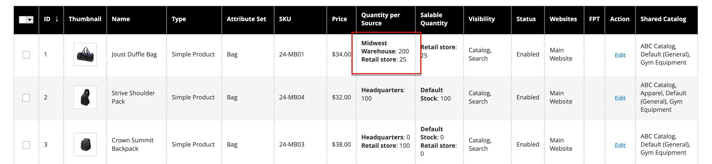

# Inventar - Zuteilung von Quellen und Mengen

Für Multisource-Händler mit [[!DNL Inventory Management]](../inventory-management/introduction.md), scrollen Sie nach unten zu **Quellen** und Zuteilung von Quellen und Mengen:

1. Um eine Quelle hinzuzufügen, klicken Sie auf **[!UICONTROL Assign Sources]**.

1. Suchen Sie nach Quellen und aktivieren Sie das Kontrollkästchen neben den Quellen, die Sie für das Produkt hinzufügen möchten.

   {width="600" zoomable="yes"}

1. Klicks **[!UICONTROL Done]** , um die Quellen hinzuzufügen.

1. Um die Menge und den Status der Quelle zu verwalten, klicken Sie auf **[!UICONTROL Advanced Inventory]** und **[!UICONTROL Manage Stock]** nach `Yes`.

1. Satz **[!UICONTROL Source Item Status]** nach `In Stock`.

1. Geben Sie einen Betrag ein, um die **[!UICONTROL Qty]** für gebrauchte Waren.

1. Führen Sie einen der folgenden Schritte aus, um eine Meldung für die Lagerbestandsmengen festzulegen:

   - _Anzahl benutzerdefinierter Benachrichtigungen_ - Löschen Sie die **[!UICONTROL Notify Quantity Use Default]** aktivieren und einen Betrag eingeben in **[!UICONTROL Notify Quantity]**.

   - _Standardmenge benachrichtigen_ - Wählen Sie die **[!UICONTROL Notify Quantity Use Default]** aktivieren. Commerce-Prüfungen und -Einstellungen in [!UICONTROL Advanced Inventory] oder globale Store-Konfiguration.

   {width="600" zoomable="yes"}
