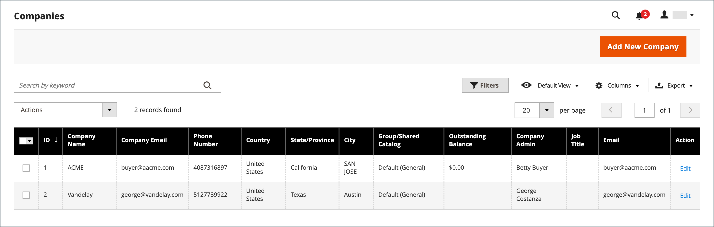
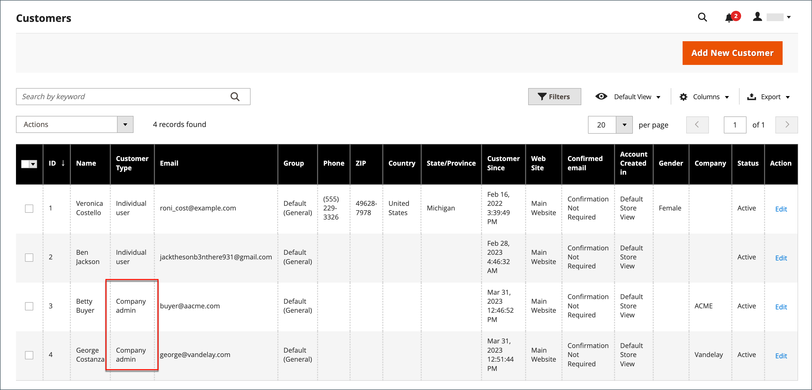

# Unternehmenskonten

Wenn Sie B2B-Unternehmenskonten in Ihren Store integrieren, können Sie das Einkaufserlebnis für Unternehmen vereinfachen, indem Sie Unternehmen die Möglichkeit geben, mehrere Unterkonten mit flexiblen Berechtigungen zu erstellen, die auf den Benutzerrollen in ihrer Organisation basieren. Je nach Unternehmen kann ein Store-Administrator Promotions und Preise an ihre Bedürfnisse anpassen und hochgradig angepasste Angebote erstellen, die den Anforderungen der Kunden gerecht werden und die Bestellungen erhöhen. Durch Hinzufügen einer Unternehmenskontozuordnung zu einer standardmäßigen [Person](../customers/account-create.md) kann der Kunde die spezifischen Einkaufs-Workflows verwenden, die für das Unternehmen definiert sind.

Vorteile eines Unternehmenskontos:

- Bietet unbegrenzte [Unternehmensbenutzer](account-company-users.md) und die Erstellung zusätzlicher Konten, was die Käufe von Unternehmen vereinfacht.

- Enthält Unterstützung für eine Unternehmenshierarchie mit _intelligenten_ Unternehmenskonten mit unterschiedlichen [Rollen und Berechtigungen](account-company-roles-permissions.md) für die Auftragserteilung.

- Bietet Händlern einen Mechanismus, um ihr Einkommen zu steigern, indem sie [Unternehmensspeicherkredite](credit-company.md) als Zahlungsmethode anbieten.

- Unterstützt die [Verwaltung](account-company-manage.md) aller Unternehmenskonten im Admin.

## Unternehmenskonten anzeigen

Das Raster _Unternehmen_ listet alle aktiven Unternehmenskonten und ausstehenden Anforderungen auf, unabhängig von der Statuseinstellung. Es bietet außerdem die Tools für die [Erstellung von](account-company-create.md) und die [Verwaltung von](account-company-manage.md) Unternehmenskonten. Verwenden Sie die standardmäßigen Rastersteuerelemente, um die Liste zu filtern und das Spaltenlayout anzupassen. Eine Liste der Spaltenbeschreibungen finden Sie im Abschnitt _Spaltenbeschreibungen_ in [Verwalten von Unternehmenskonten](account-company-manage.md).

Kunden können ein Unternehmenskonto über die Storefront erstellen oder ein Händler kann über den Administrator ein Unternehmenskonto erstellen. Standardmäßig ist die Möglichkeit aktiviert, Unternehmenskonten aus der Storefront zu erstellen. Wenn die Konfiguration dies zulässt, kann ein Besucher des Stores das Öffnen eines Unternehmenskontos anfordern. Nachdem das Unternehmenskonto genehmigt wurde, kann der Unternehmensadministrator die Unternehmensstruktur und Benutzer mit verschiedenen Berechtigungsstufen einrichten.

Wechseln Sie in der Seitenleiste _Admin_ zu **[!UICONTROL Customers]** > **[!UICONTROL Companies]**.

{width="700" zoomable="yes"}

Das Raster [!UICONTROL Companies] listet alle Unternehmen unabhängig vom Status auf. Im folgenden Beispiel werden zwei Unternehmen erfasst: das Unternehmen ACME und das Unternehmen Vandelay.

## Firmenadministrator

Das folgende Beispiel zeigt das Raster _Kunden_ mit den anfänglichen Unternehmensadministratorkonten.

{width="700" zoomable="yes"}

Es ist möglich, dass die Person, die als Unternehmensadministrator fungiert, innerhalb des Unternehmens über mehrere Rollen verfügt. Wenn für den Unternehmensadministrator eine separate E-Mail-Adresse angegeben wird, umfasst die ursprüngliche Unternehmensstruktur den Unternehmensadministrator sowie ein einzelnes Benutzerkonto im Namen des Unternehmensadministrators. In diesem Fall kann sich der Unternehmensadministrator als Unternehmen oder als einzelner Benutzer beim Konto anmelden.

Nach Erstellung des Kontos definiert der Unternehmensadministrator die Unternehmensstruktur von [Teams](account-company-structure.md), richtet die [Unternehmensbenutzer](account-company-users.md) ein und richtet für jede Gruppe [Rollen und Berechtigungen](account-company-roles-permissions.md) ein.

### Legen Sie das Kennwort des Unternehmensadministrators vor der ersten Anmeldung fest.

1. Der Unternehmensadministrator findet eine Begrüßungs-E-Mail aus dem Store.

   {width="500"}

   >[!NOTE]
   >
   >Die E-Mail-Adressenziele und der Inhalt der E-Mail werden durch die Optionen bestimmt, die in der Konfiguration der [E-Mail-Optionen des Unternehmens](email-company-configuration.md) angegeben sind.

1. Befolgt die Anweisungen und klickt auf [!UICONTROL **link**] , um das Kennwort festzulegen.

1. Fügt ein [!UICONTROL **neues Kennwort**] für ihr Konto ein und bestätigt es erneut.

   Das Kennwort muss mindestens drei der folgenden Zeichentypen enthalten:

   - Kleinbuchstaben (ca.
   - Großbuchstaben (ABC...)
   - Zahlen (1234567890)
   - Sonderzeichen (!@#$...)

1. Klicks auf [!UICONTROL **Neues Kennwort festlegen**].

   {width="700" zoomable="yes"}

1. Wenn die Seite [!UICONTROL Customer Login] angezeigt wird, gibt der Kunde seine [!UICONTROL **E-Mail**] und sein [!UICONTROL **Passwort**] ein.

1. Klicken Sie auf [!UICONTROL **Anmelden**] , um auf das Konto-Dashboard zuzugreifen.

   {width="700" zoomable="yes"}

## Unternehmensstruktur

Es kann ein Unternehmenskonto eingerichtet werden, das die Struktur des Unternehmens widerspiegelt. Zunächst umfasst die Unternehmensstruktur nur den Unternehmensadministrator, kann jedoch erweitert werden, um Teams von Benutzern aufzunehmen. Die Benutzer können Teams zugeordnet oder innerhalb einer Hierarchie von Abteilungen und Unterteilungen innerhalb des Unternehmens organisiert werden. Die Struktur unterstützt die Verwendung von [Genehmigungsregeln](account-dashboard-approval-rules.md) für [Bestellungen](purchase-order-flow.md) (Bestellaufträge), die mit dem Unternehmenskonto verknüpft sind.

{width="450"}

Im Konto-Dashboard des Unternehmensadministrators wird die Unternehmensstruktur als Struktur dargestellt und besteht zunächst nur aus dem Unternehmensadministrator.

{width="600"}

Bei der Erstellung des Kontos kann der Unternehmensadministrator die E-Mail-Adresse des Unternehmens verwenden oder eine andere E-Mail-Adresse erhalten.

Im folgenden Beispiel umfasst die ursprüngliche Unternehmensstruktur den Unternehmensadministrator sowie ein einzelnes Benutzerkonto im Namen des Unternehmensadministrators. Die Administratorfunktionen des Unternehmens (z. B. die Unternehmensstruktur und Validierungsregeln) sind jedoch nur verfügbar, wenn sie bei dem Benutzerkonto angemeldet sind, das als Unternehmensadministrator benannt wurde.

{width="600"}
