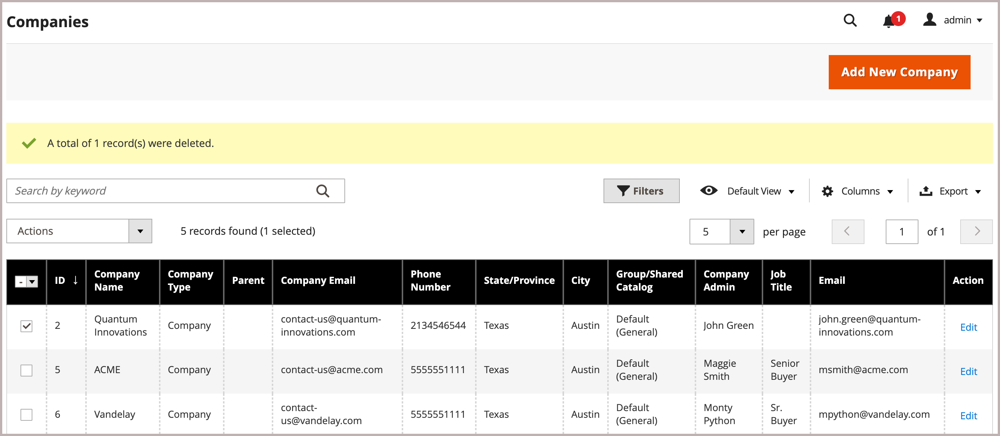

# Zuweisen eines Unternehmensadministrators

Der Unternehmensadministrator wird beim ersten Erstellen des Unternehmenskontos zugewiesen und kann nur von einem Store-Administrator über den Administrator geändert werden.

- Jeder Firma kann nur ein Administrator zugewiesen sein.
- Ein Firmenbenutzer kann nur für ein Unternehmen der Administrator sein.
- Änderungen am zugewiesenen Unternehmensadministrator müssen von einem Store-Administrator vom Administrator vorgenommen werden.

## Zugewiesenen Unternehmensadministrator ändern

1. Navigieren Sie in der _Admin_-Seitenleiste zu **[!UICONTROL Customers]** > **[!UICONTROL Companies]**.

   {width="700" zoomable="yes"}

1. Suchen Sie das Unternehmen in der Liste und klicken Sie dann auf **[!UICONTROL Edit]**.

1. Erweitern Sie  den Abschnitt **[!UICONTROL Company Admin]** .

   {width="700" zoomable="yes"}

1. Geben Sie die **[!UICONTROL Job Title]** des neuen Unternehmensadministrators ein.

   Durch diese Aktion wird das Formular gelöscht und die erforderlichen _[!UICONTROL First Name]_und_[!UICONTROL Last Name]_ Felder sind hervorgehoben.

1. Geben Sie die **[!UICONTROL Email]** des neuen Unternehmensadministrators ein.

   Wenn das System die E-Mail-Adresse nicht in der Datenbank findet, werden Sie aufgefordert, zu bestätigen, dass Sie den Unternehmensadministrator ersetzen möchten.

   - Wenn für den neuen Unternehmensadministrator kein Benutzerkonto vorhanden ist, erstellt das System ein Konto vom Typ `Company Admin`.

   - Wenn das Benutzerkonto im System vorhanden ist, wird es an die Position des Unternehmensadministrators in der Unternehmensstruktur verschoben.

1. Geben Sie die **[!UICONTROL First Name]** und **[!UICONTROL Last Name]** sowie alle weiteren Informationen ein, die für den neuen Unternehmensadministrator gelten.

1. Klicken Sie abschließend auf **[!UICONTROL Save]**.

   Das individuelle Konto des früheren Unternehmensadministrators verbleibt als aktives Benutzerkonto, das der Standardbenutzerrolle zugewiesen ist, im System. Wenn dies die einzige Firma ist, die mit dem Benutzerkonto verknüpft ist, ändert sich der Kontotyp von *[!UICONTROL Company user]* in *[!UICONTROL Individual user]*.

   Das System sendet eine E-Mail-Benachrichtigung über die Änderung an die neuen und früheren Unternehmensadministratoren.

