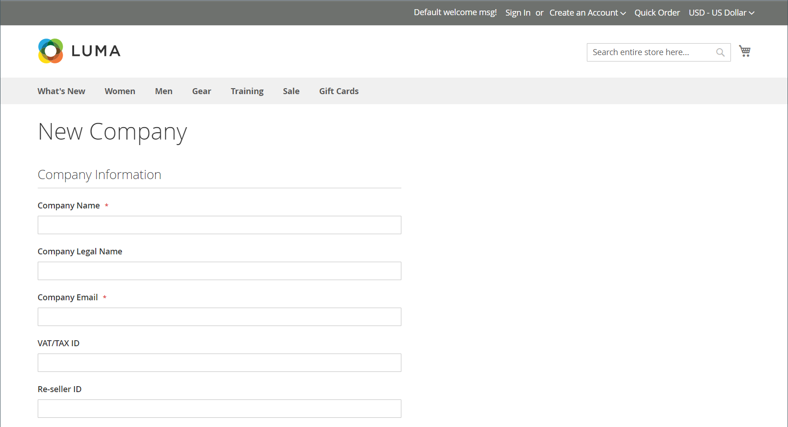

# Erstellen eines Unternehmenskontos

Mit Unternehmenskonten können B2B-Unternehmen Einkauf, Benutzer und Kredite innerhalb von Adobe Commerce verwalten. In diesem Abschnitt wird der gesamte Prozess zum Erstellen, Konfigurieren und Aktivieren von Unternehmenskonten beschrieben.

## Übersicht über die Erstellung von Unternehmenskonten

Unternehmenskonten können auf zwei Arten erstellt werden, die jeweils für verschiedene Geschäftsszenarien geeignet sind:

* **Storefront-Registrierung** - Self-Service-Kontoanfragen von Unternehmen
* **Admin Creation** - Sales-Assisted Account Setup mit vorkonfigurierten Details

Alle Unternehmenskonten müssen vor ihrer Aktivierung vom Administrator genehmigt werden, um eine ordnungsgemäße Überprüfung und Konfiguration sicherzustellen.

## Voraussetzungen

Stellen Sie vor dem Erstellen von Unternehmenskonten sicher, dass die folgenden Anforderungen erfüllt sind:

* **Systemanforderungen:**
   * [B2B-Funktionen sind &#x200B;](enable-basic-features.md) Ihrer Adobe Commerce-Installation aktiviert
   * Die Unternehmensregistrierung ist für die Erstellung von Storefronts aktiviert
   * E-Mail-Benachrichtigungen sind für Validierungs-Workflows konfiguriert

* **Geschäftsanforderungen:**
   * Genehmigungsprozesse und -richtlinien werden eingerichtet
   * Vertriebsmitarbeiter werden zugewiesen (für vom Administrator erstellte Konten)
   * Kreditrichtlinien werden definiert (wenn Firmenkredite verwendet werden)
   * Kundengruppen und freigegebene Kataloge sind konfiguriert

* **Administratorzugriff:**
   * Entsprechende Berechtigungen für die Unternehmensverwaltung
   * Zugriff auf die Abschnitte zur Kunden- und Unternehmensverwaltung

Das System weist die Rolle [Unternehmensadministrator](account-company-admin.md) der Person zu, die ein Unternehmenskonto in der Storefront eingerichtet hat. Nachdem der Store-Administrator die Anforderung zur Erstellung des Unternehmenskontos in der Admin-Instanz genehmigt hat, kann der Unternehmensadministrator ein Kontokennwort festlegen und sich beim Konto anmelden.

## Methode 1: Der Kunde erstellt das Konto in der Storefront

**Verwendung dieser Methode:**

* Die Self-Service-Unternehmensregistrierung wird bevorzugt
* Kunden verfügen über alle erforderlichen Geschäftsinformationen
* Standard-Genehmigungs-Workflow ist ausreichend
* Es ist keine spezielle Konfiguration oder Vorab-Population erforderlich

>[!IMPORTANT]
>
>Um diese Methode zu unterstützen (sodass Kundinnen und Kunden ihr Unternehmen über die Storefront registrieren können), stellen Sie sicher, dass die [B2B-Funktionen](enable-basic-features.md) aktiviert sind.

1. In der oberen rechten Ecke der Kopfzeile der Storefront klickt der Kunde auf **[!UICONTROL Create an Account]** und wählt **[!UICONTROL Create New Company Account]** aus.

   {width="700" zoomable="yes"}

   >[!NOTE]
   >
   >Wenn ein Besucher bei einem registrierten Benutzerkonto angemeldet ist, kann er ein Unternehmenskonto erstellen, indem er zu _[!UICONTROL Customer Profile]_>**[!UICONTROL Company Structure]**>**[!UICONTROL Create a Company Account]**&#x200B;navigiert.

1. Im Abschnitt _[!UICONTROL Company Information]_&#x200B;führt der Kunde Folgendes aus:

   * Füllen Sie die erforderlichen Felder aus:

      * **[!UICONTROL Company Name]**
      * **[!UICONTROL Company Email]**

   * Füllen Sie die verbleibenden Felder aus, falls zutreffend:

      * **[!UICONTROL Company Legal Name]**
      * **[!UICONTROL VAT/TAX ID]**
      * **[!UICONTROL Reseller ID]**

   {width="700" zoomable="yes"}

1. Füllen Sie die erforderlichen Felder im Abschnitt _[!UICONTROL Legal Address]_&#x200B;aus.

   * **[!UICONTROL Street Address]**
   * **[!UICONTROL City]**
   * **[!UICONTROL Country]**
   * **[!UICONTROL State/Province]**
   * **[!UICONTROL ZIP/Postal Code]**
   * **[!UICONTROL Phone Number]**

   {width="700" zoomable="yes"}

1. Führt im Abschnitt _[!UICONTROL Company Administrator]_&#x200B;folgende Schritte aus:

   * Gibt die **[!UICONTROL Email address]** für den Unternehmensadministrator ein.

     Die E-Mail-Adresse für den Unternehmensadministrator kann mit der E-Mail-Adresse des Unternehmens oder einer anderen E-Mail-Adresse identisch sein. Wenn Sie eine andere E-Mail-Adresse eingeben, erstellt das System zusätzlich zum Firmenadministratorkonto ein Firmenbenutzerkonto.

   * Gibt den **[!UICONTROL First Name]** und die **[!UICONTROL Last Name]** des Unternehmensadministrators ein.

   * Füllen Sie optional die folgenden Felder aus:

      * **[!UICONTROL Job Title]**
      * **[!UICONTROL Work Phone Number]**
      * **[!UICONTROL Gender]**

   

1. Schließt die Validierung ab, wenn reCAPTCHA für diese Storefront-Funktion aktiviert ist.

1. Wenn die Informationen vollständig sind, wählen Sie **[!UICONTROL Submit]** aus.

   Wenn der Händler die Anforderung zum Erstellen eines Unternehmenskontos genehmigt, sendet das System eine E-Mail-Benachrichtigung an den Unternehmensadministrator.

   {width="500"}

   Wenn das Kennwort festgelegt ist, kann sich der Unternehmensadministrator [&#x200B; dem Konto &#x200B;](../customers/customer-sign-in.md).

## Methode 2: Händler erstellt das Konto vom Administrator

**Verwendung dieser Methode:**

* Bevorzugte Unterstützung bei der Kontoerstellung durch den Vertrieb
* Vorausfüllen von Kontodetails aus vorhandenen Geschäftsbeziehungen
* Benutzerdefinierte Konfiguration ist erforderlich (Kreditlimits, Sonderpreise)
* Sofortige Aktivierung ohne Genehmigungs-Workflow ist erforderlich

Der Prozess der Erstellung einer Firma aus der Admin ist im Wesentlichen der gleiche wie aus der Storefront, aber mit zusätzlichen Feldern.

{width="700" zoomable="yes"}

1. Navigieren Sie in der _Admin_-Seitenleiste zu **[!UICONTROL Customers]** > **[!UICONTROL Companies]**.

1. Klicken Sie auf **[!UICONTROL Add New Company]** und führen Sie folgende Schritte aus:

   * Füllen Sie die folgenden erforderlichen Felder aus:

      * **[!UICONTROL Company Name]**
      * **[!UICONTROL Company Email]**

   * Wenn Sie noch nicht bereit sind, das Konto zu aktivieren, legen Sie **[!UICONTROL Status]** auf `Pending Approval` fest. (Standardmäßig auf `Active` festgelegt.)

   * Wählen Sie ggf. das Administratorkonto des **[!UICONTROL Sales Representative]** aus, der das Konto verwalten soll.

1. Gehen Sie im Abschnitt _[!UICONTROL Account Information]_&#x200B;wie folgt vor:

   * Füllen Sie je nach Bedarf die folgenden Felder aus:

      * **[!UICONTROL Company Legal Name]**
      * **[!UICONTROL VAT/TAX ID]**
      * **[!UICONTROL Reseller ID]**

   * Geben Sie **[!UICONTROL Comment]** ggf. zusätzliche Informationen zum Kunden ein.

     Die Kommentare sind nur vom Administrator einsehbar.

   {width="700" zoomable="yes"}

1. Beim erstmaligen Erstellen einer Firma erscheint das _[!UICONTROL Company Hierarchy]_&#x200B;beim Erweitern leer. Nachdem Sie das Unternehmen gespeichert haben, können Sie es in eine Unternehmenshierarchie einbeziehen. Siehe [Unternehmensverwaltung](manage-companies.md).

1. Füllen Sie im Abschnitt _[!UICONTROL Legal Address]_&#x200B;die folgenden erforderlichen Felder aus:

   * **[!UICONTROL Street Address]**
   * **[!UICONTROL City]**
   * **[!UICONTROL Country]**
   * **[!UICONTROL ZIP/Postal Code]**
   * **[!UICONTROL Phone Number]**

1. Gehen Sie im Abschnitt _[!UICONTROL Company Admin]_&#x200B;wie folgt vor:

   * Füllen Sie die folgenden erforderlichen Felder aus:

      * **[!UICONTROL Email]**
      * **[!UICONTROL First Name]**
      * **[!UICONTROL Last Name]**

   * Füllen Sie die folgenden optionalen Teile des Namens aus, die möglicherweise häufiger für einige Kundennamen gelten als für andere und nach eigenem Ermessen verwendet werden können:

      * **[!UICONTROL Prefix]**
      * **[!UICONTROL Middle Name/Initial]**
      * **[!UICONTROL Suffix]**

   * Wenn die Informationen verfügbar sind, füllen Sie die restlichen Felder aus, um den Unternehmensadministrator zu beschreiben:

      * **[!UICONTROL Website]**
      * **[!UICONTROL Job Title]**
      * **[!UICONTROL Work Phone Number]**
      * **[!UICONTROL Gender]**
      * **[!UICONTROL Send Welcome Email From]**

   {width="700" zoomable="yes"}

1. Füllen Sie im Abschnitt _[!UICONTROL Company Credit]_, der eine Zusammenfassung der Kreditaktivität des Kunden anzeigt, so viele Felder wie möglich im unteren Teil des Abschnitts aus:

   * **[!UICONTROL Credit Currency]**
   * **[!UICONTROL Credit Limit]**
   * **[!UICONTROL Allow to Exceed Credit Limit]**
   * **[!UICONTROL Reason for Change]**

   {width="700" zoomable="yes"}

1. Gehen Sie im Abschnitt _[!UICONTROL Advanced Settings]_&#x200B;wie folgt vor:

   >[!NOTE]
   >
   >Die Kundengruppenzuweisung bestimmt, welcher freigegebene Katalog für das Unternehmen und seine Mitarbeiter verfügbar ist. Standardmäßig weist das System die Firma der als Standard konfigurierten Kundengruppe zu.

   * Sie können die **[!UICONTROL Customer Group]** für das Unternehmen und seine Mitarbeiter in eine Gruppe ändern, die Zugriff auf einen anderen freigegebenen Katalog hat, oder in eine Standard-Kundengruppe. Das System fordert Sie zur Bestätigung auf, bevor Sie die Gruppe ändern.

     {width="600"}

   * Wenn Sie Firmenmitarbeitern erlauben möchten, Angebote aus ihrem Konto zu generieren, setzen Sie **[!UICONTROL Allow Quotes]** auf `Yes`.

   * Wenn Sie Firmenmitarbeitern erlauben möchten, Bestellungen über ihr Konto zu erstellen und zu verwenden, setzen Sie **[!UICONTROL Enable Purchase Orders]** auf `Yes`.

   * Um die für das Unternehmen verfügbaren **[!UICONTROL Applicable Payment Methods]** zu ändern, deaktivieren Sie das Kontrollkästchen **[!UICONTROL Use config settings]** und wählen Sie eine der folgenden Optionen aus:

     | Option | Beschreibung |
     |-------------------------------|-----------------------------------------------------------------------------------------------------------------------------------------------------------------------------------------------------------------------------------------|
     | `B2B Payment Methods` | (Standard) Aktiviert alle [standardmäßig festgelegten Zahlungsmethoden](../configuration-reference/general/b2b-features.md#default-b2b-payment-methods) für B2B-Bestellungen. |
     | `All Enabled Payment Methods` | Stellt alle [aktivierten Zahlungsmethoden](../configuration-reference/sales/payment-methods.md) für mit dem Unternehmenskonto verknüpfte Kundenkonten zur Verfügung. |
     | `Selected Payment Methods` | Ermöglicht die Auswahl der Zahlungsmethoden, die für mit dem Unternehmenskonto verknüpfte Kundenkonten verfügbar sind. Um mehrere Zahlungsmethoden auszuwählen, halten Sie die Strg-Taste (PC) oder die Befehlstaste (Mac) gedrückt und wählen Sie jede Option aus. |

     {style="table-layout:auto"}

   * Um die für das Unternehmen verfügbaren **[!UICONTROL Applicable Shipping Methods]** zu ändern, deaktivieren Sie das Kontrollkästchen **[!UICONTROL Use config settings]** und wählen Sie eine der folgenden Optionen aus:

     | Option | Beschreibung |
     |--------------------------------|----------------------------------------------------------------------------------------------------------------------------------------------------------------------------------------------------------------------------------------------------|
     | `B2B Shipping Methods` | (Standard) Aktiviert alle ([&#x200B; festgelegten Versandmethoden) &#x200B;](../configuration-reference/general/b2b-features.md#default-b2b-shipping-methods) B2B-Bestellungen. |
     | `All Enabled Shipping Methods` | Stellt alle [aktivierten Versandmethoden](../configuration-reference/sales/delivery-methods.md) für Kundenkonten zur Verfügung, die mit dem Firmenkonto verknüpft sind. |
     | `Selected Shipping Methods` | Ermöglicht die Auswahl der Versandmethoden, die für mit dem Firmenkonto verknüpfte Kundenkonten verfügbar sind. Um mehrere Versandmethoden auszuwählen, halten Sie die Strg-Taste (PC) oder die Befehlstaste (Mac) gedrückt und wählen Sie jede Option aus. |

     {style="table-layout:auto"}

1. Wenn Sie fertig sind, wählen Sie **[!UICONTROL Save]** aus.

   Wenn die Anforderung zum Erstellen eines Firmenkontos vom Händler genehmigt wird, wird eine E-Mail-Benachrichtigung an die E-Mail-Adresse des Unternehmensadministrators gesendet.

   Wenn das Kennwort festgelegt ist, kann sich der Unternehmensadministrator [&#x200B; dem Konto &#x200B;](../customers/customer-sign-in.md).

## Nach der Kontoerstellung

Nachdem ein Unternehmenskonto erstellt wurde, geschieht der folgende Prozess:

### &#x200B;1. Genehmigungs-Workflow

* **Ausstehender Status** - Neue Konten warten auf Administratorprüfung
* **Überprüfungsprozess** - Store-Administratoren überprüfen Geschäftsinformationen und genehmigen/ablehnen Anfragen
* **Statusaktualisierungen** - Unternehmen erhalten E-Mail-Benachrichtigungen über Änderungen des Genehmigungsstatus

### &#x200B;2. Kontoaktivierung

* **Willkommens-E-**: Genehmigte Unternehmensadministratoren erhalten Einrichtungsanweisungen
* **Kennworteinrichtung**: Administratoren erstellen sichere Kennwörter für den Kontozugriff
* **Erstmalige Anmeldung** - Erstmaliger Zugriff auf das Unternehmens-Dashboard und die Funktionen

### &#x200B;3. Nächste Schritte für Unternehmensadministratoren

Nach der Aktivierung sollten Unternehmensadministratoren:

* **[Unternehmensstruktur konfigurieren](account-company-structure.md)** - Richten Sie Abteilungen und Benutzerhierarchie ein
* **[Firmenbenutzer verwalten](account-company-users.md)** - Mitarbeiter hinzufügen und Rollen zuweisen
* **[Bestellungen einrichten](purchase-order-flow.md)** - Bei Bedarf Validierungs-Workflows konfigurieren
* **[Krediteinstellungen überprüfen](credit-company.md)** - Firmenkredite verstehen und verwalten (falls aktiviert)

## Häufige Probleme und Fehlerbehebung

### Probleme bei der Kontoerstellung

**Das Registrierungsformular kann nicht gesendet werden**

* Überprüfen, ob alle erforderlichen Felder korrekt ausgefüllt wurden
* Überprüfen, ob E-Mail-Adressen gültig und eindeutig sind
* Stellen Sie sicher, dass B2B-Funktionen aktiviert sind und eine Unternehmensregistrierung zulässig ist.
* Browser-Cache löschen und erneut versuchen

**Firmenname ist bereits vorhanden**

* Eindeutigen Firmennamen auswählen
* Wenden Sie sich an den Administrator, wenn Sie glauben, dass dies ein Fehler ist
* Erwägen, Standort- oder Geschäftseinheitskennung hinzuzufügen

**Probleme mit E-Mail-Adressen**

* E-Mail-Adressen von Unternehmen anstelle von persönlichen Adressen verwenden
* Stellen Sie sicher, dass die E-Mail-Adresse des Unternehmensadministrators verfügbar ist.
* Vergewissern Sie sich, dass die Domain nicht durch E-Mail-Filter blockiert wird

### Genehmigungs- und Aktivierungsanfragen

**Genehmigungs-E-Mail nicht empfangen**

* Spam-/Junk-E-Mail-Ordner überprüfen
* Überprüfen, ob die E-Mail-Adresse bei der Registrierung korrekt eingegeben wurde
* Store-Administrator kontaktieren, um den Status der manuellen Genehmigung zu überprüfen
* Die Verarbeitung an Werktagen kann 24-48 Stunden dauern

**Kennwort kann nach der Genehmigung nicht festgelegt werden**

* Verwenden Sie den exakten Link in der Genehmigungs-E-Mail
* Überprüfen, ob der Aktivierungslink abgelaufen ist
* Neue Aktivierungs-E-Mail vom Administrator anfordern

**Probleme nach der Aktivierung aufrufen**

* Vergewissern Sie sich, dass Sie sich über das richtige Unternehmenskonto-Portal anmelden
* Überprüfen Sie, ob Ihr Kontostatus „Aktiv“ ist.
* Stellen Sie sicher, dass Sie die Anmeldedaten des Unternehmensadministrators verwenden
* Support kontaktieren, wenn die Berechtigungen falsch erscheinen

## Best Practices für die Sicherheit

Beim Erstellen und Verwalten von Unternehmenskonten:

* **Sichere Kennwörter verwenden** - Erfordert komplexe Kennwörter für Unternehmensadministratoren
* **Geschäftsinformationen überprüfen** - Validieren von Unternehmensdetails während des Genehmigungsprozesses
* **Überwachen der Kontoaktivität** - Überprüfen Sie regelmäßig den Zugriff und die Berechtigungen der Unternehmensbenutzer
* **Schutz sensibler Daten** - Sicherstellen, dass Kredit- und Finanzinformationen ordnungsgemäß gesichert sind

## Benutzeroberflächenreferenz für Unternehmenskonto

### Schaltflächenleiste

| Schaltfläche | Beschreibung |
|---------------------------|------------------------------------------------------------------|
| [!UICONTROL Back] | Kehrt zur Seite Unternehmen zurück, ohne die Änderungen zu speichern. |
| [!UICONTROL Reset] | Stellt die ursprünglichen Werte in allen Feldern mit nicht gespeicherten Änderungen wieder her. |
| [!UICONTROL Save] | Speichert Änderungen am Unternehmen und lässt das Profil offen. |
| [!UICONTROL Save & Close] | Speichert Änderungen am Unternehmen und schließt das Profil. |

{style="table-layout:auto"}

### Feldbeschreibungen

| Feld | Beschreibung |
|-----------------------------------|---------------------------------------------------------------------------------------------------------------------------------------------------------------------------------------------------------------------------------------------------------------------------------------------------------------------------------------------------------------------------------------------------------------------------------------------------------------------------------------------------------------------------------------------------------------------------------------------------------------------------------------------------------------------------------------------------------------------------------------------------------------------------------------------------------------------------------------------------------------------------------------------------------------------------------|
| [!UICONTROL Company Name] | Der Firmenname wird bei der ersten Erstellung des Firmenkontos eingegeben und kann eine gekürzte Version des vollständigen rechtlichen Namens sein. |
| [!UICONTROL Status] | (Nur Admin) Gibt den aktuellen Status des Unternehmenskontos an. Optionen:  **[!UICONTROL Active]**- Das Unternehmenskonto wird vom Store-Administrator genehmigt. Der Unternehmensadministrator und die zugehörigen Mitglieder können sich beim Konto in der Storefront anmelden und Käufe tätigen. **[!UICONTROL Pending Approval]** - Es wurde eine Anfrage zum Öffnen eines Unternehmenskontos eingereicht, die jedoch noch nicht vom Store-Administrator genehmigt wurde.  **[!UICONTROL Rejected]**- Eine Anfrage zum Öffnen eines Unternehmenskontos wurde eingereicht, aber vom Store-Administrator nicht genehmigt. Die ursprünglichen Anmeldedaten, die zum Senden der Anfrage verwendet wurden, sind blockiert. **&#x200B; Blockiert &#x200B;**- Mitglieder des Unternehmens können sich anmelden und auf den Katalog zugreifen, jedoch keine Käufe tätigen. Der Store-Administrator kann ein Firmenkonto sperren, das keinen guten Ruf hat. Die Sperre des Kontos kann vom Store-Administrator jederzeit entfernt werden. |
| [!UICONTROL Company Email] | Die mit dem Unternehmenskonto verknüpfte E-Mail-Adresse. |
| [!UICONTROL Sales Representative] | (Nur Admin) Der Admin-Benutzer, der der primäre Kontakt für das Unternehmenskonto ist. |

{style="table-layout:auto"}

#### [!UICONTROL Account Information]

| Feld | Beschreibung |
|---------------------------------|-----------------------------------------------------------------------------------------------------------------------------------------------------------------------------------------------------------------------------------------------------------------------------------------------------------------------------------------------------------------------------------------------------------------------------------------------------------------|
| [!UICONTROL Company Legal Name] | Der vollständige rechtliche Name der Firma. |
| [!UICONTROL VAT / TAX ID] | Die [Umsatzsteuer](../stores-purchase/vat.md)-Nummer, die dem Unternehmen von einigen Steuergebieten zu Steuerberichterstattungszwecken zugewiesen wird. Informationen zum Konfigurieren der MwSt.-/STEUER-ID des Kunden, die in der Storefront angezeigt werden soll, finden Sie unter [Optionen für neues Konto erstellen](../configuration-reference/customers/customer-configuration.md).   **_Hinweis:_** Der Unternehmensadministrator und andere Firmenbenutzer haben keine eigenen separaten Umsatzsteuer-/Steuer-ID-Nummern in ihren Kundenkonten. |
| [!UICONTROL Reseller ID] | Die Wiederverkaufsnummer, die dem Unternehmen zu Steuerberichtszwecken zugewiesen wird. |
| [!UICONTROL Comment] | (Nur Admin) Diese Hinweise zum Unternehmenskonto dienen als Referenz und sind nur für Admins sichtbar. |

{style="table-layout:auto"}

#### [!UICONTROL Company Hierarchy]

| Feld | Beschreibung |
|-----------------------------------|------------------------------------------------------------------------------------------------------------------------------------------------------|
| [!UICONTROL Company ID] | Die ID-Nummer der Firma. |
| [!UICONTROL Company Name] | Der vollständige Name der Firma.  Ein `current company indicator` wird in der bearbeiteten Firmenzeile angezeigt. |
| [!UICONTROL Company Email] | Die mit dem Unternehmenskonto verknüpfte E-Mail-Adresse. |
| [!UICONTROL Phone Number] | Die primäre Telefonnummer der Firma. |
| [!UICONTROL Country] | Das Land, in dem das Unternehmen für die Ausübung seiner Geschäftstätigkeit registriert ist. |
| [!UICONTROL State/Province] | Das Bundesland, in dem das Unternehmen für die Ausübung seiner Geschäftstätigkeit registriert ist. |
| [!UICONTROL City] | Die Stadt, in der das Unternehmen für die Geschäftstätigkeit registriert ist. |
| [!UICONTROL Group/Shared Catalog] | (Nur Admin) Zeigt die [Kundengruppe](../customers/customer-groups.md) oder [freigegebenen Katalog](catalog-shared.md) an, die dem Unternehmen zugewiesen sind. |
| [!UICONTROL Company Admin] | Der vollständige Name des Unternehmensadministrators. |
| [!UICONTROL Action] | Die Liste der möglichen Aktionen für diese Unternehmensposition. |

{style="table-layout:auto"}

#### [!UICONTROL Legal Address]

| Feld | Beschreibung |
|------------------------------|-----------------------------------------------------------------------------|
| [!UICONTROL Street Address] | Die Straße, an der das Unternehmen für die Geschäftstätigkeit registriert ist. |
| [!UICONTROL City] | Die Stadt, in der das Unternehmen für die Geschäftstätigkeit registriert ist. |
| [!UICONTROL Country] | Das Land, in dem das Unternehmen für die Ausübung seiner Geschäftstätigkeit registriert ist. |
| [!UICONTROL State/Province] | Das Bundesland, in dem das Unternehmen für die Ausübung seiner Geschäftstätigkeit registriert ist. |
| [!UICONTROL ZIP/Postal Code] | Die Postleitzahl, bei der das Unternehmen für die Ausübung seiner Geschäftstätigkeit registriert ist. |
| [!UICONTROL Phone Number] | Die primäre Telefonnummer der Firma. |

{style="table-layout:auto"}

#### [!UICONTROL Company Admin]

| Feld | Beschreibung |
|--------------------------------------|---------------------------------------------------------------------------------------------------------------------------------------------------------------------------------------------------------------------------------------------------|
| [!UICONTROL Website] | Bestimmt die Website, zu der der Unternehmensadministrator gehört. |
| [!UICONTROL Job Title] | Der Titel des Unternehmensadministrators, der das Unternehmenskonto verwaltet. |
| [!UICONTROL Work Phone Number] | Die Telefonnummer des Unternehmensadministrators, der das Unternehmenskonto verwaltet. |
| [!UICONTROL Email] | Die E-Mail-Adresse des Unternehmensadministrators kann mit der E-Mail-Adresse des Unternehmens übereinstimmen. Wenn Sie eine andere E-Mail-Adresse eingeben, erstellt das System zusätzlich zum Firmenkonto ein separates individuelles Konto für den Unternehmensadministrator. |
| [!UICONTROL Prefix] | Gegebenenfalls das Präfix, das mit dem Namen des Unternehmensadministrators verknüpft ist (z. B. `Mr.`, `Ms.`, `Mrs.` oder `Dr.`). Je nach Konfiguration kann das Eingabefeld ein Textfeld oder eine Liste sein. |
| [!UICONTROL First Name] | Der Vorname des Unternehmensadministrators. |
| [!UICONTROL Middle Name/Initial] | Der zweite Vorname oder Initial des Unternehmensadministrators. |
| [!UICONTROL Last Name] | Der Nachname des Unternehmensadministrators. |
| [!UICONTROL Suffix] | Gegebenenfalls das Suffix, das mit dem Namen des Unternehmensadministrators verknüpft ist (z. B. `Jr.`, `Sr.` oder `III.`). Je nach Konfiguration kann das Eingabefeld ein Textfeld oder eine Liste sein. |
| [!UICONTROL Gender] | Das Geschlecht des Unternehmensadministrators. Optionen: `Male` / `Female` / `Not Specified` |
| [!UICONTROL Send Welcome Email From] | Die Store-Ansicht, von der aus das System die Begrüßungs-E-Mail sendet. |

{style="table-layout:auto"}

#### [!UICONTROL Company Credit]

| Feld | Beschreibung |
|-------------------------------------------|-----------------------------------------------------------------------------------------------------------------------------------------------------------------------------------------|
| [!UICONTROL Credit Currency] | (Nur Admin) Die Währung, die vom Store für Käufe auf Firmenguthaben akzeptiert wird. |
| [!UICONTROL Credit Limit] | (Nur Admin) Das Kreditlimit, das auf das Unternehmenskonto erweitert wird. |
| [!UICONTROL Allow to Exceed Credit Limit] | (Nur Admin) Gibt an, ob die Firma berechtigt ist, das Kreditlimit zu überschreiten. Optionen: `Yes` / `No` |
| [!UICONTROL Reason for Change] | (Nur Admin) Ein Hinweis, der erklärt, warum das Unternehmen das Kreditlimit überschreiten darf bzw. nicht darf. Dieses Feld ist nur aktiv, wenn sich die Berechtigung zum Überschreiten des Kreditlimits ändert. |

{style="table-layout:auto"}

#### [!UICONTROL Advanced Settings]

Sie können erweiterte Einstellungen für einzelne Unternehmen konfigurieren. Wenn Sie eine Unternehmenshierarchie erstellen, können Sie die Konfiguration der Einstellungen optimieren, indem Sie die Einstellungen für die übergeordnete Firma konfigurieren und diese Einstellungen auf alle oder ausgewählte untergeordnete Firmen anwenden, anstatt jede untergeordnete Firma einzeln zu konfigurieren. Weitere Informationen finden Sie unter [Verwalten der Firmenhierarchie](manage-company-hierarchy.md).

| Feld | Beschreibung |
|------------------------------------------|--------------------------------------------------------------------------------------------------------------------------------------------------------------------------------------------------------------------------|
| [!UICONTROL Customer Group] | (Nur Admin) Zeigt die [Kundengruppe](../customers/customer-groups.md) oder [freigegebenen Katalog](catalog-shared.md) an, die dem Unternehmen zugewiesen sind. |
| [!UICONTROL Allow Quotes] | (Nur Admin) Legt fest, ob Firmenmitglieder verhandelbare Angebote im Namen der Firma vorbereiten und einreichen können. |
| [!UICONTROL Enable Purchase Orders] | (Nur Admin) Legt fest, ob Firmenmitglieder Bestellungen als [Bestellungen](account-dashboard-my-purchase-orders.md) im Namen der Firma einreichen können. |
| Anwendbare Zahlungsmethoden | (Nur Admin) Zeigt die Zahlungsmethoden an, die für Unternehmenskäufe verfügbar sind. Optionen: `B2B Payment Methods` / `All Enabled Payment Methods` / `Selected Payment Methods` |
| [!UICONTROL Payment Methods] | (Nur Admin) Wird aktiv, wenn Sie bestimmte Zahlungsmethoden aktivieren. Um mehrere Zahlungsmethoden für das Firmenkonto zur Verfügung zu stellen, halten Sie die Strg-Taste (PC) oder die Befehlstaste (Mac) gedrückt und wählen Sie jede Option aus. |
| [!UICONTROL Applicable Shipping Methods] | (Nur Admin) Zeigt die Versandmethoden an, die für Unternehmenskäufe verfügbar sind. Optionen: `B2B Shipping Methods` / `All Enabled Shipping Methods` / `Selected Shipping Methods` |
| [!UICONTROL Shipping Methods] | (Nur Admin) Wird aktiv, wenn Sie bestimmte Versandmethoden aktivieren. Um mehrere Versandmethoden für das Firmenkonto verfügbar zu machen, halten Sie die Strg-Taste (PC) oder die Befehlstaste (Mac) gedrückt und wählen Sie jede Option aus. |

{style="table-layout:auto"}

>[!MORELIKETHIS]
>
>* [B2B-Funktionen aktivieren](enable-basic-features.md) - Konfigurieren grundlegender B2B-Funktionen
>* [Unternehmenskontenstruktur](account-company-structure.md) - Organisieren Sie Benutzer und Abteilungen in der Storefront
>* [Firmenbenutzer verwalten](account-company-users.md) - Hinzufügen und Konfigurieren von Mitarbeiterkonten in der Storefront
>* [Rolle des Unternehmensadministrators](account-company-admin.md) - Grundlegendes zu den Zuständigkeiten des Administrators
>* [Unternehmen verwalten](manage-companies.md) - Überblick über die Verwaltung des Unternehmens
>* [Firmenkreditmanagement](credit-company.md) - Einrichten und Verwalten von Firmenkrediten über den Administrator
>* [Workflow für Bestellungen](purchase-order-flow.md) - Konfigurieren von Validierungsprozessen durch den Administrator
>* [Unternehmensrollen und -berechtigungen](account-company-roles-permissions.md) - Steuern der Benutzerzugriffsebenen über den Administrator
>* [B2B-Konfigurationsreferenz](../configuration-reference/general/b2b-features.md) - Detaillierte Systemeinstellungen
