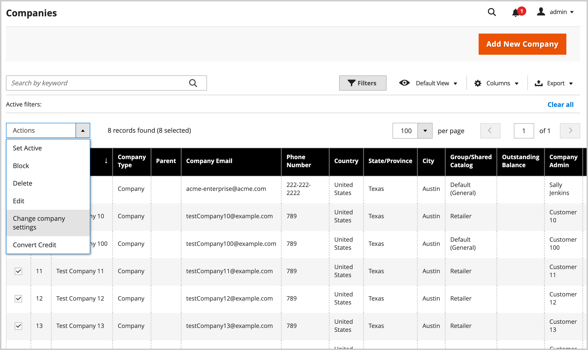

# Verwalten von Unternehmenskonten

Auf der Seite _[!UICONTROL Companies]_&#x200B;werden alle aktuellen Unternehmenskonten unabhängig vom Status aufgelistet. Alle ausstehenden Genehmigungsanfragen werden oben in der Liste angezeigt.

{width="700" zoomable="yes"}

Verwenden Sie das *[!UICONTROL Columns]*-Steuerelement, um die im Raster angezeigten Spalten anzupassen. Passen Sie die in der Ansicht angezeigten Unternehmen mithilfe der Such- und Filterfunktionen an.

- Suchen Sie mithilfe der _[!UICONTROL Search]_&#x200B;nach Unternehmen **Raster**&#x200B;Firmen. Die Suche indiziert die Spalten **Firmenname**&#x200B;und **Übergeordnet**.

- Passen Sie die Ansicht so an, dass Datensätze einbezogen werden, die bestimmte Kriterien erfüllen, indem Sie die [!UICONTROL Filter] verwenden. Wenn die B2B-Site beispielsweise so konfiguriert ist, dass sowohl einzelne Unternehmenskonten als auch [Unternehmenshierarchien](manage-companies.md) verwaltet werden, können Sie nach `[!UICONTROL Company Type - Company]` filtern, um nur einzelne Unternehmen anzuzeigen, oder nach `[!UICONTROL Company Type - Parent]`, um nur die übergeordnete Firma für jede Hierarchie anzuzeigen.

Wenden Sie mithilfe des _[!UICONTROL Actions]_-Steuerelements über dem Raster eine Aktion auf mehrere Unternehmensdatensätze an. Anstatt beispielsweise jede einzelne Unternehmensanfrage zu genehmigen, können Sie mehrere Anfragen auswählen, um die Konten in einer einzigen Aktion zu aktivieren. Die verfügbaren Aktionen hängen von den [Berechtigungen](../systems/permissions.md) für die Rolle ab, die Ihrem Admin-Benutzerkonto zugewiesen ist.

## Ressourcen zur Unternehmensrolle

Die Einstellungen [Rollenressourcen](../systems/permissions-user-roles.md#role-resources) bestimmen die folgenden Möglichkeiten:

- Firma hinzufügen
- Löschen einer Firma
- Resterstattung anwenden
- Firmen anzeigen

Diese Rollenressourcen müssen für die [Benutzerrolle“ festgelegt werden](../systems/permissions-user-roles.md) die dem Admin-Benutzerkonto zugewiesen ist.

## Verwalten von Unternehmenskonten über das Raster „Firmen“

Zeigen Sie die Benutzerkonten für Unternehmen im Menü Admin an, und verwalten Sie sie. Wählen Sie dazu **[!UICONTROL Customers]** > **[!UICONTROL Companies]** aus, um die Seite *[!UICONTROL Companies]* zu öffnen.

Sie können Konten einzeln oder in Gruppen verwalten.

- Zeigen Sie Konfigurationseinstellungen für ein einzelnes Unternehmenskonto an oder ändern Sie sie, indem Sie in der Spalte **[!UICONTROL Action]** für den Eintrag für das Unternehmenskonto **[!UICONTROL Edit]** auswählen.

  {width="675" zoomable="yes"}

- Sie können eine Gruppe ausgewählter Unternehmenskonten mithilfe der Optionen anzeigen oder ändern, die im [!UICONTROL Actions]**-Steuerelement über dem Raster verfügbar sind.

  {width="675" zoomable="yes"}

In den folgenden Abschnitten finden Sie Anweisungen zum Anwenden jeder Aktion.

### Aktivieren von Unternehmenskonten

1. Wählen Sie im **[!UICONTROL Actions]** die Option **[!UICONTROL Set Active]** aus.

1. Wenn Sie zum Bestätigen aufgefordert werden, klicken Sie auf **[!UICONTROL OK]**.

### Aktiv/Inaktiv festlegen

Kunden mit inaktiven Konten können sich nicht anmelden oder über ihre Konten Einkäufe tätigen. Es gibt zwei Methoden, um ein Kundenkonto als aktiv oder inaktiv festzulegen:

Methode 1: **Vom Kundenraster**

1. Navigieren Sie in _Admin_-Seitenleiste zu [!UICONTROL **Kunden**] > [!UICONTROL **Alle Kunden**].

1. Wählen Sie im Menü **[!UICONTROL Actions]** eine der folgenden Optionen aus:

   - **[!UICONTROL Active]**
   - **[!UICONTROL Inactive]**

1. Wählen Sie nach Aufforderung die Option **[!UICONTROL OK]** aus, um die Änderung anzuwenden.

Methode 2: **Von der Seite zur Kontobearbeitung**

1. Navigieren Sie in _Admin_-Seitenleiste zu [!UICONTROL **Kunden**] > [!UICONTROL **Alle Kunden**].

1. Suchen Sie im Raster den Kundendatensatz, der bearbeitet werden soll.

1. Klicken Sie in _Spalte_ Aktionen“ ganz rechts auf [!UICONTROL **Bearbeiten**].

1. Wählen Sie die [!UICONTROL **Kontoinformationen**] aus.

1. Legen Sie [!UICONTROL **Kunde aktiv**] auf `Yes` oder `No` fest.

1. Klicken Sie [!UICONTROL **Kunde speichern**].

### Unternehmenskonten blockieren

Benutzer, die mit einem blockierten Unternehmenskonto verknüpft sind, können sich anmelden und auf den Katalog zugreifen, jedoch keine Käufe tätigen. Ein Unternehmen mit einem nicht anerkannten Konto kann vorübergehend gesperrt werden, bis die Angelegenheit geklärt ist.

1. Wählen Sie im **[!UICONTROL Actions]** die Option **[!UICONTROL Block]** aus.

1. Wenn Sie zum Bestätigen aufgefordert werden, klicken Sie auf **[!UICONTROL OK]**.

### Löschen von Unternehmenskonten

Gelöschte Unternehmenskonten können nicht wiederhergestellt werden. Der Status von Benutzerkonten, die mit dem Unternehmen verknüpft sind, wird auf `Inactive` festgelegt und die Unternehmens-ID wird aus den Profilen von Benutzerkonten entfernt. Informationen über Unternehmensaktivitäten und -transaktionen werden im System gespeichert.

1. Wählen Sie im **[!UICONTROL Actions]** die Option **[!UICONTROL Delete]** aus.

1. Wenn Sie zum Bestätigen aufgefordert werden, klicken Sie auf **[!UICONTROL OK]**.

### Unternehmenseinstellungen ändern

Aktualisieren Sie die Konfiguration [Erweiterte ](account-company-create.md#advanced-settings)), um dieselben Einstellungen auf mehrere im Raster *Unternehmen“ ausgewählte Unternehmen*.

>[!NOTE]
>
>Verwalten Sie die erweiterten Konfigurationseinstellungen für eine Unternehmensorganisation mit einer übergeordneten und zugehörigen untergeordneten Firmen über die Ansicht [Unternehmenshierarchie](manage-company-hierarchy.md#change-company-settings).

1. Wählen Sie im **[!UICONTROL Actions]** die Option **[!UICONTROL Change company settings]** aus.

   Im *[!UICONTROL Change company settings]* Formular werden die anfänglichen Konfigurationseinstellungen auf die Standardwerte festgelegt.

1. Aktivieren Sie für jede zu ändernde Konfigurationseinstellung das Kontrollkästchen **[!UICONTROL Change]** , um die Einstellung zu aktivieren. Aktualisieren Sie dann die Einstellung nach Bedarf.

   {width="675" zoomable="yes"}

1. Wählen Sie nach dem Aktualisieren der Konfigurationseinstellungen **[!UICONTROL Apply Changes]** aus.

1. Wenn Sie dazu aufgefordert werden, wählen Sie **[!UICONTROL Change settings]** aus, um die Konfiguration für die ausgewählten Unternehmen zu aktualisieren.

>[!TIP]
>
>Sie können die erweiterten Konfigurationseinstellungen für ein einzelnes Unternehmen ändern, indem Sie in der Spalte **[!UICONTROL Action]** für den Eintrag Firmenkonto die Option **[!UICONTROL Edit]** auswählen.

### Die Kreditwährung umrechnen

Die Gutschrift auf den Konten ausgewählter Unternehmen wird in den aktuellen Kurs der ausgewählten Währung umgerechnet.

1. Wählen Sie im **[!UICONTROL Actions]** die Option **[!UICONTROL Convert Currency]** aus.

1. Wenn Sie zum Bestätigen aufgefordert werden, klicken Sie auf **[!UICONTROL OK]**.

1. Wählen Sie die **[!UICONTROL Credit Currency]** aus, die für die ausgewählten Unternehmenskonten verwendet werden soll.

   Die Beträge werden, sofern verfügbar, gemäß den aktuellen Umrechnungskursen neu berechnet. Falls nicht verfügbar, können Sie benutzerdefinierte Konversionsraten manuell eingeben. Das System zeigt so viele Umrechnungsberechnungen an, wie für die von den ausgewählten Unternehmen verwendete Kreditwährung erforderlich sind.

1. Klicken Sie auf **[!UICONTROL Proceed]** , um die Konvertierung abzuschließen.

## Bearbeiten eines Unternehmenskontos

Methode 1: **Schnellbearbeitung**

1. Aktivieren Sie in der ersten Spalte das Kontrollkästchen des zu bearbeitenden Unternehmenskontos.

1. Wählen Sie im **[!UICONTROL Actions]** die Option **[!UICONTROL Edit]** aus.

   Jeder Wert, der aktualisiert werden kann, wird in einem Textfeld angezeigt.

   {width="675" zoomable="yes"}

1. Aktualisieren Sie einen der folgenden Werte nach Bedarf:

   - **[!UICONTROL Company Name]**

   - **[!UICONTROL Company Email]**

   - **[!UICONTROL Phone Number]**

1. Klicken Sie auf **[!UICONTROL Save]**.

Methode 2: **Vollständige Bearbeitung**

1. Suchen Sie im Raster nach dem Firmendatensatz, der bearbeitet werden soll.

1. Wählen Sie **[!UICONTROL Edit]** aus der Spalte _[!UICONTROL Action]_&#x200B;aus.

1. Nehmen Sie die erforderlichen Änderungen an den Unternehmensinformationen vor.

   Beschreibungen der Felder finden Sie unter [Erstellen eines Unternehmenskontos](account-company-create.md).

1. Klicken Sie abschließend auf **[!UICONTROL Save]**.

## Zuweisen eines Vertriebsmitarbeiters

Der Vertriebsmitarbeiter ist ein [Admin-Benutzer](../systems/permissions.md) der als Ansprechpartner für ein Firmenkonto zugewiesen ist und alle automatisierten E-[-Nachrichten ](../b2b/enable-basic-features.md#configure-company-email-options) Unternehmen erhält. Pro Unternehmenskonto kann nur ein Vertriebsmitarbeiter zugewiesen werden, aber ein einziger Vertriebsmitarbeiter kann mehrere Unternehmenskonten verwalten. Das standardmäßige Admin-Benutzerkonto wird als Vertriebsmitarbeiter zugewiesen, es sei denn, es wurde ein anderer Admin-Benutzer zugewiesen.

Der Name und die E-Mail-Adresse des zugeordneten Vertriebsmitarbeiters sind für die Mitglieder des Unternehmens auf der Seite mit dem Unternehmenskonto und den Angeboten sichtbar.

1. Navigieren Sie in der _Admin_-Seitenleiste zu **[!UICONTROL Customers]** > **[!UICONTROL Companies]**.

1. Suchen Sie das Unternehmen im Raster und öffnen Sie es im Bearbeitungsmodus.

1. Legen Sie **[!UICONTROL Sales Representative]** auf den Admin-Benutzer fest, den Sie als Ansprechpartner für das Unternehmen zuweisen möchten.

1. Klicken Sie abschließend auf **[!UICONTROL Save]**.

   Der zugewiesene Vertriebsmitarbeiter erhält eine E-Mail-Benachrichtigung über den Auftrag.

## Aktualisieren eines Unternehmensprofils

Das Unternehmensprofil kann vom Unternehmensadministrator in der Storefront und von einem Store-Administrator in der Admin verwaltet werden.

{width="700" zoomable="yes"}

1. Navigieren Sie in der _Admin_-Seitenleiste zu **[!UICONTROL Customers]** > **[!UICONTROL Companies]**.

1. Suchen Sie das Unternehmen im Raster und klicken Sie in der Spalte _[!UICONTROL Action]_&#x200B;auf **[!UICONTROL Edit]**.

1. Aktualisieren Sie die Feldwerte in jedem Abschnitt nach Bedarf, indem Sie die Feldbeschreibungen als Referenz verwenden.

1. Klicken Sie abschließend auf **[!UICONTROL Save]**.

## Demo zum Firmenkonto

In diesem Video erfahren Sie mehr über die Verwaltung von Unternehmenskonten:

>[!VIDEO](https://video.tv.adobe.com/v/344447?quality=12&learn=on)

## Unternehmensleitung

Nachdem eine Firma erstellt wurde, können Admin-Benutzer mit entsprechenden Berechtigungen den Abschnitt [!UICONTROL Company Hierarchy] verwenden, um eine übergeordnete Firmenorganisation zu erstellen, indem sie die angegebene übergeordnete Firma bearbeiten und verwandte Firmen zuweisen.

Wenn eine Firma zu einer Hierarchie hinzugefügt wurde, zeigt das [!UICONTROL Company Hierarchy] die übergeordnete Firma und alle zugewiesenen Firmen im Raster an.

Weitere Informationen finden [ unter ](manage-company-hierarchy.md) von Unternehmenshierarchien .

## Unternehmensoptionen und -spalten

Die folgenden Abschnitte enthalten eine Referenz für die verfügbaren Aktionen, Optionen und angezeigten Informationen, die für die Verwaltung von Unternehmenskonten verfügbar sind.

### Optionen zur Aktionssteuerung

| Option | Beschreibung |
|--------------------------------------|---------------------------------------------------------------------------------------------------------------------------------------------------------------------------------------------------------------------------------------------------------------------------------|
| [!UICONTROL Set Active] | Setzt den Status aller ausgewählten Firmendatensätze auf `Active`. Unternehmensadministratoren erhalten Anweisungen, wie sie ihre Passwörter festlegen, damit sie über die Storefront auf ihre Konten zugreifen und ihre Unternehmen verwalten können. |
| [!UICONTROL Block] | Schränkt nicht angesehene Unternehmenskonten ein, behält aber das Konto bei. Firmenmitglieder können sich anmelden und auf den Katalog zugreifen, aber sie können keine Bestellungen im Namen des Unternehmens aufgeben. |
| [!UICONTROL Delete] | Löscht ausgewählte Unternehmenskonten. Der Status von Benutzerkonten, die mit einem gelöschten Unternehmen verknüpft sind, wird auf `Inactive` festgelegt und die Unternehmens-ID wird aus den Profilen von Benutzerkonten entfernt. Informationen über Unternehmensaktivitäten und -transaktionen werden im System gespeichert. |
| [!UICONTROL Edit] | Ermöglicht die Bearbeitung einiger Werte des ausgewählten Firmendatensatzes aus dem Raster. Standardmäßig sind der Firmenname, die Unternehmens-E-Mail-Adresse und die Telefonnummer zur schnellen Bearbeitung verfügbar. |
| [!UICONTROL Change company settings] | Öffnet das Formular *Unternehmenseinstellungen ändern*, um die Konfiguration [Erweiterte Einstellungen](account-company-create.md#advanced-settings) zu aktualisieren und die Änderungen auf die ausgewählten Unternehmen anzuwenden. |
| [!UICONTROL Convert Credit] | Rechnet die Gutschrift auf Rechnung für die ausgewählten Unternehmen entsprechend den Kursen der angegebenen Währung um. |

{style="table-layout:auto"}

### Spaltenbeschreibungen

#### Standardspaltenlayout

| Spalte | Beschreibung |
|-----------------------------------|--------------------------------------------------------------------------------------------------------------------------------------------------------------------------------------------------------------------------------------------------------------------------------------------------------------------------------------------------------------------------------------------------------------------------------------------------------------------------|
| [!UICONTROL Select] | Kontrollkästchen zur Auswahl von Unternehmensdatensätzen, die Gegenstand einer Aktion sein sollen, oder zur Auswahl/Abwahl aller Datensätze über die Auswahlsteuerung in der Spaltenüberschrift. |
| [!UICONTROL ID] | Eine eindeutige numerische Kennung, die zugewiesen wird, wenn die Anfrage zum Erstellen einer Firma gesendet wird. |
| [!UICONTROL Company Name] | Der Firmenname wird bei der ersten Erstellung des Firmenkontos eingegeben und kann eine gekürzte Version des vollständigen rechtlichen Namens sein. |
| [!UICONTROL Company Type] | Der Typ von [Unternehmen](manage-companies.md). Optionen:  **[!UICONTROL Company]**- Standardmäßig werden neue Unternehmen als einzelne Unternehmen erstellt. **[!UICONTROL Parent]** - Das Unternehmen ist eine Muttergesellschaft anderer Unternehmen.  **[!UICONTROL Child]**- Dieses Unternehmen ist mit einer Muttergesellschaft verbunden. |
| [!UICONTROL Parent] | Zeigt die übergeordnete Firma für diese spezifische Firmenzeile an. |
| [!UICONTROL Company Email] | Die mit dem Unternehmenskonto verknüpfte E-Mail-Adresse. |
| [!UICONTROL Phone Number] | Die primäre Telefonnummer der Firma. |
| [!UICONTROL Country] | Das Land, in dem das Unternehmen für die Ausübung seiner Geschäftstätigkeit registriert ist. |
| [!UICONTROL State Province] | Das Bundesland, in dem das Unternehmen für die Ausübung seiner Geschäftstätigkeit registriert ist. |
| [!UICONTROL City] | Die Stadt, in der das Unternehmen für die Geschäftstätigkeit registriert ist. |
| [!UICONTROL Group/Shared Catalog] | Der Spaltenname hängt davon ab, ob der freigegebene Katalog in der Konfiguration aktiviert ist. Optionen:  **[!UICONTROL Customer Group]**- Wenn der freigegebene Katalog in der Konfiguration nicht aktiviert ist, gibt den Namen der [Kundengruppe“ an](../customers/customer-groups.md) zu der das Unternehmen gehört. **[!UICONTROL Shared Catalog]** - Wenn der freigegebene Katalog in der Konfiguration aktiviert ist, gibt den Namen des freigegebenen Katalogs an, der dem Kunden zugewiesen ist. |
| [!UICONTROL Outstanding Balance] | Der ausstehende Saldo auf dem Unternehmenskonto. Die Spalte ist leer, wenn das Unternehmen keine Kredithistorie hat und sein Kreditlimit null ist. |
| [!UICONTROL Company Admin] | Der Vor- und Nachname des Unternehmensadministrators. |
| [!UICONTROL Job Title] | Die Stellenbezeichnung des Unternehmensadministrators. |
| [!UICONTROL Work Phone Number] | Die geschäftliche Telefonnummer des Unternehmensadministrators. |
| [!UICONTROL Email] | Die E-Mail-Adresse des Unternehmensadministrators. |
| [!UICONTROL Action] | **[!UICONTROL Edit]** - Öffnet das Unternehmenskonto im Bearbeitungsmodus. |

{style="table-layout:auto"}

#### Zusätzliche Spalten

Die folgenden Spalten sind verfügbar, indem Sie das [Spalten-Layout](../getting-started/admin-grid-controls.md) des Rasters ändern.

| Spalte | Beschreibung |
|---------------------------------|--------------------------------------------------------------------------------------------------------------------------------------------------------------------------------------------------------------------------------------------------------------------------------------------------------------------------------------------------------------------------------------------------------------------------------------------------------------------------------------------------------------------------------------------------------------------------------------------------------------------------------------------------------------------------------------------------------------------------------------------------------------------------------------------------------------------------------------------------------------------------------------------------------------------------------------------------------|
| [!UICONTROL Company Legal Name] | Der vollständige rechtliche Name der Firma. |
| [!UICONTROL Street Address] | Die Straße, an der das Unternehmen für die Geschäftstätigkeit registriert ist. |
| [!UICONTROL ZIP] | Die Postleitzahl, bei der das Unternehmen für die Ausübung seiner Geschäftstätigkeit registriert ist. |
| [!UICONTROL Reseller ID] | Die Wiederverkaufsnummer, die dem Unternehmen zu Steuerberichtszwecken zugewiesen wird. |
| [!UICONTROL VAT/TAX ID] | Die [Umsatzsteuer](../stores-purchase/vat.md)-Nummer, die dem Unternehmen von einigen Steuergebieten zu Steuerberichterstattungszwecken zugewiesen wird. Informationen zum Konfigurieren der MwSt.-/STEUER-ID des Kunden, die in der Storefront angezeigt werden soll, finden Sie unter [Optionen für neues Konto erstellen](../configuration-reference/customers/customer-configuration.md). |
| [!UICONTROL Credit Limit] | Das Kreditlimit, das auf das Unternehmenskonto erweitert wird. |
| [!UICONTROL Credit Currency] | Die Währung, die vom Store für Käufe auf Firmenguthaben akzeptiert wird. |
| [!UICONTROL Status] | Gibt den [Status](account-company-approve.md) des Firmenkontos an. Optionen:  **[!UICONTROL Active]**- Das Unternehmenskonto wird vom Store-Administrator genehmigt. Der Unternehmensadministrator und die zugehörigen Mitglieder können sich beim Konto in der Storefront anmelden und Käufe tätigen. **[!UICONTROL Pending Approval]** - Es wurde eine Anfrage zum Öffnen eines Unternehmenskontos eingereicht, die jedoch noch nicht vom Store-Administrator genehmigt wurde.  **[!UICONTROL Rejected]**- Eine Anfrage zum Öffnen eines Unternehmenskontos wurde eingereicht, aber vom Store-Administrator nicht genehmigt. Die ursprünglichen Anmeldedaten, die zum Senden der Anfrage verwendet wurden, sind blockiert. **[!UICONTROL Blocked]** - Mitglieder des Unternehmens können sich anmelden und auf den Katalog zugreifen, jedoch keine Käufe tätigen. Der Store-Administrator kann ein Firmenkonto sperren, das keinen guten Ruf hat. Die Sperre des Kontos kann vom Store-Administrator jederzeit entfernt werden. |
| [!UICONTROL Gender] | Das Geschlecht des Unternehmensadministrators. Optionen: männlich / weiblich / nicht angegeben |
| [!UICONTROL Comment] | Hinweise zum Firmenkonto, die nur vom Administrator eingesehen werden können. |

{style="table-layout:auto"}

### Schaltflächenleiste

| Schaltfläche | Beschreibung |
|--------------------------------|---------------------------------------------------------------------------------------------------------------------------------------------------------------------------------------------------------------------------------------------------------------------|
| [!UICONTROL Back] | Kehrt zur Seite Unternehmen zurück, ohne die Änderungen zu speichern. |
| [!DNL Delete Company] | Löscht das Unternehmenskonto. Der Status von Benutzerkonten, die mit dem Unternehmen verknüpft sind, wird auf `Inactive` festgelegt und die Unternehmens-ID wird aus den Profilen von Benutzerkonten entfernt. Informationen über Unternehmensaktivitäten und -transaktionen werden im System gespeichert. |
| [!DNL Reset] | Stellt die ursprünglichen Werte in allen Feldern mit nicht gespeicherten Änderungen wieder her. |
| [!DNL Reimburse Balance] | Ermöglicht dem Administrator, den Saldo aus dem Warenkorb-Guthaben zurückzuzahlen, auf das sich die Bestellnummer bezieht. |
| [!DNL Save] | Speichert Änderungen am Unternehmen und lässt das Profil offen. |
| [!UICONTROL Save & Close] | Speichert Änderungen am Unternehmen und schließt das Profil. |

{style="table-layout:auto"}

### Feldbeschreibungen

| Feld | Beschreibung |
|-----------------------------------|--------------------------------------------------------------------------------------------------------------------------------------------------------------------------------------------------------------------------------------------------------------------------------------------------------------------------------------------------------------------------------------------------------------------------------------------------------------------------------------------------------------------------------------------------------------------------------------------------------------------------------------------------------------------------------------------------------------------------------------------------------------------------------------------------------------------------------------------------------------------------------------------------------------------------------------------------------|
| [!UICONTROL Company Name] | Der Firmenname wird bei der ersten Erstellung des Firmenkontos eingegeben und kann eine gekürzte Version des vollständigen rechtlichen Namens sein. |
| [!UICONTROL Status] | Gibt den [Status](account-company-approve.md) des Firmenkontos an. Optionen:  **[!UICONTROL Active]**- Das Unternehmenskonto wird vom Store-Administrator genehmigt. Der Unternehmensadministrator und die zugehörigen Mitglieder können sich beim Konto in der Storefront anmelden und Käufe tätigen. **[!UICONTROL Pending Approval]** - Es wurde eine Anfrage zum Öffnen eines Unternehmenskontos eingereicht, die jedoch noch nicht vom Store-Administrator genehmigt wurde.  **[!UICONTROL Rejected]**- Eine Anfrage zum Öffnen eines Unternehmenskontos wurde eingereicht, aber vom Store-Administrator nicht genehmigt. Die ursprünglichen Anmeldedaten, die zum Senden der Anfrage verwendet wurden, sind blockiert. **[!UICONTROL Blocked]** - Mitglieder des Unternehmens können sich anmelden und auf den Katalog zugreifen, jedoch keine Käufe tätigen. Der Store-Administrator kann ein Firmenkonto sperren, das keinen guten Ruf hat. Die Sperre des Kontos kann vom Store-Administrator jederzeit entfernt werden. |
| [!UICONTROL Company Email] | Die mit dem Unternehmenskonto verknüpfte E-Mail-Adresse. |
| [!UICONTROL Sales Representative] | Der Admin-Benutzer, der der primäre Kontakt für das Unternehmenskonto ist. |

{style="table-layout:auto"}

#### [!UICONTROL Account Information]

| Feld | Beschreibung |
|---------------------------------|----------------------------------------------------------------------------------------------------------------------------|
| [!UICONTROL Company Legal Name] | Der vollständige rechtliche Name der Firma. |
| [!UICONTROL VAT / TAX ID] | Die Steuer- oder [Umsatzsteuer](../stores-purchase/vat.md)-Nummer, die dem Unternehmen zu Steuerberichtszwecken zugewiesen wird. |
| [!UICONTROL Reseller ID] | Die Wiederverkaufsnummer, die dem Unternehmen zu Steuerberichtszwecken zugewiesen wird. |
| [!UICONTROL Comment] | Diese Hinweise zum Unternehmenskonto dienen als Referenz und sind nur vom Administrator sichtbar. |

{style="table-layout:auto"}

#### [!UICONTROL Company Hierarchy]

| Spalten | Beschreibung |
|-----------------------------|------------------------------------------------------------------------------------------------------------------------------------------------------|
| [!UICONTROL Company ID] | Die ID-Nummer der Firma. |
| [!UICONTROL Company Name] | Der vollständige Name der Firma.  Ein `current company indicator` wird in der bearbeiteten Firmenzeile angezeigt. |
| [!UICONTROL Company Email] | Die mit dem Unternehmenskonto verknüpfte E-Mail-Adresse. |
| [!UICONTROL Phone Number] | Die primäre Telefonnummer der Firma. |
| [!UICONTROL State/Province] | Das Bundesland, in dem das Unternehmen für die Ausübung seiner Geschäftstätigkeit registriert ist. |
| [!UICONTROL City] | Die Stadt, in der das Unternehmen für die Geschäftstätigkeit registriert ist. |
| [!UICONTROL Customer Group] | (Nur Admin) Gibt die [Kundengruppe](../customers/customer-groups.md) oder [freigegebenen Katalog](catalog-shared.md) an, die dem Unternehmen zugewiesen ist. |
| [!UICONTROL Company Admin] | Der vollständige Name des Unternehmensadministrators. |
| [!UICONTROL Action] | Die Liste der möglichen Aktionen für diese Unternehmensposition. |

{style="table-layout:auto"}

#### [!UICONTROL Legal Address]

| Spalten | Beschreibung |
|-----------------------------|------------------------------------------------------------------------------------------------------------------------------------------------------|
| [!UICONTROL Street Address] | Die Straße, an der das Unternehmen für die Geschäftstätigkeit registriert ist. |
| [!UICONTROL City] | Die Stadt, in der das Unternehmen für die Geschäftstätigkeit registriert ist. |
| [!UICONTROL Country] | Das Land, in dem das Unternehmen für die Ausübung seiner Geschäftstätigkeit registriert ist. |
| [!UICONTROL State/Province] | Das Bundesland, in dem das Unternehmen für die Ausübung seiner Geschäftstätigkeit registriert ist. |
| [!UICONTROL ZIP/Postal Code] | Die Postleitzahl, bei der das Unternehmen für die Ausübung seiner Geschäftstätigkeit registriert ist. |
| [!UICONTROL Phone Number] | Die primäre Telefonnummer der Firma. |

{style="table-layout:auto"}

#### [!UICONTROL Company Admin]

| Feld | Beschreibung |
|--------------------------------------|--------------------------------------------------------------------------------------------------------------------------------------------------------------------------------------------------------------------------------------------------|
| [!UICONTROL Website] | Legen Sie [Website-Umfang](../getting-started/websites-stores-views.md) für das Unternehmenskonto fest. Die Standardeinstellung ist *[!UICONTROL Main Website]*. |
| [!UICONTROL Job Title] | Der Titel des Unternehmensadministrators, der das Unternehmenskonto verwaltet. |
| [!UICONTROL Work Phone Number] | Die Telefonnummer des Unternehmensadministrators, der das Unternehmenskonto verwaltet. |
| [!UICONTROL Email] | Die E-Mail-Adresse des Unternehmensadministrators kann mit der E-Mail-Adresse des Unternehmens übereinstimmen. Wird eine andere E-Mail-Adresse eingegeben, wird für den Unternehmensadministrator zusätzlich zum Firmenkonto ein separates individuelles Konto erstellt. |
| [!UICONTROL Prefix] | Falls zutreffend, das Präfix, das mit dem Namen des Unternehmensadministrators verknüpft ist (z. B. `Mr.`, `Ms.`, `Mrs.` oder `Dr.`). Je nach Konfiguration kann das Eingabefeld ein Textfeld oder eine Liste sein. |
| [!UICONTROL First Name] | Der Vorname des Unternehmensadministrators. |
| [!UICONTROL Middle Name/Initial] | Der zweite Vorname oder Initial des Unternehmensadministrators. |
| [!UICONTROL Last Name] | Der Nachname des Unternehmensadministrators. |
| [!UICONTROL Suffix] | Gegebenenfalls das Suffix, das mit dem Namen des Unternehmensadministrators verknüpft ist (z. B. `Jr.`, `Sr.` oder `III`). Je nach Konfiguration kann das Eingabefeld ein Textfeld oder eine Liste sein. |
| [!UICONTROL Gender] | Das Geschlecht des Unternehmensadministrators. Optionen: `Male` / `Female` / `Not Specified` |
| [!UICONTROL Send Welcome Email From] | Legen Sie die Storeview fest, die beim Senden der Begrüßungs-E-Mail an den neuen Unternehmensadministrator verwendet werden soll, wenn Sie die *[!UICONTROL Default Store View]* nicht verwenden möchten. |

{style="table-layout:auto"}

#### [!UICONTROL Company Credit]

| Feld | Beschreibung |
|-------------------------------------------|--------------------------------------------------------------------------------------------------------------------------------------------------------------------------------|
| [!UICONTROL Credit Currency] | Die Währung, die vom Store für Käufe auf Firmenguthaben akzeptiert wird. |
| [!UICONTROL Credit Limit] | Das Kreditlimit, das auf das Unternehmenskonto erweitert wird. |
| [!UICONTROL Allow to Exceed Credit Limit] | Gibt an, ob die Firma berechtigt ist, das Kreditlimit zu überschreiten. Optionen: Ja / Nein |
| [!UICONTROL Reason for Change] | Ein Hinweis, der die Umstände erläutert, unter denen das Unternehmen das Kreditlimit überschreiten kann oder nicht. Dieses Feld ist nur aktiv, wenn sich die Berechtigung zum Überschreiten des Kreditlimits ändert. |

{style="table-layout:auto"}

#### [!UICONTROL Advanced Settings]

| Feld | Beschreibung |
|-----------------------------------------|------------------------------------------------------------------------------------------------------------------------------------------------------------------------------------------------------|
| [!UICONTROL Customer Group] | Gibt die [Kundengruppe](../customers/customer-groups.md) oder den [freigegebenen Katalog](catalog-shared.md) an, die bzw. der dem Unternehmen zugewiesen ist. |
| [!UICONTROL Allow Quotes] | Legt fest, ob Firmenmitglieder verhandelbare Angebote im Namen der Firma vorbereiten und einreichen können. |
| [!UICONTROL Enable Purchase Orders] | Legt fest, ob Bestellungen für das Unternehmen zulässig sind. Damit Bestellungen für Mitgliedskonten von Unternehmen funktionieren, muss der Unternehmensadministrator diese Funktion auch in der Storefront aktivieren. |
| [!UICONTROL Applicable Payment Methods] | Gibt die Zahlungsmethoden an, die für Unternehmenskäufe verfügbar sind. Optionen: `B2B Payment Methods` / `All Enabled Payment Methods` / `Specific Payment Methods` |
| [!UICONTROL Payment Methods] | (Nur Admin) Wird aktiv, wenn bestimmte Zahlungsmethoden angegeben sind. Um mehrere Zahlungsmethoden auszuwählen, halten Sie die Strg-Taste (PC) oder die Befehlstaste (Mac) gedrückt und klicken Sie auf die einzelnen Optionen. |

{style="table-layout:auto"}
