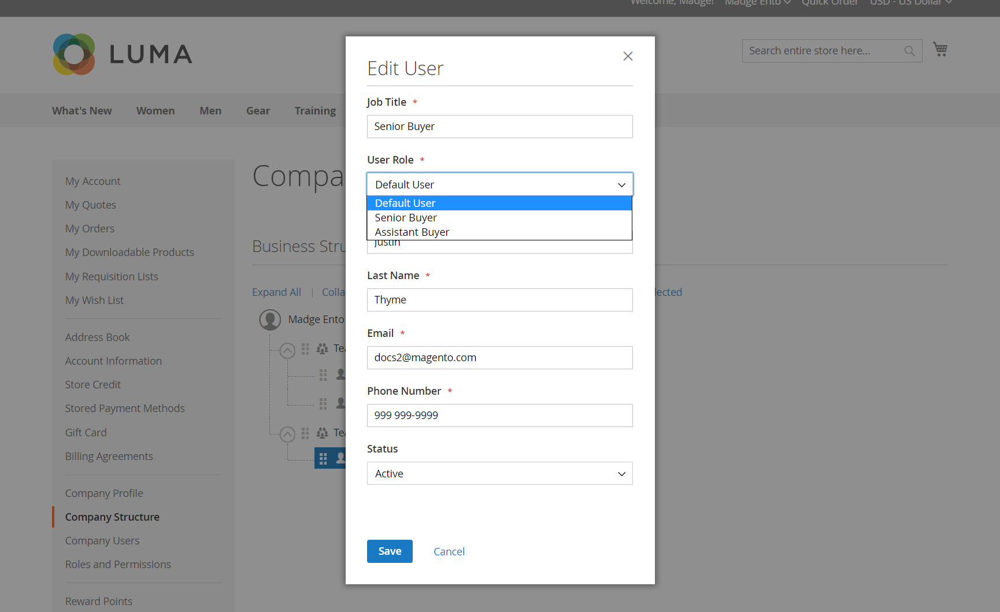

# Unternehmensrollen und -berechtigungen

Sie richten Rollen für Unternehmensbenutzer ein, die über verschiedene Berechtigungsebenen für den Zugriff auf Verkaufsinformationen und Ressourcen verfügen. Standardmäßig ist der Unternehmensadministrator ein &quot;*&quot; mit* Berechtigungen. Die [Zugriff verweigert](../content-design/pages.md#access-denied) wird angezeigt, wenn ein Benutzer nicht über die Berechtigung zum Zugriff auf die Seite verfügt.

{width="700" zoomable="yes"}

Das System verfügt über eine vordefinierte Standardbenutzerrolle, die Sie unverändert *oder* Ihren Anforderungen anpassen können. Sie können so viele Rollen erstellen, wie für Ihre Unternehmensstruktur und die organisatorischen Zuständigkeiten erforderlich sind, z. B.:

- **Standardbenutzer** - Der Standardbenutzer hat vollen Zugriff auf Aktivitäten im Zusammenhang mit Verkäufen und Angeboten sowie nur Lesezugriff auf das Unternehmensprofil und die Kreditinformationen.

- **Senior Buyer** - Ein Senior Buyer hat möglicherweise Zugriff auf alle Sales- und Quotes-Ressourcen und hat schreibgeschützte Berechtigungen für das Unternehmensprofil, Benutzer und Teams, Zahlungsinformationen und Firmenkredite.

- **Hilfskäufer** - Ein Hilfskäufer kann berechtigt sein, eine Bestellung mithilfe von **[!UICONTROL Checkout with quote]** aufzugeben und Bestellungen, Angebote und Informationen im Unternehmensprofil anzuzeigen.

## Verwalten von Rollen und Berechtigungen

Verwalten Sie Unternehmensrollen über das Storefront-Konto des Unternehmensadministrators.

**So öffnen Sie Rollen und Berechtigungen:**

1. Melden Sie sich bei der Storefront als Unternehmensadministrator an.

1. Wählen Sie im linken Bedienfeld **[!UICONTROL Roles and Permissions]** aus.

1. Führen Sie eine der folgenden Aufgaben aus.

### Erstellen einer Rolle

1. Klicken Sie auf **[!UICONTROL Add New Role]**.

   {width="600" zoomable="yes"}

1. Geben Sie einen beschreibenden **[!UICONTROL Role Name]** ein.

1. Führen Sie unter **[!UICONTROL Role Permissions]** einen der folgenden Schritte aus:

   - Aktivieren Sie das Kontrollkästchen jeder Ressource oder Aktivität, auf die Benutzende, die der Rolle zugewiesen sind, zugreifen dürfen.

   - Aktivieren Sie das Kontrollkästchen **[!UICONTROL All]** und deaktivieren Sie das Kontrollkästchen für jede Ressource oder Aktivität, auf die Benutzende, die der Rolle zugewiesen sind, keine Zugriffsberechtigung haben.

1. Klicken Sie auf **[!UICONTROL Save Role]**.

1. Wiederholen Sie diese Schritte, um so viele Rollen wie nötig zu erstellen.

### Rolle ändern

1. Suchen Sie die zu ändernde Rolle und klicken Sie in der Spalte **[!UICONTROL Actions]** auf **[!UICONTROL Edit]** .

1. Nehmen Sie die erforderlichen Änderungen an den Einstellungen für Namen und Berechtigungen vor.

1. Klicken Sie abschließend auf **[!UICONTROL Save Role]**.

### Duplizieren einer Rolle

1. Suchen Sie die Rolle, die Sie duplizieren möchten, und klicken Sie in der Spalte **[!UICONTROL Actions]** auf **[!UICONTROL Duplicate]** .

1. Nehmen Sie die erforderlichen Änderungen an den Einstellungen für Namen und Berechtigungen vor.

1. Klicken Sie abschließend auf **[!UICONTROL Save Role]**.

### Löschen einer Rolle

1. Suchen Sie in der Liste der Rollen nach der zu löschenden Rolle.

   Nur Rollen ohne zugewiesene Benutzer können gelöscht werden.

1. Klicken Sie in der Spalte **[!UICONTROL Actions]** auf **[!UICONTROL Delete]** .

1. Wenn Sie zum Bestätigen aufgefordert werden, klicken Sie auf **[!UICONTROL OK]**.

## Aktionen der Rollenliste {#actions}

| Aktion | Beschreibung |
| --- | --- |
| [!UICONTROL Duplicate] | Erstellt eine Kopie der ausgewählten Rolle. Der Name der doppelten Rolle `- Duplicated` am Ende hinzugefügt. |
| [!UICONTROL Edit] | Ändert den Namen und den Berechtigungssatz. |
| [!UICONTROL Delete] | Löscht die Rolle. Nur Rollen ohne zugewiesene Benutzer können gelöscht werden. |

{style="table-layout:auto"}

## Rollenberechtigungen

B2B-Funktionen werden durch **Berechtigungen** (ACL-Ressourcen) bewertet. Wenn ein(e) Benutzende(r) im Unternehmen eine Seite öffnet oder eine Aktion in der Storefront ausführt, prüft das Programm, ob seine/ihre Rolle die erforderliche Berechtigung enthält.

Unternehmensadministratoren können die Berechtigungskonfiguration für eine Rolle aktualisieren, indem sie **[!UICONTROL Edit]** auswählen und dann Berechtigungen in der **[!UICONTROL Role Permissions]**-Liste auswählen oder löschen.

{width="700" zoomable="yes"}

Weisen Sie diese Ressourcen zu, wenn **eine Unternehmensrolle erstellen oder bearbeiten** im Unternehmenskonto vorhanden ist. Benutzer mit der Berechtigung zum Verwalten von Rollen können das Rollenformular öffnen und die Berechtigungsstruktur festlegen.

Rollenberechtigungen sind in einer Baumstruktur mit Hauptoptionen und untergeordneten Optionen organisiert. Wenn Sie eine Hauptoption auswählen, werden automatisch alle untergeordneten Optionen ausgewählt. Wenn Sie eine Hauptoption löschen, werden auch alle untergeordneten Optionen gelöscht. Untergeordnete Optionen können auch einzeln ausgewählt oder gelöscht werden.

### Alle Berechtigungen

| Berechtigungsbezeichnung | Beschreibung |
| --- | --- |
| Alle | Stammknoten für **alle** Berechtigungen zugewiesen zu dieser Storefront-Rolle. |

### Vertriebsberechtigungen

| Berechtigungsbezeichnung | Beschreibung |
| --- | --- |
| Verkauf | Übergeordnetes Element für Checkout- und Bestellanzeige für Firmenbenutzer. |
| Auschecken zulassen | Bestellungen an der Kasse aufgeben. |
| Pay-on-Account-Methode verwenden | Verwenden Sie **Zahlung auf Konto** (Firmenkredit) an der Kasse, wenn es verfügbar ist. |
| Bestellungen anzeigen | Zeigen Sie die eigenen Bestellungen des Benutzers an. |
| Bestellungen von untergeordneten Benutzern anzeigen | Zeigt Bestellungen an, die von Benutzern unterhalb dieses Benutzers in der Hierarchie platziert wurden. |

### Berechtigungen für Anführungszeichen

Übergeordneter Knoten in der Berechtigungsstruktur des Unternehmens: **Anführungszeichen**.

| Berechtigungsbezeichnung | Beschreibung |
| --- | --- |
| Anführungszeichen | Übergeordnetes Element für verhandelbare Angebotsaktionen der Storefront. |
| Anzeigen (Anführungszeichen) | Anzeigen verhandelbarer Angebote. |
| Anfordern, Bearbeiten, Löschen | Fordern Sie neue Angebote an, bearbeiten Sie Angebote und löschen Sie Angebote nach Geschäftsregeln. |
| Checkout mit Angebot | Checkout mit einem genehmigten Angebot abschließen. |
| Angebote von untergeordneten Benutzern verwalten | Übergeordnetes Element für Aktionen in Anführungszeichen von untergeordneten Elementen. |
| Anzeigen (Anführungszeichen der untergeordneten Elemente) | Anführungszeichen von untergeordneten Elementen anzeigen. |
| Bearbeiten (Anführungszeichen der Untergebenen) | Anführungszeichen der untergeordneten Elemente bearbeiten. |
| Löschen (Anführungszeichen der untergeordneten Elemente) | Anführungszeichen der untergeordneten Elemente löschen. |

### Angebotsvorlagen

Übergeordneter Knoten: **Angebotsvorlagen** (unter **Anführungszeichen** in der Unternehmensstruktur).

| Berechtigungsbezeichnung | Beschreibung |
| --- | --- |
| Angebotsvorlagen | Übergeordnetes Element für Angebotsvorlagenfunktionen in der Storefront. |
| Anzeigen (Vorlagen) | Angebotsvorlagen anzeigen. |
| Anfordern, Bearbeiten, Löschen | Angebotsvorlagen erstellen, aktualisieren, abbrechen und verwalten |
| Generieren von Anführungszeichen aus Vorlagen | Generieren von verhandelbaren Anführungszeichen aus Vorlagen |
| Angebotsvorlagen von untergeordneten Benutzern verwalten | Übergeordnetes Element für untergeordnete Vorlagenaktionen. |
| Anzeigen (Vorlagen der Untergebenen) | Angebotsvorlagen von Mitarbeitern anzeigen. |
| Bearbeiten (Vorlagen der Untergebenen) | Angebotsvorlagen von Mitarbeitern bearbeiten. |
| Löschen (Vorlagen der Untergebenen) | Angebotsvorlagen der untergeordneten Mitarbeiter löschen. |

### Bestellungsgenehmigungen

Übergeordneter Knoten: **Bestellgenehmigungen**. Berechtigungen für Bestellungen und Genehmigungsregeln sind unter dieser Verzweigung in der Struktur verschachtelt.

### Bestellungen

| Berechtigungsbezeichnung | Beschreibung |
| --- | --- |
| Bestellungsgenehmigungen | Übergeordnet für Bestellungsfunktionen und Genehmigungsfunktionen. |
| Meine Bestellungen anzeigen | Von diesem Benutzer erstellte Bestellungen anzeigen. |
| Für untergeordnete Elemente anzeigen | Bestellungen für Benutzer unterhalb dieses Benutzers in der Hierarchie anzeigen. |
| Für alle Unternehmen anzeigen | Bestellungen im gesamten Unternehmen anzeigen. |
| In dieser Funktion erstellte Bestellungen automatisch genehmigen | Bestellungen, die von Benutzern in dieser Funktion erstellt wurden, automatisch genehmigen, wenn Regeln dies zulassen. |

### Bestellregeln

| Berechtigungsbezeichnung | Beschreibung |
| --- | --- |
| Bestellungen ohne andere Genehmigungen genehmigen | Bestellungen genehmigen, selbst wenn normalerweise andere Genehmigungen erforderlich wären (gemäß Genehmigungsregeln). |
| Genehmigungsregeln anzeigen | Regeln für Bestellgenehmigungen anzeigen. |
| Erstellen, Bearbeiten und Löschen | Genehmigungsregeln erstellen, bearbeiten und löschen. |

### Unternehmensprofil und Kontakte

Storefront-Berechtigungen für Unternehmensprofilabschnitte. Verschachtelte **Bearbeiten**-Einträge gelten nur unter der Berechtigung **Anzeigen** darüber in der Rollenstruktur.

| Berechtigungsbezeichnung | Beschreibung |
| --- | --- |
| Unternehmensprofil | Zugreifen auf Unternehmensprofilbereiche als Gruppe. |
| Kontoinformationen (Ansicht) | Informationen zum Unternehmenskonto anzeigen. |
| Bearbeiten | Bearbeiten Sie die Kontoinformationen des Unternehmens (unter „Kontoinformationen„). |
| Rechtliche Adresse (Ansicht) | Zeigen Sie die rechtliche Adresse des Unternehmens an. |
| Bearbeiten | Bearbeiten Sie die rechtliche Adresse des Unternehmens (unter „Adresse„). |
| Kontakte (Ansicht) | Firmenkontakte anzeigen. |
| Zahlungsinformationen (Ansicht) | Zeigen Sie Zahlungsinformationen im Unternehmensprofil an. |
| Versandinformationen (Ansicht) | Lieferinformationen im Unternehmensprofil anzeigen. |

## Benutzerverwaltung für Unternehmen

| Berechtigungsbezeichnung | Beschreibung |
| --- | --- |
| Firmen-Benutzerverwaltung | Übergeordnet für Rollen und für Benutzer oder Teams. |
| Anzeigen von Rollen und Berechtigungen | Anzeigen von Unternehmensrollen und deren Berechtigungen |
| Verwalten von Rollen und Berechtigungen | Rollen erstellen oder bearbeiten und Berechtigungen zuweisen. |
| Benutzer und Teams anzeigen | Anzeigen von Unternehmensbenutzenden und -teams. |
| Verwalten von Benutzern und Teams | Benutzer und Teams hinzufügen, bearbeiten oder entfernen. |

## Unternehmenskredit

| Berechtigungsbezeichnung | Beschreibung |
| --- | --- |
| Unternehmenskredit | Zugriff auf den Kreditbereich des Unternehmens. |
| Anzeigen (Kredithistorie) | Anzeigen der Kredithistorie des Unternehmens und der zugehörigen Saldoinformationen. |

## Einem Firmenbenutzer eine Rolle zuweisen

Nachdem Sie die benötigten Rollen definiert haben, weisen Sie jedem Firmenbenutzer eine Rolle zu.

**So weisen Sie eine Rolle zu:**

1. Melden Sie sich bei der Storefront als Unternehmensadministrator an.

1. Wählen Sie im linken Bedienfeld **[!UICONTROL Company Users]** aus.

   {width="700" zoomable="yes"}

1. Suchen Sie den Benutzer in der Liste und klicken Sie auf **[!UICONTROL Edit]**.

1. Wählen Sie die entsprechende **[!UICONTROL User Role]** für den Benutzer aus.

   {width="700" zoomable="yes"}

1. Klicken Sie auf **[!UICONTROL Save]**.

>[!MORELIKETHIS]
>
>- [Verwalten von Firmenbenutzenden](account-company-users.md)
>- [Struktur des Unternehmenskontos](account-company-structure.md)
>- [Rolle des Unternehmensadministrators](account-company-admin.md)
>- [Unternehmen verwalten](manage-companies.md)
>- [Aktivieren von B2B-Funktionen](enable-basic-features.md)
