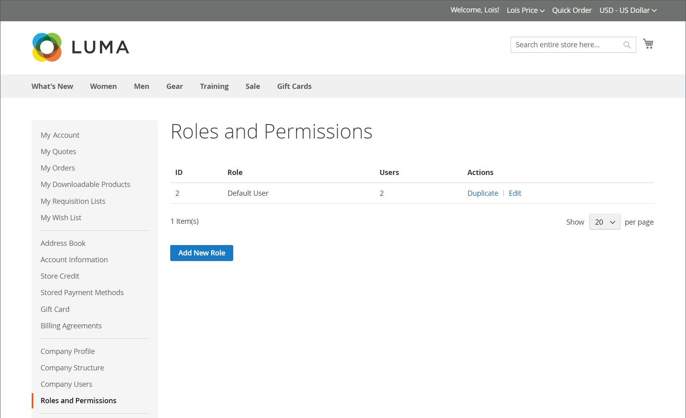

# Unternehmensrollen und -berechtigungen

Rollen für Unternehmensbenutzer werden mit verschiedenen Berechtigungsstufen für den Zugriff auf Verkaufsinformationen und -ressourcen eingerichtet. Der Unternehmensadministrator ist standardmäßig ein _Superuser_ mit vollständigen Berechtigungen. Die [Zugriff verweigert](../content-design/pages.md#access-denied) angezeigt, wenn der Benutzer nicht über die nötigen Berechtigungen zum Zugriff auf die Seite verfügt.

{width="700" zoomable="yes"}

Das System verfügt über eine vordefinierte Standardbenutzerrolle, die Sie verwenden können. _as is_ oder ändern Sie sie entsprechend Ihren Anforderungen. Sie können so viele Rollen erstellen, wie für Ihre Unternehmensstruktur und organisatorische Aufgaben erforderlich sind, z. B.:

- **Standardbenutzer** — Der Standardbenutzer hat vollen Zugriff auf Aktivitäten im Zusammenhang mit Verkäufen und Anführungszeichen sowie schreibgeschützten Zugriff auf Unternehmensprofil- und Kreditdaten.

- **Hauptkäufer** — Ein älterer Käufer hat möglicherweise Zugriff auf alle Ressourcen für Verkäufe und Preisangebote sowie auf schreibgeschützte Berechtigungen für das Unternehmensprofil, Benutzer und Teams, Zahlungsinformationen und Firmenkredite.

- **Assistent: Käufer** — Ein Assistenzkäufer kann die Erlaubnis haben, eine Bestellung über _Checkout mit Anführungszeichen_ und um Bestellungen, Anführungszeichen und Informationen im Firmenprofil anzuzeigen.

## Rollen und Berechtigungen verwalten

1. Der Unternehmensadministrator meldet sich bei seinem Store-Konto an.

1. Wählen Sie im linken Bereich **[!UICONTROL Roles and Permissions]**.

1. Führt eine der folgenden Aufgaben aus.

### Rollen erstellen

1. Klicks **[!UICONTROL Add New Role]**.

   {width="600" zoomable="yes"}

1. Fügt eine Beschreibung ein **[!UICONTROL Role Name]**.

1. under _[!UICONTROL Role Permissions]_, führt einen der folgenden Schritte aus:

   - Markiert das Kontrollkästchen der einzelnen Ressourcen oder Aktivitäten, denen Benutzer, denen die Rolle zugewiesen wurde, Zugriff gewähren.

   - Wählt die **[!UICONTROL All]** und deaktivieren das Kontrollkästchen der einzelnen Ressourcen oder Aktivitäten, auf die die Benutzer, die der Rolle zugewiesen sind, keinen Zugriff haben.

1. Klicks **[!UICONTROL Save Role]**.

1. Erstellt so viele Rollen wie nötig, indem diese Schritte wiederholt werden.

### Rollen ändern

1. Damit die Rolle geändert werden kann, klickt der Unternehmensadministrator auf **[!UICONTROL Edit]** im _[!UICONTROL Actions]_Spalte.

1. Nehmen Sie die erforderlichen Änderungen an den Namen- und Berechtigungseinstellungen vor.

1. Klicken Sie nach Abschluss **[!UICONTROL Save Role]**.

### Rolle duplizieren

1. Damit die Rolle dupliziert wird, klickt der Unternehmensadministrator auf **[!UICONTROL Duplicate]** im _[!UICONTROL Actions]_Spalte.

1. Nehmen Sie die erforderlichen Änderungen an den Namen- und Berechtigungseinstellungen vor.

1. Klicken Sie nach Abschluss **[!UICONTROL Save Role]**.

### Rollen löschen

1. Der Unternehmensadministrator findet die zu löschende Rolle In der Liste der Rollen.

   Es können nur Rollen ohne zugewiesene Benutzer gelöscht werden.

1. Klicks **[!UICONTROL Delete]** im _[!UICONTROL Actions]_Spalte.

1. Wenn Sie zur Bestätigung aufgefordert werden, klickt **[!UICONTROL OK]**.

## Aktionen

| Aktion | Beschreibung |
|-----------| ----------- |
| [!UICONTROL Duplicate] | Erstellt eine Kopie der ausgewählten Rolle. Der Name der doppelten Rolle hat `- Duplicated` hinzugefügt. |
| [!UICONTROL Edit] | Ändern Sie den Namen und/oder den Berechtigungssatz. |
| [!UICONTROL Delete] | Löschen Sie die Rolle. Es können nur Rollen ohne zugewiesene Benutzer gelöscht werden. |

{style="table-layout:auto"}

## Rollenberechtigungen

- Alle
   - Vertrieb
      - Auschecken zulassen (Reihenfolge festlegen)
         - Methode &quot;Pay On Account&quot;verwenden
      - Bestellungen anzeigen
         - Anzeigen von Bestellungen untergeordneter Benutzer
- Anführungszeichen
   - Ansicht
      - Anfrage, Bearbeiten, Löschen
      - Checkout mit Anführungszeichen
      - Anzeigen von Anführungszeichen untergeordneter Benutzer
- Bestellgenehmigungen
   - Meine Kaufaufträge anzeigen
      - Anzeigen für Untergeordnete
      - Anzeigen für alle Unternehmen
   - Automatische Genehmigung von in dieser Rolle erstellten EOs
   - Kaufaufträge ohne andere Genehmigungen genehmigen
   - Anzeigen von Genehmigungsregeln
      - Erstellen, Bearbeiten und Löschen
- Firmenprofil
   - Kontoinformationen (Ansicht)
      - Bearbeiten
   - Anschrift
      - Bearbeiten
   - Kontakte (Ansicht)
   - Zahlungsinformationen (Ansicht)
   - Versandinformationen (Ansicht)
- Benutzerverwaltung in Unternehmen
   - Rollen und Berechtigungen anzeigen
      - Rollen und Berechtigungen verwalten
   - Benutzer und Teams anzeigen
      - Benutzer und Teams verwalten
- Firmenguthaben
   - Ansicht

## Zuweisen einer Rolle zu einem Unternehmensbenutzer

Nach der Definition der erforderlichen Rollen weist der Unternehmensadministrator jedem Unternehmensbenutzer eine Rolle zu.

1. Melden Sie sich bei ihrem Unternehmenskonto als Unternehmensadministrator an.

1. Wählen Sie im linken Bereich **[!UICONTROL Company Users]**.

   {width="700" zoomable="yes"}

1. Findet den Benutzer in der Liste und klickt auf **[!UICONTROL Edit]**.

1. Wählen Sie die geeignete **[!UICONTROL User Role]** für den Benutzer.

   {width="700" zoomable="yes"}

1. Klicks **[!UICONTROL Save]**.
