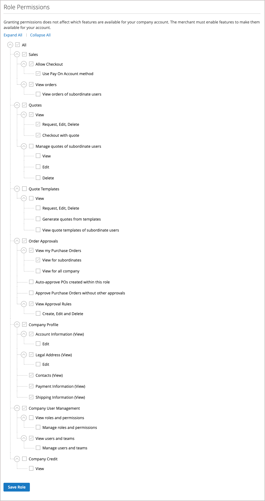

# Unternehmensrollen und -berechtigungen

Rollen für Unternehmensbenutzer werden mit verschiedenen Berechtigungsstufen für den Zugriff auf Verkaufsinformationen und -ressourcen eingerichtet. Standardmäßig ist der Unternehmensadministrator ein _Superuser_ mit vollen Berechtigungen. Die Seite [Zugriff verweigert](../content-design/pages.md#access-denied) wird angezeigt, wenn der Benutzer nicht über die Berechtigung zum Zugriff auf die Seite verfügt.

{width="700" zoomable="yes"}

Das System verfügt über eine vordefinierte Standardbenutzerrolle, die Sie _wie besehen_ verwenden oder entsprechend Ihren Anforderungen ändern können. Sie können so viele Rollen erstellen, wie für Ihre Unternehmensstruktur und organisatorische Aufgaben erforderlich sind, z. B.:

- **Standardbenutzer** - Der Standardbenutzer hat vollen Zugriff auf Aktivitäten im Zusammenhang mit Verkäufen und Anführungszeichen sowie schreibgeschützten Zugriff auf Unternehmensprofile und Kreditdaten.

- **Hauptkäufer** - Ein älterer Käufer hat möglicherweise Zugriff auf alle Ressourcen für Verkauf und Preisangebote sowie auf schreibgeschützte Berechtigungen für das Unternehmensprofil, Benutzer und Teams, Zahlungsinformationen und Unternehmensgutschriften.

- **Assistant Buyer**: Ein Assistant Buyer kann berechtigt sein, eine Bestellung mithilfe von _Checkout mit Anführungszeichen_ zu tätigen und Bestellungen, Anführungszeichen und Informationen im Firmenprofil anzuzeigen.

## Rollen und Berechtigungen verwalten

1. Der Unternehmensadministrator meldet sich bei seinem Store-Konto an.

1. Wählen Sie im linken Bereich **[!UICONTROL Roles and Permissions]** aus.

1. Führt eine der folgenden Aufgaben aus.

### Rollen erstellen

1. Klicks **[!UICONTROL Add New Role]**.

   {width="600" zoomable="yes"}

1. Fügt einen beschreibenden **[!UICONTROL Role Name]** ein.

1. Führt unter _[!UICONTROL Role Permissions]_einen der folgenden Schritte aus:

   - Markiert das Kontrollkästchen der einzelnen Ressourcen oder Aktivitäten, denen Benutzer, denen die Rolle zugewiesen wurde, Zugriff gewähren.

   - Aktivieren Sie das Kontrollkästchen **[!UICONTROL All]** und deaktivieren Sie das Kontrollkästchen der einzelnen Ressourcen oder Aktivitäten, auf die Benutzer, die der Rolle zugewiesen sind, keine Zugriffsberechtigung haben.

1. Klicks **[!UICONTROL Save Role]**.

1. Erstellt so viele Rollen wie nötig, indem diese Schritte wiederholt werden.

### Rollen ändern

1. Damit die Rolle geändert werden kann, klickt der Unternehmensadministrator in der Spalte _[!UICONTROL Actions]_auf **[!UICONTROL Edit]**.

1. Nehmen Sie die erforderlichen Änderungen an den Namen- und Berechtigungseinstellungen vor.

1. Klicken Sie nach Abschluss des Vorgangs auf **[!UICONTROL Save Role]**.

### Rolle duplizieren

1. Damit die Rolle dupliziert werden kann, klickt der Unternehmensadministrator in der Spalte _[!UICONTROL Actions]_auf **[!UICONTROL Duplicate]**.

1. Nehmen Sie die erforderlichen Änderungen an den Namen- und Berechtigungseinstellungen vor.

1. Klicken Sie nach Abschluss des Vorgangs auf **[!UICONTROL Save Role]**.

### Rollen löschen

1. Der Unternehmensadministrator findet die zu löschende Rolle In der Liste der Rollen.

   Es können nur Rollen ohne zugewiesene Benutzer gelöscht werden.

1. Klicks **[!UICONTROL Delete]** in der Spalte _[!UICONTROL Actions]_.

1. Wenn Sie zur Bestätigung aufgefordert werden, klicken Sie auf **[!UICONTROL OK]**.

## Aktionen

| Aktion | Beschreibung |
|-----------| ----------- |
| [!UICONTROL Duplicate] | Erstellt eine Kopie der ausgewählten Rolle. Am Ende des Namens der doppelten Rolle wurde `- Duplicated` hinzugefügt. |
| [!UICONTROL Edit] | Ändern Sie den Namen und/oder den Berechtigungssatz. |
| [!UICONTROL Delete] | Löschen Sie die Rolle. Es können nur Rollen ohne zugewiesene Benutzer gelöscht werden. |

{style="table-layout:auto"}

## Rollenberechtigungen

Unternehmensadministratoren können die Berechtigungskonfiguration für eine Rolle aktualisieren, indem sie den Wert [!UICONTROL Edit action] auswählen und dann Berechtigungen in der Liste **Rollenberechtigungen** auswählen oder entfernen.

{width="700" zoomable="yes"}

## Zuweisen einer Rolle zu einem Unternehmensbenutzer

Nach der Definition der erforderlichen Rollen weist der Unternehmensadministrator jedem Unternehmensbenutzer eine Rolle zu.

1. Melden Sie sich bei ihrem Unternehmenskonto als Unternehmensadministrator an.

1. Wählen Sie im linken Bereich **[!UICONTROL Company Users]** aus.

   {width="700" zoomable="yes"}

1. Sucht den Benutzer in der Liste und klickt auf **[!UICONTROL Edit]**.

1. Wählen Sie den entsprechenden **[!UICONTROL User Role]** für den Benutzer aus.

   {width="700" zoomable="yes"}

1. Klicks **[!UICONTROL Save]**.
