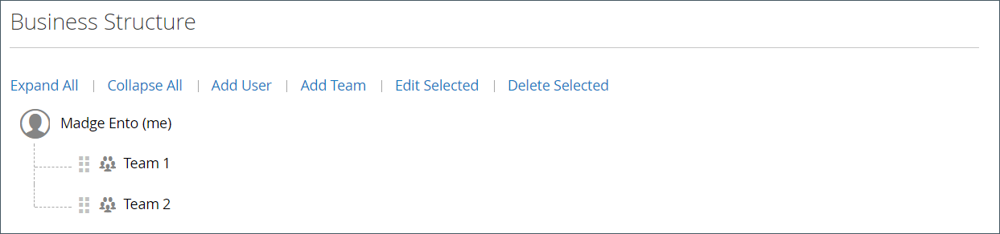

# Struktur des Unternehmenskontos

Es kann ein Unternehmenskonto eingerichtet werden, das die Struktur des Unternehmens widerspiegelt. Zunächst umfasst die Unternehmensstruktur nur den Unternehmensadministrator, kann jedoch erweitert werden, um Teams von Benutzern aufzunehmen. Die Benutzer können Teams zugeordnet oder innerhalb einer Hierarchie von Abteilungen und Unterteilungen innerhalb des Unternehmens organisiert werden.

{width="500"}

Im Konto-Dashboard des Unternehmensadministrators wird die Unternehmensstruktur als Struktur dargestellt und besteht zunächst nur aus dem Unternehmensadministrator.

{width="600" zoomable="yes"}

Wenn das Konto erstellt und genehmigt wird, kann der Unternehmensadministrator die E-Mail-Adresse des Unternehmens verwenden oder eine andere E-Mail-Adresse erhalten.

Es ist möglich, dass die Person, die als Unternehmensadministrator fungiert, innerhalb des Unternehmens über mehrere Rollen verfügt. Wenn für den Unternehmensadministrator eine separate E-Mail-Adresse angegeben wird, umfasst die ursprüngliche Unternehmensstruktur den Unternehmensadministrator sowie ein einzelnes Benutzerkonto im Namen des Unternehmensadministrators. In diesem Fall kann sich der Unternehmensadministrator als Unternehmen oder als einzelner Benutzer beim Konto anmelden.

{width="600" zoomable="yes"}

Bei Händlern spiegelt sich die gesamte Unternehmensstruktur in der _Unternehmen_ und _Kunden_ Raster innerhalb des Administrators. Das Unternehmensnetz listet alle Unternehmen unabhängig vom Status auf. Das folgende Beispiel zeigt zwei Unternehmen: die _ACME_ und _Vendelay_ Unternehmen.

{width="700" zoomable="yes"}

Das folgende Beispiel zeigt die [!UICONTROL Customers] mit den anfänglichen Unternehmensadministratorkonten für diese Unternehmen.

{width="700" zoomable="yes"}

Nach Erstellung des Kontos muss der Unternehmensadministrator die Unternehmensstruktur von [Teams](account-company-structure.md), richten Sie die [Unternehmensbenutzer](account-company-users.md)und [Rollen und Berechtigungen](account-company-roles-permissions.md) für jede.

## Symbole für die Unternehmensstruktur

| Symbol | Beschreibung |
| ---- | ----------------- |
|  | Bezeichnet den Unternehmensadministrator in der Unternehmensstruktur. |
|  | Stellt ein Team in der Unternehmensstruktur dar. |
|  | Stellt einen Benutzer in der Unternehmensstruktur dar. |
|  | Verschiebt ein Team an eine andere Position in der Unternehmensstruktur. |
|  | Erweitert ein Team in der Unternehmensstruktur. |
|  | Reduziert ein Team in der Unternehmensstruktur. |

{style="table-layout:auto"}

## Erstellen von Unternehmensteams

Die Struktur eines Unternehmenskontos sollte die Einkaufs-Organisation widerspiegeln, sei es einfach und einfach oder komplex eine Organisation mit unterschiedlichen Teams für jede Unterteilung und jeden Geschäftsbereich des Unternehmens.

Wenn der Store [konfiguriert](enable-basic-features.md) Damit Unternehmen ihre eigenen Konten verwalten können, gehört die Einrichtung der Unternehmensstruktur zu den ersten Aufgaben, die ein Unternehmensadministrator nach Genehmigung des Kontos abschließen muss. Im Unternehmenskonto wird die Struktur des Unternehmens als Baum dargestellt, wobei sich der Unternehmensadministrator oben befindet.

{width="450"}

1. Der Unternehmensadministrator meldet sich bei seinem Konto an.

1. Wählen Sie im linken Bereich **[!UICONTROL Company Structure]**.

1. under **[!UICONTROL Business Structure]**, Klicks **[!UICONTROL Add Team]** und führt Folgendes aus:

   - Fügt die **[!UICONTROL Team Title]** und **[!UICONTROL Description]**.

     Der Teamtitel kann beliebig sein, was die Struktur des Unternehmens darstellt, z. B. ein Team, ein Büro oder eine Abteilung innerhalb des Unternehmens

     {width="700" zoomable="yes"}

   - Klicken Sie nach Abschluss **[!UICONTROL Save]**.

   - Erstellt so viele Teams wie nötig.

     {width="600" zoomable="yes"}

1. Gehen Sie wie folgt vor, um eine Hierarchie von Teams zu erstellen:

   - Wählen Sie das übergeordnete Team aus und klicken Sie auf **[!UICONTROL Add Team]**.

     {width="600" zoomable="yes"}

   - Fügt die **[!UICONTROL Team Title]** und **[!UICONTROL Description]**.

   - Klicks **[!UICONTROL Save]**.

1. Wiederholt diese Schritte, um so viele Teams, Divisionen und Unterteilungen wie nötig zu erstellen.

   {width="600" zoomable="yes"}

## Verschieben eines Teams

Wenn der Unternehmensadministrator mit der Unternehmensstruktur arbeitet, kann er Teams oder Abteilungen an andere Positionen in der Struktur ziehen.

1. Der Unternehmensadministrator ermittelt das zu verschiebende Team.

1. Klickt und zieht das Team an eine neue Position in der Unternehmensstruktur.

## Team löschen

>[!NOTE]
>
>Bevor Sie ein Team löschen, sollten Sie sicherstellen, dass das richtige Team ausgewählt ist. Gelöschte Teams können nicht wiederhergestellt werden.

1. Der Unternehmensadministrator wählt das zu löschende Team aus.

1. Klicks **[!UICONTROL Delete Selected]**.

1. Wenn Sie zur Bestätigung aufgefordert werden, klickt **[!UICONTROL Delete]**.

## Erweitern oder Reduzieren der Teamstruktur

Wenn der Unternehmensadministrator mit der Unternehmensstruktur arbeitet, kann er den Baum reduzieren oder erweitern:

- Klicks **[!UICONTROL Collapse All]** oder **[!UICONTROL Expand All]**.

- Klicks  zum Reduzieren eines Teams oder  , um ein Team zu erweitern.

## Zuweisen von Benutzern zu Teams

Wenn Teams und Benutzer zum ersten Mal zum [Unternehmensstruktur](account-company-structure.md), werden sie unter dem Unternehmensadministrator auf derselben Ebene platziert.

{width="700" zoomable="yes"}

| Kontrolle | Beschreibung |
|--- |--- |
| [!UICONTROL Collapse All / Expand All] | Die Struktur der Geschäftsstruktur wird entweder reduziert oder erweitert |
| [!UICONTROL Add User] | Erstellt einen Benutzer unterhalb des aktuellen Teams |
| [!UICONTROL Add Team] | Erstellt ein Team |
| [!UICONTROL Edit Selected / Delete Selected] | Bearbeiten oder Entfernen von Benutzern aus der Geschäftsstruktur |

{style="table-layout:auto"}

1. Im linken Bereich wählt der Unternehmensadministrator **[!UICONTROL Company Structure]**.

1. Um einen Benutzer einem vorhandenen Team zuzuweisen, ziehen sie () den Benutzer unter dem entsprechenden Team.

   {width="700" zoomable="yes"}
