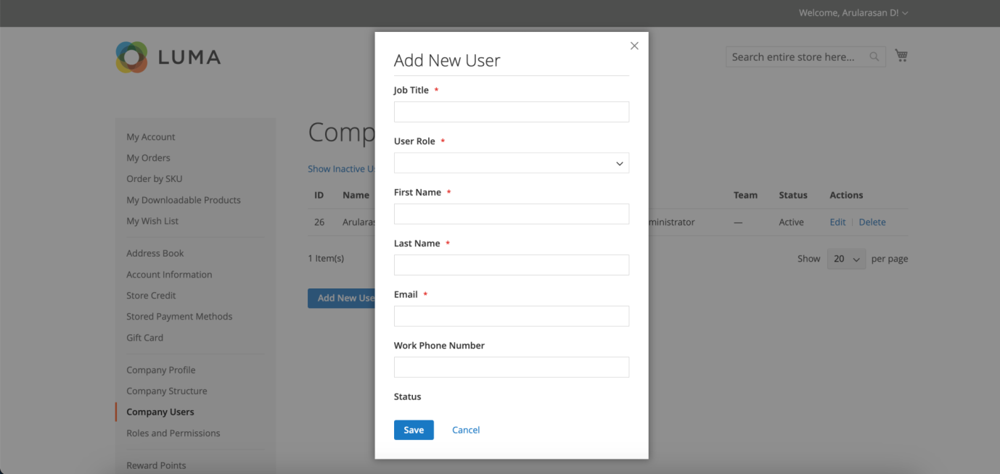

# Verwalten von Unternehmensbenutzerkonten

Auf der Storefront werden Unternehmensbenutzer vom Unternehmensadministrator zugewiesen und sind auf der Seite &quot;_[!UICONTROL Company Users]_&quot;sichtbar. Diese Personen sind in der Regel Käufer mit unterschiedlichen Berechtigungen für den Zugriff auf Store-Dienste und -Ressourcen.

Der Unternehmensadministrator richtet zunächst die [Unternehmensstruktur](account-company-structure.md) ein und führt dann bei Bedarf die folgenden Aufgaben aus:

- Erstellen von Unternehmensbenutzern und Zuweisen von Benutzern zu Teams

- Definieren von Rollen und Berechtigungen und Zuweisen von Benutzern zu Rollen

Unternehmensbenutzer können nur vom Unternehmensadministrator hinzugefügt, bearbeitet, inaktiviert oder gelöscht werden.

- Wenn ein Benutzer entfernt wird, ändert sich der Kontostatus in *inaktiv* und der Kunde kann sich nicht mehr beim Unternehmen anmelden. Administratoren können weiterhin auf alle Inhalte zugreifen, die mit dem Benutzer verknüpft sind. Der Kontoadministrator kann den Zugriff wiederherstellen, indem er den Kontostatus von der Seite [!UICONTROL Company Users] auf *[!UICONTROL Active]* ändert.

- Wenn ein Benutzerkonto gelöscht wird, werden das Konto und alle zugehörigen Inhalte aus der Storefront gelöscht. Diese Aktion kann nicht rückgängig gemacht werden.

## Hinzufügen von Unternehmensbenutzern

1. Der Unternehmensadministrator meldet sich von der Storefront aus bei seinem Konto an.

1. Wählen Sie im linken Bereich **[!UICONTROL Company Users]** aus.

   {width="700" zoomable="yes"}

1. klickt auf **[!UICONTROL Add New User]** und führt Folgendes aus:

   - Fügt die **[!UICONTROL Job Title]** des neuen Benutzers ein.

   - Wählen Sie den entsprechenden **[!UICONTROL User Role]** aus, wenn die Rollen und Berechtigungen definiert sind. Andernfalls können sie später zurückkehren, um die Rolle zuzuweisen.

     {width="700" zoomable="yes"}

   - Fügt die Benutzerinformationen in den übrigen Feldern hinzu:
      - **[!UICONTROL First Name]** und **[!UICONTROL Last Name]**
      - **[!UICONTROL Email]**
      - **[!UICONTROL Work Phone Number]**

   Standardmäßig ist die **[!UICONTROL Status]** des Kontos `Active`.

1. Klicken Sie nach Abschluss des Vorgangs auf **[!UICONTROL Save]**.

1. Wiederholt den Vorgang, um so viele Unternehmensbenutzer wie nötig zu erstellen.

   Die neuen Benutzer werden zusammen mit dem Unternehmensadministrator in der Liste der Unternehmensbenutzer angezeigt.

Um Zeit während der ersten Bestellung zu sparen, kann der Unternehmensadministrator jeden Unternehmensbenutzer daran erinnern, die standardmäßige Abrechnungs- und Lieferadresse des Unternehmens zu seinem [Adressbuch](../customers/account-dashboard-address-book.md) hinzuzufügen.

## Einen Benutzer aus dem [!UICONTROL Company structure] entfernen

Unternehmensadministratoren können einen Benutzer aus dem [!UICONTROL Company Structure] entfernen.

Nachdem ein Konto entfernt wurde, ändert sich der Benutzerkontenstatus in *inaktiv* und der Benutzer kann sich nicht mehr in der Storefront anmelden.
Der Administrator kann ein Konto reaktivieren, indem er die Benutzerkontoinformationen auf der Seite Unternehmensbenutzer bearbeitet.

1. Der Unternehmensadministrator meldet sich von der Storefront aus bei seinem Konto an.

1. Wählen Sie im linken Bereich **[!UICONTROL Company Structure]** aus.

1. Wählt den Unternehmensbenutzer in der Unternehmensstruktur aus.

1. Klicks **[!UICONTROL Remove from Structure]**.

   {width="600" zoomable="yes"}

1. Wenn Sie zur Bestätigung aufgefordert werden, klicken Sie auf **[!UICONTROL Remove]**.

   Im Admin bleibt der Unternehmensbenutzer im Raster [Kunden](../customers/customers-all.md) aufgeführt, jedoch mit dem Status `Inactive`.

## Anzeigen und Verwalten von Unternehmensbenutzerkonten

Unternehmensadministratoren können Unternehmensbenutzerkonten mithilfe der Ansichtsfilter auf der Seite [!UICONTROL Company Users] anzeigen und verwalten.

{width="700" zoomable="yes"}

- Zeigen Sie nur inaktive Benutzer an, indem Sie &quot;**[!UICONTROL Show Inactive Users]**&quot;auswählen.
- Zeigen Sie nur aktive Benutzer an, indem Sie &quot;**[!UICONTROL Show Active Users]**&quot;auswählen.
- Zeigen Sie alle Benutzer an, indem Sie &quot;**[!UICONTROL Show All Users]**&quot;auswählen.

Der Unternehmensadministrator kann ein einzelnes Konto mithilfe des Zeileneintrags &quot;*[!UICONTROL Actions]*&quot;verwalten, um die Kontoinformationen zu bearbeiten, den Kontostatus zu verwalten oder ein Konto zu löschen.

### Informationen zu Unternehmensbenutzerkonten bearbeiten

Unternehmensadministratoren können Profilinformationen zu Benutzerkonten aktualisieren und den Kontostatus ändern.

1. Suchen Sie auf der Seite [!UICONTROL Company Users] nach dem zu aktualisierenden Benutzerkonto. Klicken Sie auf **[!UICONTROL Edit]**.

1. Nehmen Sie alle erforderlichen Änderungen an den Benutzerkontoinformationen vor, einschließlich der Änderung des Kontostatus.

1. Wenden Sie die Änderungen an, indem Sie auf **[!UICONTROL Save]** klicken.

>[!NOTE]
>
>Wenn Sie ein Unternehmensbenutzerkonto bearbeiten und feststellen, dass dem Profil die erforderlichen Kontoinformationen wie z. B. die Berufsbezeichnung und die Telefonnummer fehlen, deutet dies darauf hin, dass das Konto von einem Commerce-Site-Administrator hinzugefügt wurde. Diese Konten können nicht über die Storefront bearbeitet werden. Wenden Sie sich an Ihren Site-Administrator, um Informationen zu aktualisieren oder den Kontostatus zu ändern.

### Deaktivieren oder Löschen eines aktiven Kontos

1. Suchen Sie auf der Seite [!UICONTROL Company Users] nach dem zu aktualisierenden Benutzerkonto. Klicken Sie auf **[!UICONTROL Manage]**.

   {width="600" zoomable="yes"}

1. Deaktivieren oder löschen Sie bei Bedarf das Benutzerkonto, wenn Sie dazu aufgefordert werden.

>[!IMPORTANT]
>
>Durch das Löschen eines Unternehmensbenutzerkontos werden das Konto und alle zugehörigen Inhalte aus dem System entfernt. Diese Aktion kann nicht rückgängig gemacht werden.

## Feldbeschreibungen für das Profil von Unternehmensbenutzern

| Feld | Beschreibung |
|--------------------------------|---------------|
| [!UICONTROL Job Title] | Die Berufsbezeichnung des Unternehmensbenutzers. |
| [!UICONTROL User Role] | Die dem Unternehmensbenutzer zugewiesene [Rolle](account-company-roles-permissions.md). Optionen: `Default User` / (andere Rollen) |
| [!UICONTROL First Name] | Der Vorname des Unternehmensbenutzers. |
| [!UICONTROL Last Name] | Der Nachname des Unternehmensbenutzers. |
| [!UICONTROL Email] | Die E-Mail-Adresse des Unternehmensbenutzers. |
| [!UICONTROL Work Phone Number] | Die geschäftliche Telefonnummer des Unternehmensbenutzers. |
| [!UICONTROL Status] | Der Status des Unternehmensbenutzerkontos. Optionen: `Active` / `Inactive` |

{style="table-layout:auto"}
