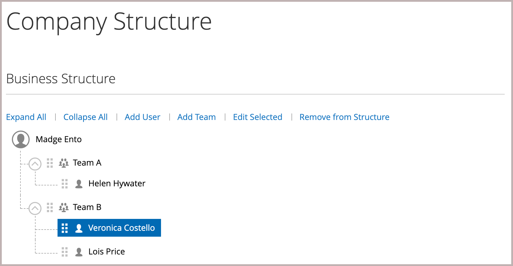

# Verwalten von Unternehmensbenutzerkonten

Unternehmensbenutzer werden vom Unternehmensadministrator zugewiesen und sind vom Kundentyp _[!UICONTROL Company User]_im Raster_[!UICONTROL Customers]_ im Admin sichtbar. Diese Personen sind in der Regel Käufer mit unterschiedlichen Berechtigungen für den Zugriff auf Store-Dienste und -Ressourcen.

Der Unternehmensadministrator richtet zunächst die [Unternehmensstruktur](account-company-structure.md) ein und führt dann bei Bedarf die folgenden Aufgaben aus:

- Erstellen von Unternehmensbenutzern und Zuweisen von Benutzern zu Teams

- Definieren von Rollen und Berechtigungen und Zuweisen von Benutzern zu Rollen

>[!IMPORTANT]
>
>Unternehmensbenutzer können nur vom Unternehmensadministrator hinzugefügt, bearbeitet oder entfernt werden. Das Entfernen kann nicht rückgängig gemacht werden, da der Benutzer aus der Unternehmensstruktur entfernt wurde.

## Hinzufügen von Unternehmensbenutzern

1. Der Unternehmensadministrator meldet sich von der Storefront aus bei seinem Konto an.

1. Wählen Sie im linken Bereich **[!UICONTROL Company Users]** aus.

   {width="700" zoomable="yes"}

1. klickt auf **[!UICONTROL Add New User]** und führt Folgendes aus:

   - Fügt die **[!UICONTROL Job Title]** des neuen Benutzers ein.

   - Wählen Sie den entsprechenden **[!UICONTROL User Role]** aus, wenn die Rollen und Berechtigungen definiert sind. Andernfalls können sie später zurückkehren, um die Rolle zuzuweisen.

     {width="700" zoomable="yes"}

   - Fügt die übrigen Felder nach Bedarf für den Benutzer aus:

      - **[!UICONTROL First Name]** und **[!UICONTROL Last Name]**
      - **[!UICONTROL Email]**
      - **[!UICONTROL Phone Number]**

   Standardmäßig ist die **[!UICONTROL Status]** des Kontos `Active`.

1. Klicken Sie nach Abschluss des Vorgangs auf **[!UICONTROL Save]**.

1. Wiederholt den Vorgang, um so viele Unternehmensbenutzer wie nötig zu erstellen.

   Die neuen Benutzer werden zusammen mit dem Unternehmensadministrator in der Liste der Unternehmensbenutzer angezeigt.

Um Zeit während der ersten Bestellung zu sparen, kann der Unternehmensadministrator jeden Unternehmensbenutzer daran erinnern, die standardmäßige Abrechnungs- und Lieferadresse des Unternehmens zu seinem [Adressbuch](../customers/account-dashboard-address-book.md) hinzuzufügen.

## Bearbeiten von Firmenbenutzern

1. Der Unternehmensadministrator meldet sich von der Storefront aus bei seinem Konto an.

1. Wählen Sie im linken Bereich **[!UICONTROL Company Users]** aus.

1. Sucht den zu aktualisierenden Benutzerdatensatz und klickt auf **[!UICONTROL Edit]**.

1. Nehmen Sie die erforderlichen Änderungen vor.

1. Klicken Sie nach Abschluss des Vorgangs auf **[!UICONTROL Save]**.

## Entfernen eines Unternehmensbenutzers

1. Der Unternehmensadministrator meldet sich von der Storefront aus bei seinem Konto an.

1. Wählen Sie im linken Bereich **[!UICONTROL Company Structure]** aus.

1. Wählt den Unternehmensbenutzer in der Unternehmensstruktur aus.

1. Klicks **[!UICONTROL Delete Selected]**.

   {width="600" zoomable="yes"}

1. Wenn Sie zur Bestätigung aufgefordert werden, klicken Sie auf **[!UICONTROL Delete]**.

Im Admin bleibt der Unternehmensbenutzer im Raster [Kunden](../customers/customers-all.md) aufgeführt, jedoch mit dem Status `Inactive`.

## Feldbeschreibungen

| Feld | Beschreibung |
|--------------|---------------|
| [!UICONTROL Job Title] | Die Berufsbezeichnung des Unternehmensbenutzers. |
| [!UICONTROL User Role] | Die dem Unternehmensbenutzer zugewiesene [Rolle](account-company-roles-permissions.md). Optionen: `Default User` / (andere Rollen) |
| [!UICONTROL First Name] | Der Vorname des Unternehmensbenutzers. |
| [!UICONTROL Last Name] | Der Nachname des Unternehmensbenutzers. |
| [!UICONTROL Email] | Die E-Mail-Adresse des Unternehmensbenutzers. |
| [!UICONTROL Phone Number] | Die Telefonnummer des Unternehmensbenutzers. |
| [!UICONTROL Status] | Der Status des Unternehmensbenutzerkontos. Optionen: `Active` / `Inactive` |

{style="table-layout:auto"}
