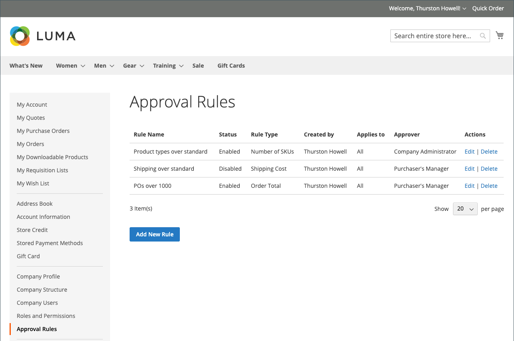

# Validierungsregeln für Bestellungen

Die meisten Unternehmen benötigen eine Bestellgenehmigung für Bestellungen. Durch das Hinzufügen von Genehmigungsregeln für ihr Unternehmenskonto können sie steuern, wer Bestellungen erstellen und wie viel sie ausgeben können. Beispiel:

* Jeder PO-Wert unter X wird automatisch genehmigt.
* POs über X, aber unter Q müssen von Y genehmigt werden.
* Jeder PO über X-Wert muss von Y und Z genehmigt werden.
* Eine Bestellung, die von einem Benutzer auf Director-Ebene oder höher erstellt wurde, wird automatisch genehmigt.

Je nach Rolle und Berechtigungen des Unternehmens können Benutzer Genehmigungsregeln erstellen, bearbeiten, löschen oder anzeigen.

>[!IMPORTANT]
>
>Die Einrichtung einer Genehmigungsregel erfordert eine definierte [Unternehmensstruktur](account-company-structure.md) um die Validierung durch den Manager des Käufers zu bestimmen.

## Zahlungsmethoden

Die Validierungsabläufe für Bestellungen unterstützen sowohl Online- als auch Offline-Zahlungsmethoden. Alle standardmäßigen Offline-Zahlungsmethoden werden bei Bestellgenehmigungen unterstützt. Für Online-Zahlungen werden die folgenden Methoden unterstützt:

* PayPal Express
* Braintree-Zahlungen

## Einrichten von Genehmigungsregeln

Mit den erforderlichen [Berechtigungen für ihre Rolle](account-company-roles-permissions.md), können B2B-Kunden Genehmigungsregeln einrichten, um Unternehmensrichtlinien durchzusetzen, indem sie auf **[!UICONTROL Approval Rules]** im linken Bereich für ihr Kundenkonto.

{width="700" zoomable="yes"}

Um eine Validierungsregel zu erstellen, führt ein Kunde die folgenden Schritte aus:

1. Klicks **[!UICONTROL Add New Rule]** , um eine Regel zu erstellen.

1. Ändert bei Bedarf die Regel aus **[!UICONTROL Enabled]** nach **[!UICONTROL Disabled]**.

   Die Regel ist standardmäßig aktiviert, aber ein Kunde kann die Regel mit einer deaktivierten Einstellung erstellen und sie später aktivieren, wenn er bereit ist, sie zu erzwingen.

1. Für **[!UICONTROL Rule name]** gibt einen kurzen, aber beschreibenden Namen für die Regel ein, z. B. `Orders less than $100`.

   Regelnamen müssen eindeutig sein.

1. Für **[!UICONTROL Description]**, gibt eine längere Erläuterung der Regel ein.

1. Für **[!UICONTROL Applies to]**, wählt eine oder mehrere Unternehmensrollen aus, die für die Anwendung der Regel verwendet werden.

1. Wählen Sie die **[!UICONTROL Rule Type]** und definiert die Regel.

   Die folgenden Abschnitte enthalten eine ausführliche Erläuterung und ein Beispiel für jeden Regeltyp.

   {width="700" zoomable="yes"}

1. Für **[!UICONTROL Requires approval from]** wählen je nach Typ der Genehmigung einen oder mehrere erforderliche Genehmiger aus.

   >[!NOTE]
   >
   >* Stellen Sie beim Zuweisen einer Rolle als Genehmiger sicher, dass mindestens ein Benutzer in dieser Rolle vorhanden ist.
   >* Wenn es zwei oder mehr Benutzer mit derselben Rolle als Genehmiger gibt, kann der Ersteller der Bestellung sie nicht genehmigen. In diesem Fall ist eine manuelle Genehmigung von jedem anderen Benutzer mit dieser Rolle erforderlich. Wenn jedoch `Auto-approve POs created within this role` -Option in der [Rollenberechtigungen](account-company-roles-permissions.md), wird die Bestellung automatisch validiert.
   >* Wenn nur ein Benutzer mit der Rolle &quot;Genehmiger&quot;vorhanden ist und dieser Benutzer der Ersteller ist, wird die Bestellung immer automatisch genehmigt - die `Auto-approve POs created within this role` Berechtigungseinstellung wird ignoriert.

1. Klicken **[!UICONTROL Save]**.

### [!UICONTROL Order Total]

Dieser Regeltyp wird verwendet, um eine EO-Genehmigung basierend auf der Bestellsumme einschließlich Steuern zu verlangen.

1. Wählen Sie eine **[!UICONTROL Order Total amount]** Option:

   * `is more than`
   * `is less than`
   * `is more than or equal to`
   * `is less than or equal to`

1. Wählt den Währungstyp aus und geben Sie den Betrag ein.

{width="600" zoomable="yes"}

### [!UICONTROL Shipping Cost]

Dieser Regeltyp wird verwendet, um eine EO-Genehmigung basierend auf Versandkosten zu verlangen, die viele Unternehmen benötigen.

1. Legt die **[!UICONTROL Shipping cost value]**:

   * `is more than`
   * `is less than`
   * `is more than or equal to`
   * `is less than or equal to`

1. Legt den gewünschten Versandbetrag fest.

{width="600" zoomable="yes"}

### [!UICONTROL Number of SKUs]

Dieser Regeltyp wird verwendet, um eine PO-Genehmigung basierend auf der Anzahl der SKUs oder eindeutigen Produkte in der Bestellung zu erfordern. Sie steuert die Anzahl unterschiedlicher Elementtypen, nicht die Anzahl der zu sortierenden Elemente. Eine Bestellung könnte beispielsweise Folgendes umfassen:

* Zwei große weiße Hemden
* Drei mittelweiße Hemden

In diesem Beispiel werden fünf Elemente, aber zwei unterschiedliche SKUs angegeben.

1. Legt die **[!UICONTROL Number of SKUs]** Wert:

   * `is more than`
   * `is less than`
   * `is more than or equal to`
   * `is less than or equal to`

1. Legt die Anzahl der SKUs fest.

{width="600" zoomable="yes"}

## Validierungsregeln bearbeiten

Um eine vorhandene Genehmigungsregel zu ändern, kann ein Kunde die folgenden Schritte ausführen:

1. In der Seitenleiste seines Kontos wählt der Kunde **[!UICONTROL Approval Rules]**.

1. Sucht den Eintrag der zu bearbeitenden Validierungsregel.

1. Klicks **[!UICONTROL Edit]**.

1. nimmt alle erforderlichen Änderungen und Klicks vor **[!UICONTROL Save]**.

## Validierungsregeln löschen

Um eine vorhandene Genehmigungsregel zu entfernen, kann ein Kunde die folgenden Schritte ausführen:

1. In der Seitenleiste ihres Kontos wählt **[!UICONTROL Approval Rules]**.

1. Sucht nach dem zu löschenden Eintrag der Validierungsregel.

1. Klicks **[!UICONTROL Delete]**.

1. Klicken Sie zur Bestätigung der Aktion auf **[!UICONTROL OK]**.

## Demo zur Bestellvalidierung

Sehen Sie sich dieses Video an, um mehr über Bestellgenehmigungen zu erfahren:

>[!VIDEO](https://video.tv.adobe.com/v/344450?quality=12)
