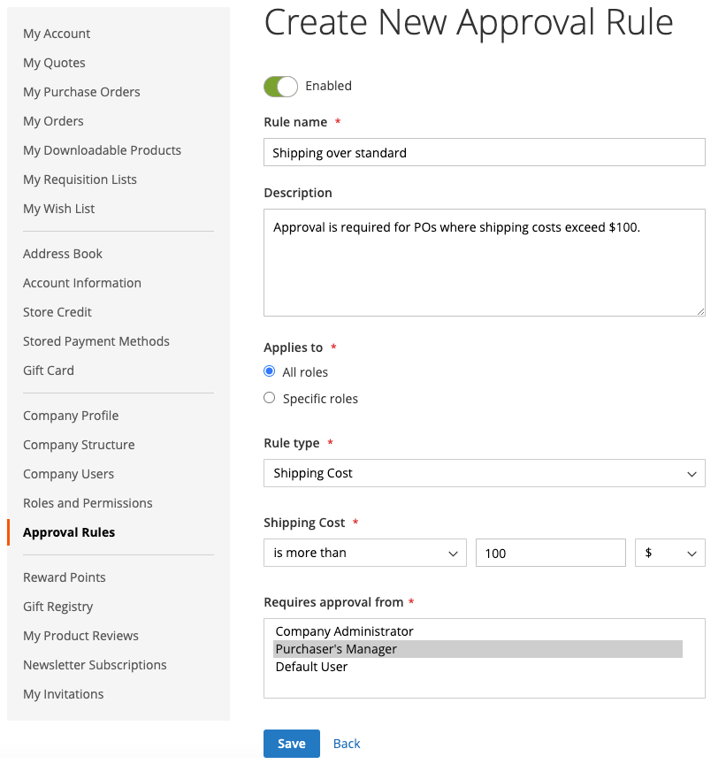

# Genehmigungsregeln für Bestellungen

Die meisten Unternehmen benötigen eine Bestellgenehmigung für Bestellungen. Durch das Hinzufügen von Genehmigungsregeln für ihr Unternehmenskonto können sie steuern, wer Bestellungen erstellen kann und wie viel sie ausgeben können. Beispiel:

* Alle Bestellungen mit einem Wert unter X werden automatisch genehmigt.
* Bestellungen über dem Wert X, aber unter Q müssen von Y genehmigt werden.
* Alle POS über X-Werte müssen von Y und Z genehmigt werden.
* Eine Bestellung, die von einer Person auf Director-Ebene oder höher erstellt wurde, wird automatisch genehmigt.

Je nach Unternehmensrolle und Berechtigungen können Benutzende Genehmigungsregeln erstellen, bearbeiten, löschen oder anzeigen.

>[!IMPORTANT]
>
>Für die Einrichtung der Genehmigungsregel ist eine [ (Unternehmensstruktur](account-company-structure.md) erforderlich, um die Genehmigung durch den Manager des Einkäufers anzugeben.

## Zahlungsmethoden

Genehmigungsflüsse für Bestellungen unterstützen sowohl Online- als auch Offline-Zahlungsmethoden. Alle standardmäßigen Offline-Zahlungsmethoden werden für Bestellgenehmigungen unterstützt. Für Online-Zahlungen werden die folgenden Methoden unterstützt:

* PayPal Express
* Braintree Payments

## Einrichtung der Validierungsregel

Mit den erforderlichen [Berechtigungen für ihre Rolle](account-company-roles-permissions.md) können B2B-Kunden Genehmigungsregeln einrichten, um Unternehmensrichtlinien durchzusetzen, indem sie im linken Bereich auf **[!UICONTROL Approval Rules]** für ihr Kundenkonto klicken.

{width="700" zoomable="yes"}

Um eine Validierungsregel zu erstellen, führt ein Kunde die folgenden Schritte aus:

1. Klicks **[!UICONTROL Add New Rule]** zum Erstellen einer Regel.

1. Ändern Sie bei Bedarf die Regel von **[!UICONTROL Enabled]** in **[!UICONTROL Disabled]**.

   Die Regel ist aktiviert wie die Standardeinstellung, aber ein Kunde kann die Regel mit einer deaktivierten Einstellung erstellen und später aktivieren, wenn er bereit ist, sie durchzusetzen.

1. Geben Sie **[!UICONTROL Rule name]** einen kurzen, aber beschreibenden Namen für die Regel ein, z. B. `Orders less than $100`.

   Regelnamen müssen eindeutig sein.

1. Geben Sie **[!UICONTROL Description]** eine längere Erklärung für die Regel ein.

1. Wählen Sie **[!UICONTROL Applies to]** eine oder mehrere Unternehmensrollen aus, die für die Anwendung der Regel verwendet werden.

1. Wählt den **[!UICONTROL Rule Type]** aus und definiert die Regel.

   Die folgenden Abschnitte enthalten eine detaillierte Erklärung und ein Beispiel für jeden Regeltyp.

   {width="700" zoomable="yes"}

1. Wählen Sie **[!UICONTROL Requires approval from]** je nach Genehmigungstyp eine oder mehrere erforderliche genehmigende Personen aus.

   >[!NOTE]
   >
   >* Stellen Sie beim Zuweisen einer Rolle als genehmigende Person sicher, dass mindestens ein Benutzer in dieser Rolle vorhanden ist.
   >* Wenn es zwei oder mehr Benutzer mit derselben genehmigenden Rolle gibt, kann der Ersteller der Bestellung diese nicht genehmigen. In diesem Fall ist eine manuelle Genehmigung durch jeden anderen Benutzer mit dieser Genehmigerrolle erforderlich. Wenn `Auto-approve POs created within this role` Option jedoch in den [Rollenberechtigungen“ festgelegt ist](account-company-roles-permissions.md) wird die Bestellung automatisch genehmigt.
   >* Wenn nur ein Benutzer mit der Rolle des Genehmigers vorhanden ist und dieser Benutzer der Ersteller ist, wird die Bestellung immer automatisch genehmigt. Die Einstellung für die `Auto-approve POs created within this role` wird ignoriert.

1. Klicken Sie auf **[!UICONTROL Save]**.

### [!UICONTROL Order Total]

Dieser Regeltyp wird verwendet, um eine Bestellgenehmigung basierend auf der Bestellsumme einschließlich Steuer zu verlangen.

1. Wählt eine **[!UICONTROL Order Total amount]** Option:

   * `is more than`
   * `is less than`
   * `is more than or equal to`
   * `is less than or equal to`

1. Wählt den Währungstyp aus und gibt den Betrag ein.

{width="600" zoomable="yes"}

### [!UICONTROL Shipping Cost]

Dieser Regeltyp wird verwendet, um eine auf den Versandkosten basierende Bestellgenehmigung erforderlich zu machen. Dies ist für viele Unternehmen erforderlich.

1. Legt die **[!UICONTROL Shipping cost value]** fest:

   * `is more than`
   * `is less than`
   * `is more than or equal to`
   * `is less than or equal to`

1. Legt den gewünschten Versandbetrag fest.

{width="600" zoomable="yes"}

### [!UICONTROL Number of SKUs]

Dieser Regeltyp wird verwendet, um eine Bestellgenehmigung basierend auf der Anzahl der SKUs oder der eindeutigen Produkte in der Bestellung zu verlangen. Sie steuert die Anzahl der unterschiedlichen Elementtypen, nicht die Anzahl der bestellten Elemente. Eine Bestellung könnte beispielsweise Folgendes umfassen:

* Zwei große weiße Hemden
* Drei mittelweiße Hemden

In diesem Beispiel werden fünf Elemente, aber zwei verschiedene SKUs angegeben.

1. Legt den **[!UICONTROL Number of SKUs]** fest:

   * `is more than`
   * `is less than`
   * `is more than or equal to`
   * `is less than or equal to`

1. Legt die Anzahl der SKUs fest.

{width="600" zoomable="yes"}

## Genehmigungsregeln bearbeiten

Um eine vorhandene Genehmigungsregel zu ändern, kann ein Kunde die folgenden Schritte ausführen:

1. In der Seitenleiste seines Kontos wählt der Kunde **[!UICONTROL Approval Rules]** aus.

1. Sucht den Eintrag für die Genehmigungsregel, der bearbeitet werden soll.

1. Klicks **[!UICONTROL Edit]**.

1. Führt alle erforderlichen Änderungen durch und klickt **[!UICONTROL Save]**.

## Genehmigungsregeln löschen

Um eine vorhandene Genehmigungsregel zu entfernen, kann ein Kunde die folgenden Schritte ausführen:

1. Wählen Sie in der Seitenleiste ihres Kontos **[!UICONTROL Approval Rules]** aus.

1. Sucht den zu löschenden Genehmigungsregeleintrag.

1. Klicks **[!UICONTROL Delete]**.

1. Um die Aktion zu bestätigen, klicken Sie auf **[!UICONTROL OK]**.

## Demo zu Bestellgenehmigungen

In diesem Video erfahren Sie mehr über Bestellgenehmigungen:

>[!VIDEO](https://video.tv.adobe.com/v/3411353?quality=12&learn=on&captions=ger)
