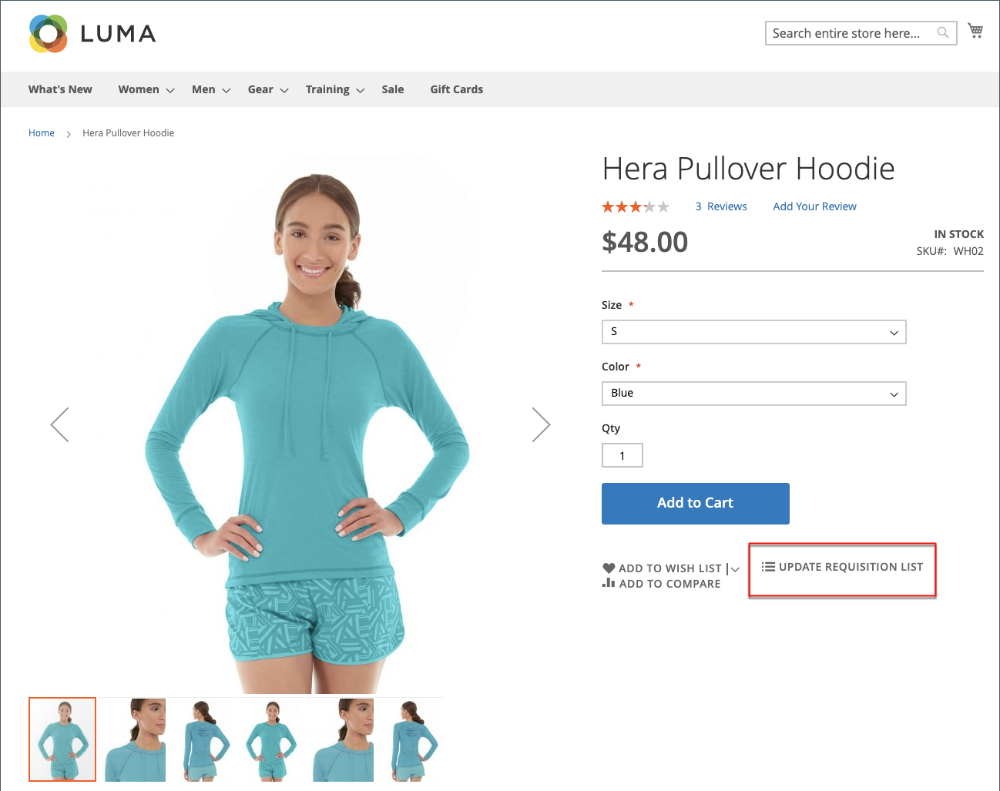

# [!UICONTROL My Requisition Lists]

Der Hauptgrund für die Pflege einer Anforderungsliste besteht darin, die Neubestellung von Produkten zu vereinfachen. Autorisierte Kunden können Artikel einfach aus einer Anforderungsliste neu anordnen, indem sie sie zum Warenkorb hinzufügen und Artikel von einer Liste in eine andere verschieben oder kopieren.

{width="700" zoomable="yes"}

## Anforderungsliste öffnen

1. Der Kunde wählt im Konto-Dashboard **[!UICONTROL My Requisition Lists]** aus.

1. Sucht die Anforderungsliste, die geöffnet werden soll, klickt auf **[!UICONTROL View]** und führt einen der folgenden Schritte aus:

### Produkte zum Warenkorb hinzufügen

1. Der Kunde führt einen der folgenden Schritte aus, um die hinzuzufügenden Produkte auszuwählen:

   - Markiert das Kontrollkästchen jedes Elements.
   - Klicks **[!UICONTROL Select All]**.

1. Gibt die **[!UICONTROL Qty]** ein, die dem Warenkorb hinzugefügt werden sollen.

1. Gehen Sie wie folgt vor, um Produktoptionen zu ändern:

   - Klicken Sie im Zeileneintrag auf das Symbol _Bearbeiten_ ().
   - Ändert alle erforderlichen Optionen.
   - Klicks **[!UICONTROL Update Requisition List]**.

1. Klicks **[!UICONTROL Add to Cart]**.

   {width="700" zoomable="yes"}

### Elemente in eine andere Liste kopieren

1. Der Kunde aktiviert das Kontrollkästchen jedes zu verschiebenden Elements.

1. Klicken Sie auf **[!UICONTROL Copy Selected]** und führen Sie einen der folgenden Schritte aus:

   - Wählt eine vorhandene Anforderungsliste aus.
   - Klicks **[!UICONTROL Create New Requisition List]**.

### Exportieren einer Liste

1. Der Kunde öffnet die zu exportierende Anforderungsliste.

1. Klickt auf den **[!UICONTROL Export]**.

Adobe Commerce generiert eine CSV-Liste mit `sku` und `qty` Werten und lädt sie herunter.

### Elemente in eine andere Liste verschieben

1. Der Kunde aktiviert das Kontrollkästchen jedes zu verschiebenden Elements.

1. Klicken Sie auf **[!UICONTROL Move Selected]** und führen Sie einen der folgenden Schritte aus:

   - Wählt eine vorhandene Anforderungsliste aus.
   - Klicks **[!UICONTROL Create New Requisition List]**.

### Liste drucken

1. In der rechten oberen Ecke der Liste klickt der Kunde auf **[!UICONTROL Print]**.

1. Prüft das Ausgabegerät und klickt auf **[!UICONTROL Print]**.

   {width="500" zoomable="yes"}

### Bearbeiten von Produktoptionen

Um Produktoptionen in der Liste zu bearbeiten, führt der Kunde Folgendes aus:

1. Klicken Sie auf _Bleistift_ (), um die Produktseite zu öffnen.

1. Ändert alle erforderlichen Optionen.

1. Klicks **[!UICONTROL Update Requisition List]**.

   {width="700" zoomable="yes"}

Ein Produkt in der Anforderungsliste kann bearbeitet werden, wenn:

- Das Produkt hat **[!UICONTROL all options set]** (wenn es sich um ein &quot;[&#x200B; Produkt“ &#x200B;](../catalog/product-create-configurable.md) der Anforderungsliste handelt).

  Das Produkt ist **[!UICONTROL added to this Requisition List]**.

- Das Produkt ist [ein einfaches Produkt mit Optionen](../catalog/settings-advanced-custom-options.md)

- Die Bearbeitung ist für den Produkttyp zulässig.

### Elemente entfernen

1. Der Kunde aktiviert das Kontrollkästchen jedes zu entfernenden Elements.

1. Klicks **[!UICONTROL Remove Selected]**.

1. Wenn Sie zur Bestätigung aufgefordert werden, klicken Sie auf **[!UICONTROL Delete]**.

### Umbenennen einer Liste

1. Nach dem Listentitel klickt der Kunde auf **[!UICONTROL Rename]**.

1. Gibt einen anderen **[!UICONTROL Requisition List Name]** ein.

1. Klicks **[!UICONTROL Save]**.

   {width="300"}

### Anforderungsliste entfernen

1. Der Kunde öffnet die zu löschende Anforderungsliste.

1. Klicks **[!UICONTROL Delete Requisition List]**.

1. Wenn Sie zur Bestätigung aufgefordert werden, klicken Sie auf **[!UICONTROL Delete]**.

>[!NOTE]
>
>Diese Aktion kann nicht rückgängig gemacht werden.

## Aktionen

| Aktion | Beschreibung |
|--- |--- |
| [!UICONTROL Rename] | Ermöglicht das Umbenennen der Anforderungsliste und das Aktualisieren der Beschreibung. |
| [!UICONTROL Export] | Exportiert die Anforderungsliste in eine CSV-Datei. |
| [!UICONTROL Print] | Druckt die aktuelle Anforderungsliste. |
| [!UICONTROL Select] | Verwaltet die Elementauswahl, die Gegenstand einer Aktion sein soll.  **[!UICONTROL Select All]**- Wählt alle Artikel in der Anforderungsliste aus. **[!UICONTROL Remove Selected]** - Entfernt alle ausgewählten Artikel aus der Anforderungsliste.  **[!UICONTROL Copy Selected]**- Kopiert alle ausgewählten Artikel in eine andere Anforderungsliste. |
| [!UICONTROL Add to Cart] | Fügt dem Warenkorb ausgewählte Artikel hinzu. |
| [!UICONTROL Update List] | Berechnet die Zwischensumme neu, um eine Änderung der Menge widerzuspiegeln. |
| [!UICONTROL Delete Requisition List] | Löscht die Anforderungsliste aus dem Konto des Firmenbenutzers. |

{style="table-layout:auto"}
