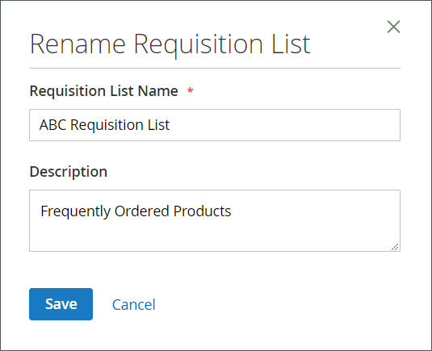

# [!UICONTROL My Requisition Lists]

Der Hauptgrund für die Pflege einer Anforderungsliste besteht darin, die Neuanordnung von Produkten zu erleichtern. Autorisierte Kunden können Artikel aus einer Anforderungsliste einfach neu anordnen, indem sie sie zum Warenkorb hinzufügen und Artikel von einer Liste in eine andere verschieben oder kopieren.

{width="700" zoomable="yes"}

## Eine Anforderungsliste öffnen

1. Im Konto-Dashboard wählt der Kunde **[!UICONTROL My Requisition Lists]**.

1. Findet die Liste der Anforderungen, die sie öffnen möchten, und klickt auf **[!UICONTROL View]** und führen Sie einen der folgenden Schritte aus:

### Produkte zum Warenkorb hinzufügen

1. Der Kunde führt einen der folgenden Schritte aus, um die hinzuzufügenden Produkte auszuwählen:

   - Markiert das Kontrollkästchen jedes Elements.
   - Klicks **[!UICONTROL Select All]**.

1. Fügt die **[!UICONTROL Qty]** zum Warenkorb hinzugefügt werden.

1. Zum Ändern von Produktoptionen gehen Sie wie folgt vor:

   - Klicken Sie im Zeileneintrag auf die _Bearbeiten_ ().
   - Ändert erforderliche Optionen.
   - Klicks **[!UICONTROL Update Requisition List]**.

1. Klicks **[!UICONTROL Add to Cart]**.

   {width="700" zoomable="yes"}

### Elemente in eine andere Liste kopieren

1. Der Kunde wählt das Kontrollkästchen jedes zu verschiebenden Elements aus.

1. Klicks **[!UICONTROL Copy Selected]** und führt einen der folgenden Schritte aus:

   - Wählt eine vorhandene Anforderungsliste aus.
   - Klicks **[!UICONTROL Create New Requisition List]**.

### Liste exportieren

1. Der Kunde öffnet die zu exportierende Anforderungsliste.

1. Klicks auf die **[!UICONTROL Export]** -Link.

Adobe Commerce generiert und lädt eine CSV-Liste mit `sku` und `qty` -Werte.

### Verschieben von Elementen in eine andere Liste

1. Der Kunde wählt das Kontrollkästchen jedes zu verschiebenden Elements aus.

1. Klicks **[!UICONTROL Move Selected]** und führen Sie einen der folgenden Schritte aus:

   - Wählt eine vorhandene Anforderungsliste aus.
   - Klicks **[!UICONTROL Create New Requisition List]**.

### Liste drucken

1. In der oberen rechten Ecke der Liste klickt der Kunde auf **[!UICONTROL Print]**.

1. Überprüft das Ausgabegerät und klickt auf **[!UICONTROL Print]**.

   {width="500" zoomable="yes"}

### Produktoptionen bearbeiten

Um Produktoptionen in der Liste zu bearbeiten, führt der Kunde Folgendes aus:

1. Klicks auf die _Bleistift_ (), um die Produktseite zu öffnen.

1. Ändert erforderliche Optionen.

1. Klicks **[!UICONTROL Update Requisition List]**.

   {width="700" zoomable="yes"}

Ein Produkt in der Anforderungsliste kann bearbeitet werden, wenn:

- Das Produkt **[!UICONTROL all options set]** (wenn es sich um eine [konfiguriertes Produkt](../catalog/product-create-configurable.md) in der Anforderungsliste).

  Das Produkt ist **[!UICONTROL added to this Requisition List]**.

- Das Produkt ist [ein einfaches Produkt mit Optionen](../catalog/settings-advanced-custom-options.md)

- Die Bearbeitung ist für den Produkttyp zulässig.

### Elemente entfernen

1. Der Kunde wählt das Kontrollkästchen jedes zu entfernenden Elements aus.

1. Klicks **[!UICONTROL Remove Selected]**.

1. Wenn Sie zur Bestätigung aufgefordert werden, klickt **[!UICONTROL Delete]**.

### Liste umbenennen

1. Nach dem Listentitel klickt der Kunde auf **[!UICONTROL Rename]**.

1. Fügt eine andere **[!UICONTROL Requisition List Name]**.

1. Klicks **[!UICONTROL Save]**.

   {width="300"}

### Liste mit Anforderungen entfernen

1. Der Kunde öffnet die zu löschende Anforderungsliste.

1. Klicks **[!UICONTROL Delete Requisition List]**.

1. Wenn Sie zur Bestätigung aufgefordert werden, klickt **[!UICONTROL Delete]**.

>[!NOTE]
>
>Diese Aktion kann nicht rückgängig gemacht werden.

## Aktionen

| Aktion | Beschreibung |
|--- |--- |
| [!UICONTROL Rename] | Hiermit können Sie die Anforderungsliste umbenennen und die Beschreibung aktualisieren. |
| [!UICONTROL Export] | Exportiert die Anforderungsliste in eine CSV-Datei. |
| [!UICONTROL Print] | Druckt die aktuelle Anforderungsliste. |
| [!UICONTROL Select] | Verwaltet die Elementauswahlen, die Gegenstand einer Aktion sein sollen.  **[!UICONTROL Select All]**- Wählt alle Elemente in der Anforderungsliste aus. **[!UICONTROL Remove Selected]** - Entfernt alle ausgewählten Elemente aus der Anforderungsliste.  **[!UICONTROL Copy Selected]**- Kopiert alle ausgewählten Elemente in eine andere Anforderungsliste. |
| [!UICONTROL Add to Cart] | Fügt ausgewählte Artikel zum Warenkorb hinzu. |
| [!UICONTROL Update List] | Berechnet die Zwischensumme neu, um eine Mengenänderung widerzuspiegeln. |
| [!UICONTROL Delete Requisition List] | Löscht die Anforderungsliste aus dem Konto des Unternehmensbenutzers. |

{style="table-layout:auto"}
