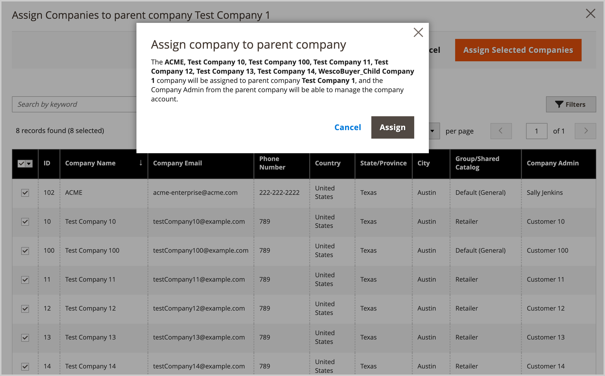

# Verwalten Sie die [!UICONTROL Company Hierarchy]

[!BADGE 1.5.0-Beta]{type=Informative url="/help/b2b/release-notes.md" tooltip="Nur für Beta-Programmteilnehmer verfügbar"}

Administratoren können eine [!UICONTROL Company Hierarchy] indem verbundene Unternehmen einer benannten Muttergesellschaft zugewiesen werden, die das Unternehmen an der Spitze der Organisation ist. Wenn die Variable [!UICONTROL Company Type] is `Company`, ist das Unternehmen nicht Teil einer Organisation und berechtigt, Muttergesellschaft zu werden oder einer bestehenden Muttergesellschaft zuzuweisen.

Im Admin verwalten Sie Unternehmenszuweisungen, indem Sie ein Unternehmen bearbeiten und dann die [!UICONTROL Company Hierarchy] Konfiguration zum Zuweisen oder Aufheben der Zuweisung von Unternehmen.

{width="700"}

>[!NOTE]
>
>Weitere Informationen zum [!UICONTROL Company Hierarchy] Raster, siehe [Unternehmenshierarchie](account-company-create.md#company-hierarchy) Feldbeschreibungen.

## Zuweisen von Unternehmen zu einer Organisation

1. Aus dem _Admin_ Seitenleiste, navigieren Sie zu **[!UICONTROL Customers]** > **[!UICONTROL Companies]**.

   {width="700" zoomable="yes"}

1. Im [!UICONTROL Companies] -Raster öffnen Sie die Detailseite des Unternehmens, um die Zuweisungen zu erstellen.

   - Um einer bestehenden Muttergesellschaft weitere Unternehmen zuzuweisen, wählen Sie die **[!UICONTROL Edit]** Maßnahmen für die Muttergesellschaft.
   - Um eine Muttergesellschaft zu erstellen, wählen Sie die **[!UICONTROL Edit]** Maßnahmen, damit das Unternehmen als Mutterunternehmen bestimmt wird.

     Es ist nicht möglich, eine Muttergesellschaft aus einer bestehenden Muttergesellschaft oder einem untergeordneten Unternehmen zu erstellen.

1. Erweitern Sie auf der Seite mit den Unternehmensdetails den **[!UICONTROL Company Hierarchy]**.

   {width="700" zoomable="yes"}

   Das Raster zeigt vorhandene Unternehmenszuweisungen an, sofern vorhanden. Die Muttergesellschaft befindet sich immer oben im [!UICONTROL Company Hierarchy] Gitter. Die `[!UICONTROL Current]` kennzeichnet das zu bearbeitende Unternehmen.

1. Fügen Sie Unternehmen zur übergeordneten Organisation hinzu.

   - Wählen Sie aus einer Liste der verfügbaren Unternehmen aus, indem Sie **[!UICONTROL Assign Companies]**.

   - **Alle auf dieser Seite auswählen** oder wählen Sie ein oder mehrere bestimmte Firmenzeilen-Elemente aus.

   - Auswählen **[!UICONTROL Assign Selected Companies]**.

   - Führen Sie die Unternehmenszuweisung durch Auswahl von aus. **[!UICONTROL Assign]**.

     {width="675" zoomable="yes"}

## Aufheben der Zuweisung von Unternehmen zu einer Muttergesellschaft

1. Im _Admin_ Seitenleiste, navigieren Sie zu **[!UICONTROL Customers]** > **[!UICONTROL Companies]**.

   {width="700" zoomable="yes"}

1. Im [!UICONTROL Companies] -Raster öffnen Sie die Firmendetailseite für das Mutterunternehmen, indem Sie **[!UICONTROL Edit]**.

1. Anzeigen der Liste der zugeordneten Unternehmen durch Erweiterung **[!UICONTROL Company Hierarchy]**.

1. Aus dem [!UICONTROL Company Hierarchy] wird die Zuweisung eines Unternehmens mithilfe des **[!UICONTROL Select]** Entscheidungsniveau **[!UICONTROL Unassign from parent]**.

   {width="700" zoomable="yes"}

1. Entfernen Sie bei Aufforderung das zugewiesene Unternehmen aus der Hierarchie, indem Sie **[!UICONTROL Unassign]**.
