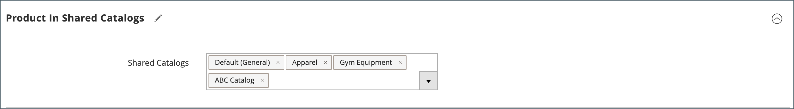

# Verwalten freigegebener Kataloge

Die _[!UICONTROL Shared Catalogs]_-Seite bietet Zugriff auf die Tools, die zur Verwaltung Ihrer freigegebenen Kataloge erforderlich sind. Die Seite ähnelt dem standardmäßigen Admin-Arbeitsbereich mit Filtern und Aktionssteuerelementen. Das Raster listet alle freigegebenen Kataloge auf, einschließlich des standardmäßigen öffentlichen freigegebenen Katalogs und aller benutzerdefinierten Kataloge, die Sie eingerichtet haben.

## Aktualisieren der Produktauswahl

Die Auswahl der Produkte in einem beliebigen freigegebenen Katalog kann einfach über das _[!UICONTROL Action]_-Spalte des gemeinsamen Katalograds. Die Änderungen, die Sie vornehmen, sind für Mitglieder aller zugehörigen Unternehmenskonten sichtbar. Der Prozess entspricht im Wesentlichen der Auswahl von Produkten für eine neue [Katalogstruktur](catalog-shared-pricing-structure.md), allerdings kann der Umfang der Konfiguration nicht geändert werden.

1. Im _Admin_ Seitenleiste, navigieren Sie zu **[!UICONTROL Catalog]** > **[!UICONTROL Shared Catalogs]**.

1. Den freigegebenen Katalog im Raster finden Sie im **[!UICONTROL Action]** und wählen Sie **[!UICONTROL Set Pricing and Structure]**.

   {width="700" zoomable="yes"}

1. Befolgen Sie die Anweisungen unter [Schritt 2: Produkte auswählen](catalog-shared-pricing-structure.md#step-2-choose-the-products).

   Sie können das erste Element überspringen, da der Umfang eines freigegebenen Katalogs nach dem ersten Speichern nicht mehr geändert werden kann.

Wenn Sie mit einem bestimmten Produkt arbeiten, wird die _[!UICONTROL Products In Shared Catalog]_jeden freigegebenen Katalog auflisten, in dem das Produkt verfügbar ist. Weitere Informationen finden Sie unter [Produkte zu einem freigegebenen Katalog hinzufügen](catalog-shared-product-add.md).

{width="600" zoomable="yes"}

## Aktualisierung benutzerdefinierter Preise

Die benutzerdefinierten Preise für Produkte in einem beliebigen freigegebenen Katalog können einfach über die Spalte Aktion im Raster Gemeinsame Kataloge aktualisiert werden. Die Änderungen, die Sie vornehmen, sind für Mitglieder des zugehörigen Unternehmens oder der zugehörigen Kundengruppe in der Storefront sichtbar. Der Prozess entspricht im Wesentlichen dem Festlegen benutzerdefinierter Preise für eine neue [freigegebener Katalog](catalog-shared-pricing-structure.md), allerdings kann der Umfang der Konfiguration nicht geändert werden.

1. Im _Admin_ Seitenleiste, navigieren Sie zu **[!UICONTROL Catalog]** > **[!UICONTROL Shared Catalogs]**.

1. Den freigegebenen Katalog im Raster, den Sie aktualisieren möchten, finden Sie im **[!UICONTROL Action]** und wählen Sie **[!UICONTROL Set Pricing and Structure]**.

1. Im _[!UICONTROL Catalog Structure]_Seite, klicken **[!UICONTROL Configure]**und führen Sie einen der folgenden Schritte aus:

   - Klicken Sie in der Fortschrittsanzeige oben auf der Seite auf **[!UICONTROL Pricing]**.
   - Klicken Sie oben rechts auf **[!UICONTROL Next]**.

1. Befolgen Sie die Anweisungen unter [Schritt 3: Festlegen benutzerdefinierter Preise](catalog-shared-pricing-structure.md#step-3-set-custom-prices).

## Aktualisieren von Kategorienberechtigungen

[Kategorienberechtigungen](../catalog/category-permissions.md) automatisch auf `Allow` für Produkte, die aus der Kategorienstruktur zu einem freigegebenen Katalog hinzugefügt werden. Sie können später die Berechtigungen anpassen oder bei Bedarf zusätzliche Regeln erstellen.

>[!NOTE]
>
>**[B2B-Version 1.3.0](release-notes.md#b2b-v130) und höher** — Wenn Sie einen freigegebenen Katalog erstellen, wird jede [Kategorienberechtigung](../catalog/category-permissions.md) für den Katalog auf `Allow` für die _[!UICONTROL Display Product Prices]_und_[!UICONTROL Add to Cart]_ für Kundengruppen, denen dieser Zugriff in den Katalogberechtigungseinstellungen zugewiesen wurde. Zuvor wurden diese Einstellungen automatisch auf `Deny` auch wenn die Katalogberechtigungen auf `Allow`.

>[!IMPORTANT]
>
>Alle vorhandenen [Gruppenberechtigungseinstellungen](../configuration-reference/catalog/catalog.md#category-permissions) werden von **_all_** Kategorien im Katalog, wenn die **_[!UICONTROL Shared Catalog]_** aktiviert ist. [!UICONTROL Shared Catalog] steuert alle Kategorieberechtigungen im Katalog vollständig, wenn sie aktiviert sind.

1. Im _Admin_ Seitenleiste, navigieren Sie zu **[!UICONTROL Catalog]** > **[!UICONTROL Categories]**.

1. Wählen Sie im Kategoriebaum die Kategorie der Produkte aus, die Sie aktualisieren möchten.

   Um alle Produkte einzubeziehen, wählen Sie die Kategorie der obersten Ebene im Baum aus.

1. Hinunter scrollen und erweitern  die **[!UICONTROL Category Permissions]** Abschnitt.

1. Klicks **[!UICONTROL New Permission]** und gehen Sie wie folgt vor:

   {width="600" zoomable="yes"}

   - Wählen Sie die **[!UICONTROL Customer Group]** , der dem freigegebenen Katalog entspricht, und ändern Sie die Berechtigungseinstellungen nach Bedarf.

     {width="600" zoomable="yes"}

   - Um eine Berechtigungsregel für eine andere Kundengruppe zu erstellen, klicken Sie auf **[!UICONTROL New Permissions]** und wiederholen Sie den Vorgang.

   - Um eine Berechtigungsregel zu löschen, klicken Sie auf die _Löschen_  Symbol.

1. Wenn Sie fertig sind, klicken Sie auf **[!UICONTROL Save]**.

## Aktualisieren der Katalogdetails

Die Detailinformationen eines freigegebenen Katalogs können einfach über die Spalte Aktion des Rasters Gemeinsame Kataloge aktualisiert werden. Die Änderungen, die Sie vornehmen, werden in allen zugehörigen Unternehmenskonten übernommen.

{width="700" zoomable="yes"}

1. Im _Admin_ Seitenleiste, navigieren Sie zu **[!UICONTROL Catalog]** > **[!UICONTROL Shared Catalogs]**.

1. Den freigegebenen Katalog, den Sie aktualisieren möchten, finden Sie im **[!UICONTROL Action]** und wählen Sie **[!UICONTROL General Settings]**.

   {width="600" zoomable="yes"}

1. Aktualisieren Sie die Katalogdetailinformationen nach Bedarf.

   - Durch Änderung des Namens eines freigegebenen Katalogs wird auch der Name der entsprechenden Kundengruppe geändert.
   - Ändern des Katalogtyps von `Custom` nach `Public` konvertiert den vorhandenen öffentlichen Katalog in einen benutzerdefinierten Katalog. Alle Unternehmen, die mit dem ursprünglichen öffentlichen Katalog verbunden sind, werden der Ersetzung zugewiesen. Ein öffentlicher Katalog kann nicht in einen benutzerdefinierten Katalog konvertiert werden.

1. Wenn Sie fertig sind, klicken Sie auf **[!UICONTROL Save]**.

## Gemeinsame Katalogseitenreferenz

### Schaltflächenleiste

| Schaltfläche | Beschreibung |
|--- |--- |
| [!UICONTROL Back] | Kehrt zur Seite &quot;Freigegebene Kataloge&quot;zurück, ohne den neuen freigegebenen Katalog zu speichern. |
| [!UICONTROL Delete] | Löscht den Katalog und weist alle verbundenen Unternehmen und deren Mitglieder dem öffentlich freigegebenen Katalog zu. |
| [!UICONTROL Reset] | Löscht das Formular nicht gespeicherter Änderungen und stellt die ursprünglichen Katalogdetailinformationen wieder her. |
| [!UICONTROL Duplicate] | Erstellt eine [Kopie des Katalogs](catalog-shared-create.md). Für einen benutzerdefinierten Katalog, das Preismodell und die Struktur des Originals, aber ohne die Unternehmensverbände. Wenn ein öffentlicher freigegebener Katalog dupliziert wird, ändert sich der Typ des doppelten Katalogs in `custom`. Eine entsprechende Kundengruppe wird auch mit demselben Namen wie der duplizierte Katalog erstellt. Standardmäßig wird ein duplizierter Katalog _Duplizieren von_ den Originalkatalog. |
| [!UICONTROL Save and Continue Edit] | Speichert alle Änderungen und behält das Formular im Bearbeitungsmodus bei. |
| [!UICONTROL Save] | Speichert Änderungen, schließt das Formular und kehrt zur Seite Gemeinsame Kataloge zurück. |

{style="table-layout:auto"}

### Katalogdetails

| Feld | Beschreibung |
|--- |--- |
| [!UICONTROL Name] | Identifiziert den freigegebenen Katalog im gesamten Admin und in den Kundenkonten, in denen er verfügbar ist. Der Katalogname sollte beschreibend sein und nicht länger als 32 Zeichen sein. Sie können nicht zwei freigegebene Kataloge mit demselben Namen haben. Maximale Zeichen: 32 |
| [!UICONTROL Type] | **[!UICONTROL Custom]** - Identifiziert einen Katalog mit benutzerdefinierten Preisen, die nur für die spezifischen Unternehmen verfügbar sind, denen er zugewiesen ist. **[!UICONTROL Public]**- Identifiziert den freigegebenen Katalog, der für alle Gastbesucher und angemeldete Kunden verfügbar ist, die nicht mit einem Unternehmen verbunden sind. Ein &quot;standardmäßiger&quot;freigegebener Katalog wird erstellt, wenn B2B für Adobe Commerce installiert ist, muss jedoch vom Administrator konfiguriert werden. Es kann jeweils nur ein öffentlicher freigegebener Katalog vorhanden sein. |
| [!UICONTROL Customer Tax Class] | Bestimmt die Steuerklasse, die für Käufe verwendet wird, die aus dem Katalog getätigt werden. Die Optionen umfassen alle verfügbaren Steuerklassen. |
| [!UICONTROL Description] | Kurze Erläuterung der Verwendung des Katalogs. |

{style="table-layout:auto"}
