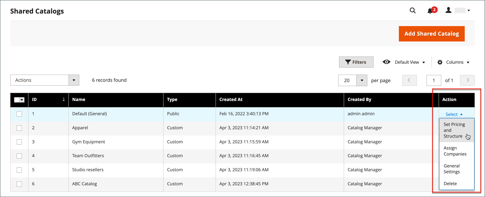
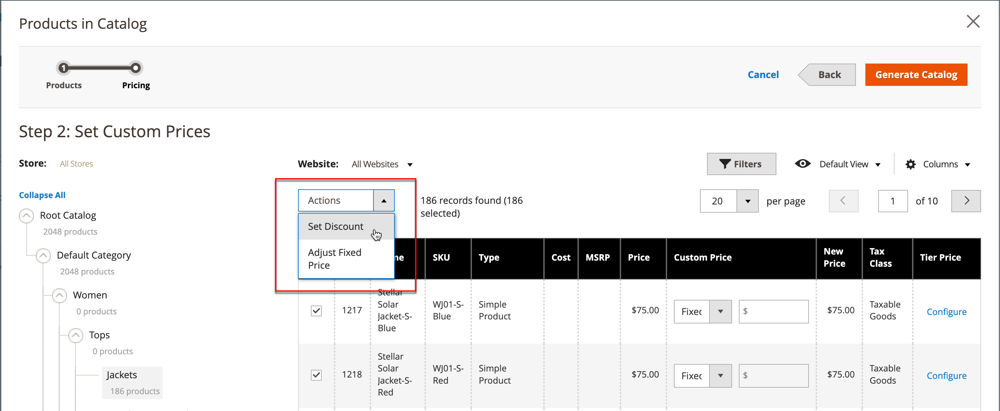
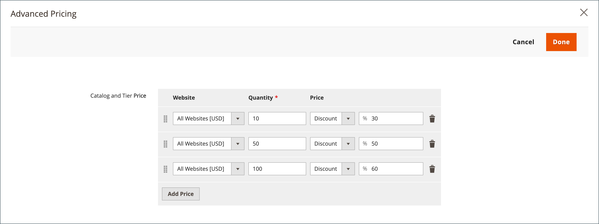

# Festlegen der Preise und Struktur für freigegebene Kataloge

Die Einrichtung der Preise und der Struktur eines freigegebenen Katalogs ist ein zweistufiger Prozess. Ihre aktuelle Position im Prozess wird mit einer Zahl in der Fortschrittsleiste am oberen Seitenrand hervorgehoben. Sie können den anderen Schritt des Prozesses jederzeit anzeigen, indem Sie auf die Fortschrittsleiste klicken. Wenn Sie beispielsweise an benutzerspezifischen Preisen arbeiten, können Sie zur Produktauswahlseite zurückkehren, um darauf zu verweisen. Klicken Sie einfach oben auf der Seite in der Fortschrittsleiste auf **[!UICONTROL Products]** und dann auf **[!UICONTROL Pricing]** , um zur Seite mit den benutzerdefinierten Preisen zurückzukehren. Ihre Arbeit geht in diesem Prozess nicht verloren.

{width="700" zoomable="yes"}

In der Standardkategoriestruktur ist die Stammkategorie der oberste Container und wird in den Beispieldaten als _Standardkategorie_ bezeichnet. Wenn freigegebene Kataloge jedoch aktiviert sind, verfügt die Kategoriestruktur über einen äußeren Container mit dem Namen _Stammkatalog_. Der Stammkatalog umfasst alle anderen Kategoriestrukturen, die im System vorhanden sind. Weitere Informationen finden Sie unter [Katalogbereich](../catalog/introduction.md#catalog-scope).

## Schritt 1: Freigegebene Katalogpreise und -strukturkonfiguration öffnen

1. Navigieren Sie in der _Admin_-Seitenleiste zu **[!UICONTROL Catalog]** > **[!UICONTROL Shared Catalogs]**

1. Wechseln Sie für den freigegebenen Katalog im Raster zur Spalte _[!UICONTROL Action]_&#x200B;und klicken Sie auf **[!UICONTROL Set Pricing and Structure]**.

   {width="700" zoomable="yes"}

1. Klicken Sie beim ersten Konfigurieren des freigegebenen Katalogs auf **[!UICONTROL Configure]** , um mit den folgenden Schritten fortzufahren.

## Schritt 2: Wählen Sie die Produkte

Der erste Schritt im Prozess besteht darin, die Produkte auszuwählen, die Sie in den freigegebenen Katalog aufnehmen möchten. Die Produktauswahlseite enthält auf der linken Seite [Kategoriestruktur](../catalog/category-create.md) und auf der rechten Seite ein synchronisiertes Produktraster. Wenn Sie auf eine Kategorie in der Baumstruktur klicken, werden die Produkte in der Kategorie im Raster angezeigt.

Nur Kategorien mit ausgewählten Produkten werden in der [oberen Navigation](../catalog/navigation-top.md) angezeigt, wenn der freigegebene Katalog in der Storefront angezeigt wird. Standardmäßig sind nur die ersten drei Kategorieebenen in der Storefront-Navigation enthalten, nicht die Stammkategorie.

1. Verwenden Sie die **Store**-Auswahl, um den [Umfang](../catalog/introduction.md#product-scope) der Konfiguration festzulegen.

   Der Umfang der Konfiguration kann nur festgelegt werden, bevor der freigegebene Katalog zum ersten Mal gespeichert wird. Wenn Sie die Produktauswahl später bearbeiten, ist die Store-Auswahl nicht verfügbar.

   {width="600" zoomable="yes"}

1. Führen Sie in der Kategoriestruktur einen der folgenden Schritte aus:

   - Um alle Produkte einzubeziehen, klicken Sie auf **[!UICONTROL Select all]** oder aktivieren Sie das Kontrollkästchen der übergeordneten Kategorie.
   - Um bestimmte Produktkategorien einzubeziehen, aktivieren Sie das Kontrollkästchen jeder Kategorie, die Sie einbeziehen möchten.
   - Um ein einzelnes Produkt ein- oder auszuschließen, aktivieren bzw. deaktivieren Sie das Kontrollkästchen des Produkts.

   Die Notation unter jeder Kategorie in der Baumstruktur zeigt die Anzahl der Produkte aus der Kategorie an, die derzeit im freigegebenen Katalog enthalten sind. Die Notation unter der [Stammkategorie](../catalog/category-root.md) zeigt die Gesamtzahl der Produkte aus allen Kategorien an, die derzeit für den freigegebenen Katalog ausgewählt sind.

1. Um Kategorieprodukte im Raster anzuzeigen, klicken Sie auf den Namen der Kategorie in der Baumstruktur. Wenn eine Kategorie ausgewählt wird, geschieht Folgendes:

   - Der Umschalter in der ersten Spalte des Rasters wird für jedes ausgewählte Produkt auf die grüne _Ein_-Position festgelegt.
   - Wenn ein Produkt mehreren Kategorien zugewiesen ist und nicht in einer dieser Kategorien ausgewählt wurde, bleibt es über die anderen Kategorien verfügbar und auch bei Verwendung [Katalogsuche](../catalog/search.md).
   - Das System setzt [Kategorieberechtigungen](../catalog/category-permissions.md) für die ausgewählten Produkte automatisch auf `Allow`.

1. Verwenden Sie bei Bedarf die Filter und andere Rastersteuerelemente, um die Produkte zu finden, die Sie in den freigegebenen Katalog aufnehmen möchten.

   Sie können einzelne Produkte einzeln auswählen oder weglassen, indem Sie auf den Umschalter in der ersten Spalte klicken.

   Wenn Sie eine Kategorie auswählen, die keine Produkte enthält, aber mit CMS-Inhalten oder einem externen Link verknüpft ist, wird sie in der oberen Navigationsleiste der Storefront angezeigt.

   Die von Ihnen vorgenommenen Kategorieeinstellungen werden erst dauerhaft in der Datenbank aufgezeichnet, wenn die Konfiguration gespeichert wurde. Sie werden jedoch vorübergehend gespeichert, während Sie an der Struktur und den Preisen arbeiten.

1. Klicken Sie auf **[!UICONTROL Next]**.

   {width="600" zoomable="yes"}

## Schritt 3: Benutzerdefinierte Preise festlegen

Sie können benutzerdefinierte Preise für jedes Produkt einzeln festlegen oder das _[!UICONTROL Action]_&#x200B;verwenden, um benutzerdefinierte Preise als festen Betrag oder Prozentsatz für mehrere Produktdatensätze festzulegen.

- **[!UICONTROL Fixed]**: Gibt den Endproduktpreis an. Wenn Sie beispielsweise einen Festpreis von 10,00 $ eingeben, lautet der Preis in der Storefront für das entsprechende Unternehmen 10,00 $.

  >[!NOTE]
  >
  >Der Mindestwert zwischen dem Grundpreis und dem eingegebenen Festwert wird als Endproduktpreis verwendet.

  >[!NOTE]
  >
  >**_Festpreis_** Anpassbare Produktoptionen werden _nicht_ durch Gruppenpreis-, Stufenpreis-, Sonderpreis- oder Katalogpreisregeln beeinflusst.

- **[!UICONTROL Percentage]**: Bestimmt den benutzerdefinierten Preis anhand des Rabattprozentsatzes. Um beispielsweise einen Rabatt von 10 % anzubieten, setzen Sie den benutzerdefinierten Preistyp auf `Percentage` und geben Sie `10` ein. Der ermäßigte Zollpreis beträgt 90 Prozent des ursprünglichen Produktpreises.

Um den Rabatt für die folgenden Produktarten auf einen festen Betrag oder einen Prozentsatz festzulegen, verwenden Sie die Spalte _[!UICONTROL Custom Price]_&#x200B;im Raster:

- [Einfach](../catalog/product-create-simple.md) (einschließlich konfigurierbarer Produktvarianten)
- [Bündel](../catalog/product-create-bundle.md)
- [herunterladbar](../catalog/product-create-downloadable.md)
- [Virtuell](../catalog/product-create-virtual.md)

Die Spalte Benutzerdefinierter Preis ist leer für [konfigurierbare](../catalog/product-create-configurable.md) und [gruppierte](../catalog/product-create-grouped.md) Produktarten und für [Geschenkkarten](../catalog/product-gift-card-create.md).

Die Auswahl der Produkte im Raster kann auf der Seite &quot;_&quot; nicht geändert_. Sie können jedoch die Fortschrittsanzeige oben auf der Seite verwenden, um zum vorherigen Schritt zurückzukehren und die Auswahl der Produkte zu ändern.

{width="600" zoomable="yes"}

### Benutzerdefinierten Preis anwenden

1. Für eine Installation auf mehreren Sites **[!UICONTROL Website]** Sie auf die Website, auf der die benutzerdefinierten Preise gelten.

   {width="600" zoomable="yes"}

1. Verwenden Sie eine der folgenden Methoden, um die Produkte auszuwählen, für die die benutzerdefinierte Preisgestaltung gelten soll.

   - Verwenden Sie die Kategoriestruktur, um alle Produkte in einer bestimmten Kategorie auszuwählen.
   - Legen Sie das _[!UICONTROL Mass Actions]_&#x200B;in der Kopfzeile auf `Select All` fest.
   - Aktivieren Sie das Kontrollkästchen einzelner Produkte.

   Das Raster zeigt die Produkte in den aktuell ausgewählten Kategorien an, und Sie können die Standardsteuerelemente verwenden, um Produkte zu finden und die Liste zu filtern.

   {width="600" zoomable="yes"}

1. Legen Sie **[!UICONTROL Actions]** auf eine der folgenden Einstellungen fest:

   - `Set Discount` - Wendet einen Rabattprozentsatz auf alle ausgewählten Produkte an. Jeder betroffene Produktpreis wird als (**_)_** angezeigt.
   - `Adjust Fixed Price` - Wendet einen festen Rabattprozentsatz auf alle ausgewählten Produkte an. Jeder betroffene Produktpreis wird als (**_)_** angezeigt.

   {width="600" zoomable="yes"}

1. Geben Sie bei Aufforderung den Rabatt oder die Preisanpassung ein und klicken Sie auf **[!UICONTROL Apply]**.

   {width="400"} 

   {width="400"}

   Der Rabatt wird auf alle ausgewählten Produkte angewendet, und die Spalte _Benutzerdefinierter Preis_ spiegelt die Art des Rabatts und des angewendeten Betrags wider.

   {width="600" zoomable="yes"}

### Stufenpreis anwenden

[Preisstufe](../catalog/product-price-tier.md) ermöglicht es Ihnen, einen Mengenrabatt für Produkte im freigegebenen Katalog anzubieten. Die Spalte _Stufenpreis_ des Rasters enthält einen Link zu den Optionen _Erweiterte Preise_ die speziell für den freigegebenen Katalog gelten. Wenn das Produkt bereits Preisstufen enthält, wird die Anzahl der vorhandenen Preisstufen in Klammern hinter der Relation angezeigt.

Die folgenden Anweisungen zeigen, wie Sie Preisstufen auf ein einzelnes Produkt anwenden. Informationen zur Anwendung der Preisstufe auf mehrere Produkte finden Sie unter [Preise der &#x200B;](../systems/data-import-price-tier.md)).

1. Rufen Sie für das Produkt im Raster die Spalte _Stufenpreis_ auf und klicken Sie auf **[!UICONTROL Configure]**.

   {width="600" zoomable="yes"}

1. Klicken Sie auf _Seite_ Erweiterte Preise“ auf **[!UICONTROL Add Price]** und führen Sie folgende Schritte aus:

   {width="600" zoomable="yes"}

   - Legen Sie **[!UICONTROL Website]** auf die Website fest, für die der Stufenpreis gilt.
   - Geben Sie die Menge des Produkts ein, das gekauft werden muss, um den Rabatt zu erhalten.
   - Setzen Sie **[!UICONTROL Price]** auf einen der folgenden Rabatttypen:
      - `Fixed`
      - `Discount`
   - Geben Sie den Rabattbetrag ein.
   - Um eine weitere Preisstufe einzugeben, klicken Sie auf **Preis hinzufügen** und wiederholen Sie den Vorgang, um die nächste Preisstufe zu definieren.

   {width="600" zoomable="yes"}

1. Klicken Sie abschließend auf **[!UICONTROL Done]**.

   Im Raster wird die Anzahl der Ebenen in Klammern in der Spalte _[!UICONTROL Tier Price]_&#x200B;angezeigt.

   {width="600" zoomable="yes"}

## Struktur und Preise speichern

Wenn die benutzerdefinierte Preisgestaltung abgeschlossen ist, klicken Sie auf **[!UICONTROL Generate Catalog]** und dann auf **[!UICONTROL Save]**.

Der freigegebene Katalog wird jetzt in der Datenbank gespeichert. Der Name wird in der Spalte _[!UICONTROL Shared Catalog]_&#x200B;des&#x200B;_[!UICONTROL Products]_ Rasters angezeigt. Der nächste Schritt besteht darin[&#x200B; den freigegebenen Katalog einem Unternehmen zuzuweisen](./catalog-shared-assign-companies.md).
