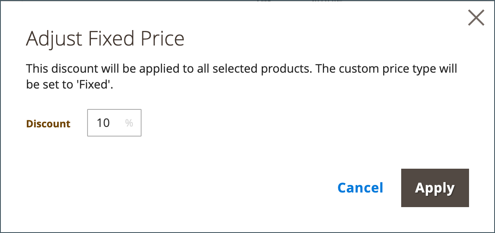

# Festlegen der gemeinsamen Preise und Struktur von Katalogen

Die Einrichtung der Preise und der Struktur eines freigegebenen Katalogs ist ein zweistufiger Prozess. Ihre aktuelle Position im Prozess wird durch eine Zahl in der Fortschrittsleiste am oberen Rand der Seite hervorgehoben. Sie können den anderen Schritt im Prozess jederzeit anzeigen, indem Sie auf die Fortschrittsleiste klicken. Wenn Sie z. B. an benutzerdefinierten Preisen arbeiten, sollten Sie zur Produktauswahlseite zurückkehren, um sie zu referenzieren. Einfaches Klicken **[!UICONTROL Products]** in der Fortschrittsleiste oben auf der Seite und klicken Sie dann auf **[!UICONTROL Pricing]** , um zur Seite mit den benutzerspezifischen Preisen zurückzukehren. Ihre Arbeit geht dabei nicht verloren.

{width="700" zoomable="yes"}

In der Standardkategorien-Struktur ist die Stammkategorie der oberste Container und wird als _Standardkategorie_ in den Beispieldaten. Wenn freigegebene Kataloge aktiviert sind, verfügt die Kategoriestruktur jedoch über einen äußeren Container mit dem Namen _Stammkatalog_. Der Stammkatalog umfasst alle anderen Kategoriestrukturen, die im System vorhanden sind. Weitere Informationen finden Sie unter [Katalogbereich](../catalog/introduction.md#catalog-scope).

## Schritt 1: Öffnen Sie die Konfiguration der freigegebenen Katalogpreise und -struktur

1. Im _Admin_ Seitenleiste, navigieren Sie zu **[!UICONTROL Catalog]** > **[!UICONTROL Shared Catalogs]**

1. Den freigegebenen Katalog im Raster finden Sie im _[!UICONTROL Action]_Spalte und klicken Sie auf **[!UICONTROL Set Pricing and Structure]**.

   {width="700" zoomable="yes"}

1. Wenn der freigegebene Katalog zum ersten Mal konfiguriert ist, klicken Sie auf **[!UICONTROL Configure]** um mit den folgenden Schritten fortzufahren.

## Schritt 2: Auswählen der Produkte

Der erste Schritt in diesem Prozess besteht darin, die Produkte auszuwählen, die Sie in den freigegebenen Katalog aufnehmen möchten. Auf der Produktselektionsseite wird die [Kategorienstruktur](../catalog/category-create.md) auf der linken Seite und ein synchronisiertes Produktraster auf der rechten Seite. Wenn Sie auf eine Kategorie im Baum klicken, werden die Produkte in der Kategorie im Raster angezeigt.

Nur Kategorien mit ausgewählten Produkten werden in der [oberste Navigation](../catalog/navigation-top.md) wenn der freigegebene Katalog über die Storefront angezeigt wird. Standardmäßig sind nur die ersten drei Kategoriestufen in der Storefront-Navigation enthalten, nicht jedoch die Root-Kategorie.

1. Verwenden Sie die **Store** Auswahl zum Festlegen der [Umfang](../catalog/introduction.md#product-scope) der Konfiguration.

   Der Umfang der Konfiguration kann nur festgelegt werden, bevor der freigegebene Katalog zum ersten Mal gespeichert wird. Wenn Sie die Produktauswahl später bearbeiten, ist die Store-Auswahl nicht mehr verfügbar.

   {width="600" zoomable="yes"}

1. Führen Sie im Kategoriebaum einen der folgenden Schritte aus:

   - Um alle Produkte einzuschließen, klicken Sie auf **[!UICONTROL Select all]** oder aktivieren Sie das Kontrollkästchen der übergeordneten Kategorie.
   - Um bestimmte Produktkategorien einzubeziehen, aktivieren Sie das Kontrollkästchen jeder Kategorie, die Sie einbeziehen möchten.
   - Um ein einzelnes Produkt ein- oder auszuschließen, aktivieren oder deaktivieren Sie das Kontrollkästchen des Produkts.

   Die Notation unter jeder Kategorie im Baum zeigt die Anzahl der Produkte aus der Kategorie an, die derzeit im freigegebenen Katalog enthalten sind. Die -Notation unter der [Stammkategorie](../catalog/category-root.md) zeigt die Gesamtanzahl der Produkte aus allen Kategorien an, die derzeit für den freigegebenen Katalog ausgewählt sind.

1. Um Kategorieprodukte im Raster anzuzeigen, klicken Sie auf den Namen der Kategorie im Baum. Wenn eine Kategorie ausgewählt wird, geschieht Folgendes:

   - Der Umschalter in der ersten Spalte des Rasters ist auf Grün eingestellt _on_ Position für jedes ausgewählte Produkt.
   - Wenn ein Produkt mehreren Kategorien zugewiesen ist und nicht in einer dieser Kategorien ausgewählt ist, bleibt es in den anderen Kategorien verfügbar und auch bei der Verwendung von [Katalogsuche](../catalog/search.md).
   - Das System setzt automatisch [Kategorieberechtigungen](../catalog/category-permissions.md) nach `Allow` für die ausgewählten Produkte.

1. Verwenden Sie bei Bedarf die Filter und andere Rastersteuerelemente, um die Produkte zu finden, die Sie in den freigegebenen Katalog aufnehmen möchten.

   Sie können einzelne Produkte einzeln auswählen oder auslassen, indem Sie in der ersten Spalte auf den Umschalter klicken.

   Wenn Sie eine Kategorie auswählen, die keine Produkte enthält, aber mit CMS-Inhalten oder einem externen Link verknüpft ist, wird diese in der oberen Navigation des Storefront angezeigt.

   Die Kategorieeinstellungen, die Sie vornehmen, werden erst dann dauerhaft in der Datenbank gespeichert, wenn die Konfiguration gespeichert wurde. Sie werden jedoch vorübergehend gespeichert, wenn Sie an der Struktur und den Preisen arbeiten.

1. Klicken **[!UICONTROL Next]**.

   {width="600" zoomable="yes"}

## Schritt 3: Festlegen benutzerdefinierter Preise

Sie können für jedes Produkt individuell benutzerdefinierte Preise festlegen oder die Variable _[!UICONTROL Action]_-Kontrolle, um benutzerdefinierte Preise als festen Betrag oder Prozentsatz für mehrere Produktdatensätze festzulegen.

- **[!UICONTROL Fixed]**: Gibt den endgültigen Produktpreis an. Wenn Sie beispielsweise einen Festpreis von 10,00 USD eingeben, liegt der Preis in der Storefront für das entsprechende Unternehmen bei 10,00 USD.

  >[!NOTE]
  >
  >Der Mindestwert zwischen dem Basispreis und dem eingegebenen Festwert wird als Endproduktpreis verwendet.

  >[!NOTE]
  >
  >**_Festpreis_** Anpassbare Produktoptionen sind _not_ beeinflusst von den Regeln für Gruppenpreis, Tier-Preis, Sonderpreis oder Katalogpreis.

- **[!UICONTROL Percentage]**: Bestimmt den benutzerdefinierten Preis basierend auf dem Rabattprozentsatz. Um beispielsweise einen 10-prozentigen Rabatt anzubieten, setzen Sie den benutzerdefinierten Preistyp auf `Percentage` und eingeben `10`. Der ermäßigte benutzerdefinierte Preis beträgt 90 Prozent des ursprünglichen Produktpreises.

Um den Rabatt für die folgenden Produktarten auf einen festen Betrag oder Prozentsatz festzulegen, verwenden Sie die Variable _[!UICONTROL Custom Price]_Spalte im Raster:

- [Einfach](../catalog/product-create-simple.md) (einschließlich konfigurierbarer Produktvarianten)
- [Paket](../catalog/product-create-bundle.md)
- [herunterladbar](../catalog/product-create-downloadable.md)
- [Virtual](../catalog/product-create-virtual.md)

Die Spalte &quot;Benutzerdefinierter Preis&quot;ist leer für [konfigurierbar](../catalog/product-create-configurable.md) und [grouped](../catalog/product-create-grouped.md) Produktarten und [Geschenkkarten](../catalog/product-gift-card-create.md).

Die Auswahl der Produkte im Raster kann nicht über die _Benutzerdefinierte Preise_ Seite. Sie können jedoch die Fortschrittsanzeige oben auf der Seite verwenden, um zum vorherigen Schritt zurückzukehren und die Auswahl der Produkte zu ändern.

{width="600" zoomable="yes"}

### Anwenden eines benutzerspezifischen Preises

1. Für eine Installation mit mehreren Sites legen Sie **[!UICONTROL Website]** auf die Website, auf der die benutzerdefinierten Preise gelten.

   {width="600" zoomable="yes"}

1. Verwenden Sie eine der folgenden Methoden, um die Produkte auszuwählen, für die die benutzerdefinierten Preise gelten sollen.

   - Verwenden Sie den Kategoriebaum, um alle Produkte einer bestimmten Kategorie auszuwählen.
   - Legen Sie die _[!UICONTROL Mass Actions]_in der Kopfzeile zu `Select All`.
   - Aktivieren Sie das Kontrollkästchen einzelner Produkte.

   Das Raster zeigt die Produkte in den aktuell ausgewählten Kategorien an und Sie können die Standardsteuerelemente verwenden, um Produkte zu finden und die Liste zu filtern.

   {width="600" zoomable="yes"}

1. Satz **[!UICONTROL Actions]** auf einen der folgenden Werte zu:

   - `Set Discount` - Wendet einen Rabattprozentsatz auf alle ausgewählten Produkte an. Jeder betroffene Produktpreis wird als **_discount_** Preis.
   - `Adjust Fixed Price` - Wendet einen festen Rabattprozentsatz auf alle ausgewählten Produkte an. Jeder betroffene Produktpreis wird als **_bereinigt_** Preis.

   {width="600" zoomable="yes"}

1. Geben Sie bei Aufforderung den Rabatt oder die Preisanpassung ein und klicken Sie auf **[!UICONTROL Apply]**.

   {width="400"} 

   {width="400"}

   Der Rabatt wird auf alle ausgewählten Produkte angewendet und die Variable _Benutzerspezifischer Preis_ gibt die Art des angewendeten Rabatts und Betrags an.

   {width="600" zoomable="yes"}

### Anwenden eines Ebenenpreises

[Kategoriekosten](../catalog/product-price-tier.md) ermöglicht Ihnen, einen Mengenrabatt für Produkte im freigegebenen Katalog anzubieten. Die _Basispreis_ enthält eine Relation zur _Erweiterte Preise_ Optionen, die speziell für den freigegebenen Katalog gelten. Wenn das Produkt bereits Stufenpreise enthält, wird die Anzahl der vorhandenen Ebenen in Klammern nach dem Link angezeigt.

Die folgenden Anweisungen zeigen, wie Sie die Stufenpreise auf ein einzelnes Produkt anwenden. Informationen zum Anwenden von Stufenpreisen auf mehrere Produkte finden Sie unter [Einfuhrstufungspreise](../systems/data-import-price-tier.md).

1. Gehen Sie für das Produkt im Raster zum _Basispreis_ Spalte und klicken Sie auf **[!UICONTROL Configure]**.

   {width="600" zoomable="yes"}

1. Im _Erweiterte Preise_ Seite, klicken **[!UICONTROL Add Price]** und gehen Sie wie folgt vor:

   {width="600" zoomable="yes"}

   - Satz **[!UICONTROL Website]** auf der Website, auf der der Tier-Preis gilt.
   - Geben Sie die Menge des Produkts ein, das gekauft werden muss, um den Rabatt zu erhalten.
   - Satz **[!UICONTROL Price]** auf einen der folgenden Rabatttypen:
      - `Fixed`
      - `Discount`
   - Geben Sie den Rabattbetrag ein.
   - Klicken Sie auf , um eine weitere Ebene einzugeben. **Preis hinzufügen** und wiederholen Sie den Prozess, um die nächste Ebene zu definieren.

   {width="600" zoomable="yes"}

1. Wenn Sie fertig sind, klicken Sie auf **[!UICONTROL Done]**.

   Im Raster wird die Anzahl der Ebenen in Klammern der _[!UICONTROL Tier Price]_Spalte.

   {width="600" zoomable="yes"}

## Speichern Sie Struktur und Preise

Klicken Sie nach Abschluss der benutzerspezifischen Preisgestaltung auf **[!UICONTROL Generate Catalog]** then **[!UICONTROL Save]**.

Der freigegebene Katalog wird jetzt in der Datenbank gespeichert. Der Name erscheint im _[!UICONTROL Shared Catalog]_Spalte_[!UICONTROL Products]_ Gitter. Der nächste Schritt besteht darin, [Zuweisen des freigegebenen Katalogs zu einem Unternehmen](./catalog-shared-assign-companies.md).
