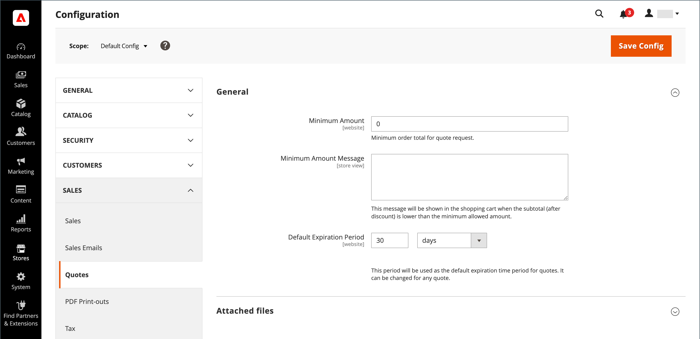
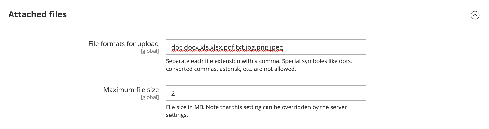

# Konfigurieren von Anführungszeichen

Wenn Anführungszeichen in den allgemeinen B2B[Funktionen aktiviert sind](enable-basic-features.md) können Sie die Unterstützung für Anführungszeichen im Admin konfigurieren. Die Angebotskonfiguration bestimmt den minimalen erforderlichen Bestellbetrag für Angebotsanfragen, die Angebotslebensdauer und die unterstützten Dateiformate für angehängte Dateien.

>[!NOTE]
>
>Die Konfigurationsoptionen für Angebote und die Möglichkeit, Funktionen für die Angebotsaushandlung zu verwenden, werden mithilfe der [Rollenressourcen](../systems/permissions-user-roles.md#role-resources) gesteuert. Diese Rollenressourcen müssen für die Administratorbenutzerrolle ausgewählt werden, die dem Administratorbenutzerkonto zugewiesen ist. Um Zugriff auf Angebotsfunktionen in Admin zu gewähren, gehen Sie zu **[!UICONTROL System]** > _[!UICONTROL Permissions]_>**[!UICONTROL User Roles]**, wählen Sie die Rolle aus und navigieren Sie in der Struktur_ Rollenressourcen _zu [!UICONTROL Sales] > [!UICONTROL Operations] > [!UICONTROL Quotes] .

1. Navigieren Sie in _Admin_-Seitenleiste zu **[!UICONTROL Stores]** > _[!UICONTROL Settings]_>**[!UICONTROL Configuration]**.

1. Erweitern Sie im linken Bereich **[!UICONTROL Sales]** und wählen Sie **[!UICONTROL Quotes]**.

1. Erweitern Sie  den Abschnitt **[!UICONTROL General]** und führen Sie folgende Schritte aus:

   {width="700" zoomable="yes"}

   Unter [Anführungszeichen](../configuration-reference/sales/quotes.md) in der _Konfigurationsreferenz_ finden Sie eine vollständige Liste der Angebotsfeatures und ihrer Funktionen.

   - Geben Sie die **[!UICONTROL Minimum Amount]** im Warenkorb ein, die erfüllt sein müssen, bevor eine Angebotsanfrage gesendet werden kann.

   - Geben Sie **[!UICONTROL Minimum Amount Message]** die Nachricht ein, die angezeigt werden soll, wenn die Summe des Warenkorbs nicht dem erforderlichen Mindestbetrag entspricht.

   - Geben Sie **[!UICONTROL Default Expiration Period]** die Anzahl der **[!UICONTROL days]**, **[!UICONTROL weeks]** oder **[!UICONTROL months]** ein, für die ein Angebot gültig bleiben soll.

1. Erweitern Sie  den Abschnitt **[!UICONTROL Attached files]** und führen Sie folgende Schritte aus:

   - Geben Sie **[!UICONTROL File formats for upload]** das Suffix jedes Dateityps ein, den Sie für Dateien unterstützen, die an ein Anführungszeichen angehängt sind.

     Geben Sie jedes Dateisuffix in Kleinbuchstaben und durch ein Komma getrennt ein.

     Standardmäßig werden die folgenden Formate unterstützt: `doc`, `docx`, `xls`, `xlsx`, `pdf`, `txt`, `jpg`, `png` und `jpeg`

   - Geben Sie **[!UICONTROL Maximum file size]** die maximale Größe einer angehängten Datei in Megabyte ein.

     Der eingegebene Wert wird möglicherweise von der Server-Einstellung überschrieben.

     {width="600" zoomable="yes"}

1. Klicken Sie abschließend auf **[!UICONTROL Save Config]**.
