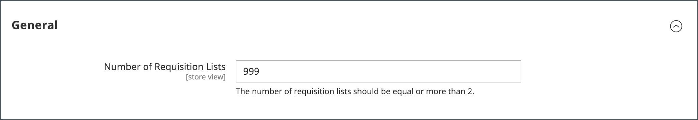

# Anforderungslisten-Maximum konfigurieren

Wenn die Anforderungslisten-Funktion aktiviert ist, können Kunden mehrere Listen häufig gekaufter Artikel erstellen und diese Listen für die Auftragserteilung verwenden. Es ist sowohl für angemeldete Benutzer als auch für Gäste verfügbar. Anforderungslisten können aktiviert werden, wenn Sie [die B2B-Funktionen konfigurieren](enable-basic-features.md).

Ein Kunde kann über mehrere Listen verfügen, die sich auf Produkte verschiedener Anbieter, Käufer, Teams, Kampagnen oder auf alles andere konzentrieren, was gängige Workflows optimiert. [Funktionalität der Anforderungsliste](requisition-lists.md) ähnelt Wunschlisten, mit den folgenden Unterschieden:

- Eine Anforderungsliste wird nach dem Versand von Artikeln an den Warenkorb nicht gelöscht. Es kann mehrmals verwendet werden.
- Die Benutzeroberfläche für Anforderungslisten verwendet eine kompakte Ansicht, um viele Elemente anzuzeigen.

Standardmäßig können Kunden bis zu 999 Anforderungslisten für ihr Konto verwalten. Sie können jedoch die Konfiguration ändern und eine niedrigere Zahl angeben, um die Belastung Ihres Stores zu verringern.

1. Navigieren Sie in _Admin_-Seitenleiste zu **[!UICONTROL Stores]** > _[!UICONTROL Settings]_>**[!UICONTROL Configuration]**.

1. Erweitern Sie im linken Bereich **[!UICONTROL Customers]** und wählen Sie **[!UICONTROL Requisition Lists]**.

   {width="600" zoomable="yes"}

1. Geben Sie **[!UICONTROL Number of Requisition Lists]** die maximale Anzahl von Anforderungslisten ein, die für jedes Kundenkonto gepflegt werden können.

   Die Mindestzahl ist `2`, die Höchstzahl `999`.

1. Klicken Sie abschließend auf **[!UICONTROL Save Config]**.
