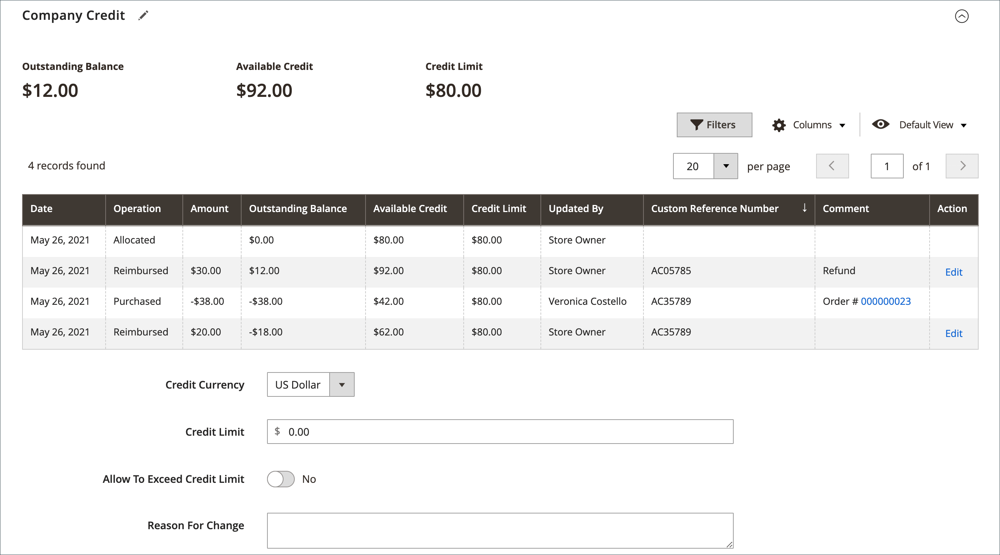

# Firmenkredite verwalten

Firmenkredite ermöglichen B2B-Unternehmen, Käufe gegen eine vorab genehmigte Kreditlinie zu tätigen, anstatt eine sofortige Zahlung zu verlangen. Wenn [Zahlung auf Konto](../b2b/enable-basic-features.md#configure-payment-on-account) aktiviert ist, können Unternehmen bis zu ihrem Kreditlimit kaufen und ihren Kreditstatus über das Konto-Dashboard einsehen.

{width="700" zoomable="yes"}

Firmenkredite bieten Ihnen folgende Möglichkeiten:

* **Kreditbedingungen verlängern** - Vertrauenswürdigen Geschäftskunden den Kauf auf Rechnung mit Zahlungsaufschub ermöglichen
* **Kreditlimits festlegen** - Kontrollieren Sie finanzielle Risiken, indem Sie Kreditlimits für jedes Unternehmen festlegen
* **Kreditaktivität verfolgen** - Überwachen Sie alle Kredittransaktionen, Zahlungen und ausstehenden Salden in Echtzeit
* **B2B-Transaktionen optimieren** - Vereinfachen Sie den Einkaufsprozess für Unternehmen mit etablierten Kreditbeziehungen
* **Unterstützung komplexer Workflows** - Integration in Bestellungen, Angebote und Genehmigungsprozesse

## Voraussetzungen

Stellen Sie vor der Einrichtung des Firmenkredits Folgendes sicher:

* B2B-Funktionen sind in Ihrer Adobe Commerce-Installation aktiviert
* [Zahlung auf Konto](../b2b/enable-basic-features.md#configure-payment-on-account) ist konfiguriert und aktiviert
* Die Unternehmenskonten sind ordnungsgemäß mit den erforderlichen Geschäftsinformationen eingerichtet.
* Sie verfügen über Administratorrechte zur Verwaltung der Einstellungen für Firmenkredite.
* Währungseinstellungen werden konfiguriert, wenn in mehreren Währungen gearbeitet wird

## Anwendungsszenarien

Firmenkredite sind ideal für:

* **Etablierte B2B-** - Langfristige Geschäftskunden mit bewährter Zahlungsgeschichte
* **Großkunden** - Unternehmen, die regelmäßig umfangreiche Einkäufe tätigen, die längere Zahlungsfristen erfordern
* **Saisonale Geschäfte** - Unternehmen mit zyklischem Cashflow, die flexible Zahlungsfristen benötigen
* **Unternehmensbeschaffung** - Organisationen mit zentralisiertem Einkauf, aber verteilter Zahlungsverarbeitung
* **Lieferkettenpartner** - Distributoren, Händler und Channel-Partner, die Kreditfazilitäten benötigen

## Grundlegendes zu Einstellungen für Firmenkredite

Für jedes Unternehmensprofil können die folgenden kreditbezogenen Parameter konfiguriert werden:

* **Kreditwährung** - Währung für alle Kredittransaktionen und -salden
* **Kreditlimit** - Höchstbetrag, den das Unternehmen jederzeit schulden kann
* **Überschreiten des Kreditlimits zulassen**— Gibt an, ob Unternehmen Aufträge aufgeben können, die das verfügbare Guthaben überschreiten
* **Änderungsgrund** - Dokumentationsfeld zur Aufzeichnung von Änderungen der Krediteinstellungen

Weitere Informationen zu diesen Einstellungen und zum Konfigurieren des Firmenprofils finden Sie unter [Erstellen eines Firmenkontos](account-company-create.md).

>[!NOTE]
>
>Wenn ein Unternehmen einen offenen Saldo hat, wird dem Filialadministrator bei der Anzeige im Admin oben in den Kundenaufträgen ein Hinweis angezeigt. Dadurch wird sichergestellt, dass der Status der Gutschrift bei der Auftragsverarbeitung bekannt ist.

## Firmenkreditaktivität

Im Abschnitt [!UICONTROL Company Credit] des Firmenprofils wird eine vollständige Historie aller Kredittransaktionen, Saldenänderungen und Zahlungsaktivitäten in einem Rasterformat angezeigt.

{width="700" zoomable="yes"}

Das Raster zeigt die folgenden Informationen für jede Transaktion an:

| Spalte | Beschreibung |
|--- |--- |
| [!UICONTROL Date] | Das Datum der Transaktion. Um Datum und Uhrzeit anzuzeigen, bewegen Sie den Mauszeiger über das Datum. |
| [!UICONTROL Operation] | Der Aktivitätstyp, der mit der Transaktion verbunden ist. Werte:  **[!UICONTROL Allocated]**- Dem Unternehmen zugewiesene Gutschrift. **[!UICONTROL Updated]** - Änderung wurde auf eines der folgenden Felder angewendet: [!UICONTROL Credit limit] / [!UICONTROL Credit currency] / [!UICONTROL Allow to exceed credit limit]  **[!UICONTROL Purchased]**- Bestellung wurde aufgegeben. **[!UICONTROL Reimbursed]** - Der ausstehende Restbetrag wurde zurückgezahlt.  **[!UICONTROL Refunded]**- Ein Gutschriftsbetrag wurde zurückerstattet. **[!UICONTROL Reverted]** - Der Auftrag wurde storniert und der Betrag auf das Guthaben zurückgeführt. |
| [!UICONTROL Amount] | Der Transaktionsbetrag, der den folgenden Transaktionsarten zugeordnet ist: `Purchased` / `Reimbursed` / `Refunded` / `Reverted`  Bei Kaufbeträgen wird der Betrag in der Anzeigewährung des Geschäfts und im Format der Einstellung der Kreditwährung angezeigt, gefolgt vom aktuellen Umrechnungskurs (falls zutreffend). Beispiel:  EUR 20.000,00 ($22.400,00)  USD/EUR 0,8928 |
| [!UICONTROL Outstanding Balance] | Der erstattete Betrag abzüglich des fälligen Gesamtbetrags aller Bestellungen, die mit der Zahlungsmethode „Auf Konto“ aufgegeben wurden. Der Betrag kann als positiver oder negativer Wert erscheinen.  **[!UICONTROL Positive value]**- Eine Vorauszahlung wird als positiver Wert dargestellt. **[!UICONTROL Negative value]** - Ein fälliger Betrag wird als negativer Wert dargestellt. |
| [!UICONTROL Available Credit] | Die Summe aus _[!UICONTROL Credit Limit]_&#x200B;und&#x200B;_[!UICONTROL Outstanding Balance]_. Wenn das Unternehmen das Kreditlimit überschritten hat, erscheint der Betrag als negativer Wert. |
| [!UICONTROL Credit Limit] | Der dem Unternehmen gewährte Kreditbetrag. |
| [!UICONTROL Updated By] | Der Name der Person, die den Vorgang initiiert hat. |
| [!UICONTROL Custom Reference Number] | Die benutzerdefinierte Referenznummer, die mit der Transaktion verknüpft ist. |
| [!UICONTROL Comment] | Eine Kompilierung der Werte aus dem `Reason for Change` Feld, abhängig vom Vorgangstyp.  **[!UICONTROL Purchased]**- Enthält Kommentare zum Kauf sowie die Bestellnummer und den Link zur Bestellung. **[!UICONTROL Reimbursed]** - Enthält Kommentare aus der zurückgezahlten Transaktion. |
| [!UICONTROL Action] | Nur für `Reimbursed` Vorgänge. **[!UICONTROL Edit]** - Ermöglicht die Aktualisierung des Erstattungsbetrags. |

{style="table-layout:auto"}

## Aktualisieren der Kreditdaten

Wenn Kunden Zahlungen vornehmen, aktualisieren Administratoren die Kreditdaten im Administrator.

1. Navigieren Sie in _Admin_-Seitenleiste zu **Kunden > Firmen**.

1. Suchen Sie die Firma im Raster und öffnen Sie im _Bearbeiten_-Modus.

1. Erweitern Sie den Abschnitt **Firmenkredite**.

1. Geben **unter „Kreditlimit** den neuen Wert ein.

1. Ändern Sie die anderen Werte nach Bedarf.

1. Wenn die Aktualisierungen abgeschlossen sind, klicken Sie auf **[!UICONTROL Save]**.

## Zahlungen empfangen

Ein erstatteter Saldo ist eine Offline-Zahlung, die von einem Unternehmen auf den Saldo seines Kontos geleistet wird. Der Store-Administrator gibt den Betrag manuell im Firmenprofil ein, indem er die Schaltfläche _Saldo zurückerstatten_ verwendet. Wenn der Betrag übermittelt wird, berechnet das System den ausstehenden Saldo und die verfügbare Unternehmensgutschrift neu und erfasst die Aktion in der Kredithistorie des Unternehmens. Der erstattete Betrag wird in der Kreditwährung angegeben, wie in der Konfiguration angegeben.

### Zahlung auf ein Firmenkonto anwenden

1. Navigieren Sie in der _Admin_-Seitenleiste zu **[!UICONTROL Customers]** > **[!UICONTROL Companies]**.

1. Suchen Sie den Firmendatensatz in der Liste und öffnen Sie ihn im **[!UICONTROL Edit]**.

1. Klicken Sie oben auf der Seite auf **Kontostand**.

1. Fügen Sie im Dialogfeld die Zahlungsinformationen hinzu:

   {width="500"}

   * Geben Sie den **Betrag** der Zahlung ein.

     Der Betrag kann als positiver oder negativer Wert eingegeben werden.

   * Geben Sie gegebenenfalls als Referenz **Benutzerdefinierte Referenznummer** ein.

     Pro Kostenerstattung kann nur eine individuelle Referenznummer eingegeben werden. Um die Zahlung auf mehrere Bestellungen anzuwenden, erstellen Sie für jede Bestellung eine separate Kostenerstattung.

   * Geben Sie bei Bedarf einen **Kommentar** ein, um die Erstattung zu beschreiben.

1. Klicken Sie **Rückerstattung**.

   Das System aktualisiert die Salden und den Kreditverlauf automatisch, um die Rückzahlung widerzuspiegeln.

### Bearbeiten einer Kostenerstattung

1. Öffnen Sie das Unternehmensprofil im **[!UICONTROL Edit]**.

1. Erweitern Sie  den Abschnitt **Firmenkredite**.

1. Suchen Sie die Rückerstattungstransaktion im Raster und klicken Sie auf **[!UICONTROL Edit]**.

1. Nehmen Sie die erforderlichen Änderungen an **Benutzerdefinierte Referenznummer** und &quot;**&quot;**.

   Der Erstattungsbetrag kann nicht geändert werden.

1. Klicken Sie auf **[!UICONTROL Save]**.

## Storefront-Kreditinformationen

Firmenadministratoren können ihre Kreditdaten im Konto-Dashboard anzeigen, einschließlich ausstehender Salden, verfügbarer Gutschriften, Kreditlimits und ausstehender Rechnungen. Wenn Aufträge storniert werden, werden die Beträge an den Firmensaldo zurückgegeben und im Feld „Kreditzuordnungshistorie“ angezeigt.

{width="700" zoomable="yes"}

## Firmenkreditdemo

In diesem Demovideo erfahren Sie mehr über die Verwaltung von Firmenkrediten:

>[!VIDEO](https://video.tv.adobe.com/v/3411352?quality=12&learn=on&captions=ger)

## Sicherheitsüberlegungen

Implementieren Sie bei der Verwaltung von Unternehmenskrediten robuste Sicherheitsmaßnahmen, um sensible Finanzdaten zu schützen:

* **Zugriffskontrolle** - Kreditverwaltungsberechtigungen nur autorisierten Personen zugänglich machen
* **Audit-Trails**: Führen Sie umfassende Protokolle über alle Kredittransaktionen und -änderungen
* **Datenschutz** - Verschlüsseln sensibler Finanzinformationen sowohl während der Übertragung als auch im Ruhezustand
* **Genehmigungs-Workflows** - Implementieren mehrstufiger Genehmigungsprozesse für umfangreiche Kreditanpassungen
* **Regelmäßige Überprüfungen** - Führen Sie regelmäßige Prüfungen des Benutzerzugriffs und der Kreditbeziehungen durch

## Best Practices

* &#x200B;
   * **Kreditrichtlinien-Management**: Legen Sie bei der Verwaltung von Firmenkrediten klare Richtlinien für die Festlegung von Kreditlimits auf der Grundlage der Zahlungsgeschichte und der Geschäftsbeziehungen des Kunden fest. Überprüfen Sie die ausstehenden Salden und Zahlungsmuster regelmäßig, um das Risiko einzuschätzen, und dokumentieren Sie Änderungen der Krediteinstellungen immer mit detaillierten Gründen für Prüfungszwecke.

Verarbeiten Sie Zahlungen umgehend, um genaue Salden zu halten, und stellen Sie sicher, dass die Einstellungen für die Kreditwährung mit den primären Geschäftsvorgängen jedes Unternehmens übereinstimmen.

* **Compliance und Sicherheit** - Beschränken Sie die Berechtigungen für das Kreditmanagement auf autorisiertes Personal, implementieren Sie Genehmigungs-Workflows für umfangreiche Kreditanpassungen und schützen Sie sensible Finanzinformationen gemäß den Sicherheitsrichtlinien Ihres Unternehmens. Regelmäßige Überprüfungen des Benutzerzugriffs und der Kreditbeziehungen tragen dazu bei, eine angemessene Aufsicht und Compliance aufrechtzuerhalten.

>[!MORELIKETHIS]
>
>* [B2B-Funktionen aktivieren](enable-basic-features.md) * Konfigurieren von Zahlungen auf Konto und anderen B2B-Funktionen
>* [Unternehmenskonto erstellen](account-company-create.md) * Einrichten von Unternehmenskonten mit Kreditfunktionen
>* [Unternehmen verwalten](manage-companies.md) * Übersicht über die Funktionen zur Unternehmensverwaltung
>* [Unternehmensrollen und -berechtigungen](account-company-roles-permissions.md) * Konfigurieren des Benutzerzugriffs für die Kreditverwaltung
>* [Workflow für Bestellungen](purchase-order-flow.md) * Erfahren Sie, wie sich Gutschriften in Bestellungen integrieren lassen
>* [B2B-Konfigurationsreferenz](../configuration-reference/general/b2b-features.md) - Detaillierte Konfigurationseinstellungen für B2B-Funktionen
