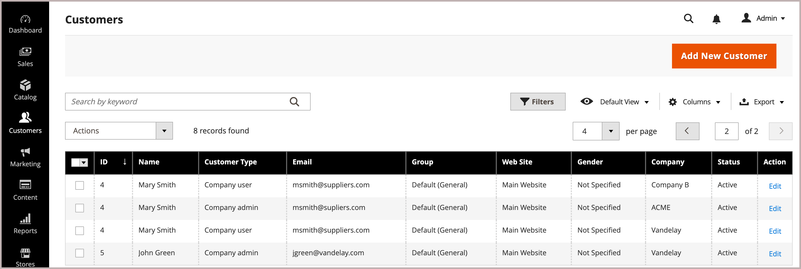

# Benutzer zu einem Unternehmenskonto hinzufügen

Wenn in der Konfiguration aktiviert, fügt der Unternehmensadministrator Unternehmensbenutzer hinzu und verwaltet sie über die Storefront. Konten von Unternehmensbenutzern können jedoch auch vom Administrator hinzugefügt und verwaltet werden.

Bei Bedarf können Sie einen Benutzer mehreren Unternehmen zuweisen. Wenn B2B-Käufer beispielsweise mehrere Unternehmen unterstützen, können Sie ihre Benutzerkonten zu allen Unternehmen hinzufügen, mit denen sie Geschäfte tätigen. Auf der Storefront können Käufer, die mehreren Unternehmen zugewiesen sind, zwischen Unternehmenskonten wechseln, indem sie im Menü *[!UICONTROL Company]* aus den verfügbaren Unternehmen auswählen.

{width="700"}

>[!NOTE]
>
>Wenn eine Person bereits über ein persönliches Konto bei Ihrem Geschäft verfügt und später für ein Unternehmen arbeitet, weisen Sie das individuelle Konto der Person nicht dem Unternehmen zu. Erstellen Sie stattdessen ein Unternehmensbenutzerkonto für die Person mit einer Unternehmens-E-Mail-Adresse.

## Hinzufügen eines Unternehmensbenutzers

Wenn Sie einen Unternehmensbenutzer hinzufügen, ist das erste Unternehmen, das Sie mit dem Benutzerkonto verknüpfen, das Standardunternehmen.

1. Wechseln Sie in der Admin-Seitenleiste zu **[!UICONTROL Customers > All Customers]**.

1. Klicken Sie auf **[!UICONTROL Add new customer]**.

1. Konfigurieren Sie das neue Konto.

   1. Geben Sie den anfänglichen Kontostatus an, indem Sie den Umschalter **[!UICONTROL Customer Active]** festlegen.

      Schalten Sie es ein, um das Konto sofort zu aktivieren, oder deaktivieren Sie es, um ein inaktives Konto zu erstellen.

   1. Wählen Sie den Website-Umfang aus der Liste **[!UICONTROL Associate to Website]** aus.

   1. Klicken Sie auf **[!UICONTROL Associate to Company]** , um die verfügbaren Unternehmen anzuzeigen.

      {width="675"}

      Filtern Sie bei Bedarf die Liste, indem Sie die ersten Buchstaben des Unternehmensnamens in das Eingabefeld eingeben.

   1. Wählen Sie in der Liste ein oder mehrere Unternehmen aus, denen Sie den Kunden zuweisen möchten, und klicken Sie auf **[!UICONTROL Done]**.

      Unternehmensbenutzer werden für jedes mit ihrem Konto verknüpfte Unternehmen automatisch der Kundengruppe (oder dem [freigegebenen Katalog](catalog-shared.md)) hinzugefügt.

   1. Geben Sie die erforderlichen Benutzerkontoinformationen ein: **[!UICONTROL First Name]**, **[!UICONTROL Last Name]** und **[!UICONTROL Email]**.

   1. Erlauben Sie Vertriebsmitarbeitern, sich im Namen des Kunden bei der Storefront anzumelden, indem Sie **[!UICONTROL Allow remote shopping assistance]** aktivieren.

   1. Wenden Sie die Änderungen an, indem Sie auf **[!UICONTROL Save Customer]** klicken.

      {width="675"}

Die Zeile &quot;[!UICONTROL Customers grid]&quot;zeigt für jedes Unternehmen, dem der Benutzer zugewiesen ist, eine separate Zeile an. Die folgenden Spalten werden aktualisiert.

- Die Spalte _[!UICONTROL Customer Type]_wird aktualisiert und zeigt die dem Benutzer zugewiesene Rolle an.

  Wenn der Kunde zum ersten Mal einem Unternehmen zugewiesen wird, wird die Spalte _[!UICONTROL Customer Type]_von_[!UICONTROL Individual user]_ auf _[!UICONTROL Company User]_aktualisiert.

- Die Spalte _[!UICONTROL Group]_ändert sich in den Namen der Kundengruppe (oder des freigegebenen Katalogs), die dem Unternehmen zugewiesen ist.

- In der Spalte _[!UICONTROL Company]_wird der Name des Unternehmens angezeigt, mit dem das Kundenprofil jetzt verknüpft ist.

## Benutzer einem oder mehreren Unternehmenskonten zuweisen

Wenn Sie einen neuen Benutzer zuweisen, ist das erste Unternehmen, das Sie mit dem Benutzerkonto verknüpfen, das Standardunternehmen.

1. Wechseln Sie in der Seitenleiste _Admin_ zu **[!UICONTROL Customers]** > **[!UICONTROL All Customers]**.

1. Suchen Sie den Kunden im Raster und klicken Sie in der Spalte _[!UICONTROL Action]_auf **[!UICONTROL Edit]**.

1. Wählen Sie im linken Bereich **[!UICONTROL Account Information]** aus.

1. Wählen Sie in der Liste **[!UICONTROL Associate to Company]** ein oder mehrere Unternehmen aus, die Sie dem Unternehmensbenutzer zuweisen möchten, und klicken Sie auf **[!UICONTROL Done]**.

1. Wenden Sie die Änderungen an, indem Sie auf **[!UICONTROL Save Customer]** klicken.

## Entfernen der Unternehmenszuweisung aus einem Benutzerkonto

Wenn Sie ein Unternehmen aus einem Benutzerprofil entfernen, wird der Benutzerzugriff auf dieses Unternehmen widerrufen. Auf Benutzerdaten kann weiterhin über den Admin zugegriffen werden. Wenn Sie alle Unternehmenszuweisungen entfernen, ändert sich der _[!UICONTROL Customer Type]_in *[!UICONTROL Individual user]*, wodurch die B2B-Funktionen für das Konto deaktiviert werden.

1. Bearbeiten Sie im Kundenraster in Admin das Kundenprofil, um es zu aktualisieren.

1. Entfernen Sie im Abschnitt *[!UICONTROL Account Information] ein zugewiesenes Unternehmen aus dem Feld **[!UICONTROL Associate to Company]**, indem Sie auf die Schaltfläche **[!UICONTROL X]** in der Beschriftung für den Unternehmensnamen klicken.

1. Wenden Sie die Änderungen an, indem Sie auf **[!UICONTROL Save Customer]** klicken.

>[!NOTE]
>
>Wenn ein Unternehmensbenutzer als Unternehmensadministrator zugewiesen wird, können Sie die Unternehmensverknüpfung von diesem Benutzer erst dann verwenden, wenn Sie das Unternehmenskonto so aktualisieren, dass ein neuer Unternehmensadministrator zugewiesen wird.
