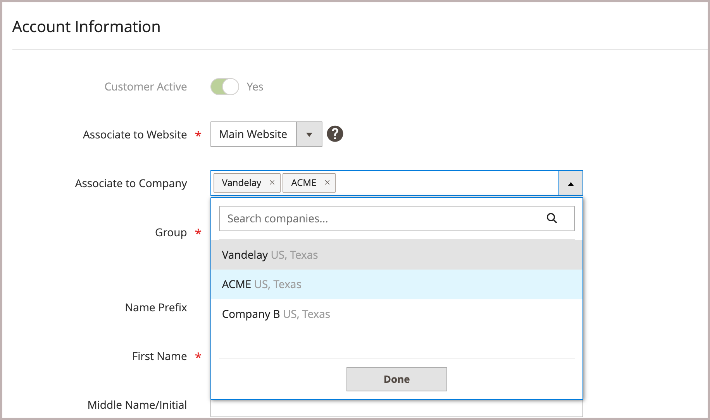

# Hinzufügen von Kunden zu einem Unternehmenskonto

Wenn in der Konfiguration aktiviert, fügt der Unternehmensadministrator Benutzer zum Unternehmen hinzu. Die Unternehmenszuweisung eines Kundenprofils kann jedoch auch vom Administrator vorgenommen oder geändert werden.

>[!NOTE]
>
>Wenn eine Person bereits über ein persönliches Konto bei Ihrem Geschäft verfügt und später für ein Unternehmen arbeitet, weisen Sie das individuelle Konto der Person nicht dem Unternehmen zu. Erstellen Sie stattdessen ein Unternehmensbenutzerkonto für die Person mit einer Unternehmens-E-Mail-Adresse.

1. Wechseln Sie in der Seitenleiste _Admin_ zu **[!UICONTROL Customers]** > **[!UICONTROL All Customers]**.

1. Suchen Sie den Kunden im Raster und klicken Sie in der Spalte _[!UICONTROL Action]_auf **[!UICONTROL Edit]**.

1. Wählen Sie im linken Bereich **[!UICONTROL Account Information]** aus.

1. Klicken Sie auf **[!UICONTROL Associate to Company]** und geben Sie die ersten Buchstaben des Unternehmensnamens in das Eingabefeld ein.

   Das System generiert eine Liste aller möglichen Übereinstimmungen.

   {width="600"}

1. Wählen Sie in der Liste das Unternehmen aus, dem Sie den Kunden zuweisen möchten, und klicken Sie auf **[!UICONTROL Done]**.

1. Wenn der Kunde zuvor einem anderen Unternehmen zugewiesen wurde, klicken Sie auf **[!UICONTROL Confirm]**.

   Der Kunde wird der Kundengruppe (oder dem [freigegebenen Katalog](catalog-shared.md)) des Unternehmens neu zugewiesen und zu seiner [Unternehmensstruktur](account-company-structure.md) hinzugefügt.

1. Klicken Sie nach Abschluss des Vorgangs auf **[!UICONTROL Save Customer]**.

   Die folgenden Spalten werden im Raster [Kunden](../customers/customers-all.md) aktualisiert:

   - Die Spalte _[!UICONTROL Group]_ändert sich in den Namen der Kundengruppe (oder des freigegebenen Katalogs), die dem Unternehmen zugewiesen ist.
   - In der Spalte _[!UICONTROL Company]_wird der Name des Unternehmens angezeigt, mit dem das Kundenprofil jetzt verknüpft ist.
