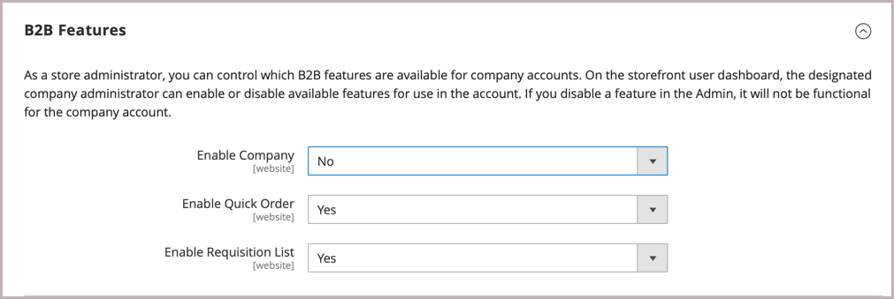

# B2B-Funktionen aktivieren

Standardmäßig sind alle B2B-Funktionen zunächst deaktiviert. Ein Store-Administrator kann die B2B-Funktionen nach Bedarf für Commerce Stores aktivieren oder deaktivieren. Eine vollständige Liste der B2B-Konfigurationseinstellungen finden Sie unter [B2B Features configuration reference](../configuration-reference/general/b2b-features.md).

Wenn Sie den Support für Kundenunternehmen aktivieren, werden automatisch zusätzliche B2B-Funktionen aktiviert:

- [!DNL Shared Catalog]

  Unterstützt benutzerdefinierte Preiskonfigurationen für verschiedene Unternehmen und ermöglicht zudem Kategorieberechtigungen für alle Stores.

- [!DNL Enable Shared Catalog direct products price assigning]

  Verbessert die Site-Leistung, indem nur Produkte gespeichert werden, die einem freigegebenen Katalog im Preisindex zugewiesen sind. Die Aktivierung dieser Funktion ist eine Best Practice für Händler, die über viele freigegebene Kataloge verfügen, um benutzerdefinierte Preise für verschiedene Unternehmen zu verwalten.

- [!DNL B2B Quotes]

  Bietet Verkäufern und Firmenkäufern die Möglichkeit, Preise zu verhandeln.

- [!DNL B2B default payment and shipping methods]

  Bestimmt die Auswahl der Zahlungs- und Versandoptionen, die B2B-Käufern auf der Storefront zur Verfügung stehen.

Konfigurationseinstellungen für diese Funktionen sind nur sichtbar, wenn [!DNL Enable Company] auf `Yes` gesetzt ist.

B2B [!DNL Quick Order] - und [!DNL Requisition List] -Funktionen können unabhängig aktiviert und deaktiviert werden.

## B2B-Funktionen konfigurieren

1. Wechseln Sie in der Seitenleiste _Admin_ zu **[!UICONTROL Stores]** > _[!UICONTROL Settings]_>**[!UICONTROL Configuration]**.

   Wenn Sie über eine Installation mit mehreren Sites verfügen, legen Sie das Steuerelement **[!UICONTROL Store View]** in der linken oberen Ecke auf die Website fest, für die die Konfiguration gilt.

1. Wählen Sie im linken Bereich unter _[!UICONTROL General]_die Option **[!UICONTROL B2B Features]**:

   {width="600"}

   - Ermöglichen Sie es Kunden, ihre eigenen Unternehmenskonten zu verwalten und die Unterstützung für zusätzliche B2B-Funktionen zu aktivieren, indem Sie **[!UICONTROL Enable Company]** auf `Yes` setzen.

     Wenn Sie die Unternehmensunterstützung aktivieren, werden der freigegebene Katalog, das B2B-Angebot, die B2B-Zahlungsmethoden und die B2B-Versandmethoden automatisch aktiviert.

   - Damit Kunden und Gäste schnell Bestellungen basierend auf der SKU oder dem Produktnamen aufgeben können, setzen Sie **[!UICONTROL Enable Quick Order]** auf `Yes`.

   - Damit Kunden Anforderungslisten über ihr Konto-Dashboard erstellen und verwalten können, setzen Sie **[!UICONTROL Enable Requisition List]** auf `Yes`.

     Sie können auch [die maximale Anzahl von Listen konfigurieren](configure-requisition-lists.md), die ein Kunde für sein Konto haben kann.

1. Klicken Sie nach Abschluss des Vorgangs auf **[!UICONTROL Save Config]**.

## Standardmäßige B2B-Zahlungs- und Versandmethoden konfigurieren

1. Erweitern Sie  im Abschnitt **[!UICONTROL Default B2B Payment Methods]** .

1. Um die Standardzahlungsmethoden für B2B-Bestellungen festzulegen, setzen Sie **[!UICONTROL Applicable Payment Methods]** auf eine der folgenden Optionen:

   - `All Payment Methods`

   - `Selected Payment Methods`

     Wählen Sie für die jeweilige Option die **[!UICONTROL Payment Methods]** aus, die Sie Ihren Kunden zur Verfügung stellen möchten, indem Sie die Strg- (PC) oder Befehlstaste (Mac) gedrückt halten, während Sie auf die einzelnen Optionen klicken.

   Die Liste der [Zahlungsmethoden](../configuration-reference/sales/payment-methods.md) zeigt an, welche Optionen derzeit in Ihrem Store aktiviert oder deaktiviert sind. Neben den Standardzahlungsmethoden enthält die Liste auch folgende Elemente:

   - Keine Zahlungsinformationen erforderlich
   - [Kontozahlung](#configure-payment-on-account)
   - Gespeicherte Konten
   - Stored Cards

   {width="600"}

1. Erweitern Sie  im Abschnitt **[!UICONTROL Default B2B Shipping Methods]** .

1. Um die standardmäßigen Versandmethoden für B2B-Bestellungen anzugeben, setzen Sie **[!UICONTROL Applicable Shipping Methods]** auf eine der folgenden Optionen:

   - `All Shipping Methods`
   - `Selected Shipping Methods`

     Wählen Sie für die jeweilige Option die **[!UICONTROL Shipping Methods]** aus, die Sie Ihren Kunden zur Verfügung stellen möchten, indem Sie die Strg- (PC) oder Befehlstaste (Mac) gedrückt halten, während Sie auf die einzelnen Optionen klicken.

     Die Liste der Versandmethoden zeigt an, welche derzeit [aktiviert oder deaktiviert sind](../configuration-reference/sales/delivery-methods.md).

   {width="600"}

1. Klicken Sie nach Abschluss des Vorgangs auf **[!UICONTROL Save Config]**.

## E-Mail-Optionen für Unternehmen konfigurieren

Der [Vertriebsmitarbeiter](account-company-manage.md#assign-a-sales-representative), der als Hauptkontakt für ein Unternehmen zugewiesen ist, ist standardmäßig als Absender vieler automatisierter E-Mail-Nachrichten konfiguriert, die an das Unternehmen gesendet werden.

1. Wechseln Sie in der Seitenleiste _Admin_ zu **[!UICONTROL Stores]** > _[!UICONTROL Settings]_>**[!UICONTROL Configuration]**.

1. Erweitern Sie im linken Bereich den Wert **[!UICONTROL Customers]** und wählen Sie **[!UICONTROL Company Configuration]** aus.

1. Stellen Sie bei Bedarf **[!UICONTROL Store View]** auf die Store-Ansicht ein, um den [Perimeter](../getting-started/websites-stores-views.md#scope-settings) der Konfiguration zu definieren.

1. Füllen Sie den Abschnitt **[!UICONTROL Company Registration]** aus:

   >[!NOTE]
   >
   >Deaktivieren Sie das Kontrollkästchen **[!UICONTROL Use system value]** , um das Feld bearbeitbar zu machen.

   - Setzen Sie **[!UICONTROL Company Registration Email Recipient]** auf den [Speicherkontakt](../getting-started/store-details.md#store-email-addresses) , der benachrichtigt werden soll, wenn eine neue Registrierungsanfrage für ein Unternehmen empfangen wird.

   - Geben Sie für &quot;**[!UICONTROL Send Company Registration Email Copy To]**&quot; die E-Mail-Adresse jeder Person ein, die eine Kopie der Registrierungsbenachrichtigung erhalten soll. Trennen Sie mehrere E-Mail-Adressen durch Kommas.

   - Um zu bestimmen, wie die Kopie der Benachrichtigung gesendet wird, setzen Sie **Methode zum Senden der E-Mail-Kopie** auf eine der folgenden Optionen:

      - `Bcc` - Sendet eine _Blinde höfliche Kopie_, indem der Empfänger in die Kopfzeile derselben E-Mail eingefügt wird, die an den Kunden gesendet wird. Der BCC-Empfänger ist für den Kunden nicht sichtbar.
      - `Separate Email` - Sendet die Kopie als separate E-Mail.

   - Wenn Sie eine E-Mail-Vorlage vorbereitet haben, die anstelle der Standardvorlage verwendet werden soll, setzen Sie &quot;**[!UICONTROL Default Company Registration Email]**&quot;auf den Namen der Vorlage. Standardmäßig wird die Vorlage `Company Registration Request` verwendet.

     {width="600"}

1. Füllen Sie den Abschnitt **[!UICONTROL Customer-Related Emails]** aus:

   Wenn Sie alternative E-Mail-Vorlagen für die Verwendung anstelle der Standardeinstellungen vorbereitet haben, wählen Sie die Vorlage aus, die Sie für jeden der folgenden Schritte verwenden möchten:

   - **[!UICONTROL Default 'Sales Rep Assigned' Email]**
   - **[!UICONTROL Default 'Assign Company to Customer' Email]**
   - **[!UICONTROL Default 'Assign Company Admin' Email]**
   - **[!UICONTROL Default 'Company Admin Inactive' Email]**
   - **[!UICONTROL Default 'Company Admin Changed to Member' Email]**
   - **[!UICONTROL Default 'Customer Status Active' Email]**
   - **[!UICONTROL Default 'Customer Status Inactive' Email]**

   {width="600"}

1. Füllen Sie den Abschnitt **[!UICONTROL Company Status Change]** aus:

   - Geben Sie für &quot;**[!UICONTROL Send Company Status Change Email Copy To]**&quot; die E-Mail-Adresse jeder Person ein, die eine Kopie der Benachrichtigung über die Statusänderung erhalten soll. Trennen Sie mehrere E-Mail-Adressen durch Kommas.

   - Um zu bestimmen, wie die Kopie der Benachrichtigung gesendet wird, setzen Sie **Methode zum Senden der E-Mail-Kopie** auf eine der folgenden Optionen:

      - `Bcc` - Sendet eine _Blinde höfliche Kopie_, indem der Empfänger in die Kopfzeile derselben E-Mail eingefügt wird, die an den Kunden gesendet wird. Der BCC-Empfänger ist für den Kunden nicht sichtbar.
      - `Separate Email` - Sendet die Kopie als separate E-Mail.

   - Wenn Sie eine E-Mail-Vorlage vorbereitet haben, die verwendet werden soll, wenn sich der Unternehmensstatus von `Pending Approval` in `Active` ändert, setzen Sie **[!UICONTROL Default 'Company Status Change to Active 1' Email]** auf den Namen der Vorlage. Standardmäßig wird die Vorlage `Company Status Active 1` verwendet.

   - Wenn Sie eine E-Mail-Vorlage vorbereitet haben, die verwendet werden soll, wenn sich der Unternehmensstatus von `Rejected` oder `Blocked` in `Active` ändert, setzen Sie **[!UICONTROL Default 'Company Status Change to Active 2' Email]** auf den Namen der Vorlage. Standardmäßig wird die Vorlage `Company Status Active 2` verwendet.

   - Wenn Sie eine E-Mail-Vorlage vorbereitet haben, die verwendet werden soll, wenn sich der Unternehmensstatus in `Rejected` ändert, setzen Sie **[!UICONTROL Default 'Company Status Change to Rejected' Email]** auf den Namen der Vorlage. Standardmäßig wird die Vorlage `Company Status Rejected` verwendet.

   - Wenn Sie eine E-Mail-Vorlage vorbereitet haben, die verwendet werden soll, wenn sich der Unternehmensstatus in `Blocked` ändert, setzen Sie **[!UICONTROL Default 'Company Status Change to Blocked' Email]** auf den Namen der Vorlage. Standardmäßig wird die Vorlage `Company Status Blocked` verwendet.

   - Wenn Sie eine E-Mail-Vorlage vorbereitet haben, die verwendet werden soll, wenn sich der Unternehmensstatus in `Pending Approval` ändert, setzen Sie **[!UICONTROL Default 'Company Status Change to Pending Approval' Email]** auf den Namen der Vorlage. Standardmäßig wird die Vorlage `Company Status Pending Approval` verwendet.

   {width="600"}

1. Füllen Sie den Abschnitt **[!UICONTROL Company Credit Emails]** aus:

   - Setzen Sie **[!UICONTROL Company Credit Change Email Sender]** auf den [Speicherkontakt](../getting-started/store-details.md#store-email-addresses) , der benachrichtigt werden soll, wenn eine Änderung an der einem Unternehmen zugewiesenen Kreditbeschränkung vorgenommen wird. Standardmäßig wird die Benachrichtigung an den _Kundenbetreuer_ gesendet.

   - Geben Sie für &quot;**[!UICONTROL Send Company Credit Change Email Copy To]**&quot; die E-Mail-Adresse jeder Person ein, die eine Kopie der Benachrichtigung über eine Kreditänderung erhalten soll. Trennen Sie mehrere E-Mail-Adressen durch Kommas.

   - Um zu bestimmen, wie die Kopie der Benachrichtigung gesendet wird, setzen Sie **Methode zum Senden der E-Mail-Kopie** auf eine der folgenden Optionen:

      - `Bcc` - Sendet eine _Blinde höfliche Kopie_, indem der Empfänger in die Kopfzeile derselben E-Mail eingefügt wird, die an den Kunden gesendet wird. Der BCC-Empfänger ist für den Kunden nicht sichtbar.
      - `Separate Email` - Sendet die Kopie als separate E-Mail.

   - Wenn Sie E-Mail-Vorlagen für die Verwendung anstelle der Standardwerte vorbereitet haben, wählen Sie die Vorlage für jede der folgenden Benachrichtigungen aus, die an den Unternehmensadministrator gesendet werden.

      - **[!UICONTROL Allocated Email Template]**
      - **[!UICONTROL Updated Email Template]**
      - **[!UICONTROL Reimbursed Email Template]**
      - **[!UICONTROL Refunded Email Template]**
      - **[!UICONTROL Reverted Email Template]**

   {width="600"}

1. Klicken Sie nach Abschluss des Vorgangs auf **[!UICONTROL Save Config]**.

## Bestellvalidierung konfigurieren

Die Möglichkeit, die Auftragsverarbeitung und Bestellungen zu verfolgen, gibt Unternehmensadministratoren die Kontrolle über die Handlungen der Käufer des Unternehmens. Die Funktion zur Bestellvalidierung ist verfügbar, wenn die Funktion für Bestellungen von einem Store-Administrator aktiviert wurde.

1. Wechseln Sie in der Seitenleiste _Admin_ zu **[!UICONTROL Stores]** > _[!UICONTROL Settings]_>**[!UICONTROL Configuration]**.

1. Erweitern Sie im linken Bereich den Wert **[!UICONTROL General]** und wählen Sie **[!UICONTROL B2B Features]** aus.

1. Erweitern Sie  im Abschnitt **[!UICONTROL Order Approval Configuration]** .

   {width="600"}

1. Damit Unternehmen eigene Kaufaufträge erstellen können, setzen Sie **[!UICONTROL Enable Purchase Orders]** auf `Yes`.

1. Klicken Sie nach Abschluss des Vorgangs auf **[!UICONTROL Save Config]**.

   Die Funktion &quot;Bestellungen&quot;ist auf Website-Ebene aktiviert. Um diesen Bestelltyp für ein Unternehmen zu aktivieren, verwenden Sie die entsprechenden Einstellungen in jedem [Firmenprofil](account-company-manage.md).

## Konfigurieren von Kaufaufträgen

1. Wechseln Sie in der Seitenleiste _Admin_ zu **[!UICONTROL Customers]** > **[!UICONTROL Companies]**.

1. Suchen Sie das Unternehmen in der Liste und klicken Sie auf **[!UICONTROL Edit]**.

1. Erweitern Sie  im Abschnitt **[!UICONTROL Advanced Settings]** .

1. Setzen Sie **[!UICONTROL Enable Purchase Orders]** auf `Yes`.

1. Klicken Sie nach Abschluss des Vorgangs auf **[!UICONTROL Save]**.

Nach der Aktivierung wird der Abschnitt &quot;**[!UICONTROL Approval Rules]**&quot; in der Storefront [Konto-Dashboard](../customers/account-dashboard.md) für einen Unternehmensadministrator angezeigt.

>[!NOTE]
>
>Der Zugriff auf Bestellungen auf die Storefront muss vom Unternehmensadministrator auf der Grundlage der [Benutzerrollenberechtigungen für Unternehmen](account-company-roles-permissions.md) gewährt werden.

## Konfigurieren der Zahlung auf dem Konto

&quot;Payment on Account&quot;ist eine Offline-Zahlungsmethode, mit der Unternehmen bis zu dem in ihrem Profil angegebenen Kreditlimit Einkäufe tätigen können. Die Zahlung auf Konto kann global oder pro Unternehmen aktiviert werden und wird beim Checkout nur angezeigt, wenn sie aktiviert ist. Wenn _Zahlung auf Konto_ als Zahlungsmethode verwendet wird, wird oben in der Bestellung eine Meldung angezeigt, die den Status des Kontos angibt. Informationen zum Konfigurieren dieser Zahlungsmethode für ein bestimmtes Unternehmen finden Sie unter [Verwalten von Unternehmenskonten](account-company-manage.md).

>[!NOTE]
>
>Die Zahlung auf Konto wird nicht für Bestellungen mit [mehreren Versandadressen](../stores-purchase/shipping-settings.md#multiple-addresses) unterstützt und erscheint nicht unter den Zahlungsoptionen für diese Bestellungen.

So aktivieren Sie die Option Zahlung auf Konto für Ihren Store:

1. Wechseln Sie in der Seitenleiste _Admin_ zu **[!UICONTROL Stores]** > _[!UICONTROL Settings]_>**[!UICONTROL Configuration]**.

1. Erweitern Sie im linken Bereich den Wert **[!UICONTROL Sales]** und wählen Sie **[!UICONTROL Payment Methods]** aus.

1. Erweitern Sie  im Abschnitt **[!UICONTROL Payment on Account]** .

   {width="600"}

   >[!NOTE]
   >
   >Heben Sie bei Bedarf zunächst das Kontrollkästchen **[!UICONTROL Use system value]** auf, um diese Einstellungen zu ändern.

1. Setzen Sie **[!UICONTROL Enabled]** auf `Yes`, um die Zahlung auf dem Konto zu ermöglichen.

1. Geben Sie einen **[!UICONTROL Title]** -Wert ein, der die Zahlungsmethode beim Checkout angibt, oder Sie können den Standardtitel `Payment on Account` akzeptieren.

1. Wenn Bestellungen in der Regel auf die Genehmigung warten, akzeptieren Sie den Standardwert **[!UICONTROL New Order Status]** als `Pending`, bis er genehmigt wurde.

   Wenn Sie es bevorzugen, können Sie den Status `Processing` oder `Suspected Fraud` für neue Bestellungen mit dieser Zahlungsmethode verwenden.

1. Setzen Sie **[!UICONTROL Payment from Applicable Countries]** auf einen der folgenden Werte:

   - `All Allowed Countries` - Kunden aus allen in Ihrer Store-Konfiguration angegebenen [Ländern](../getting-started/store-details.md#country-options) können diese Zahlungsmethode verwenden.
   - `Specific Countries` - Nachdem Sie diese Option ausgewählt haben, wird die Liste _[!UICONTROL Payment from Specific Countries]_angezeigt. Um mehrere Länder auszuwählen, halten Sie die Strg-Taste (PC) oder die Befehlstaste (Mac) gedrückt und klicken Sie auf jede Option.

1. Setzen Sie **[!UICONTROL Minimum Order Total]** und **[!UICONTROL Maximum Order Total]** auf die Bestellbeträge, die erforderlich sind, um für diese Zahlungsmethode qualifiziert zu sein.

   >[!NOTE]
   >
   >Eine Bestellung qualifiziert sich, wenn der Gesamtwert zwischen den minimalen oder maximalen Gesamtwerten liegt oder genau damit übereinstimmt.

1. Geben Sie eine **[!UICONTROL Sort Order]** -Zahl ein, die die Position dieses Elements in der Liste der Zahlungsmethoden festlegt, die beim Checkout angezeigt werden.

   Der Wert ist relativ zu den anderen Zahlungsmethoden. (`0` = first, `1` = second, `2` = third usw.)

1. Klicken Sie nach Abschluss des Vorgangs auf **[!UICONTROL Save Config]**.
