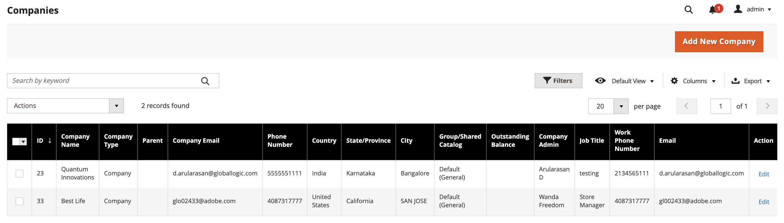

# Unternehmensleitung

Das Unternehmensmanagement in Adobe Commerce bietet Admins umfassende Tools zum Organisieren, Konfigurieren und Überwachen von B2B-Geschäftsbeziehungen. Diese Funktion ist für Unternehmen, die mit mehreren Unternehmenskunden, Tochtergesellschaften oder komplexen Organisationsstrukturen arbeiten, von entscheidender Bedeutung.

Die Unternehmensverwaltung ermöglicht Ihnen Folgendes:

* **Geschäftsbeziehungen organisieren** - Erstellen und verwalten Sie individuelle Unternehmenskonten für Ihre B2B-Kunden.
* **Organisationshierarchien aufbauen** - Strukturieren Sie hierarchisch untergeordnete Beziehungen, die reale Geschäftsorganisationen widerspiegeln
* **Zentrale Administration** - Verwalten Sie mehrere Unternehmen und deren Einstellungen über eine einzige Verwaltungsoberfläche.
* **Vorgänge optimieren** - Anwendung konsistenter Konfigurationen und Richtlinien in verbundenen Unternehmen
* **Support Complex Structures** - Verwalten von Tochtergesellschaften, Franchisen, Unternehmen mit mehreren Standorten und Unternehmensbereichen

Admin-Benutzer können eine Unternehmenshierarchie erstellen, die eine B2B-Organisation spiegelt, indem sie Unternehmen einer bestimmten übergeordneten Firma zuweisen. Diese Zuweisung ermöglicht es dem Administrator der übergeordneten Firma, Unternehmen innerhalb der Organisation anzuzeigen und zu verwalten.

Starten Sie Unternehmensverwaltungsaufgaben über die *[!UICONTROL Companies]*. Navigieren Sie vom Administrator aus zu **[!UICONTROL Customers]** > **[!UICONTROL Companies]**.

{width="700" zoomable="yes"}

## Voraussetzungen

Bevor Sie Unternehmen verwalten, stellen Sie Folgendes sicher:

* B2B-Funktionen sind in Ihrer Adobe Commerce-Installation aktiviert
* Sie verfügen über administrativen Zugriff mit Berechtigungen der Unternehmensverwaltung
* Unternehmenskonten sind ordnungsgemäß mit den erforderlichen Geschäftsinformationen konfiguriert
* Benutzerrollen und -berechtigungen sind für Unternehmensadministratoren und -benutzer definiert

## Anwendungsszenarien

Die Unternehmensführung ist ideal für:

* **Unternehmen mit mehreren Standorten** mit zentralisiertem Einkauf, aber standortspezifischen Anforderungen
* **Franchise-**, die sowohl eine Unternehmensaufsicht als auch lokale Autonomie erfordern
* **Konzerngesellschaften** gemeinsame Policen, aber unabhängige Geschäfte
* **Großunternehmen** mit mehreren Geschäftsbereichen oder Geschäftseinheiten
* **Vertriebsnetzwerke** mit Resellern, Händlern oder Channel-Partnern

## Grundlegendes zur Unternehmenshierarchie und Unternehmenstypen

Die Unternehmenshierarchie strukturiert Geschäftsbeziehungen, indem mehrere Unternehmen unter einer einzigen Muttergesellschaft organisiert werden. Diese Funktion spiegelt reale Organisationsstrukturen wider und ermöglicht gleichzeitig ein zentralisiertes Management und die Bewahrung individueller Unternehmensidentitäten.

### Unternehmenstypen

Die Spalte *[!UICONTROL Company Type]* im Raster Unternehmen zeigt, wie jedes Unternehmen in Ihre B2B-Organisation passt:

* **Parent** - Zentraler Hub mit einer oder mehreren zugeordneten Firmen
   * Steuert mehrere untergeordnete Unternehmen, kann jedoch nicht einem anderen übergeordneten Unternehmen zugewiesen werden.
   * **Anwendungsfall** - Hauptsitz des Unternehmens, Franchise-Organisation oder Holdinggesellschaft

* **Untergeordnet** - Firma, die einer übergeordneten Organisation zugewiesen ist
   * Funktioniert unter übergeordneter Governance und kann Konfigurationen erben
   * Darf jeweils nur einem übergeordneten Element angehören
   * **Anwendungsfall** - Niederlassungen, Franchise-Standorte oder regionale Abteilungen

* **Unternehmen** - Unabhängige Einzelfirma
   * Funktioniert unabhängig ohne Hierarchiebeziehungen
   * Kann in übergeordnetes Element (durch Zuweisung von Unternehmen) oder untergeordnetes Element (durch Zuweisung zu übergeordnetem Element) konvertieren
   * **Anwendungsfall** - Einzelne Geschäftskunden oder eigenständige Kunden

### Unternehmenstypen konvertieren

* **Einzelunternehmen → Übergeordnetes Unternehmen** - Weisen Sie ihm weitere Unternehmen zu
* **Einzelfirma → Untergeordnet** - Einem bestehenden übergeordneten Unternehmen zuweisen
* **Untergeordnetes → Single** - Heben Sie die Zuweisung des untergeordneten Unternehmens zum übergeordneten Unternehmen auf.
* **Übergeordnetes → untergeordnetes Element** - Nicht möglich, ohne zunächst alle zugewiesenen Unternehmen zu entfernen

### Verwalten von Unternehmenshierarchien

Erweitern Sie beim Bearbeiten von Unternehmen innerhalb einer Hierarchie *[!UICONTROL Company Hierarchy]* , um alle zugehörigen Unternehmen anzuzeigen. Eine `Current` Markierung zeigt das Unternehmen an, das bearbeitet wird.

{width="700" zoomable="yes"}

Detaillierte schrittweise Anweisungen finden Sie unter [Verwalten der Unternehmenshierarchie](manage-company-hierarchy.md).

## Aufgaben der Unternehmensleitung

Beim Verwalten von Unternehmen über das Firmenraster können Admins die folgenden Aufgaben über das *[!UICONTROL Company Hierarchy]* ausführen:

* **Anzeigen und Verwalten von Unternehmensbeziehungen**
   * **Zugeordnete Unternehmen anzeigen** - Alle mit einer übergeordneten Organisation verknüpften Unternehmen in einer zentralen Ansicht anzeigen
   * **Unternehmensstatus überwachen** - Verfolgen Sie aktive, ausstehende und inaktive Unternehmen in der Hierarchie.
   * **Zugriff auf Unternehmensdetails** - Navigieren Sie direkt zu den einzelnen Seiten für die Unternehmenskonfiguration

* **Erstellen und Ändern von Hierarchien**
   * **Firmen zuweisen** - Fügen Sie auf der Firmendetailseite vorhandene Firmen zu einer übergeordneten Organisation hinzu
   * **Eltern-Kind-Beziehungen erstellen** - Strukturieren Sie Unternehmen so, dass sie reale Geschäftsbeziehungen widerspiegeln
   * **Strukturen neu organisieren** - Verschiebt Unternehmen zwischen verschiedenen übergeordneten Organisationen, wenn sich die geschäftlichen Anforderungen ändern

* **Verwaltung der Massenkonfiguration**
   * **Einstellungen unternehmensübergreifend anwenden** - Aktualisieren Sie erweiterte Einstellungen für mehrere Unternehmen gleichzeitig mithilfe des [!UICONTROL Actions] Steuerelements im Firmenraster
   * **Standardisieren von Konfigurationen** - Sicherstellen konsistenter Richtlinien in verwandten Organisationen
   * **Individuelle Einstellungen überschreiben** - Übergeordnete Firmenkonfigurationen an ausgewählte untergeordnete Firmen pushen

* **Verwaltungsmaßnahmen**
   * **Entfernen von Unternehmensbeziehungen** - Verwenden Sie die *[!UICONTROL Unassign from parent]* Aktion, um organisatorische Verbindungen aufzulösen
   * **Verwalten des Unternehmenszugriffs** - Steuern, welche Administratoren Unternehmensbeziehungen anzeigen und ändern können
   * **Hierarchieänderungen überwachen** - Änderungen an Organisationsstrukturen verfolgen

## Best Practices

Beachten Sie beim Verwalten von Unternehmen die folgenden Best Practices:

* **Erstellen von Unternehmenshierarchien** - Planen Sie beim Verwalten komplexer Unternehmensstrukturen Ihre Hierarchie so, dass sie echten Geschäftsbeziehungen entspricht, während Sie die Strukturen einfach halten, um Benutzerverwirrung zu vermeiden. Dokumentieren Sie alle Unternehmensbeziehungen und ihre Geschäftsverbindungen für zukünftige Referenzzwecke.

* **Konfigurationsverwaltung** - Testen Sie Konfigurationsänderungen einzelner Unternehmen, bevor Sie sie auf ganze Hierarchien anwenden, und dokumentieren Sie immer die aktuellen Einstellungen, bevor Sie Massenänderungen vornehmen. Informieren Sie die betroffenen Unternehmensadministratoren vorab über geplante Änderungen.

* **Sicherheit** - Beschränken Sie die Unternehmensverwaltungsberechtigungen auf vertrauenswürdige Administratoren, führen Sie regelmäßige Überprüfungen der Unternehmensbeziehungen und Zugriffsberechtigungen durch und überwachen Sie alle Hierarchieänderungen zu Auditzwecken.

>[!MORELIKETHIS]
>
>* [Erstellen eines Unternehmenskontos](account-company-create.md)
>* [Verwalten von Unternehmenshierarchien](manage-company-hierarchy.md)
>* [Unternehmensrollen und -berechtigungen](account-company-roles-permissions.md)
>* [Kreditmanagement von Unternehmen](credit-company.md)
>* [Aktivieren von B2B-Funktionen](enable-basic-features.md)
