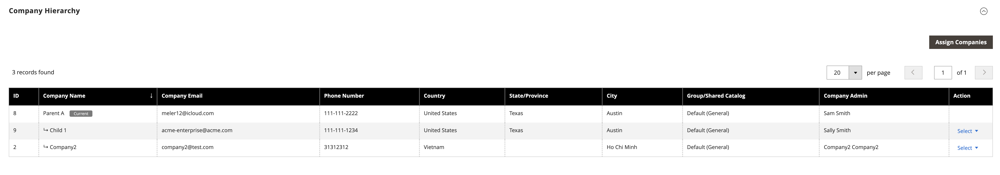

# Unternehmensverwaltung

Die Unternehmensverwaltungsfunktion optimiert den Geschäftsbetrieb für Unternehmen mit komplexen Organisationsstrukturen. Administratoren können Unternehmen als Gruppe verwalten, indem sie eine Unternehmenshierarchie erstellen, die verbundene Unternehmen einer bestimmten Muttergesellschaft zuordnet. Diese Zuweisung ermöglicht es dem Administrator der Muttergesellschaft, sein eigenes Konto zu verwalten und das Unternehmen Konten für alle zugewiesenen Unternehmen.

Erstellen Sie eine Unternehmenshierarchie auf der Detailseite &quot;Unternehmen&quot;.

{width="700" zoomable="yes"}

## Öffnen Sie die Detailseite &quot;Firma&quot;.

1. Aus dem _Admin_ Seitenleiste, navigieren Sie zu **[!UICONTROL Customers]** > **[!UICONTROL Companies]**.

1. Öffnen Sie die Detailseite des Unternehmens im Raster Unternehmen für das Mutterunternehmen, indem Sie die **[!UICONTROL Edit]** Aktion.

Siehe [Verwalten von Unternehmenskonten](account-company-manage.md) für weitere Informationen über das Unternehmensnetz.

## [!UICONTROL Company Hierarchy]

Bei der ersten Erstellung des Unternehmens muss die Variable [!UICONTROL Company Hierarchy] grid ist leer, wenn Sie es erweitern. Nachdem ein Unternehmen erstellt wurde, können Admin-Benutzer mit entsprechenden Berechtigungen die [!UICONTROL Company Hierarchy] eine Muttergesellschaft zu gründen, indem die benannte Muttergesellschaft bearbeitet und verbundene Unternehmen zugewiesen werden.

{width="700" zoomable="yes"}

Siehe [Zuweisen und Aufheben der Zuweisung von Unternehmen](assign-companies.md) Weitere Informationen zu den verfügbaren Aktionen finden Sie im [!UICONTROL Company Hierarchy] Gitter.
