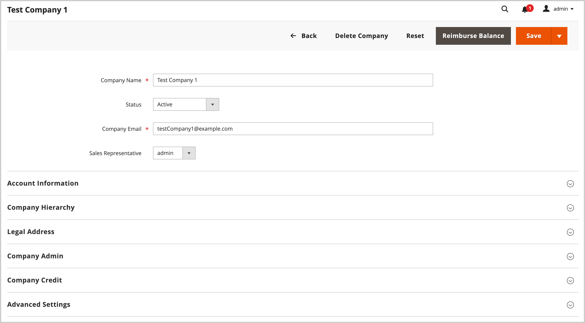
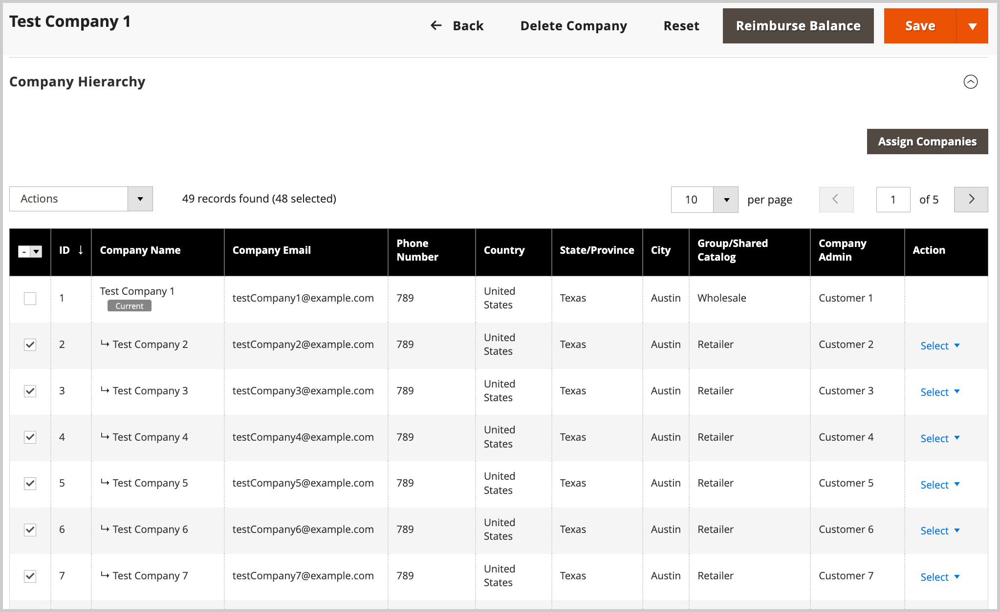

# Verwalten von Unternehmenshierarchien

Mit der [!UICONTROL Company Hierarchy] können Sie mehrere verbundene Unternehmen unter einer einzigen übergeordneten Unternehmensstruktur organisieren. Dies eignet sich ideal für Unternehmen mit Tochtergesellschaften, Franchises, mehreren Standorten oder komplexen Organisationsstrukturen, die eine zentralisierte Verwaltung unter Beibehaltung individueller Unternehmensidentitäten benötigen.

## Anwendungsszenarien

* **Zentrale Verwaltung** - Wenden Sie Einstellungen und Konfigurationen über mehrere Unternehmen hinweg von einer einzigen übergeordneten Firma an
* **Struktur beibehalten** - Organisieren Sie Unternehmen in einer logischen Hierarchie, die Ihrer Geschäftsorganisation entspricht
* **Vorgänge optimieren** - Angebote, Bestellungen, Zahlungsmethoden und Versandeinstellungen für die gesamte Organisation verwalten
* **Autonomie bewahren** - Einzelne Unternehmen behalten ihre Identität bei und profitieren gleichzeitig von gemeinsamen Konfigurationen

## Voraussetzungen

Bevor Sie eine Unternehmenshierarchie erstellen, stellen Sie Folgendes sicher:

* B2B-Funktionen sind in Ihrer Commerce-Installation aktiviert
* Sie verfügen über Administratorzugriff, um Unternehmen zu verwalten
* Übergeordnete und untergeordnete Unternehmen werden bereits als einzelne Unternehmen erstellt
* Sie wissen, dass durch Anwenden übergeordneter Einstellungen bestehende untergeordnete Unternehmenskonfigurationen überschrieben werden

## Funktionsweise

Administratoren können eine Unternehmenshierarchie erstellen, indem sie verknüpfte Unternehmen einer bestimmten übergeordneten Firma zuweisen, welche die Firma an der Spitze der Organisationshierarchie ist.

Erstellen Sie vom Administrator aus eine übergeordnete Firma, indem Sie eine einzelne Firma (`[!UICONTROL Company Type] = Company`) bearbeiten und in der [!UICONTROL Company Hierarchy]-Konfiguration verwandte Firmen zuweisen.

{width="700"}

>[!NOTE]
>
>Weitere Informationen zum [!UICONTROL Company Hierarchy] finden Sie unter [Unternehmenshierarchie](account-company-create.md#company-hierarchy) Feldbeschreibungen.

Verwalten Sie Unternehmenszuweisungen, indem Sie eine übergeordnete Firma bearbeiten und mithilfe des *[!UICONTROL Company Hierarchy]* Firmen hinzufügen oder entfernen. Verwenden Sie das *[!UICONTROL Actions]*, um die [erweiterten Einstellungen“ für &#x200B;](#change-company-settings) in der Organisation zu verwalten.

## Firmen einer übergeordneten Firma zuweisen

1. Navigieren Sie in _Admin_-Seitenleiste zu **[!UICONTROL Customers]** > **[!UICONTROL Companies]**.

   {width="700" zoomable="yes"}

1. Öffnen Sie im [!UICONTROL Companies] die Seite „Firmendetails“, um die Zuweisungen zu erstellen.

   * Um einer bestehenden übergeordneten Firma zusätzliche Firmen zuzuweisen, wählen Sie die **[!UICONTROL Edit]** für die übergeordnete Firma aus.
   * Um eine übergeordnete Firma zu erstellen, wählen Sie die **[!UICONTROL Edit]** Aktion für die als übergeordnete Firma angegebene Firma aus.

     Sie können keine neue übergeordnete Firma aus einer vorhandenen übergeordneten oder untergeordneten Firma erstellen.

1. Erweitern Sie auf der Seite „Unternehmensdetails“ **[!UICONTROL Company Hierarchy]** und klicken Sie dann auf **[!UICONTROL Assign Companies]**.

   {width="675" zoomable="yes"}

1. Wählen Sie aus der Liste der verfügbaren Unternehmen die zuzuweisenden Unternehmen aus und klicken Sie dann auf **[!UICONTROL Assign Selected Companies]**.

   {width="675" zoomable="yes"}

1. Wenn Sie dazu aufgefordert werden, schließen Sie die Unternehmenszuweisung ab, indem Sie **[!UICONTROL Assign]** auswählen.

## Zuweisung von Firmen zu einer übergeordneten Firma aufheben

1. Öffnen Sie auf der Seite Firmen die Firmendetailseite für die übergeordnete Firma, indem Sie die Aktion **[!UICONTROL Edit]** auswählen.

   {width="700" zoomable="yes"}

1. Anzeigen der Liste der zugewiesenen Unternehmen durch Erweitern von **[!UICONTROL Company Hierarchy]**.

1. Entfernen Sie die Firma aus der Organisation.

   * Wählen Sie in der Spalte [!UICONTROL Action] für das zu entfernende Unternehmen **[!UICONTROL Select]** > **[!UICONTROL Unassign from parent]** aus.

     {width="640" zoomable="yes"}

   * Wenn Sie dazu aufgefordert werden, entfernen Sie die zugewiesene Firma aus der Hierarchie, indem Sie **[!UICONTROL Unassign]** auswählen.

## Verwalten von Unternehmenseinstellungen für eine Organisation

Aktualisieren Sie [&#x200B; Konfiguration &#x200B;](account-company-create.md#advanced-settings)Erweiterte Einstellungen) für eine Organisation. Sie können:

* Übergeordnete Konfigurationseinstellungen auf alle untergeordneten Unternehmen anwenden
* Anwenden derselben Einstellungen auf ausgewählte Unternehmen in der Organisation

Sie können eine der folgenden Einstellungen anwenden:

* **Angebotsverwaltung** - Aktivieren oder Deaktivieren der Möglichkeit für Unternehmen, Angebote anzufordern und zu verwalten
* **Bestellungen** - Steuern, ob Unternehmen Bestellungen erstellen und verwalten können
* **Konfiguration der Zahlungsmethode** - Definieren, welche Zahlungsmethoden Unternehmen zur Verfügung stehen
* **Einstellungen für Zahlungsmethoden** - Konfigurieren Sie bestimmte Parameter und Limits für Zahlungsmethoden
* **Verfügbarkeit der Versandmethode** - Festlegen, welche Versandmethoden Unternehmen verwenden können
* **Konfiguration der Versandmethode** - Definieren der Einstellungen und Einschränkungen für die Versandmethode

Während des Aktualisierungsprozesses werden die anfänglichen Konfigurationswerte standardmäßig auf die aktuellen Werte gesetzt, die für die übergeordnete Firma konfiguriert wurden. Sie müssen das Kontrollkästchen Ändern für mindestens eine Einstellung aktivieren, um Einstellungen auf die ausgewählten Unternehmen anzuwenden. Sie können den Standardwert für jede Einstellung auch aktualisieren, bevor Sie die Änderungen anwenden.

>[!WARNING]
>
>Das Anwenden von Einstellungen der übergeordneten Firma ersetzt vorhandene Konfigurationen der untergeordneten Firma, einschließlich Kreditlimits, Zahlungsmethoden, Versandeinstellungen und benutzerdefinierter Einschränkungen. Nachdem Sie die Einstellungen angewendet haben, können Sie die erweiterten Einstellungen für einzelne übergeordnete und untergeordnete Unternehmen weiterhin verwalten und anpassen, indem Sie den Zeileneintrag Firma bearbeiten.

### Best Practices

Beachten Sie beim Anwenden der Einstellungen der übergeordneten Firma auf untergeordnete Firmen die folgenden Best Practices:

* Überprüfen vorhandener untergeordneter Unternehmenseinstellungen, bevor übergeordnete Konfigurationen angewendet werden
* Änderungen der Testeinstellungen werden zuerst für eine untergeordnete Firma durchgeführt.
* Kommunikation von Änderungen an möglicherweise betroffene Unternehmensadministratoren

### Übergeordnete Konfigurationseinstellungen auf untergeordnete Unternehmen anwenden

1. Navigieren Sie in _Admin_-Seitenleiste zu **[!UICONTROL Customers]** > **[!UICONTROL Companies]**.

1. Bearbeiten Sie im [!UICONTROL Companies] das übergeordnete Unternehmen, indem Sie **[!UICONTROL Edit]** aus der Spalte **[!UICONTROL Action]** auswählen.

1. Erweitern Sie auf der Seite mit den übergeordneten Firmendetails **[!UICONTROL Company Hierarchy]** Abschnitt, um die in der Organisation enthaltenen Unternehmen anzuzeigen.

1. Wählen Sie die zu konfigurierenden Unternehmen aus.

   {width="675" zoomable="yes"}

1. Wählen Sie im **[!UICONTROL Actions]** über dem Raster **[!UICONTROL Change company settings]** aus.

   {width="675" zoomable="yes"}

1. Ändern Sie die Konfigurationseinstellungen.

   * Suchen Sie auf der Seite [!UICONTROL Change company settings] nach der zu ändernden Konfigurationseinstellung.

   * Aktivieren Sie das Kontrollkästchen **[!UICONTROL Change]** , um die Einstellung zu aktivieren.

   * Aktualisieren Sie den Wert bei Bedarf.

     {width="575" zoomable="yes"}

1. Wählen Sie nach dem Aktualisieren der Konfiguration **[!UICONTROL Apply Changes]** aus.

1. Wenn Sie dazu aufgefordert werden, wählen Sie **[!UICONTROL Change settings]** aus, um die Konfiguration für die ausgewählten Unternehmen zu aktualisieren.

>[!MORELIKETHIS]
>
>* [Erstellen eines Unternehmenskontos](account-company-create.md) - Erfahren Sie, wie Sie einzelne Unternehmen erstellen, bevor Sie Hierarchien erstellen.
>* [Unternehmensrollen und -berechtigungen](account-company-roles-permissions.md) - Grundlegendes zum Benutzerzugriff in Unternehmensstrukturen
>* [Firmenkreditmanagement](credit-company.md) - Konfigurieren von Kreditlimits und Zahlungsbedingungen für Unternehmen
>* [Unternehmen verwalten](manage-companies.md) - Überblick über die Funktionen zur Unternehmensverwaltung
>* [B2B-Funktionen aktivieren](enable-basic-features.md) - Aktivieren und Konfigurieren der B2B-Funktionen
