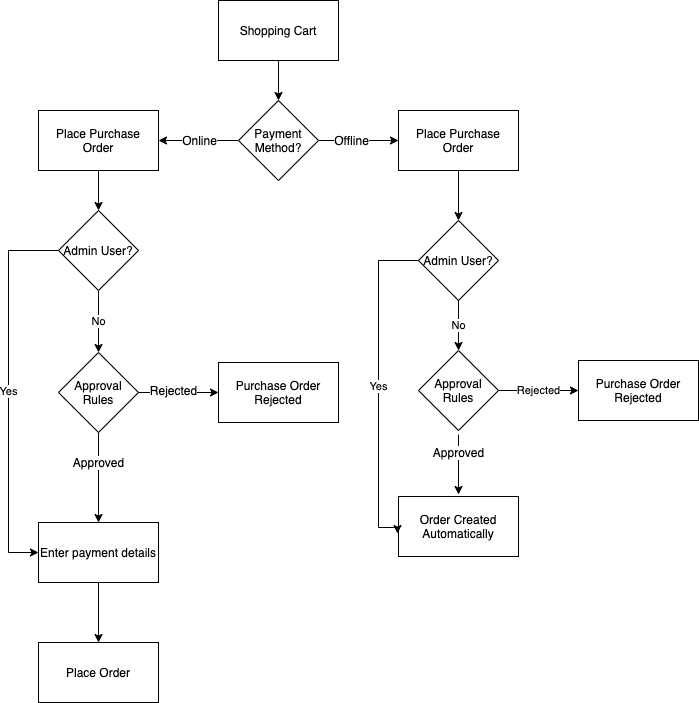

# Bestellungen für Unternehmen

Bestellungen (POs) sind eine gängige Methode für Unternehmen, die Ausgaben zu verfolgen und zu kontrollieren. [Bestellung](../stores-purchase/purchase-order.md) ist eine der standardmäßigen Offline-Zahlungsmethoden, die in Adobe Commerce und Magento Open Source unterstützt werden. Wenn B2B von Adobe Commerce installiert ist und [_Bestellungen aktivieren_](account-company-manage.md#advanced-settings) ist für ein Unternehmenskonto aktiviert. Alle Bestellungen werden automatisch als Bestellungen (PO) erstellt. Firmenbenutzer mit dem erforderlichen [Berechtigungen](account-company-roles-permissions.md) Sie können von ihnen erstellte Bestellungen und von untergeordneten Benutzern erstellte Bestellungen erstellen, bearbeiten und löschen.

## Bestellfluss

Je nach Rolle und Reihenfolge können Firmenbenutzer verschiedenen Genehmigungsregeln unterliegen. Und je nachdem, ob Sie Online- oder Offline-Zahlungsmethoden verwenden, ist der Fluss etwas anders. Firmenadministratoren können Bestellungen automatisch erstellen und dabei die Genehmigungsregeln umgehen. Da das Speichern von Online-Zahlungsdetails während des Genehmigungsprozesses ein Sicherheitsrisiko darstellt, werden diese Details nach der Genehmigung hinzugefügt und die Bestellung wird dann in eine echte Bestellung umgewandelt.

{width="600" zoomable="yes"}

>[!NOTE]
>
>Eine Bestellung kann nicht aufgegeben werden, wenn ein oder mehrere Produkte in der Bestellung derzeit deaktiviert oder nicht vorrätig sind.

Der Workflow für Bestellungen für eine Firma kann auf verschiedene Weise variieren:

- Wenn keine Validierungsregeln festgelegt sind, können Bestellungen aufgegeben und die Bestellung direkt abgeschlossen werden.

  >[!NOTE]
  >
  >Standardmäßig ist ein `Purchase order has been submitted for approval` Die Nachricht wird Firmenbenutzern immer angezeigt, auch wenn keine Genehmigungsregeln festgelegt sind. Wenn kein Validierungsprozess erforderlich ist, erhalten die Benutzer des Unternehmens automatisch eine E-Mail, in der sie darüber informiert werden, dass die Bestellung erstellt und genehmigt wurde.

- Wenn Genehmigungsregeln vom Unternehmensadministrator definiert wurden, durchlaufen die Benutzer den Genehmigungsprozess.
- Offline-Zahlungsdetails werden bei der Erstellung der Bestellung eingegeben.
- Online-Zahlungsdetails werden eingegeben, nachdem die Bestellung genehmigt wurde.

>[!NOTE]
>
>Bestellungen erstellen eine _Momentaufnahme_ von Artikelpreisen, Rabatten und Versandpreisen zum Zeitpunkt der Bestellerfassung. Wenn sich der Preis eines Artikels nach der Erstellung der Bestellung ändert, wird der ursprüngliche Preis verwendet.

### Beispiel für einen einfachen Workflow

Unternehmen verwenden Bestellungen, um zu steuern, was Mitarbeiter im Namen des Unternehmens kaufen können, und richten häufig Genehmigungsregeln ein, um Unternehmensrichtlinien durchzusetzen. Abhängig von den Genehmigungsregeln müssen möglicherweise mehrere Personen die Bestellung genehmigen.

1. Der Benutzer erstellt eine Bestellung für Waren im Wert von 25.000 US-Dollar.
1. Der Vorgesetzte muss zustimmen.
1. Da die Bestellung mehr als 10.000 US-Dollar beträgt, muss der V.P. auch genehmigen.
1. Je nach Zahlungsmethode wird die Bestellung nach den Validierungen automatisch in eine Bestellung umgewandelt, oder der Benutzer kehrt zurück, um Zahlungsdetails einzugeben.

### Genehmigungsregeln

Validierungsregeln werden verwendet, um Ausgaben auf der Grundlage von Unternehmensrichtlinien zu steuern. Beispiele für Genehmigungsregeln sind:

- Jede Bestellung über 100 $ bedarf der Genehmigung Ihres Managers.
- Für jede Bestellung über 1.000 US-Dollar benötigen Sie die Genehmigung Ihres Managers und des Unternehmensadministrators.
- Jede Bestellung mit mehr als 30 eindeutigen SKUs muss vom Unternehmensadministrator genehmigt werden.

Wenn diese Regeln für ein Unternehmen gelten, kann ein Firmenbenutzer die Bestellung sofort abschließen, wenn die Bestellung weniger als 100 US-Dollar beträgt. Informationen zur Definition von Genehmigungsregeln finden Sie unter [Genehmigungsregeln](account-dashboard-approval-rules.md)

### Typen von Store-Benutzern

Der Workflow für Bestellungen kann auch unterschiedlich sein, je nachdem, wer den Kauf tätigt.

- Ein regulärer Mitarbeiter kann allen Genehmigungsregeln unterliegen
- Ein Manager könnte über mehr Kaufkraft verfügen und hätte andere Genehmigungsregeln
- Unternehmensadministratoren können alle Genehmigungsregeln umgehen und ihre Bestellungen automatisch ausführen lassen.

Alle diese Faktoren können sich auf den exakten Checkout-Prozess auswirken.

## [!UICONTROL My Purchase Orders]

Wenn Bestellungen für eine Firma aktiviert sind, wird die **[!UICONTROL My Purchase Orders]** Das Element wird im linken Bedienfeld für Kunden angezeigt, die bei einem Firmenbenutzerkonto angemeldet sind. Es gibt drei Registerkarten, die unterschiedliche Bestelllisten und Funktionen bieten:

- **[!UICONTROL My Purchase Orders]**: Vom Kunden erstellte Bestellungen.
- **[!UICONTROL Company Purchase Orders]**: POS, die von untergeordneten Benutzern innerhalb des Unternehmens erstellt werden (hängt von der Unternehmensstruktur und den Rollen ab).
- **[!UICONTROL Requires My Approval]**: (Sichtbar für bestimmte genehmigende Personen) Bestellungen, die auf die Genehmigung durch den Kunden warten. Der Zähler zeigt an, wie viele Bestellungen auf Genehmigung warten.

{width="700" zoomable="yes"}

Weitere Informationen zu den unterstützten Bestellfunktionen, die für Unternehmensbenutzer in der Storefront verfügbar sind, finden Sie unter [Meine Bestellungen](account-dashboard-my-purchase-orders.md).

## Offline- vs. Online-Zahlungsmethoden

Workflows können je nach Zahlungsmethode variieren. Weitere Informationen zu Adobe Commerce-Zahlungsmethoden finden Sie unter [Zahlungsmethoden](../stores-purchase/payments.md) in der _Handbuch zu Vertriebs- und Kauferlebnissen_.

>[!IMPORTANT]
>
>Bestellungen sollten einen _im Kontext_ Checkout-Erlebnis _außerhalb des Kontexts_ Checkouts werden nicht unterstützt, da sie den normalen Checkout-Ablauf umgehen. Im Allgemeinen _im Kontext_ bedeutet, dass der Kunde auf Ihrer Commerce-Site bleibt, um den Prozess abzuschließen. _außerhalb des Kontexts_ Dies ist der Fall, wenn der Kunde zu einer anderen Website weitergeleitet wird, um den Kauf abzuschließen.

### Online-Zahlungen

Aus Sicherheitsgründen möchten Online-Shops normalerweise keine Kreditkartendetails erfassen, während sie auf den Abschluss des Genehmigungsprozesses warten. Wenn daher eine Online-Zahlungsoption ausgewählt ist, kehrt der Ersteller der Bestellung nach der Genehmigung zum Geschäft zurück, gibt die Zahlungsdetails ein und schließt die Bestellung ab. Beispiele für Online-Zahlungen sind:

- Kredit-/Debitkarten
- PayPal
- Braintree

>[!IMPORTANT]
>
>Die Verwendung von Geschenkkarten, Gutschriften oder Belohnungspunkten mit Online-Zahlungsmethoden für Bestellungen wird nicht unterstützt. Die Aktivierung dieser Funktionen bei Online-Zahlungen kann zu unerwartetem Verhalten führen. Es wird empfohlen, Geschenkgutscheine zu deaktivieren, Guthaben zu speichern und Punkte zu belohnen, wenn Online-Zahlungen für Bestellungen aktiviert sind.

### Offline-Zahlungen

Da Offline-Zahlungsmethoden, wie z. B. eine Zahlungsanweisung, außerhalb der Website abgewickelt werden, sind sie sicherer. Bestellungen mit Offline-Zahlungen können nach jedem Genehmigungsprozess automatisch verarbeitet werden.

Beispiele für Offline-Zahlungen sind:

- Scheck/Zahlungsanweisung
- Anzahlung
- Nachnahme
- Banküberweisungen
- Warenkredit
