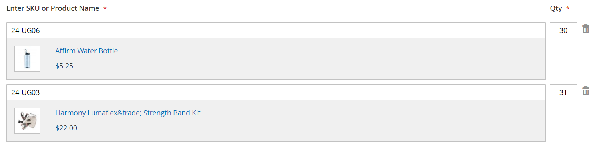

# Schnellbestellungen

Die _Schnellbestellung_-Funktion reduziert den Bestellvorgang auf mehrere Klicks für Kunden, die den Produktnamen oder die SKU der Produkte kennen, die sie bestellen möchten. Bestellungen mit mehreren SKUs können manuell eingegeben oder in das Schnellbestellungsformular importiert werden. Die Schnellbestellung kann von Kunden, die bei ihren Konten angemeldet sind, und von Gästen verwendet werden. Wenn diese Option aktiviert _, wird_ Link „Schnellbestellung“ oben auf der Seite neben dem Kundennamen angezeigt.

{width="700" zoomable="yes"}

## Aktivieren von Schnellbestellungen für Ihren Store

1. Navigieren Sie in _Admin_-Seitenleiste zu **[!UICONTROL Stores]** > _[!UICONTROL Settings]_>**[!UICONTROL Configuration]**.

1. Wählen Sie im Abschnitt _[!UICONTROL General]_&#x200B;im linken Bereich **[!UICONTROL B2B Features]**&#x200B;aus.

1. Legen Sie **[!UICONTROL Enable Quick Order]** auf `Yes` fest.

   {width="600" zoomable="yes"}

1. Klicken Sie auf **[!UICONTROL Save Config]**.

1. Wenn Sie dazu aufgefordert werden, klicken Sie [Cache-Verwaltung](../systems/cache-management.md) und aktualisieren Sie alle ungültigen Caches.

## Workflows für Schnellbestellungen

Kunden können Produkte für Schnellbestellungen mit einer der folgenden Methoden angeben.

### Methode 1: Einzelne Produkte eingeben

1. Der Kunde klickt auf den **[!UICONTROL Quick Order]**.

1. Wählt das Produkt nach SKU oder Produktname aus:

   Um eine **Schnellbestellung nach SKU** aufzugeben, führt der Kunde Folgendes aus:

   - Betritt die **[!UICONTROL SKU]**.

   - Klicks **[!UICONTROL Add to List]**.

     Die SKU wird in der Eingabezeile mit den Produktdetails unten angezeigt.

     {width="600" zoomable="yes"}

   Um eine **Schnellbestellung anhand des Produktnamens** aufzugeben, führt der Kunde Folgendes aus:

   - Gibt die ersten Zeichen des **[!UICONTROL Product Name]** ein.

     >[!NOTE]
     >
     >Verwenden Sie nicht die _Eingabetaste_, um den Namen des Produkts auszuwählen.

   - Wenn die Liste der möglichen Übereinstimmungen angezeigt wird, klickt der Kunde auf das Produkt, das er bestellen möchte.

     {width="700" zoomable="yes"}

1. Betritt die **[!UICONTROL Qty]**.

1. Wiederholt diesen Vorgang mit der nächsten Eingabezeile so oft wie nötig.

1. Klicks **[!UICONTROL Add to Cart]**.

### Methode 2: Mehrere Produkte eingeben

1. Im Feld **[!UICONTROL Enter Multiple SKUs]** führt der Kunde einen der folgenden Schritte aus:

   - Gibt eine SKU pro Zeile ein

   - Gibt alle SKUs in derselben Zeile ein, getrennt durch Kommas und ohne Leerzeichen.

     {width="600" zoomable="yes"}

1. Um die Produkte der Liste hinzuzufügen, klicken Sie auf **[!UICONTROL Add to List]**.

1. Gibt für jedes Element in der Liste den zu sortierenden **[!UICONTROL Qty]** an.

   {width="600" zoomable="yes"}

   >[!NOTE]
   >
   >Wenn das Produkt über die erforderlichen Optionen verfügt, wird der Kunde aufgefordert, die Optionen auszuwählen. Sie können warten, bis sie den Warenkorb erreichen, um Produktoptionen hinzuzufügen.

   {width="600" zoomable="yes"}

### Methode 3: Hochladen einer Liste von Produkten

1. Klicken Sie im Abschnitt _[!UICONTROL Add from File]_&#x200B;auf **[!UICONTROL Download Sample]**, um eine Bestellvorlage herunterzuladen.

   {width="600" zoomable="yes"}

1. Öffnet die heruntergeladene Datei.

1. Verwendet die Vorlage zum Hinzufügen der Produkt-SKUs, die für die Schnellbestellungsliste hochgeladen werden sollen.

1. Wenn Sie fertig sind, klicken Sie **[!UICONTROL Save]**.

   {width="400" zoomable="yes"}

1. Um die Datei hochzuladen, klicken Sie auf **[!UICONTROL Choose]** und wählen Sie die Datei aus ihrem System aus.

   Die Artikel werden der Schnellbestellungsliste hinzugefügt.

1. Wenn Sie bereit sind, klicken Sie auf **[!UICONTROL Add to Cart]**.

Nachdem der Kunde die Schnellbestellung erstellt hat, kann er wie gewohnt die Kasse durchlaufen.

{width="700" zoomable="yes"}
