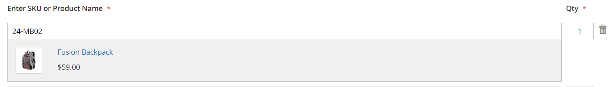

# Schnellbestellungen

Die Funktion _Quick Order_ reduziert den Bestellvorgang auf mehrere Klicks für Kunden, die den Produktnamen oder die SKU der Produkte kennen, die bestellt werden sollen. Bestellungen mit mehreren SKUs können manuell eingegeben oder in das Schnellbestellformular importiert werden. Schnellbestellungen können von Kunden, die bei ihren Konten angemeldet sind, und von Gästen verwendet werden. Wenn diese Option aktiviert ist, wird der Link _Quick Order_ oben auf der Seite neben dem Kundennamen angezeigt.

{width="700" zoomable="yes"}

## Schnellbestellungen für Ihren Store aktivieren

1. Wechseln Sie in der Seitenleiste _Admin_ zu **[!UICONTROL Stores]** > _[!UICONTROL Settings]_>**[!UICONTROL Configuration]**.

1. Wählen Sie im Abschnitt _[!UICONTROL General]_im linken Bereich die Option **[!UICONTROL B2B Features]**.

1. Setzen Sie **[!UICONTROL Enable Quick Order]** auf `Yes`.

   {width="600" zoomable="yes"}

1. Klicken Sie auf **[!UICONTROL Save Config]**.

1. Klicken Sie bei Aufforderung auf [Cache-Verwaltung](../systems/cache-management.md) und aktualisieren Sie alle ungültigen Caches.

## Arbeitsabläufe für Schnellbestellungen

Kunden können Produkte für schnelle Bestellungen mit einer der folgenden Methoden angeben.

### Methode 1: Einzelne Produkte eingeben

1. Der Kunde klickt auf den Link **[!UICONTROL Quick Order]** .

1. Auswahl des Produkts nach SKU oder Produktname:

   Um eine **schnelle Bestellung durch SKU** zu platzieren, führt der Kunde Folgendes aus:

   - Fügt den Wert **[!UICONTROL SKU]** ein.

   - Klicks **[!UICONTROL Add to List]**.

     Die SKU wird in der Eingabelinie mit den unten stehenden Produktdetails angezeigt.

     {width="600" zoomable="yes"}

   Um eine **schnelle Bestellung nach dem Produktnamen** zu platzieren, führt der Kunde Folgendes aus:

   - Fügt die ersten Zeichen von **[!UICONTROL Product Name]** ein.

     >[!NOTE]
     >
     >Verwenden Sie nicht den Schlüssel _Enter_ , um den Namen des Produkts auszuwählen.

   - Wenn die Liste möglicher Übereinstimmungen angezeigt wird, klickt der Kunde auf das Produkt, das er bestellen möchte.

     {width="700" zoomable="yes"}

1. Fügt den Wert **[!UICONTROL Qty]** ein.

1. Wiederholt diesen Vorgang mit der nächsten Eingabezeile so oft wie nötig.

1. Klicks **[!UICONTROL Add to Cart]**.

### Methode 2: Mehrere Produkte eingeben

1. Im Feld **[!UICONTROL Enter Multiple SKUs]** führt der Kunde einen der folgenden Schritte aus:

   - Fügt eine SKU pro Zeile ein

   - Fügt alle SKUs in derselben Zeile, durch Kommas getrennt, ohne Leerzeichen ein.

     {width="600" zoomable="yes"}

1. Um die Produkte zur Liste hinzuzufügen, klicken Sie auf **[!UICONTROL Add to List]**.

1. Fügt das **[!UICONTROL Qty]** ein, das für jedes Element in der Liste sortiert werden soll.

   {width="600" zoomable="yes"}

   >[!NOTE]
   >
   >Wenn das Produkt über die erforderlichen Optionen verfügt, wird der Kunde aufgefordert, die Optionen auszuwählen. Sie können warten, bis sie den Warenkorb erreichen, um Produktoptionen hinzuzufügen.

   {width="600" zoomable="yes"}

### Methode 3: Eine Produktliste hochladen

1. Klicken Sie im Abschnitt _[!UICONTROL Add from File]_auf **[!UICONTROL Download Sample]**, um eine Bestellvorlage herunterzuladen.

   {width="600" zoomable="yes"}

1. Öffnet die heruntergeladene Datei.

1. Verwendet die Vorlage, um die Produkt-SKUs hinzuzufügen, die für die Schnellbestellliste hochgeladen werden sollen.

1. Klicken Sie nach Abschluss des Vorgangs auf **[!UICONTROL Save]**.

   {width="400" zoomable="yes"}

1. Um die Datei hochzuladen, klicken Sie auf **[!UICONTROL Choose]** und wählen Sie die Datei aus ihrem System aus.

   Die Elemente werden der Liste &quot;Quick Order&quot;hinzugefügt.

1. Wenn fertig, klickt auf **[!UICONTROL Add to Cart]**.

Nachdem der Kunde die schnelle Bestellung erstellt hat, kann er wie gewohnt durch den Checkout fortfahren.

{width="700" zoomable="yes"}
