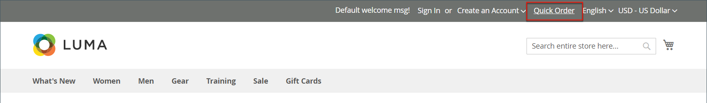

# Schnellbestellungen

Die _Schnellbestellung_ reduziert den Bestellvorgang auf mehrere Klicks für Kunden, die den Produktnamen oder die SKU der Produkte kennen, die sie bestellen möchten. Bestellungen mit mehreren SKUs können manuell eingegeben oder in das Schnellbestellformular importiert werden. Schnellbestellungen können von Kunden, die bei ihren Konten angemeldet sind, und von Gästen verwendet werden. Wenn diese Option aktiviert ist, wird die _Schnellbestellung_ -Link wird oben auf der Seite neben dem Kundennamen angezeigt.

{width="700" zoomable="yes"}

## Schnellbestellungen für Ihren Store aktivieren

1. Im _Admin_ Seitenleiste, navigieren Sie zu **[!UICONTROL Stores]** > _[!UICONTROL Settings]_>**[!UICONTROL Configuration]**.

1. Im _[!UICONTROL General]_im linken Bereich wählen Sie **[!UICONTROL B2B Features]**.

1. Satz **[!UICONTROL Enable Quick Order]** nach `Yes`.

   {width="600" zoomable="yes"}

1. Klicken **[!UICONTROL Save Config]**.

1. Klicken Sie bei Aufforderung auf [Cacheverwaltung](../systems/cache-management.md) und aktualisieren Sie alle ungültigen Caches.

## Arbeitsabläufe für Schnellbestellungen

Kunden können Produkte für schnelle Bestellungen mit einer der folgenden Methoden angeben.

### Methode 1: Einzelne Produkte eingeben

1. Der Kunde klickt auf **[!UICONTROL Quick Order]** -Link.

1. Auswahl des Produkts nach SKU oder Produktname:

   So platzieren Sie eine **Schnellbestellung nach SKU**, führt der Kunde Folgendes aus:

   - Fügt die **[!UICONTROL SKU]**.

   - Klicks **[!UICONTROL Add to List]**.

     Die SKU wird in der Eingabelinie mit den unten stehenden Produktdetails angezeigt.

     {width="600" zoomable="yes"}

   So platzieren Sie eine **Schnellbestellung nach Produktname**, führt der Kunde Folgendes aus:

   - Fügt die ersten Zeichen des **[!UICONTROL Product Name]**.

     >[!NOTE]
     >
     >Verwenden Sie nicht das _Eingabe_ -Taste, um den Namen des Produkts auszuwählen.

   - Wenn die Liste möglicher Übereinstimmungen angezeigt wird, klickt der Kunde auf das Produkt, das er bestellen möchte.

     {width="700" zoomable="yes"}

1. Fügt die **[!UICONTROL Qty]**.

1. Wiederholt diesen Vorgang mit der nächsten Eingabezeile so oft wie nötig.

1. Klicks **[!UICONTROL Add to Cart]**.

### Methode 2: Mehrere Produkte eingeben

1. Im **[!UICONTROL Enter Multiple SKUs]** , führt der Kunde einen der folgenden Schritte aus:

   - Fügt eine SKU pro Zeile ein

   - Fügt alle SKUs in derselben Zeile, durch Kommas getrennt, ohne Leerzeichen ein.

     {width="600" zoomable="yes"}

1. Um die Produkte der Liste hinzuzufügen, klicken Sie auf **[!UICONTROL Add to List]**.

1. Fügt die **[!UICONTROL Qty]** für jedes Element in der Liste zu sortieren.

   {width="600" zoomable="yes"}

   >[!NOTE]
   >
   >Wenn das Produkt über die erforderlichen Optionen verfügt, wird der Kunde aufgefordert, die Optionen auszuwählen. Sie können warten, bis sie den Warenkorb erreichen, um Produktoptionen hinzuzufügen.

   {width="600" zoomable="yes"}

### Methode 3: Eine Produktliste hochladen

1. Im _[!UICONTROL Add from File]_Abschnitt, klicken Sie auf **[!UICONTROL Download Sample]**um eine Bestellvorlage herunterzuladen.

   {width="600" zoomable="yes"}

1. Öffnet die heruntergeladene Datei.

1. Verwendet die Vorlage, um die Produkt-SKUs hinzuzufügen, die für die Schnellbestellliste hochgeladen werden sollen.

1. Klicken Sie nach Abschluss **[!UICONTROL Save]**.

   {width="400" zoomable="yes"}

1. Zum Hochladen der Datei klicken Sie auf **[!UICONTROL Choose]** und wählt die Datei aus ihrem System aus.

   Die Elemente werden der Liste &quot;Quick Order&quot;hinzugefügt.

1. Klicks **[!UICONTROL Add to Cart]**.

Nachdem der Kunde die schnelle Bestellung erstellt hat, kann er wie gewohnt durch den Checkout fortfahren.

{width="700" zoomable="yes"}
