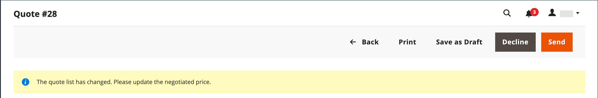

# Anführungszeichen verhandeln

Wenn in der Konfiguration [B2B-Anführungszeichen](configure-quotes.md) aktiviert ist, können Preisverhandlungen von einem autorisierten Käufer eines Unternehmens oder eines Vertriebsmitarbeiters eingeleitet werden.

Käufer initiieren die Preisverhandlungen, indem sie [ein Angebot ](quote-request.md) aus dem Warenkorb anfordern. Vertriebsmitarbeiter können Verhandlungen einleiten, indem sie [einen Entwurf für ein Angebot für einen Käufer erstellen](sales-rep-initiates-quote.md), das Angebot mit den ursprünglichen Bestellungsartikeln und Preisen aktualisieren und an den Käufer senden.

Wenn die Preisverhandlungen beginnen, werden Anführungszeichen im Raster [Anführungszeichen](quotes.md) aufgeführt. Sämtliche Verhandlungen zwischen Käufer und Verkäufer erfolgen per E-Mail und werden von der Detailansicht des Angebots aus initiiert und verfolgt.

Während des Verhandlungsprozesses kann der Verkäufer vom Administrator Folgendes tun:

- Produkte hinzufügen oder entfernen
- Menge ändern
- Anwenden eines Rabatts auf Zeileneinträge oder auf das gesamte Angebot
- Versandmethode hinzufügen oder ändern
- Kommentare hinzufügen
- Senden Sie das aktualisierte Angebot an den Käufer oder speichern Sie es als Entwurf

Käufer verwalten den Prozess der Preisverhandlungen über die Storefront mit [[!UICONTROL My Quotes]](account-dashboard-my-quotes.md). Während das Angebot zur Überprüfung geöffnet ist, wird sein Status im Konto des Käufers auf `Pending` gesetzt. Der Käufer kann das Angebot auch dann ändern und erneut einreichen, wenn es abgelehnt wurde oder abgelaufen ist.

## Schritt 1: Anforderung anzeigen

1. Wechseln Sie in der Admin-Seitenleiste zu **[!UICONTROL Sales]** > **[!UICONTROL Quotes]**.

   Die neue Anforderung wird im Raster _[!UICONTROL Quotes]_angezeigt.

1. Klicken Sie in der Spalte _Aktionen_ auf **[!UICONTROL View]**.

   {width="700" zoomable="yes"}

## Schritt 2: Anführungszeichen ändern

1. Klicken Sie unter _[!UICONTROL Quote & Account Information]_auf das Symbol_ Kalender _().

   {width="575" zoomable="yes"}

1. Wählen Sie eine **[!UICONTROL Expiration Date]** für das Anführungszeichen.

1. Scrollen Sie nach unten zum Abschnitt &quot;_[!UICONTROL Quote Totals]_&quot;und aktualisieren Sie den Abschnitt &quot;**[!UICONTROL Negotiated Price]**&quot; nach Bedarf.

   {width="600" zoomable="yes"}

   Ändert der Käufer die Menge der im Angebot enthaltenen Artikel, erscheint oben im Angebot ein Hinweis, der darauf hinweist, dass sich die Artikelliste geändert hat, und der ausgehandelte Preis muss aktualisiert werden.

   {width="600" zoomable="yes"}

### Hinzufügen neuer Produkte zum Angebot

1. Klicken Sie auf **[!UICONTROL Add Products by SKU]**.

1. Geben Sie die hinzuzufügenden **[!UICONTROL SKU]** und **[!UICONTROL Qty]** ein.

   {width="600" zoomable="yes"}

### Anwenden von Zeilenelementaktualisierungen

Wenden Sie bei Bedarf Zeilenelementänderungen im Abschnitt _[!UICONTROL Items Quoted]_an.

{width="600" zoomable="yes"}

- Ändern Sie die **[!UICONTROL Quantity]**, die zum vorgeschlagenen Preis erworben werden müssen.

- Wählen Sie **[!UICONTROL Configure]** aus und ändern Sie die Produktoptionen.

  Die Option [!UICONTROL Configure] ist nur für ein Zeilenelement für ein konfigurierbares Produkt verfügbar

- Wählen Sie im Menü **[!UICONTROL Action]** eine Aktion aus, um das Element zu aktualisieren:
   - **Rabattartikel**: Wenden Sie einen Rabatt als Prozentsatz, Festbetrag oder bevorzugte Preisgestaltung an.
Optional können Sie den Rabattbetrag sperren, um weitere Rabatte zu vermeiden. Wenn der Rabatt nicht gesperrt ist,
sowohl der Rabatt für Zeileneinträge als auch jeglicher Rabatt auf Anführungszeichen werden auf den Produktpreis angewendet.
   - **Hinterlassen Sie eine Notiz dem Käufer**, um dem Käufer zusätzliche Informationen über einen Artikel bereitzustellen.
   - **Entfernen** , um ein Element aus dem Anführungszeichen zu entfernen.

### Anwenden von Änderungen und Aktualisieren

- Um Änderungen anzuwenden, klicken Sie auf **[!UICONTROL Add to Quote]**.

- Um das Anführungszeichen zu aktualisieren, klicken Sie auf **[!UICONTROL Recalculate the Quote]**.

- Um die Änderungen anzuwenden und das Angebot auf den freigegebenen Katalog und die Preisregeln zu aktualisieren, klicken Sie auf **[!UICONTROL Update Prices]** und dann auf **[!UICONTROL Proceed]** , um die Aktualisierung zu bestätigen.

  {width="600" zoomable="yes"}

### Versandinformationen aktualisieren

1. Wenn der Käufer im Anführungszeichen eine Adresse vom Typ _Versand an_ enthält, klicken Sie auf **[!UICONTROL Get shipping methods and rates]**.

1. Wählen Sie aus den verfügbaren Optionen eine Versandmethode aus.

1. Geben Sie einen **[!UICONTROL Proposed Shipping Price]** ein.

   Die _[!UICONTROL Quote Totals]_werden aktualisiert, um den vorgeschlagenen Versandpreis widerzuspiegeln.

### Dokument anhängen

1. Klicken Sie unter dem Feld _Kommentar hinzufügen_ auf **[!UICONTROL Attach file]**.

   Standardmäßig können [angehängte Dateien](../configuration-reference/sales/quotes.md) in einem der folgenden Dateiformate bis zu 2 MB groß sein: DOC, DOCX, XLS, XLSX, PDF, TXT, JPG oder JPEG, PNG.

1. Wählen Sie die Datei aus Ihrem Verzeichnis aus.

## Schritt 3: Aktualisierung der Informationen auf Anführungszeichenebene und Versand der Antwort

1. Geben Sie im Abschnitt _[!UICONTROL Negotiation]_auf der Registerkarte_[!UICONTROL Comments]_ Ihre Antwort im Abschnitt **[!UICONTROL Add your comment]** ein.

1. Um ein unterstützendes Dokument einzuschließen, klicken Sie auf **[!UICONTROL Attach file]** und wählen Sie die Datei aus Ihrem Verzeichnis aus.

   Die maximal zulässige Dateigröße für Anhänge beträgt 2 MB.

1. So wenden Sie einen Rabatt auf das Angebot an:

   - Wählen Sie unter _[!UICONTROL Quote Totals]_im Abschnitt_[!UICONTROL Negotiated Price]_ einen der folgenden Rabatttypen aus:

      - `Percentage Discount`: Ein prozentualer Rabatt reduziert den ursprünglichen Preis um einen bestimmten Prozentsatz.
      - `Amount Discount`: Ein Rabatt für einen Betrag bewirkt eine pauschale Preissenkung.
      - `Proposed Price`: Ein vorgeschlagener Preisnachlass setzt den Endpreis unabhängig vom ursprünglichen Preis auf einen bestimmten Betrag.

   - Geben Sie den Betrag in Prozent oder als Pauschalpreis an.

     {width="600" zoomable="yes"}

   - Sie können Rabatte auf jeden Zeileneintrag oder das gesamte Angebot anwenden:

      - **Zeileneintrag-Rabatte**: Zeileneintrag-Rabatte werden auf einzelne Artikel im Warenkorb angewendet. Der Rabatt kann ein `percentage`, ein bestimmter `amount` oder ein `proposed price` sein.
      - **Rabatte auf Warenkorbebene**: Rabatte auf Warenkorbebene werden auf den gesamten Warenkorb angewendet. Der Rabatt kann entweder ein `percentage` oder ein bestimmter `amount` sein und wird auf den Gesamtwert des Warenkorbs angewendet.
      - **Kombination von Warenkorb- und Zeileneintrag-Rabatten**: In einigen Fällen können Rabatte sowohl auf Warenkorb- als auch auf Zeileneinträgen angewendet werden. Der Zeileneintrag Rabatt wird zuerst angewendet, gefolgt vom Rabatt auf Warenkorbebene auf die verbleibende Gesamtsumme.

1. Anführungszeichen senden oder speichern:

   - Wenn das Angebot zum Zurücksenden an den Käufer bereit ist, klicken Sie auf **[!UICONTROL Send]**.

   - Um die Arbeit an dem Zitat später fortzusetzen, klicken Sie auf **[!UICONTROL Save as Draft]**.

>[!NOTE]
>
> Während der Preisverhandlungen können Rabatte gesperrt werden, um weitere Änderungen zu verhindern. Sobald ein Anführungszeichen gesperrt ist, können weder der Rabatttyp noch der Betrag geändert werden, ohne das Anführungszeichen zuerst zu entsperren. Durch diese Sperrmethode wird sichergestellt, dass die vereinbarten Bedingungen zwischen dem Verkäufer und dem Käufer erhalten bleiben.

## Schritt 4: Anleitung zu einem Zitat

Wenn Sie ein Angebot senden, informiert das System sowohl den Käufer als auch den Vertriebsmitarbeiter, der das Firmenkonto verwaltet. Die E-Mail enthält einen Link zum Angebot auf dem Konto des Käufers und das Ablaufdatum des Angebots. Der Käufer kann zu jedem Zeitpunkt der Verhandlungen Folgendes tun:

- Nehmen Sie das ausgehandelte Angebot an und schließen Sie den Kauf ab.
- Senden Sie eine Antwort mit einem Zählerangebot und setzen Sie die Verhandlungen fort.
- Beenden Sie die Verhandlungen.

Um seine Position im Workflow zu überwachen, überprüfen Sie Ihre E-Mail und den Status des Zitats im Raster. Sie können den Verhandlungsprozess so lange wie nötig fortsetzen.

## Schaltflächenleiste

| Schaltfläche | Beschreibung |
|----------------------------|---------------------------------------------------------------------------------------------------------------------------------------------------------------------------------------------------------------------------------------------------------------------------------------------------------------------------------------------------------------|
| [!UICONTROL Back] | Kehrt zur Seite _[!UICONTROL Quotes]_zurück, ohne die Änderungen zu speichern. |
| [!UICONTROL Print] | Sendet das Anführungszeichen an einen Drucker oder speichert es als PDF-Datei. |
| [!UICONTROL Create Copy] | Erstellt eine Kopie des aktuellen Anführungszeichens und öffnet diese mit dem Zusatz &quot;`(copy)`&quot;, der an den ursprünglichen Namen angehängt ist. Benennen Sie das neue Anführungszeichen um, indem Sie das Feld [!UICONTROL Name] bearbeiten. Verarbeiten Sie das neue Angebot, indem Sie es als Entwurf speichern oder an den Kunden senden. |
| Vorlage erstellen | Erstellen Sie eine auf dem aktuellen Angebot basierende Angebotsvorlage. Zitatvorlagen optimieren die Preisverhandlungen, indem sie es Käufern und Verkäufern ermöglichen, sich auf Verträge und Preisbedingungen zu einigen, die auf mehrere Anführungszeichen angewendet werden können. . Auf Vereinbarung kann der Käufer ein vorab genehmigtes verknüpftes Angebot aus der Vorlage für nachfolgende Bestellungen generieren, anstatt den Prozess der Angebotsanforderung (RFQ) neu zu starten. |
| [!UICONTROL Save as Draft] | Speichern Sie alle Änderungen, die an dem Angebot vorgenommen wurden, senden Sie es jedoch nicht an den Käufer zurück. |
| [!UICONTROL Decline] | Der Vorschlag, die Preise zu verhandeln, wird entweder im Rahmen der ersten Untersuchung oder während der laufenden Verhandlungen abgelehnt. Wenn ein Angebot abgelehnt wird, sollte der Verkäufer einen Kommentar hinzufügen, um die Entscheidung zu erläutern. Wenn ein Angebot abgelehnt wird, werden alle ausgehandelten Preise auf die ursprünglichen Werte zurückgesetzt. Diese Schaltfläche ist deaktiviert, während der Verkäufer auf eine Antwort vom Käufer wartet. |
| [!UICONTROL Send] | Übermittelt das aktualisierte Angebot als Antwort auf die Anfrage des Käufers. Diese Schaltfläche ist deaktiviert, wenn der Verkäufer auf eine Antwort des Käufers wartet. |

{style="table-layout:auto"}

## Feldbeschreibungen

Informationen und Funktionen des Administrators sind in die folgenden Abschnitte unterteilt:

### [!UICONTROL Quote & Account Information]

| Feld | Beschreibung |
|-------------------------------------------------|------------------------------------------------------------------------------------------------------------------------------------------------------------------------------------------------------------------------------------------------------------------------------------------------------------------------------------------------------------------------------------------------------------------------------------------------------------------------------------------------------------------------------------------------------------------------------------------------------------------------------------------------------------------------------------------------------------------------------------------------------------------------------------------------------------------------------------------------------------------------------------------------------------------------------------------------------------------------------------------------------------------------------------------------------------------------------------------------------------|
| [!UICONTROL Name] | Der Name, der einer Anführungsanforderung vom [Käufer](account-company-roles-permissions.md) zugewiesen wurde. |
| [!UICONTROL Status] | Gibt den aktuellen Status des Zitats an. Der Status eines Angebots kann nur durch Handlung des Käufers oder Verkäufers geändert werden. Siehe auch die [Statuseinstellungen](quotes.md) vom Admin und dem Konto [des Käufers](account-dashboard-my-quotes.md). |
| [!UICONTROL Created] | Datum und Uhrzeit der ersten Einreichung des Angebotsantrags durch den Käufer. |
| [!UICONTROL Created By] | Der Vor- und Nachname des Firmenkäufers, der die Angebotsanforderung eingereicht hat. |
| [!UICONTROL Expiration Date] | Gibt den letzten Tag an, an dem das aktuelle Anführungszeichen gültig ist. Das standardmäßige Ablaufdatum wird in der Konfiguration auf 30 Tage festgelegt, nachdem ein Käufer eine Angebotsanforderung sendet.   Der Verkäufer kann das standardmäßige Ablaufdatum überschreiben, indem er ein anderes Datum (MMM DD YYY ) eingibt oder das Datum aus dem Kalender auswählt. Das Anführungszeichen läuft nie ab, wenn das Feld leer gelassen wird.   Bei offenen Anführungszeichen erhält der Verkäufer eine [E-Mail-Benachrichtigung](../systems/email-templates.md) 48 Stunden, bevor das Angebot abläuft. Käufer werden 24 Stunden vor Ablauf benachrichtigt.   Der Status des Angebots ändert sich in _Abgelaufen_ und der Käufer kann keine weiteren Änderungen am Angebot vornehmen. Die im Angebot vorgeschlagenen Preise kehren zu den ursprünglichen Werten aus dem Katalog zurück.   Wenn ein Anführungszeichen zum Überprüfen durch den Verkäufer geöffnet ist, wenn das Anführungszeichen abläuft, wird das Ablaufdatum entsprechend dem in der Konfiguration festgelegten Bereich zurückgesetzt.   Das Ablaufdatum ist das einzige Feld im Abschnitt _Anführungszeichen und Konto_ , das während des Überprüfungsprozesses bearbeitet werden kann. |
| [!UICONTROL Company] | Der rechtliche Name des [Unternehmens](account-companies.md), den der Käufer darstellt. |
| [!UICONTROL Company Admin Email] | Die E-Mail-Adresse des [Unternehmensadministrators](account-company-admin.md). |
| [!UICONTROL Sales Rep] | Der [Vertriebsmitarbeiter](account-company-manage.md), der für den Verkäufer arbeitet und der dem Unternehmenskonto zugewiesene Hauptkontakt ist. |
| [!UICONTROL Shared Catalog (or Customer Group)] | Der [freigegebene Katalog](catalog-shared.md) oder die [Kundengruppe](account-company-customer-group.md), der das Unternehmen zugewiesen ist. Das Angebot kann benutzerdefinierte Preise aus dem freigegebenen Katalog enthalten, der dem Unternehmen zugewiesen ist. |

{style="table-layout:auto"}

### [!UICONTROL Add to Quote by SKU]

| Feld | Beschreibung |
|---------------------------|-----------------------------------------------------------|
| [!UICONTROL Enter SKU] | Die SKU des Produkts, das zum Angebot hinzugefügt werden soll. |
| [!UICONTROL Qty] | Die Anzahl der Artikel dieser SKU, die dem Anführungszeichen hinzugefügt werden sollen. |
| [!UICONTROL Add to Quote] | Fügt die Menge des angegebenen Produkts zum Angebot hinzu. |

{style="table-layout:auto"}

### [!UICONTROL Items Quoted]

| Feld | Beschreibung |
|-----------------------------------------|---------------------------------------------------------------------------------------------------------------------------------------------------------------------------------------------------------------------------|
| [!UICONTROL Name & SKU] | Die verknüpfte Produktname und Bestandseinheit (SKU). |
| [!UICONTROL Stock] | Die Anzahl der Produkte unter dieser SKU, die derzeit zum Verkauf angeboten werden. |
| [!UICONTROL Cost] | Der Betrag, den der Verkäufer zum Kauf des Produkts gezahlt hat. |
| [!UICONTROL Catalog Price] | Der Preis des Produkts im Katalog des Käufers, basierend auf der Kundengruppe oder dem freigegebenen Katalog, der dem Unternehmen des Käufers zugewiesen ist. |
| [!UICONTROL Cart Price] | Der ursprüngliche Preis des Artikels im Warenkorb abzüglich der angewendeten Rabatte aus dem Warenkorb. Der Warenkorbpreis kann vom Katalogpreis abweichen, wenn für die Kundengruppe des Käufers Rabatte oder Warenkorbregeln gelten. |
| [!UICONTROL Discount] | Der auf das Element angewendete Rabatt für das Zeilenelement. Der Wert kann ein Prozentsatz, ein fester Betrag oder ein vorgeschlagener Preis sein. |
| [!UICONTROL Qty] | Die Anzahl der Einheiten in dieser SKU, die die Grundlage für den angegebenen Preis bildet. Nur positive Zahlen, die größer als null sind, können eingegeben werden. Wenn Sie die Menge auf null ändern möchten, löschen Sie den Zeileneintrag aus dem Anführungszeichen. |
| [!UICONTROL Subtotal] | Der vorgeschlagene Preis multipliziert mit der Menge der bestellten Artikel. |
| [!UICONTROL Estimated Tax] | Der Steuerbetrag, der für diesen Zeileneintrag entsprechend der Konfiguration geschätzt wird. Abhängig von den Einstellungen für die Steuerberechnung kann die geschätzte Steuer auf einer der folgenden Arten basieren: Stückpreis/Zeilensumme/Gesamtsumme |
| [!UICONTROL Subtotal (Incl./Excl. Tax)] | Abhängig von der Konfiguration kann diese Spalte die Zwischensumme mit oder ohne geschätzte Steuern anzeigen. |
| [!UICONTROL Action] | Auswahlmenü mit Vorgängen, die auf ein Zeilenelement angewendet werden können:<ul><li>**[!UICONTROL Discount item]**</li><li>**[!UICONTROL Leave a note to Buyer]**</li><li>**[!UICONTROL Remove an item from the quote]**</li></ul>. |
| [!UICONTROL Configure] | Ermöglicht die Änderung der Produktoptionen für ein konfigurierbares Produkt. |
| [!UICONTROL Update Prices] | Aktualisiert das Angebot mit den neuesten Änderungen aus dem freigegebenen Katalog und den Preisregeln. |
| [!UICONTROL Recalculate Quote] | Berechnet alle Kurse, Warenkorbpreisregeln und Steuern neu, um Kursänderungen zu berücksichtigen. |

{style="table-layout:auto"}

### [!UICONTROL Shipping Information]

| Feld | Beschreibung |
|--------------------------------------|------------------------------------------------------------------------------------------------------------------------------------------------------------------------------|
| [!UICONTROL Shipping Address] | Zeigt die Lieferadresse an, die im Konto des Käufers angegeben ist. Die Lieferadresse ist leer, wenn der Käufer vor der Antragstellung keine Anschrift angegeben hat. |
| [!UICONTROL Shipping Method & Price] | Der Link Versandmethoden und -raten abrufen wird angezeigt, wenn der Käufer im Angebot eine Adresse vom Typ _Versand an_ enthält. |

{style="table-layout:auto"}

### [!UICONTROL Negotiation]

| Feld | Beschreibung |
|--------------------------|----------------------------------------------------------------------------------------------------------------------------------------------------------------------------------------------------------------------------------------------------------------------------------------------------------------------------------------------------------------------------------------------------------------------------------------------------------------------------------------------------------------------------------------------------------------------------------------------------------------------------------------------------------|
| [!UICONTROL Comments] | Der Tab Kommentare im Abschnitt Verhandlungen wird verwendet, um dem Käufer eine Nachricht über das Angebot zu geben.  **[!UICONTROL Add your comment]**- Die Kommentare werden verwendet, um während des Verhandlungsprozesses mit dem Käufer zu kommunizieren. Verwenden Sie die Kommentare, um die im Angebot angebotenen Rabatte zu erläutern oder den Grund, aus dem eine Angebotsanforderung abgelehnt wird. **[!UICONTROL Attach file]** - Die maximale Dateigröße und die unterstützten Dateitypen für [angehängte Dateien](configure-quotes.md) werden durch die Konfiguration bestimmt. Standardmäßig kann eine angehängte Datei bis zu 2 MB und eines der folgenden Dateitypen aufweisen: DOC, DOCX, XLS, XLSX, PDF, TXT, JPG oder JPEG, PNG. |
| [!UICONTROL History Log] | Auf dieser Registerkarte wird ein vollständiger Verlauf des Zitats mit Daten, Anführungszeichenstatus und Kommentaren angezeigt. |

{style="table-layout:auto"}

### [!UICONTROL Quote Totals]

| Feld | Beschreibung |
|-----------------------------------------------------|-----------------------------------------------------------------------------------------------------------------------------------------------------------------------------------------------------------------------------------------------------------------------------------------------------------------------------------------------------------------------------------------------------------------------------------------------------------------------------------------------------------------------------------------------------------------------------------------------------------------------------------------------------------------------|
| [!UICONTROL Total Cost] | Die Gesamtkosten der im Angebot enthaltenen Artikel für den Verkäufer. |
| [!UICONTROL Catalog Total Price  (Incl./Excl. Tax)] | Der Gesamtpreis der Artikel in der Offerte ohne Steuern, entsprechend den Preisen im freigegebenen Katalog oder Primärkatalog, der als Grundlage des Angebots verwendet wird. Erweitern Sie den Abschnitt, um die Werte anzuzeigen, die in der Berechnung verwendet werden, abhängig von der Einstellung [Zwischensumme anzeigen](../configuration-reference/sales/tax.md) in der Konfiguration. Optionen:  **[!UICONTROL Subtotal (Excl. Tax)]**- Der Gesamtpreis des Katalogs ohne geschätzte Steuer. **[!UICONTROL Subtotal (Incl. Tax)]** - Der Gesamtpreis des Katalogs ohne geschätzte Steuer.  **[!UICONTROL Estimated Tax]**- Der Betrag der Steuer, der schätzungsweise auf den Gesamtpreis des Katalogs angewendet wird. |
| Verhandlungspreis | Der Rabatt, der dem Käufer angeboten wird, kann auf einer der folgenden Faktoren basieren:  **[!UICONTROL Percentage Discount]**- Der Rabatt in Prozent. **[!UICONTROL Amount Discount]** - Der Rabatt als fester Betrag.  **[!UICONTROL Proposed Price]**- Der vom Verkäufer vorgeschlagene Preis.
Wenn alle Elemente im Anführungszeichen einen Rabatt für gesperrte Elemente aufweisen, wird der Abschnitt &quot;[!UICONTROL Negotiated Price]&quot;deaktiviert, da kein weiterer Rabatt angewendet werden kann.

Wenn für ein Produkt ein Zeileneintrag-Rabatt gilt, der nicht gesperrt ist, werden sowohl der Zeileneintrag als auch der Rabatt auf Anführungszeichen auf den Produktpreis angewendet.
 |
| [!UICONTROL Quote Subtotal (Incl./Excl. Tax)] | Der gesamte vorgeschlagene Preis für jeden Zeileneintrag im Anführungszeichen, mit oder ohne Steuern, je nach den Einstellungen für die [Steuerberechnung](../configuration-reference/sales/tax.md) in der Konfiguration. |
| [!UICONTROL Shipping & Handling] | Der vom Verkäufer im Feld &quot;Vorgeschlagener Versandpreis&quot;im Abschnitt &quot;Versandinformationen&quot;des Angebots angegebene Betrag. Wenn dieses Feld leer ist, basiert der Betrag auf der ausgewählten Versandmethode. |
| [!UICONTROL Estimated Tax] | Der Betrag der Steuer, die schätzungsweise fällig ist, wie in den Anzeigeeinstellungen [1} der Konfiguration angegeben.](../configuration-reference/sales/tax.md) |
| [!UICONTROL Quote Grand Total (Incl. Tax)] | Die endgültige Gesamtsumme am Ende des Kurses, die den ausgehandelten Preis, die geschätzte Steuer sowie die vorgeschlagene Versand- und Bearbeitungszeit umfasst. |

{style="table-layout:auto"}
