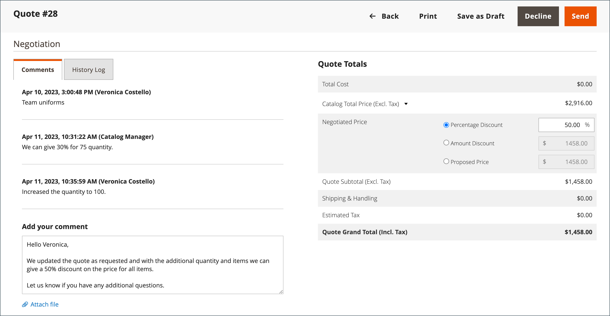

# Anführungszeichen verhandeln

Wenn [B2B-Angebote sind aktiviert](configure-quotes.md) in der Konfiguration können Preisverhandlungen von einem autorisierten Käufer eines Unternehmens oder eines Vertriebsmitarbeiters eingeleitet werden.

Käufer starten Preisverhandlungen durch [Anfordern eines Kurses](quote-request.md) aus dem Warenkorb. Vertriebsmitarbeiter können Verhandlungen einleiten durch [Erstellung eines Angebotsentwurfs für einen Käufer](sales-rep-initiates-quote.md), indem sie das Angebot mit den ursprünglichen Bestellungsartikeln und den Preisen aktualisieren und an den Käufer senden.

Wenn die Preisverhandlungen beginnen, werden Anführungszeichen im [Anführungszeichen](quotes.md) Gitter. Sämtliche Verhandlungen zwischen Käufer und Verkäufer erfolgen per E-Mail und werden von der Detailansicht des Angebots aus initiiert und verfolgt.

Während des Verhandlungsprozesses kann der Verkäufer vom Administrator Folgendes tun:

- Produkte hinzufügen oder entfernen
- Menge ändern
- Anwenden eines Rabatts auf Zeileneinträge oder den Gesamtpreis
- Versandmethode hinzufügen oder ändern
- Kommentare hinzufügen
- Senden Sie das aktualisierte Angebot an den Käufer oder speichern Sie es als Entwurf

Die Käufer verwalten den Prozess der Preisverhandlungen von der Storefront aus mithilfe von [[!UICONTROL My Quotes]](account-dashboard-my-quotes.md). Während das Angebot zur Überprüfung offen ist, wird sein Status auf dem Konto des Käufers auf `Pending`. Der Käufer kann das Angebot auch dann ändern und erneut einreichen, wenn es abgelehnt wurde oder abgelaufen ist.

## Schritt 1: Anforderung anzeigen

1. Navigieren Sie in der Admin-Seitenleiste zu **[!UICONTROL Sales]** > **[!UICONTROL Quotes]**.

   Die neue Anforderung wird im _[!UICONTROL Quotes]_Gitter.

1. Im _Aktionen_ Spalte, klicken **[!UICONTROL View]**.

   {width="700" zoomable="yes"}

## Schritt 2: Anführungszeichen ändern

1. under _[!UICONTROL Quote & Account Information]_, klicken Sie auf die_ Kalender _().

   {width="575" zoomable="yes"}

1. Wählen Sie eine **[!UICONTROL Expiration Date]** für das Anführungszeichen.

1. Scrollen Sie nach unten zum _[!UICONTROL Quote Totals]_und aktualisieren Sie die **[!UICONTROL Negotiated Price]**nach Bedarf.

   {width="600" zoomable="yes"}

   Ändert der Käufer die Menge der im Angebot enthaltenen Artikel, erscheint oben im Angebot ein Hinweis, der darauf hinweist, dass sich die Artikelliste geändert hat, und der ausgehandelte Preis muss aktualisiert werden.

   {width="600" zoomable="yes"}

### Hinzufügen neuer Produkte zum Angebot

1. Klicken **[!UICONTROL Add Products by SKU]**.

1. Geben Sie die **[!UICONTROL SKU]** und **[!UICONTROL Qty]** hinzugefügt werden.

   {width="600" zoomable="yes"}

### Anwenden von Zeilenelementaktualisierungen

Anwenden von Zeilenelementänderungen in _[!UICONTROL Items Quoted]_bei Bedarf.

{width="600" zoomable="yes"}

- Ändern Sie die **[!UICONTROL Quantity]** die zum vorgeschlagenen Preis erworben werden müssen.

- Auswählen **[!UICONTROL Configure]** und ändern Sie die Produktoptionen.

  Die [!UICONTROL Configure] ist nur für einen Zeileneintrag für ein konfigurierbares Produkt verfügbar

- Im **[!UICONTROL Action]** wählen Sie eine Aktion aus, um das Element zu aktualisieren:
   - **Rabattelement** , um einen Rabatt als Prozentsatz, Festbetrag oder bevorzugter Preis anzuwenden.
Optional können Sie den Rabattbetrag sperren, um weitere Rabatte zu vermeiden. Wenn der Rabatt nicht gesperrt ist, werden sowohl der Rabatt für Zeileneinträge als auch ein Rabatt für Anführungszeichen auf den Produktpreis angewendet.
   - **Dem Käufer eine Notiz hinterlassen** dem Käufer zusätzliche Informationen über einen Gegenstand zu übermitteln
   - **Entfernen** , um ein Element aus dem Anführungszeichen zu entfernen.

### Anwenden von Änderungen und Aktualisieren

- Um Änderungen anzuwenden, klicken Sie auf **[!UICONTROL Add to Quote]**.

- Um das Angebot zu aktualisieren, klicken Sie auf **[!UICONTROL Recalculate the Quote]**.

- Um die Änderungen anzuwenden und das Angebot auf den freigegebenen Katalog und die Preisregeln zu aktualisieren, klicken Sie auf **[!UICONTROL Update Prices]** und klicken Sie anschließend auf **[!UICONTROL Proceed]** um die Aktualisierung zu bestätigen.

  {width="600" zoomable="yes"}

### Versandinformationen aktualisieren

1. Wenn der Käufer eine _Versand an_ Adresse im Angebot, klicken Sie auf **[!UICONTROL Get shipping methods and rates]**.

1. Wählen Sie aus den verfügbaren Optionen eine Versandmethode aus.

1. Geben Sie einen **[!UICONTROL Proposed Shipping Price]**.

   Die _[!UICONTROL Quote Totals]_aktualisiert werden, um den vorgeschlagenen Versandpreis widerzuspiegeln.

### Dokument anhängen

1. Unter dem _Kommentar hinzufügen_ Feld, klicken Sie auf **[!UICONTROL Attach file]**.

   Standardmäßig ist [angehängte Dateien](../configuration-reference/sales/quotes.md) kann bis zu 2 MB in einem der folgenden Dateiformate betragen: DOC, DOCX, XLS, XLSX, PDF, TXT, JPG oder JPEG, PNG.

1. Wählen Sie die Datei aus Ihrem Verzeichnis aus.

## Schritt 3: Aktualisierung der Informationen auf Anführungszeichenebene und Versand der Antwort

1. Im _[!UICONTROL Negotiation]_im Abschnitt_[!UICONTROL Comments]_ im Tab geben Sie Ihre Antwort im **[!UICONTROL Add your comment]** Abschnitt.

1. Um ein unterstützendes Dokument einzufügen, klicken Sie auf **[!UICONTROL Attach file]** und wählen Sie die Datei aus Ihrem Verzeichnis aus.

   Die maximal zulässige Dateigröße für Anhänge beträgt 2 MB.

1. So wenden Sie einen Rabatt auf das gesamte Angebot an:

   - under _[!UICONTROL Quote Totals]_im_[!UICONTROL Negotiated Price]_ wählen Sie einen der folgenden Rabatttypen aus:

      - `Percentage Discount`
      - `Amount Discount`
      - `Proposed Price`

   - Geben Sie den Betrag in Prozent oder als Pauschalpreis an.

     {width="600" zoomable="yes"}

1. Anführungszeichen senden oder speichern:

   - Wenn das Angebot wieder an den Käufer gesendet werden kann, klicken Sie auf **[!UICONTROL Send]**.

   - Um die Arbeit an dem Angebot später fortzusetzen, klicken Sie auf **[!UICONTROL Save as Draft]**.

## Schritt 4: Anleitung zu einem Zitat

Wenn Sie ein Angebot senden, informiert das System sowohl den Käufer als auch den Vertriebsmitarbeiter, der das Firmenkonto verwaltet. Die E-Mail enthält einen Link zum Angebot auf dem Konto des Käufers und das Ablaufdatum des Angebots. Der Käufer kann zu jedem Zeitpunkt der Verhandlungen Folgendes tun:

- Nehmen Sie das ausgehandelte Angebot an und schließen Sie den Kauf ab.
- Senden Sie eine Antwort mit einem Zählerangebot und setzen Sie die Verhandlungen fort.
- Beenden Sie die Verhandlungen.

Um seine Position im Workflow zu überwachen, überprüfen Sie Ihre E-Mail und den Status des Zitats im Raster. Sie können den Verhandlungsprozess so lange wie nötig fortsetzen.

## Schaltflächenleiste

| Schaltfläche | Beschreibung |
|----------------------------|---------------------------------------------------------------------------------------------------------------------------------------------------------------------------------------------------------------------------------------------------------------------------------------------------------------------------------------------------------------|
| [!UICONTROL Back] | Gibt Folgendes zurück _[!UICONTROL Quotes]_Seite ohne Speichern von Änderungen. |
| [!UICONTROL Print] | Sendet das Anführungszeichen an einen Drucker oder speichert es als PDF-Datei. |
| [!UICONTROL Create Copy] | [!BADGE 1.5.0-Beta-Funktionen]{type=Informative url="/help/b2b/release-notes.md" tooltip="Nur für Beta-Programmteilnehmer verfügbar"}`(copy)` an den ursprünglichen Namen angehängt. Benennen Sie das neue Anführungszeichen um, indem Sie die [!UICONTROL Name] -Feld. Verarbeiten Sie das neue Angebot, indem Sie es als Entwurf speichern oder an den Kunden senden. |
| [!UICONTROL Save as Draft] | Speichern Sie alle Änderungen, die an dem Angebot vorgenommen wurden, senden Sie es jedoch nicht an den Käufer zurück. |
| [!UICONTROL Decline] | Der Vorschlag, die Preise zu verhandeln, wird entweder im Rahmen der ersten Untersuchung oder während der laufenden Verhandlungen abgelehnt. Wenn ein Angebot abgelehnt wird, sollte der Verkäufer einen Kommentar hinzufügen, um die Entscheidung zu erläutern. Wenn ein Angebot abgelehnt wird, werden alle ausgehandelten Preise auf die ursprünglichen Werte zurückgesetzt. Diese Schaltfläche ist deaktiviert, während der Verkäufer auf eine Antwort vom Käufer wartet. |
| [!UICONTROL Send] | Übermittelt das aktualisierte Angebot als Antwort auf die Anfrage des Käufers. Diese Schaltfläche ist deaktiviert, wenn der Verkäufer auf eine Antwort des Käufers wartet. |

{style="table-layout:auto"}

## Feldbeschreibungen

Informationen und Funktionen des Administrators sind in die folgenden Abschnitte unterteilt:

### [!UICONTROL Quote & Account Information]

| Feld | Beschreibung |
|-------------------------------------------------|------------------------------------------------------------------------------------------------------------------------------------------------------------------------------------------------------------------------------------------------------------------------------------------------------------------------------------------------------------------------------------------------------------------------------------------------------------------------------------------------------------------------------------------------------------------------------------------------------------------------------------------------------------------------------------------------------------------------------------------------------------------------------------------------------------------------------------------------------------------------------------------------------------------------------------------------------------------------------------------------------------------------------------------------------------------------------------------------------------|
| [!UICONTROL Name] | Der Name, der einer Anführungsanforderung von der [Käufer](account-company-roles-permissions.md). |
| [!UICONTROL Status] | Gibt den aktuellen Status des Zitats an. Der Status eines Angebots kann nur durch Handlung des Käufers oder Verkäufers geändert werden. Siehe auch [Statuseinstellungen](quotes.md) aus dem Admin und dem [Konto des Käufers](account-dashboard-my-quotes.md). |
| [!UICONTROL Created] | Datum und Uhrzeit der ersten Einreichung des Angebotsantrags durch den Käufer. |
| [!UICONTROL Created By] | Der Vor- und Nachname des Firmenkäufers, der die Angebotsanforderung eingereicht hat. |
| [!UICONTROL Expiration Date] | Gibt den letzten Tag an, an dem das aktuelle Anführungszeichen gültig ist. Das standardmäßige Ablaufdatum wird in der Konfiguration auf 30 Tage festgelegt, nachdem ein Käufer eine Angebotsanforderung sendet.   Der Verkäufer kann das standardmäßige Ablaufdatum überschreiben, indem er ein anderes Datum (MMM DD YYY ) eingibt oder das Datum aus dem Kalender auswählt. Das Anführungszeichen läuft nie ab, wenn das Feld leer gelassen wird.   Bei offenen Anführungszeichen erhält der Verkäufer eine [E-Mail-Benachrichtigung](../systems/email-templates.md) 48 Stunden vor Ablauf des Anführungszeichens. Käufer werden 24 Stunden vor Ablauf benachrichtigt.   Der Status des Anführungszeichens ändert sich in _Abgelaufen_ und der Käufer kann keine weiteren Änderungen am Angebot vornehmen. Die im Angebot vorgeschlagenen Preise kehren zu den ursprünglichen Werten aus dem Katalog zurück.   Wenn ein Anführungszeichen zum Überprüfen durch den Verkäufer geöffnet ist, wenn das Anführungszeichen abläuft, wird das Ablaufdatum entsprechend dem in der Konfiguration festgelegten Bereich zurückgesetzt.   Das Ablaufdatum ist das einzige Feld im _Anführungszeichen und Konto_ -Abschnitt, der während des Überprüfungsprozesses bearbeitet werden kann. |
| [!UICONTROL Company] | Der rechtliche Name der [Firma](account-companies.md) den der Käufer vertritt. |
| [!UICONTROL Company Admin Email] | Die E-Mail-Adresse der [Unternehmensadministrator](account-company-admin.md). |
| [!UICONTROL Sales Rep] | Die [Vertriebsmitarbeiter](account-company-manage.md) , der für den Verkäufer arbeitet und der Hauptkontakt ist, der dem Firmenkonto zugewiesen ist. |
| [!UICONTROL Shared Catalog (or Customer Group)] | Die [freigegebener Katalog](catalog-shared.md) oder [Kundengruppe](account-company-customer-group.md) dem das Unternehmen zugewiesen ist. Das Angebot kann benutzerdefinierte Preise aus dem freigegebenen Katalog enthalten, der dem Unternehmen zugewiesen ist. |

{style="table-layout:auto"}

### [!UICONTROL Add to Quote by SKU]

| Feld | Beschreibung |
|---------------------------|-----------------------------------------------------------|
| [!UICONTROL Enter SKU] | Die SKU des Produkts, das zum Angebot hinzugefügt werden soll. |
| [!UICONTROL Qty] | Die Anzahl der Artikel dieser SKU, die dem Anführungszeichen hinzugefügt werden sollen. |
| [!UICONTROL Add to Quote] | Fügt die Menge des angegebenen Produkts zum Angebot hinzu. |

{style="table-layout:auto"}

### [!UICONTROL Items Quoted]

| Feld | Beschreibung |
|-----------------------------------------|---------------------------------------------------------------------------------------------------------------------------------------------------------------------------------------------------------------------------|
| [!UICONTROL Name & SKU] | Die verknüpfte Produktname und Bestandseinheit (SKU). |
| [!UICONTROL Stock] | Die Anzahl der Produkte unter dieser SKU, die derzeit zum Verkauf angeboten werden. |
| [!UICONTROL Cost] | Der Betrag, den der Verkäufer zum Kauf des Produkts gezahlt hat. |
| [!UICONTROL Catalog Price] | Der Preis des Produkts im Katalog des Käufers, basierend auf der Kundengruppe oder dem freigegebenen Katalog, der dem Unternehmen des Käufers zugewiesen ist. |
| [!UICONTROL Cart Price] | Der ursprüngliche Preis des Artikels im Warenkorb abzüglich der angewendeten Rabatte aus dem Warenkorb. Der Warenkorbpreis kann vom Katalogpreis abweichen, wenn für die Kundengruppe des Käufers Rabatte oder Warenkorbregeln gelten. |
| [!UICONTROL Discount] | Der auf das Element angewendete Rabatt für das Zeilenelement. Der Wert kann ein Prozentsatz, ein fester Betrag oder ein vorgeschlagener Preis sein. |
| [!UICONTROL Qty] | Die Anzahl der Einheiten in dieser SKU, die die Grundlage für den angegebenen Preis bildet. Nur positive Zahlen, die größer als null sind, können eingegeben werden. Wenn Sie die Menge auf null ändern möchten, löschen Sie den Zeileneintrag aus dem Anführungszeichen. |
| [!UICONTROL Subtotal] | Der vorgeschlagene Preis multipliziert mit der Menge der bestellten Artikel. |
| [!UICONTROL Estimated Tax] | Der Steuerbetrag, der für diesen Zeileneintrag entsprechend der Konfiguration geschätzt wird. Abhängig von den Einstellungen für die Steuerberechnung kann die geschätzte Steuer auf einer der folgenden Arten basieren: Stückpreis/Zeilensumme/Gesamtsumme |
| [!UICONTROL Subtotal (Incl./Excl. Tax)] | Abhängig von der Konfiguration kann diese Spalte die Zwischensumme mit oder ohne geschätzte Steuern anzeigen. |
| [!UICONTROL Action] | Auswahlmenü mit Vorgängen, die auf ein Zeilenelement angewendet werden können:<ul><li>**[!UICONTROL Discount item]**</li><li>**[!UICONTROL Leave a note to Buyer]**</li><li>**[!UICONTROL Remove an item from the quote]**</li></ul>. |
| [!UICONTROL Configure] | Ermöglicht die Änderung der Produktoptionen für ein konfigurierbares Produkt. |
| [!UICONTROL Update Prices] | Aktualisiert das Angebot mit den neuesten Änderungen aus dem freigegebenen Katalog und den Preisregeln. |
| [!UICONTROL Recalculate Quote] | Berechnet alle Kurse, Warenkorbpreisregeln und Steuern neu, um Kursänderungen zu berücksichtigen. |

{style="table-layout:auto"}

### [!UICONTROL Shipping Information]

| Feld | Beschreibung |
|--------------------------------------|------------------------------------------------------------------------------------------------------------------------------------------------------------------------------|
| [!UICONTROL Shipping Address] | Zeigt die Lieferadresse an, die im Konto des Käufers angegeben ist. Die Lieferadresse ist leer, wenn der Käufer vor der Antragstellung keine Anschrift angegeben hat. |
| [!UICONTROL Shipping Method & Price] | Der Link Versandmethoden und -raten abrufen wird angezeigt, wenn der Käufer eine _Versand an_ -Adresse im Angebot. |

{style="table-layout:auto"}

### [!UICONTROL Negotiation]

| Feld | Beschreibung |
|--------------------------|----------------------------------------------------------------------------------------------------------------------------------------------------------------------------------------------------------------------------------------------------------------------------------------------------------------------------------------------------------------------------------------------------------------------------------------------------------------------------------------------------------------------------------------------------------------------------------------------------------------------------------------------------------|
| [!UICONTROL Comments] | Der Tab Kommentare im Abschnitt Verhandlungen wird verwendet, um dem Käufer eine Nachricht über das Angebot zu geben.  **[!UICONTROL Add your comment]**- Die Kommentare werden verwendet, um mit dem Käufer während des Verhandlungsprozesses zu kommunizieren. Verwenden Sie die Kommentare, um die im Angebot angebotenen Rabatte zu erläutern oder den Grund, aus dem eine Angebotsanforderung abgelehnt wird. **[!UICONTROL Attach file]** - Die maximale Dateigröße und die unterstützten Dateitypen für [angehängte Dateien](configure-quotes.md) werden durch die Konfiguration bestimmt. Standardmäßig kann eine angehängte Datei bis zu 2 MB und eines der folgenden Dateitypen aufweisen: DOC, DOCX, XLS, XLSX, PDF, TXT, JPG oder JPEG, PNG. |
| [!UICONTROL History Log] | Auf dieser Registerkarte wird ein vollständiger Verlauf des Zitats mit Daten, Anführungszeichenstatus und Kommentaren angezeigt. |

{style="table-layout:auto"}

### [!UICONTROL Quote Totals]

| Feld | Beschreibung |
|-----------------------------------------------------|-----------------------------------------------------------------------------------------------------------------------------------------------------------------------------------------------------------------------------------------------------------------------------------------------------------------------------------------------------------------------------------------------------------------------------------------------------------------------------------------------------------------------------------------------------------------------------------------------------------------------------------------------------------------------|
| [!UICONTROL Total Cost] | Die Gesamtkosten der im Angebot enthaltenen Artikel für den Verkäufer. |
| [!UICONTROL Catalog Total Price  (Incl./Excl. Tax)] | Der Gesamtpreis der Artikel in der Offerte ohne Steuern, entsprechend den Preisen im freigegebenen Katalog oder Primärkatalog, der als Grundlage des Angebots verwendet wird. Erweitern Sie den Abschnitt, um die Werte anzuzeigen, die in der Berechnung verwendet werden, je nach [Zwischensumme anzeigen](../configuration-reference/sales/tax.md) -Einstellung in der -Konfiguration fest. Optionen:  **[!UICONTROL Subtotal (Excl. Tax)]**- Der Gesamtpreis des Katalogs ohne veranschlagte Steuer. **[!UICONTROL Subtotal (Incl. Tax)]** - Der Gesamtpreis des Katalogs ohne veranschlagte Steuer.  **[!UICONTROL Estimated Tax]**- Der Steuerbetrag, der auf den Gesamtpreis des Katalogs angewendet werden soll. |
| Verhandlungspreis | Der dem Käufer angebotene Rabatt kann auf Folgendes basieren:  **[!UICONTROL Percentage Discount]**- Der Rabatt in Prozent. **[!UICONTROL Amount Discount]** - Der Rabatt als fester Betrag.  **[!UICONTROL Proposed Price]**- Der vom Verkäufer vorgeschlagene Preis.
Wenn alle Elemente im Anführungszeichen einen Rabatt für gesperrte Artikel haben, wird die [!UICONTROL Negotiated Price] deaktiviert ist, da kein weiterer Rabatt angewendet werden kann.

Wenn für ein Produkt ein Zeileneintrag-Rabatt gilt, der nicht gesperrt ist, werden sowohl der Zeileneintrag als auch der Rabatt auf Anführungszeichen auf den Produktpreis angewendet.
 |
| [!UICONTROL Quote Subtotal (Incl./Excl. Tax)] | Der vorgeschlagene Gesamtpreis für jeden Zeileneintrag in der Kursofferte, entweder mit oder ohne Steuern, je nach [Steuerberechnung](../configuration-reference/sales/tax.md) -Einstellungen in der Konfiguration. |
| [!UICONTROL Shipping & Handling] | Der vom Verkäufer im Feld &quot;Vorgeschlagener Versandpreis&quot;im Abschnitt &quot;Versandinformationen&quot;des Angebots angegebene Betrag. Wenn dieses Feld leer ist, basiert der Betrag auf der ausgewählten Versandmethode. |
| [!UICONTROL Estimated Tax] | Der Betrag der Steuer, die voraussichtlich fällig ist, wie in der Konfiguration angegeben [Anzeigeeinstellungen](../configuration-reference/sales/tax.md). |
| [!UICONTROL Quote Grand Total (Incl. Tax)] | Die endgültige Gesamtsumme am Ende des Kurses, die den ausgehandelten Preis, die geschätzte Steuer sowie die vorgeschlagene Versand- und Bearbeitungszeit umfasst. |

{style="table-layout:auto"}
