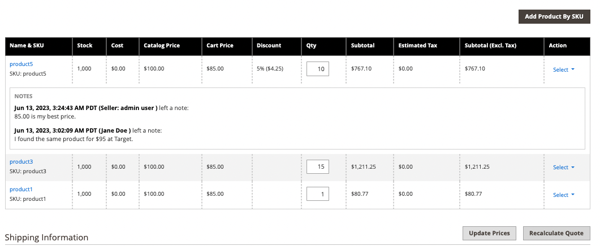

# Angebot aushandeln

Wenn [B2B-Angebote aktiviert ](configure-quotes.md), kann die Preisaushandlung in der Konfiguration von einem autorisierten Käufer von einem Unternehmen oder einem Vertriebsmitarbeiter initiiert werden.

Käufer starten den Preisaushandlungsprozess, indem sie [ein Angebot anfordern](quote-request.md) aus dem Warenkorb starten. Vertriebsmitarbeiter können die Verhandlung starten[ indem sie einen Angebotsentwurf für einen Einkäufer erstellen](sales-rep-initiates-quote.md) das Angebot mit den ursprünglichen Bestellartikeln und Preisen aktualisieren und es an den Einkäufer senden.

Wenn die Preisaushandlung beginnt, werden die Kursofferten im Raster [Kursofferten](quotes.md) aufgeführt. Alle Verhandlungen zwischen dem Käufer und Verkäufer finden per E-Mail statt und werden von der Detailansicht des Angebots initiiert und verfolgt.

Während des Verhandlungsprozesses kann der Verkäufer vom Administrator aus Folgendes tun:

- Produkte hinzufügen oder entfernen
- Menge ändern
- Rabatt auf Zeileneinträge oder das gesamte Angebot anwenden
- Versandart hinzufügen oder ändern
- Kommentare hinzufügen
- Senden Sie das aktualisierte Angebot an den Käufer oder speichern Sie es als Entwurf

Einkäufer verwalten den Prozess der Angebotsaushandlung von der Storefront aus mithilfe von [[!UICONTROL My Quotes]](account-dashboard-my-quotes.md). Während das Angebot zur Überprüfung offen ist, wird sein Status auf dem Konto des Käufers auf `Pending` gesetzt. Der Käufer kann das Angebot ändern und erneut übermitteln, auch wenn es abgelehnt wurde oder abgelaufen ist.

## Schritt 1: Anfrage anzeigen

1. Navigieren Sie in der Admin -Seitenleiste zu **[!UICONTROL Sales]** > **[!UICONTROL Quotes]**.

   Die neue Anfrage wird im _[!UICONTROL Quotes]_&#x200B;angezeigt.

1. Klicken Sie in _Spalte_ Aktionen“ auf **[!UICONTROL View]**.

   {width="700" zoomable="yes"}

## Schritt 2: Ändern des Angebots

1. Klicken Sie unter _[!UICONTROL Quote & Account Information]_&#x200B;auf_ Kalender _().

   {width="575" zoomable="yes"}

1. Wählen Sie einen **[!UICONTROL Expiration Date]** für das Angebot aus.

1. Scrollen Sie nach unten zum Abschnitt _[!UICONTROL Quote Totals]_&#x200B;und aktualisieren Sie die **[!UICONTROL Negotiated Price]**&#x200B;nach Bedarf.

   {width="600" zoomable="yes"}

   Wenn der Käufer die Menge der Artikel im Angebot ändert, erscheint oben im Angebot ein Hinweis, der angibt, dass sich die Liste der Artikel geändert hat, und der ausgehandelte Preis muss aktualisiert werden.

   {width="600" zoomable="yes"}

### Hinzufügen neuer Produkte zum Angebot

1. Klicken Sie auf **[!UICONTROL Add Products by SKU]**.

1. Geben Sie die hinzuzufügenden **[!UICONTROL SKU]** und **[!UICONTROL Qty]** ein.

   {width="600" zoomable="yes"}

### Anwenden von Zeilenelement-Aktualisierungen

Wenden Sie bei Bedarf Positionsänderungen im _[!UICONTROL Items Quoted]_&#x200B;an.

{width="600" zoomable="yes"}

- Ändern Sie die **[!UICONTROL Quantity]**, die zum vorgeschlagenen Preis erworben werden müssen.

- Wählen Sie **[!UICONTROL Configure]** aus und ändern Sie die Produktoptionen.

  Die [!UICONTROL Configure] Option ist nur für einen Zeileneintrag für ein konfigurierbares Produkt verfügbar

- Wählen Sie im Menü **[!UICONTROL Action]** eine Aktion aus, um das Element zu aktualisieren:
   - **Rabattartikel**, um einen Rabatt als Prozentsatz, festen Betrag oder bevorzugte Preisgestaltung anzuwenden.
Optional können Sie den Rabattbetrag sperren, um weitere Rabatte zu verhindern. Wenn der Rabatt nicht gesperrt ist,
Sowohl der Positionsrabatt als auch jeder Rabatt auf Angebotsebene werden auf den Produktpreis angewendet.
   - **Hinterlassen Sie eine Notiz an**, um dem Käufer zusätzliche Informationen über einen Artikel zur Verfügung zu stellen
   - **Entfernen**, um ein Element aus dem Angebot zu entfernen.

### Änderungen anwenden und aktualisieren

- Um Änderungen anzuwenden, klicken Sie auf **[!UICONTROL Add to Quote]**.

- Um das Angebot zu aktualisieren, klicken Sie auf **[!UICONTROL Recalculate the Quote]**.

- Um die Änderungen anzuwenden und das Angebot auf den freigegebenen Katalog und die Preisregeln zu aktualisieren, klicken Sie auf **[!UICONTROL Update Prices]** und dann auf **[!UICONTROL Proceed]** , um die Aktualisierung zu bestätigen.

  {width="600" zoomable="yes"}

### Versandinformationen aktualisieren

1. Wenn der Käufer eine _Lieferadresse_ im Angebot enthält, klicken Sie auf **[!UICONTROL Get shipping methods and rates]**.

1. Wählen Sie aus den verfügbaren Optionen eine Versandart aus.

1. Geben Sie einen **[!UICONTROL Proposed Shipping Price]** ein.

   Die _[!UICONTROL Quote Totals]_&#x200B;werden aktualisiert, um den vorgeschlagenen Versandpreis wiederzugeben.

### Beigefügtes Dokument beifügen

1. Klicken Sie unter _Feld „Kommentar_&quot; auf **[!UICONTROL Attach file]**.

   Standardmäßig können [angehängte Dateien](../configuration-reference/sales/quotes.md) bis zu 2 MB in jedem der folgenden Dateiformate betragen: DOC, DOCX, XLS, XLSX, PDF, TXT, JPG oder JPEG, PNG.

1. Wählen Sie die Datei aus Ihrem Verzeichnis aus.

## Schritt 3: Aktualisieren Sie die Informationen auf Angebotsebene und senden Sie Ihre Antwort

1. Geben Sie im Abschnitt _[!UICONTROL Negotiation]_&#x200B;auf der Registerkarte&#x200B;_[!UICONTROL Comments]_ im Abschnitt **[!UICONTROL Add your comment]** Ihre Antwort ein.

1. Um ein unterstützendes Dokument einzuschließen, klicken Sie auf **[!UICONTROL Attach file]** und wählen Sie die Datei aus Ihrem Verzeichnis aus.

   Die maximal zulässige Dateigröße für Anhänge beträgt 2 MB.

1. So wenden Sie einen Rabatt auf das Angebot an:

   - Wählen Sie unter _[!UICONTROL Quote Totals]_&#x200B;im Abschnitt&#x200B;_[!UICONTROL Negotiated Price]_ einen der folgenden Rabatttypen:

      - `Percentage Discount`: Ein prozentualer Rabatt reduziert den ursprünglichen Preis um einen bestimmten Prozentsatz.
      - `Amount Discount`: Bei einem Betragsrabatt wird ein fester Preisnachlass angewendet.
      - `Proposed Price`: Ein Preisnachlass, der vorgeschlagen wird, setzt den Endpreis auf einen bestimmten Betrag, unabhängig vom ursprünglichen Preis.

   - Geben Sie den Betrag als Prozentsatz oder Pauschalpreis ein.

     {width="600" zoomable="yes"}

   - Sie können Rabatte auf jeden Einzelposten oder das Angebot als Ganzes anwenden:

      - **Positionsrabatte**: Positionsrabatte werden auf einzelne Artikel im Warenkorb angewendet. Der Rabatt kann ein `percentage`, ein bestimmter `amount` oder ein `proposed price` sein.
      - **Rabatte auf Warenkorbebene**: Rabatte auf Warenkorbebene werden auf den gesamten Warenkorb angewendet. Der Rabatt kann entweder ein `percentage` oder ein bestimmter `amount` sein und wird auf den gesamten Warenkorbwert angewendet.
      - **Kombination aus Warenkorb- und**: In einigen Fällen können Rabatte sowohl auf Warenkorb- als auch auf Zeilenartikelebene angewendet werden. Der Positionsrabatt wird zuerst angewendet, gefolgt vom Rabatt auf Warenkorbebene auf die verbleibende Summe.

1. Angebot senden oder speichern:

   - Wenn das Angebot bereit ist, es an den Käufer zurückzusenden, klicken Sie auf **[!UICONTROL Send]**.

   - Um später mit der Bearbeitung des Angebots fortzufahren, klicken Sie auf **[!UICONTROL Save as Draft]**.

>[!NOTE]
>
> Während der Angebotsaushandlung können Rabatte gesperrt werden, um weitere Änderungen zu verhindern. Nachdem ein Angebot gesperrt wurde, können weder der Rabatttyp noch der Betrag geändert werden, ohne dass zuerst das Angebot entsperrt wird. Durch diesen Verriegelungsmechanismus wird sichergestellt, dass die zwischen dem Vertriebsmitarbeiter und dem Käufer vereinbarten Bedingungen gewahrt bleiben.

## Schritt 4: Folgemaßnahmen zu einem Angebot

Wenn Sie ein Angebot senden, benachrichtigt das System sowohl den Käufer als auch den Vertriebsmitarbeiter, der das Unternehmenskonto verwaltet. Die E-Mail enthält einen Link zum Angebot im Konto des Käufers und das Ablaufdatum des Angebots. Der Käufer kann zu jedem Zeitpunkt der Verhandlung einen der folgenden Schritte ausführen:

- Akzeptieren Sie das ausgehandelte Angebot und schließen Sie den Kauf ab.
- Antwort mit einem Gegenangebot senden und Verhandlung fortsetzen.
- Beenden Sie die Verhandlung.

Um seine Position im Workflow zu überwachen, überprüfen Sie Ihre E-Mail und den Status des Angebots im Raster. Sie können den Verhandlungsprozess so lange wie nötig fortsetzen.

## Schaltflächenleiste

| Schaltfläche | Beschreibung |
|----------------------------|---------------------------------------------------------------------------------------------------------------------------------------------------------------------------------------------------------------------------------------------------------------------------------------------------------------------------------------------------------------|
| [!UICONTROL Back] | Kehrt zur _[!UICONTROL Quotes]_&#x200B;zurück, ohne die Änderungen zu speichern. |
| [!UICONTROL Print] | Sendet das Angebot an einen Drucker oder speichert es als PDF. |
| [!UICONTROL Create Copy] | Erstellt und öffnet eine Kopie des aktuellen Anführungszeichens, wobei `(copy)` an den ursprünglichen Namen angehängt wird. Benennen Sie das neue Anführungszeichen um, indem Sie das Feld [!UICONTROL Name] bearbeiten. Verarbeiten Sie das neue Angebot, indem Sie es als Entwurf speichern oder an den Kunden senden. |
| Vorlage erstellen | Erstellen Sie eine Angebotsvorlage basierend auf dem aktuellen Angebot. Angebotsvorlagen optimieren die Verhandlung von Angeboten, indem sie es Käufern und Verkäufern ermöglichen, sich auf Vertrags- und Preisbedingungen zu einigen, die auf mehrere Angebote angewendet werden können. . Nach Vereinbarung kann der Käufer ein vorab genehmigtes verknüpftes Angebot aus der Vorlage für nachfolgende Bestellungen generieren, anstatt den Angebotsanforderungsprozess (RFQ) neu zu starten. |
| [!UICONTROL Save as Draft] | Speichert alle Änderungen am Angebot, sendet es jedoch nicht an den Käufer zurück. |
| [!UICONTROL Decline] | lehnt die Forderung ab, die Preise entweder bei der ersten Untersuchung oder während laufender Verhandlungen auszuhandeln. Wenn ein Angebot abgelehnt wird, sollte der Verkäufer einen Kommentar hinzufügen, um die Entscheidung zu erklären. Wenn ein Angebot abgelehnt wird, werden alle ausgehandelten Preise auf die ursprünglichen Werte zurückgesetzt. Diese Schaltfläche ist deaktiviert, während der Verkäufer auf eine Antwort des Käufers wartet. |
| [!UICONTROL Send] | Sendet das aktualisierte Angebot als Antwort auf die Anfrage des Käufers. Diese Schaltfläche ist deaktiviert, wenn der Verkäufer auf eine Antwort des Käufers wartet. |

{style="table-layout:auto"}

## Feldbeschreibungen

Zitatinformationen und Funktionen im Admin-Bereich sind in die folgenden Abschnitte unterteilt.

### [!UICONTROL Quote & Account Information]

| Feld | Beschreibung |
|-------------------------------------------------|------------------------------------------------------------------------------------------------------------------------------------------------------------------------------------------------------------------------------------------------------------------------------------------------------------------------------------------------------------------------------------------------------------------------------------------------------------------------------------------------------------------------------------------------------------------------------------------------------------------------------------------------------------------------------------------------------------------------------------------------------------------------------------------------------------------------------------------------------------------------------------------------------------------------------------------------------------------------------------------------------------------------------------------------------------------------------------------------------------|
| [!UICONTROL Name] | Der Name, der einer Angebotsanfrage vom [ zugewiesen ](account-company-roles-permissions.md). |
| [!UICONTROL Status] | Gibt den aktuellen Status des Angebots an. Der Status eines Angebots kann nur durch eine Handlung des Käufers oder Verkäufers geändert werden. Siehe auch [Statuseinstellungen](quotes.md) im Admin- und [Käuferkonto](account-dashboard-my-quotes.md). |
| [!UICONTROL Created] | Das Datum und die Uhrzeit, zu der der Käufer die Angebotsanforderung zum ersten Mal gesendet hat. |
| [!UICONTROL Created By] | Der Vor- und Nachname des Firmenkäufers, der die Angebotsanfrage gestellt hat. |
| [!UICONTROL Expiration Date] | Gibt den letzten Tag an, an dem das aktuelle Angebot gültig ist. Das standardmäßige Ablaufdatum wird in der Konfiguration auf 30 Tage festgelegt, nachdem ein Käufer eine Angebotsanfrage gesendet hat.   Der Verkäufer kann das standardmäßige Ablaufdatum überschreiben, indem er ein anderes Datum (MMM TT JJJJ ) eingibt oder das Datum aus dem Kalender auswählt. Das Angebot läuft nie ab, wenn das Feld leer gelassen wird.   Bei offenen Angeboten erhält der Verkäufer 48 [&#128279;](../systems/email-templates.md) vor Ablauf des Angebots eine E-Mail-Benachrichtigung“. Käufer werden 24 Stunden vor dem Ablaufdatum benachrichtigt.   Der Status des Angebots ändert sich in _Abgelaufen_ und der Käufer kann keine weiteren Änderungen am Angebot vornehmen. Die im Angebot vorgeschlagenen Preise werden auf die ursprünglichen Werte aus dem Katalog zurückgesetzt.   Wenn ein Angebot vom Verkäufer geprüft werden kann, wenn das Angebot abläuft, wird das Ablaufdatum entsprechend dem in der Konfiguration festgelegten Bereich zurückgesetzt.   Das Ablaufdatum ist das einzige Feld im Abschnitt _Angebot und Konto_, das während des Überprüfungsprozesses bearbeitet werden kann. |
| [!UICONTROL Company] | Der rechtliche Name des [Unternehmens](account-companies.md) den der Käufer repräsentiert. |
| [!UICONTROL Company Admin Email] | Die E-Mail-Adresse [Unternehmensadministrators](account-company-admin.md). |
| [!UICONTROL Sales Rep] | Der [Vertriebsmitarbeiter](account-company-manage.md) der für den Verkäufer arbeitet und der primäre Kontakt ist, der dem Firmenkonto zugewiesen ist. |
| [!UICONTROL Shared Catalog (or Customer Group)] | Der [freigegebene Katalog](catalog-shared.md) oder [Kundengruppe](account-company-customer-group.md) dem das Unternehmen zugewiesen ist. Das Angebot kann benutzerdefinierte Preise aus dem freigegebenen Katalog enthalten, der dem Unternehmen zugewiesen ist. |

{style="table-layout:auto"}

### [!UICONTROL Add to Quote by SKU]

| Feld | Beschreibung |
|---------------------------|-----------------------------------------------------------|
| [!UICONTROL Enter SKU] | Die SKU des Produkts, das dem Angebot hinzugefügt werden soll. |
| [!UICONTROL Qty] | Die Anzahl der Elemente dieser SKU, die dem Angebot hinzugefügt werden sollen. |
| [!UICONTROL Add to Quote] | Fügt die angegebene Produktmenge zum Angebot hinzu. |

{style="table-layout:auto"}

### [!UICONTROL Items Quoted]

| Feld | Beschreibung |
|-----------------------------------------|---------------------------------------------------------------------------------------------------------------------------------------------------------------------------------------------------------------------------|
| [!UICONTROL Name & SKU] | Der verknüpfte Produktname und die Lagereinheit (SKU). |
| [!UICONTROL Stock] | Die Anzahl der Produkte unter dieser SKU, die derzeit zum Verkauf verfügbar sind. |
| [!UICONTROL Cost] | Der Betrag, den der Verkäufer für den Kauf des Produkts gezahlt hat. |
| [!UICONTROL Catalog Price] | Der Preis des Produkts im Katalog des Käufers, basierend auf der Kundengruppe oder dem freigegebenen Katalog, der dem Unternehmen des Käufers zugewiesen ist. |
| [!UICONTROL Cart Price] | Der ursprüngliche Preis des Artikels im Warenkorb abzüglich aller vom Warenkorb angewendeten Rabatte. Der Warenkorbpreis kann vom Katalogpreis abweichen, wenn es Rabatte oder Warenkorbregeln gibt, die für die Kundengruppe des Käufers gelten. |
| [!UICONTROL Discount] | Der auf den Artikel angewendete Positionsrabatt. Der Wert kann ein Prozentsatz, ein fester Betrag oder ein vorgeschlagener Preis sein. |
| [!UICONTROL Qty] | Die Anzahl der Einheiten in dieser SKU, die die Grundlage für den angegebenen Preis ist. Es kann nur eine positive Zahl größer als null eingegeben werden. Wenn Sie die Menge auf Null ändern möchten, löschen Sie den Zeileneintrag aus dem Angebot. |
| [!UICONTROL Subtotal] | Der vorgeschlagene Preis multipliziert mit der Menge der bestellten Artikel. |
| [!UICONTROL Estimated Tax] | Der Steuerbetrag, der für diesen Zeileneintrag gemäß der Konfiguration geschätzt wird. Je nach den Einstellungen für die Steuerberechnung kann die geschätzte Steuer auf einem der folgenden Werte basieren: Einheitspreis / Zeilensumme / Summe |
| [!UICONTROL Subtotal (Incl./Excl. Tax)] | Je nach Konfiguration kann diese Spalte die Zwischensumme mit oder ohne geschätzte Steuern anzeigen. |
| [!UICONTROL Action] | Auswahlmenü der Vorgänge, die auf einen Zeileneintrag angewendet werden können:<ul><li>**[!UICONTROL Discount item]**</li><li>**[!UICONTROL Leave a note to Buyer]**</li><li>**[!UICONTROL Remove an item from the quote]**</li></ul>. |
| [!UICONTROL Configure] | Ermöglicht das Ändern der Produktoptionen für ein konfigurierbares Produkt. |
| [!UICONTROL Update Prices] | Aktualisiert das Angebot mit den neuesten Änderungen aus dem freigegebenen Katalog und den Preisregeln. |
| [!UICONTROL Recalculate Quote] | Berechnet alle Angebotspreise, Warenkorbpreisregeln und Steuern neu, um Änderungen am Angebot widerzuspiegeln. |

{style="table-layout:auto"}

### [!UICONTROL Shipping Information]

| Feld | Beschreibung |
|--------------------------------------|------------------------------------------------------------------------------------------------------------------------------------------------------------------------------|
| [!UICONTROL Shipping Address] | Zeigt die Lieferadresse an, die auf dem Konto des Käufers angegeben ist. Die Lieferadresse ist leer, wenn der Käufer vor dem Absenden der Anfrage keine Adresse angegeben hat. |
| [!UICONTROL Shipping Method & Price] | Der Link Versandarten und -sätze abrufen wird angezeigt, wenn der Käufer eine _Lieferadresse_ im Angebot enthält. |

{style="table-layout:auto"}

### [!UICONTROL Negotiation]

| Feld | Beschreibung |
|--------------------------|----------------------------------------------------------------------------------------------------------------------------------------------------------------------------------------------------------------------------------------------------------------------------------------------------------------------------------------------------------------------------------------------------------------------------------------------------------------------------------------------------------------------------------------------------------------------------------------------------------------------------------------------------------|
| [!UICONTROL Comments] | Die Registerkarte „Kommentare“ im Abschnitt „Verhandlung“ wird verwendet, um eine Nachricht über das Angebot an den Käufer einzugeben.  **[!UICONTROL Add your comment]**- Die Kommentare werden verwendet, um mit dem Käufer während des Verhandlungsprozesses zu kommunizieren. Erläutern Sie in den Kommentaren alle Rabatte, die im Angebot angeboten werden, oder den Grund, warum eine Angebotsanfrage abgelehnt wurde. **[!UICONTROL Attach file]** - Die maximale Dateigröße und die unterstützten Dateitypen für [angehängte Dateien](configure-quotes.md) werden durch die Konfiguration bestimmt. Standardmäßig kann eine angehängte Datei bis zu 2 MB groß sein und einen der folgenden Dateitypen aufweisen: DOC, DOCX, XLS, XLSX, PDF, TXT, JPG oder JPEG, PNG. |
| [!UICONTROL History Log] | Auf dieser Registerkarte wird ein vollständiger Verlauf des Angebots mit Datumsangaben, Angebotsstatus und Kommentaren angezeigt. |

{style="table-layout:auto"}

### [!UICONTROL Quote Totals]

| Feld | Beschreibung |
|-----------------------------------------------------|-----------------------------------------------------------------------------------------------------------------------------------------------------------------------------------------------------------------------------------------------------------------------------------------------------------------------------------------------------------------------------------------------------------------------------------------------------------------------------------------------------------------------------------------------------------------------------------------------------------------------------------------------------------------------|
| [!UICONTROL Total Cost] | Die Gesamtkosten der im Angebot enthaltenen Artikel für den Verkäufer. |
| [!UICONTROL Catalog Total Price  (Incl./Excl. Tax)] | Der Gesamtpreis der Artikel im Angebot ohne Steuer, entsprechend den Preisen im freigegebenen Katalog oder im primären Katalog, der als Grundlage für das Angebot verwendet wird. Erweitern Sie den Abschnitt , um die Werte anzuzeigen, die in der Berechnung verwendet werden, abhängig von der Einstellung [Zwischensumme anzeigen](../configuration-reference/sales/tax.md) in der Konfiguration. Optionen:  **[!UICONTROL Subtotal (Excl. Tax)]**- Der Kataloggesamtpreis ohne geschätzte Steuer. **[!UICONTROL Subtotal (Incl. Tax)]** - Der Gesamtpreis des Katalogs ohne geschätzte Steuer.  **[!UICONTROL Estimated Tax]**- Der geschätzte Steuerbetrag, der auf den Gesamtpreis des Katalogs angewendet wird. |
| ausgehandelter Preis | Der Rabatt, der dem Käufer angeboten wird, kann auf einem der folgenden Kriterien basieren:  **[!UICONTROL Percentage Discount]**- Der Rabatt als Prozentsatz. **[!UICONTROL Amount Discount]** - Der Rabatt als fester Betrag.  **[!UICONTROL Proposed Price]**- Der vom Verkäufer vorgeschlagene Preis.
Wenn alle Artikel im Angebot einen gesperrten Artikelrabatt haben, wird der [!UICONTROL Negotiated Price] Abschnitt deaktiviert, da kein weiterer Rabatt angewendet werden kann.

Wenn ein Produkt einen nicht gesperrten Positionsrabatt hat, werden sowohl der Positionsrabatt als auch der Rabatt auf Angebotsebene auf den Produktpreis angewendet.
 |
| [!UICONTROL Quote Subtotal (Incl./Excl. Tax)] | Der vorgeschlagene Gesamtpreis für jeden Einzelposten im Angebot, entweder mit oder ohne Steuer, je nach den Einstellungen [Steuerberechnung](../configuration-reference/sales/tax.md) in der Konfiguration. |
| [!UICONTROL Shipping & Handling] | Der vom Verkäufer im Feld Vorgeschlagener Versandpreis im Abschnitt Lieferinformationen des Angebots eingegebene Betrag. Wenn dieses Feld leer ist, basiert der Betrag auf der ausgewählten Versandmethode. |
| [!UICONTROL Estimated Tax] | Der geschätzte fällige Steuerbetrag, wie in der Konfiguration (Anzeigeeinstellungen[ angegeben](../configuration-reference/sales/tax.md). |
| [!UICONTROL Quote Grand Total (Incl. Tax)] | Die endgültige Summe am Ende des Angebots, die den ausgehandelten Preis, die geschätzte Steuer und den vorgeschlagenen Versand und die Handhabung enthält. |

{style="table-layout:auto"}
