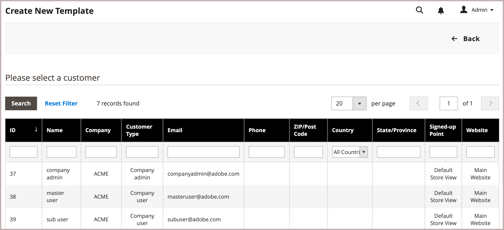

# Anwendungsfall und Workflows für Vorlagen zitieren

Mit der Funktion &quot;Anführungsvorlage&quot;können Käufer und Verkäufer den Angebotsprozess optimieren, indem sie wiederverwendbare und anpassbare Anführungsvorlagen erstellen.

- **Anpassbare Anführungszeichen**: Käufer können verknüpfte Anführungszeichen aus einer vorab genehmigten Vorlage generieren, was eine Anpassung innerhalb bestimmter Parameter ermöglicht, z. B. Zeileneinträgen und Auswahlen.
- **Bestellschwellenwerte**: Die Verkäufer können Mindest- und Höchstbestellungsverpflichtungen festlegen, um sicherzustellen, dass die Käufer vereinbarte Kaufmengen einhalten.
- **Ablaufdaten**: Vorlagen können Gültigkeitszeiträume aufweisen, um sicherzustellen, dass die Bedingungen nur innerhalb eines bestimmten Zeitraums gelten.
- **Rabatte und Preise**: Verkäufer können dieselben Funktionen für Zeileneinträge, Anführungszeichen und Versandpreisrabatte mit Anführungszeichen verwenden, um Rabatte für wiederkehrende Bestellungen festzulegen, wodurch der Verhandlungsprozess vereinfacht wird.
- **Tracking und Berichterstellung**: Das System verfolgt die Anzahl der verknüpften Anführungszeichen, die aus der Vorlage generiert wurden, und erfolgreich abgeschlossene Bestellungen, um Einblicke in die Erfüllung der vereinbarten Bestellquoten zu geben.

## Anwendungsfall

Ein Firmenkäufer kann eine Angebotsvorlage verwenden, um einen bestimmten Satz von Produkten über einen bestimmten Zeitraum zu bestellen. Der Käufer konfiguriert die folgenden Angebotsvorlagen-Optionen, um den Angebotsprozess effizienter, konsistenter und an strategische Kaufvereinbarungen anzupassen.

- Bestellschwelle zur Angabe der Mindest- und Höchstzahl der Bestellungen, die für die Preisgestaltung auf Verhandlungsbasis infrage kommen. Dies kann dazu verwendet werden, die in Vertragsvereinbarungen festgelegten Auftragskontingente anzuwenden und zu verfolgen.

- Mengenschwellen (Mindest-/Höchstmengen) Der Meldebogen legt eine Mengenschwelle fest, mit der die Mindest- und Höchstmenge festgelegt wird, die für jede Bestellung erworben werden kann. Dadurch wird sichergestellt, dass der Verkäufer die Lagerbestände effizient verwalten kann und gleichzeitig dem Käufer die Möglichkeit gibt, die Mengen nach Bedarf anzupassen.

## Workflow für Angebotsvorlagen

Angebotsvorlagen können vom Käufer oder vom Verkäufer initiiert werden.

**Schritt 1: Erstellung von Anführungsvorlagen (neu)**

- **Der Käufer erstellt die Anführungsvorlage**

  Bei der Überprüfung einer existierenden Angebotsvorlage entscheidet der Käufer, dass das Unternehmen im nächsten Jahr mehrere Bestellungen einreichen muss und zusätzliche Rabatte anfordern möchte, die auf Wiederholungsgeschäften basieren. Sie erstellen eine Angebotsvorlage, indem sie die Aktion *[!UICONTROL Create quote template]* für das Anführungszeichen verwenden. Anschließend starten sie die Verhandlungen, indem sie dem Verkäufer die neue Vorlage zur Überprüfung schicken.

  Käufer können auch direkt von der Seite *[!UICONTROL My Quote Templates]** auf der Storefront aus eine Angebotsvorlage erstellen.

- **Vertriebsmitarbeiter** - Ein Vertriebsmitarbeiter kann vom Administrator im Namen eines bestimmten Firmenkäufers eine Angebotsvorlage erstellen. Der Vertriebsmitarbeiter kann die Angebotsvorlage im Admin aus einem vorhandenen Angebot oder aus dem Raster [!UICONTROL Quote Templates] erstellen und als `draft` speichern oder sie an den Käufer senden, um die Verhandlungen zu starten. Im Entwurfszustand ist das Angebot nur für den Verkäufer sichtbar. Sobald das Anführungszeichen gesendet wurde, lautet der Status `Submitted`. Er kann vom Verkäufer erst geändert werden, wenn der Käufer ihn zurücksendet.

  {width="700" zoomable="yes"}

**Schritt 2: Überprüfung und Verhandlung in Anführungszeichen setzen (Überprüfung)**

Die Überprüfung oder Verhandlung einer Angebotsvorlage kann u. a. das Ändern von Mengen, das Entfernen von Artikeln, das Hinzufügen von Kommentaren zu Zeileneinträgen, das Anwenden von Zeileneinträgen oder Preisnachlässen (Verkäufer) und das Hinzufügen einer Lieferadresse (Käufer) umfassen.

- **Der Verkäufer zeigt eine Anfrage an und sendet eine Antwort** - In der Admin-Konsole zeigt der Verkäufer die Angebotsvorlage aus dem Raster *[!UICONTROL Quote Templates]** an oder öffnet sie über den Link in der E-Mail-Benachrichtigung. Auf der Storefront ändert sich der Status des Kurses in `Pending`, und der Käufer kann keine Änderungen vornehmen. Nach dem gleichen Prozess für [Preisverhandlungen](quote-price-negotiation.md) antwortet der Verkäufer, indem er Preisnachlässe anbietet und nach Bedarf Mengen und Artikel anpasst, einen Kommentar eingibt und das Angebot an den Käufer zurücksendet. Der Käufer und der Vertriebsmitarbeiter werden per E-Mail darüber informiert, dass der Verkäufer geantwortet hat.

- **Käufer sieht die Angebotsvorlage vom Verkäufer an und sendet Antwort** - Der Käufer klickt auf den Link in der E-Mail-Benachrichtigung, um die Angebotsvorlage zu öffnen, oder er öffnet das Angebot auf der Seite _Meine Anführungsvorlage_ des Konto-Dashboards. Der Käufer kann dem Verkäufer Notizen auf der Posten- oder Angebotsebene hinterlassen, Mengen ändern und Artikel entfernen.

Der Käufer und der Verkäufer setzen den Verhandlungsprozess so lange fort, bis eine Vereinbarung getroffen wird oder der Verkäufer die Angebotsvorlage ablehnt. Wenn der Käufer Änderungen am Angebot vornimmt, d. h. Produkte hinzufügt, entfernt oder die Produktmengen ändert, muss das Angebot zur Überprüfung an den Verkäufer zurückgegeben werden.

- **Käufer fügt eine Lieferadresse hinzu** - Der Käufer muss der Angebotsvorlage eine Lieferadresse hinzufügen, wenn keine vorhanden ist. Nach Hinzufügung der Anschrift kann der Verkäufer Versand- und Lieferoptionen anbieten. Die angezeigten Versandmethoden hängen von der Konfiguration der Storefront ab.

Wenn der Käufer eine Lieferadresse hinzufügt, muss der Verhandlungsvertrag überprüft werden, und der Verkäufer kann den Verhandlungsprozess fortsetzen, bis eine Vereinbarung erreicht ist, oder der Verkäufer lehnt die Angebotsvorlage ab.

**Schritt 3: Käufer akzeptiert eine Angebotsvorlage**

Der Käufer akzeptiert die in der Vorlage angegebenen Bedingungen. Nach Annahme der Angebotsvorlage kann der Käufer sie verwenden, um vorab genehmigte, verknüpfte Angebote zu generieren, die zur Bestellungsabwicklung verwendet werden können, ohne dass weitere Verhandlungen erforderlich sind.

Die Versandoptionen sind beim Checkout gesperrt.

### Anzeigen einer Angebotsvorlage

1. Klicken Sie in der Spalte **[!UICONTROL Actions]** für einen Datensatz auf **[!UICONTROL View]**.

1. Um auf die Kundenanfrage zu reagieren, befolgen Sie die Anweisungen und beginnen Sie mit demselben [Preisverhandlungen](quote-price-negotiation.md) -Prozess, der für die Aushandlung von Anführungszeichen verwendet wird.

### Aktivität &quot;Angebotsvorlage&quot; anzeigen

Zeigen Sie die Verhandlungs-Timeline, die Kommunikation und andere Kursaktivitäten aus den [!UICONTROL Comments] und [!UICONTROL History Log] an - Informationen umfassen Statusänderungen, Aktualisierungen von Kunden- und Versandinformationen, Artikel- und Preisaktualisierungen sowie andere wichtige Informationen.

1. Öffnen Sie eine Angebotsvorlage.

1. Sehen Sie sich Kommentare und den Verlauf von Zitat-Verhandlungen an, indem Sie zu **[!UICONTROL Negotiation]** scrollen und **[!UICONTROL Comments]** und **[!UICONTROL History Log]** auswählen.

   {width="400"}

1. Der Verlauf wird auch auf Zeileneintrag-Ebene verfolgt.

   {width="400"}

### Deklarieren einer Anführungsvorlage

Es können nur Anführungszeichenvorlagen mit dem Status `In Review` abgelehnt werden.

1. Öffnen Sie im Raster *[!UICONTROL Quote Templates]* die Anführungszeichenvorlage, die Sie ablehnen möchten.

1. Klicken Sie in der Anführungszeichenvorlage auf **[!UICONTROL Decline]**.

1. Geben Sie bei Aufforderung den Grund für die Ablehnung des Anführungszeichens ein und klicken Sie auf **[!UICONTROL Confirm]**.
