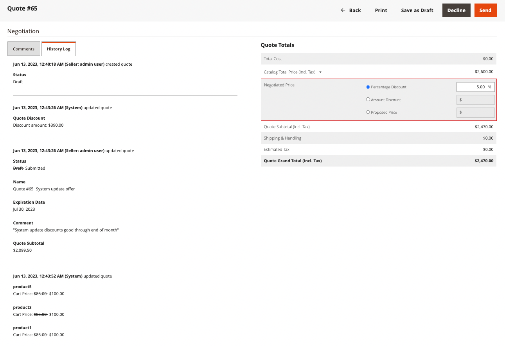

# Verhandelbare Kursofferten

Käufer und Verkäufer verwenden Angebote, um den Verhandlungsprozess für das Hinzufügen von Artikeln zu Bestellungen, das Aktualisieren von Mengen, das Anfordern und Anwenden von Rabatten usw. zu verwalten - bis sie eine Einigung erzielen. Der Prozess der Angebotsaushandlung kann von einem autorisierten Unternehmenskäufer oder von einem Vertriebsmitarbeiter des Unternehmens initiiert werden.

{width="700" zoomable="yes"}

Nachdem das Angebot erstellt wurde, beginnt der Verhandlungsprozess, wenn der Käufer oder Verkäufer das Angebot zur Überprüfung einreicht. Das _Quotes_-Raster, das jedes erhaltene Angebot auflistet und einen Verlauf der Kommunikation zwischen Käufer und Verkäufer verwaltet. Verwenden Sie die standardmäßigen [Arbeitsplatzsteuerelemente](../getting-started/admin-workspace.md) um die Liste zu filtern, das Spaltenlayout zu ändern, Ansichten zu speichern und Daten zu exportieren.

- In der Storefront senden Käufer das Angebot als [Anfrage zu verhandeln](quote-price-negotiation.md) den Preis aus dem Warenkorb. Bei der Erstellung der Angebotsanfrage kann ein Käufer das Angebot als Entwurf speichern oder es direkt an den Verkäufer senden.

- In der Admin können Vertriebsmitarbeiter Angebote im Namen des Käufers des Unternehmens erstellen. Bei der Erstellung des Angebots kann ein Verkäufer das Angebot als Entwurf speichern oder es direkt an den Käufer senden, um den Verhandlungsprozess einzuleiten.

Während des Verhandlungsprozesses kann das Angebot nur von der Person aktualisiert werden, die die Bedingungen für weitere Verhandlungen überprüft und vorschlägt.

## Voraussetzungen

Verhandelbare Anführungszeichen sind nur verfügbar, wenn Adobe Commerce die folgenden Konfigurationseinstellungen aufweist:

- [Die Adobe Commerce B2B-Erweiterung wird installiert](install.md)
- [Konfigurierte B2B-Funktionen](enable-basic-features.md)
   - Aktivieren von Unternehmenskonten
   - B2B-Angebot aktivieren

## Angebotsworkflow

Angebote können vom Käufer oder vom Verkäufer initiiert werden.

Dieses Diagramm zeigt die Angebotsstatus für einen Käufer und Verkäufer (Administrator) in den verschiedenen Schritten beim Initiieren eines Angebots an.

{width="700" zoomable="yes"}

**Schritt 1: Angebotserstellung (neu)**

- **Käufer fordert Angebot an** - Der Käufer [fordert ein Angebot an](quote-request.md) aus dem Warenkorb. Die Anfrage erscheint in der Liste _Meine Angebote_ im Konto-Dashboard des Käufers und die E-Mail-Benachrichtigung wird an den Vertriebsmitarbeiter gesendet, der dem Firmenkonto zugewiesen ist. In Admin wird die Anfrage im Raster _Anführungszeichen_ mit dem Status `New` angezeigt. Eine Angebotsanfrage kann vom Käufer bis zur Eröffnung durch den Verkäufer geändert werden.

  {width="700" zoomable="yes"}

- **Vertriebsmitarbeiter** - Ein Vertriebsmitarbeiter kann [Angebot erstellen](sales-rep-initiates-quote.md) vom Administrator im Namen eines bestimmten Unternehmens oder Käufers. Der Vertriebsmitarbeiter muss das Angebot aktualisieren, um Produkte und andere Informationen wie Rabatte und Notizen für den Käufer hinzuzufügen. Die Kundenvertretung kann das Angebot als `draft` speichern oder an den Käufer senden, um die Verhandlung zu starten. Im Entwurfsstatus ist das Angebot nur für den Verkäufer sichtbar. Sobald das Angebot gesendet wurde, ist der Status `Submitted`. Sie kann vom Verkäufer erst geändert werden, wenn der Käufer sie zurücksendet.

  {width="700" zoomable="yes"}

**Schritt 2: Angebotsüberprüfung und -verhandlung (Überprüfung)**

Die Überprüfung oder Verhandlung eines Angebots kann die Änderung von Mengen, das Entfernen von Artikeln, das Hinzufügen von Positionskommentaren, das Anwenden von Positionsrabatten oder Angebotsrabatten (Verkäufer) und das Hinzufügen einer Lieferadresse (Käufer) umfassen.

- **Verkäufer zeigt Anfrage an und sendet Antwort** - Im Administrator zeigt der Verkäufer die Anfrage für ein Angebot an. In der Storefront ändert sich der Status des Angebots in `Pending`, und der Käufer kann keine Änderungen vornehmen. Der [Verkäufer antwortet](quote-price-negotiation.md) indem er Preisnachlässe anbietet und Mengen und Artikel nach Bedarf anpasst, gibt einen Kommentar ein und sendet das Angebot an den Käufer zurück. Der Käufer und der Vertriebsmitarbeiter werden per E-Mail benachrichtigt, dass der Verkäufer geantwortet hat.

- **Der Käufer zeigt das Angebot vom Verkäufer an und sendet eine Antwort** - Der Käufer klickt auf den Link in der E-Mail-Benachrichtigung, um das Angebot zu öffnen, oder öffnet das Angebot auf der Seite _Meine Angebote_ im Konto-Dashboard. Der Einkäufer kann dem Verkäufer Notizen auf der Positionsartikel- oder Angebotsebene hinterlassen, Mengen ändern und Artikel entfernen.

Der Käufer und der Verkäufer können den Verhandlungsprozess fortsetzen, bis eine Vereinbarung getroffen wird, oder der Verkäufer lehnt das Angebot ab. Wenn der Käufer Änderungen am Angebot vornimmt - Hinzufügen oder Entfernen von Produkten oder Ändern der Produktmengen -, muss das Angebot zur Überprüfung an den Verkäufer zurückgegeben werden.

- **Käufer fügt eine Lieferadresse hinzu** - Der Käufer kann dem Angebot eine Lieferadresse hinzufügen. Nachdem der Käufer die Adresse hinzugefügt hat, kann der Verkäufer Versand- und Lieferoptionen bereitstellen. Die angezeigten Versandmethoden hängen von der Storefront-Konfiguration ab.

Wenn der Käufer eine Lieferadresse hinzufügt, muss die Verhandlungsvereinbarung überprüft werden, und der Verkäufer kann den Verhandlungsprozess fortsetzen, bis eine Vereinbarung erzielt wird, oder der Verkäufer lehnt das Angebot ab.

**Schritt 3: Käufer akzeptiert Angebot (Checkout)**

Der Käufer akzeptiert den vorgeschlagenen Preis und geht zur Kasse. Dem ausgehandelten Angebot können keine zusätzlichen Rabatte hinzugefügt werden.

Versandoptionen sind beim Checkout gesperrt.

## Angebotsstatus

Der Angebotsstatus liefert Informationen zum aktuellen Status des Angebots im Angebotsworkflow. Der Status eines Angebots ändert sich nur, wenn ein Käufer oder Verkäufer eine Aktion für das Angebot durchführt. Beispielsweise ändert sich der Status in „Bestellung“, wenn ein Käufer [!UICONTROL Proceed to Checkout] für ein aktives Angebot auswählt.

- *[!UICONTROL New]** - Der Käufer hat eine Anfrage für ein Angebot eingereicht, aber es wurde nicht vom Verkäufer angesehen. Die Anfrage kann vom Käufer aktualisiert werden, bis sie vom Verkäufer geöffnet wird.

- **[!UICONTROL Draft]** - Der Verkäufer erstellt einen Angebotsentwurf für einen Käufer. Das Angebot ist für den Käufer erst sichtbar, wenn der Verkäufer die Angebotsdetails (Artikel, Menge, Rabatt usw.) hinzufügt und das Angebot an den Käufer übermittelt.

- **[!UICONTROL Open]** - Der Verkäufer hat die Anfrage geöffnet und ist dabei, sie zu überprüfen und eine Antwort vorzubereiten

- **[!UICONTROL Submitted]** - Der Verkäufer hat eine Antwort an den Käufer gesendet. Der Angebotsdatensatz kann während des Verhandlungsprozesses nicht bearbeitet werden.

- **[!UICONTROL Client Reviewed]** - Der Käufer hat die Antwort des Verkäufers eingesehen und ist dabei, eine Antwort vorzubereiten.

- **[!UICONTROL Updated]** - Der Käufer übermittelte eine Antwort, die jedoch vom Verkäufer nicht angezeigt wurde.

- **[!UICONTROL Ordered]** - Der Käufer reichte die Bestellung auf der Grundlage des ausgehandelten Angebots ein.

- **[!UICONTROL Closed]** - Der Käufer hat die Angebotsanfrage storniert.

- **[!UICONTROL Declined]** - Der Verkäufer lehnte die Angebotsanfrage ab. Alle benutzerdefinierten Preise werden aus dem Angebot entfernt und der Datensatz wird für weitere Bearbeitungen gesperrt.

- **[!UICONTROL Expired]** - Der Käufer hat nicht innerhalb der vorgesehenen Frist auf die Antwort des Verkäufers geantwortet und das Angebot ist nicht mehr gültig.

## B2B-Rollenressourcen für Store-Angebote

Konfigurationsoptionen für Anführungszeichen werden mithilfe der [Rollenressourcen](../systems/permissions-user-roles.md#role-resources) gesteuert. Diese Rollenressourcen müssen für die Rolle des Admin-Benutzers festgelegt werden, die dem Store-Administrator zugewiesen ist.

Um Zugriff auf Angebotsfunktionen in Admin zu gewähren, gehen Sie zu **[!UICONTROL System]** > _[!UICONTROL Permissions]_>**[!UICONTROL User Roles]**, wählen Sie die Rolle aus und navigieren Sie in der Struktur_ Rollenressourcen _zu [!UICONTROL Sales] > [!UICONTROL Operations] > [!UICONTROL Quotes] .

{width="700" zoomable="yes"}

## Aktion anwenden

Im Admin können B2B-Administratoren und -Verkäufer Angebote über das Zitatraster mithilfe des [!UICONTROL Actions] verwalten.

{width="700" zoomable="yes"}

1. Navigieren Sie in der _Admin_-Seitenleiste zu **[!UICONTROL Sales]** > **[!UICONTROL Quotes]**.

1. Aktivieren Sie in der ersten Spalte des Rasters das Kontrollkästchen für jeden Datensatz, auf den Sie die Aktion anwenden möchten.

1. Wählen Sie im **[!UICONTROL Actions]** die anzuwendende Aktion aus.

### Angebot anzeigen

1. Klicken Sie in der Spalte **[!UICONTROL Actions]** für einen Datensatz auf **[!UICONTROL View]**.

1. Um auf die Kundenanfrage zu reagieren, befolgen Sie die Anweisungen und beginnen Sie mit dem [Preisaushandlung](quote-price-negotiation.md) Prozess.

### Angebotsaktivität anzeigen

Zeigen Sie die Zeitleiste der Verhandlung, die Kommunikation und andere Angebotsaktivitäten aus der [!UICONTROL Comments] und [!UICONTROL History Log] an - Informationen umfassen Statusänderungen, Aktualisierungen von Kunden- und Versandinformationen, Artikel- und Preisaktualisierungen und andere wichtige Informationen.

1. Öffnen Sie ein Angebot.

1. Zeigen Sie Kommentare und den Verlauf von Angebotsverhandlungen an, indem Sie zu **[!UICONTROL Negotiation]** scrollen und **[!UICONTROL Comments]** und **[!UICONTROL History Log]** auswählen.

   {width="400"}

1. Der Verlauf wird auch auf Zeileneingangsebene verfolgt.

   {width="400"}

### Angebotsanfrage ablehnen

Nur Angebotsanfragen mit einem `Open` können abgelehnt werden.

1. Wählen Sie jede offene Angebotsanfrage aus, die Sie ablehnen möchten.

1. Setzen Sie das _[!UICONTROL Actions]_auf `Declined`.

1. Geben Sie bei Aufforderung den Grund für die Ablehnung des Angebots ein und klicken Sie auf **[!UICONTROL Confirm]**.

   {width="400"}
