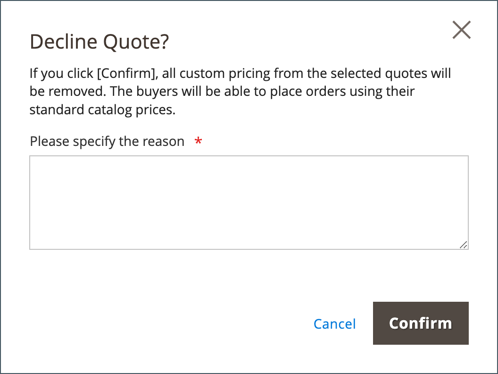

# Negotiable Anführungszeichen

Käufer und Verkäufer verwenden Anführungszeichen, um den Verhandlungsprozess für bestellbare Artikel zu verwalten, die Mengen zu aktualisieren, Rabatte anzufordern und anzuwenden usw., bis sie eine Einigung erzielen. Der Prozess der Preisverhandlungen kann von einem autorisierten Firmenkäufer oder von einem Vertriebsmitarbeiter eingeleitet werden.

{width="700" zoomable="yes"}

Nach Erstellung des Angebots beginnt der Verhandlungsprozess, sobald der Käufer oder Verkäufer das Angebot zur Überprüfung einreicht. Das Raster _Angebote_ , das jedes erhaltene Angebot auflistet und einen Verlauf der Kommunikation zwischen Käufer und Verkäufer pflegt. Verwenden Sie die standardmäßigen [Arbeitsplatzsteuerelemente](../getting-started/admin-workspace.md), um die Liste zu filtern, das Spaltenlayout zu ändern, Ansichten zu speichern und Daten zu exportieren.

- In der Storefront reichen Käufer das Angebot als [Anfrage ein, den Preis aus dem Warenkorb zu verhandeln](quote-price-negotiation.md). Bei der Erstellung des Angebots kann ein Käufer das Angebot als Entwurf speichern oder direkt an den Verkäufer übermitteln.

- Im Admin können Vertriebsmitarbeiter Angebote im Namen des Firmenkäufers erstellen. Bei der Erstellung des Angebots kann ein Verkäufer das Angebot als Entwurf speichern oder es direkt an den Käufer senden, um den Verhandlungsprozess einzuleiten.

Während des Verhandlungsprozesses kann das Zitat nur von der Person aktualisiert werden, die Bedingungen für weitere Verhandlungen überprüft und vorschlägt.

## Voraussetzungen

Negative Anführungszeichen sind nur verfügbar, wenn Adobe Commerce die folgenden Konfigurationseinstellungen aufweist:

- [Die Adobe Commerce B2B-Erweiterung ist installiert.](install.md)
- [Konfigurierte B2B-Funktionen](enable-basic-features.md)
   - Unternehmenskonten aktivieren
   - B2B-Anführungszeichen aktivieren

## Anführungsarbeitsablauf

Angebote können vom Käufer oder vom Verkäufer initiiert werden.

Dieses Diagramm zeigt den Kursstatus eines Käufers und Verkäufers (Admin) in den verschiedenen Schritten beim Initiieren eines Angebots.

{width="700" zoomable="yes"}

**Schritt 1: Erstellung von Zitaten (neu)**

- **Käufer fordert Angebot** an - Der Käufer [fordert ein Angebot](quote-request.md) vom Warenkorb an. Die Anfrage wird in der Liste _Meine Angebote_ im Konto-Dashboard des Käufers angezeigt und die E-Mail-Benachrichtigung wird an den Vertriebsmitarbeiter gesendet, der dem Unternehmenskonto zugewiesen ist. Im Admin wird die Anforderung im Raster _Anführungszeichen_ mit dem Status `New` angezeigt. Ein Angebot kann vom Käufer bis zur Eröffnung durch den Verkäufer geändert werden.

  {width="700" zoomable="yes"}

- **Vertriebsmitarbeiter** - Ein Vertriebsmitarbeiter kann [vom Administrator ein Angebot](sales-rep-initiates-quote.md) für einen bestimmten Firmenkäufer erstellen. Der Kundenbetreuer muss das Angebot aktualisieren, um dem Käufer Produkte und andere Informationen wie Rabatte und Hinweise hinzuzufügen. Die Vertriebsdarstellung kann das Angebot als `draft` speichern oder an den Käufer senden, um die Verhandlungen zu beginnen. Im Entwurfszustand ist das Angebot nur für den Verkäufer sichtbar. Sobald das Anführungszeichen gesendet wurde, lautet der Status `Submitted`. Er kann vom Verkäufer erst geändert werden, wenn der Käufer ihn zurücksendet.

  {width="700" zoomable="yes"}

**Schritt 2: Überprüfung und Verhandlung in Anführungszeichen setzen (Überprüfung)**

Die Überprüfung oder Verhandlung eines Angebots kann unter anderem die Änderung der Mengen, das Entfernen von Artikeln, das Hinzufügen von Kommentaren zu Zeileneinträgen, die Anwendung von Zeileneinträgen oder Preisnachlässen (Verkäufer) und das Hinzufügen einer Lieferadresse (Käufer) umfassen.

- **Der Verkäufer zeigt die Anfrage an und sendet die Antwort** - In der Admin-Ansicht zeigt der Verkäufer die Anfrage nach einem Angebot an. Auf der Storefront ändert sich der Status des Kurses in `Pending`, und der Käufer kann keine Änderungen vornehmen. Der [Verkäufer antwortet](quote-price-negotiation.md), indem er Preisnachlässe anbietet und bei Bedarf Mengen und Artikel anpasst, einen Kommentar eingibt und das Angebot an den Käufer zurücksendet. Der Käufer und der Vertriebsmitarbeiter werden per E-Mail darüber informiert, dass der Verkäufer geantwortet hat.

- **Der Käufer sieht das Angebot vom Verkäufer an und sendet die Antwort** - Der Käufer klickt auf den Link in der E-Mail-Benachrichtigung, um das Angebot zu öffnen, oder er öffnet das Angebot auf der Seite _Meine Angebote_ des Konto-Dashboards. Der Käufer kann dem Verkäufer Notizen auf der Posten- oder Angebotsebene hinterlassen, Mengen ändern und Artikel entfernen.

Der Käufer und der Verkäufer können den Verhandlungsprozess fortsetzen, bis eine Vereinbarung getroffen wird, oder der Verkäufer lehnt das Angebot ab. Wenn der Käufer Änderungen am Angebot vornimmt, d. h. Produkte hinzufügt, entfernt oder die Produktmengen ändert, muss das Angebot zur Überprüfung an den Verkäufer zurückgegeben werden.

- **Käufer fügt eine Lieferadresse hinzu** - Der Käufer kann dem Angebot eine Lieferadresse hinzufügen. Nach Hinzufügung der Anschrift kann der Verkäufer Versand- und Lieferoptionen anbieten. Die angezeigten Versandmethoden hängen von der Konfiguration der Storefront ab.

Wenn der Käufer eine Lieferadresse hinzufügt, muss der Verhandlungsvertrag überprüft werden, und der Verkäufer kann den Verhandlungsprozess fortsetzen, bis eine Vereinbarung erreicht ist, oder der Verkäufer lehnt das Angebot ab.

**Schritt 3: Käufer akzeptiert Anführungszeichen (Checkout)**

Der Käufer akzeptiert den vorgeschlagenen Preis und geht zum Checkout. Dem ausgehandelten Angebot können keine zusätzlichen Rabatte hinzugefügt werden.

Die Versandoptionen sind beim Checkout gesperrt.

## Anführungsstatus

Der Anführungsstatus liefert Informationen zum aktuellen Status des Anführungszeichens im Anführungszeichen-Workflow. Der Status eines Angebots ändert sich nur, wenn ein Käufer oder Verkäufer eine Aktion zum Angebot ausführt. Beispielsweise ändert sich der Status in eine Bestellung, wenn ein Käufer für ein aktives Angebot den Wert &quot;[!UICONTROL Proceed to Checkout]&quot; auswählt.

- *[!UICONTROL New]** - Der Käufer hat einen Antrag auf ein Angebot gestellt, wurde aber vom Verkäufer nicht eingesehen. Der Antrag kann vom Käufer bis zur Eröffnung durch den Verkäufer aktualisiert werden.

- **[!UICONTROL Draft]** - Der Verkäufer erstellt einen Kostenvoranschlag für einen Käufer. Das Angebot ist für den Käufer erst sichtbar, wenn der Verkäufer die Angebotsdetails (Artikel, Menge, Rabatt usw.) hinzufügt und dem Käufer das Angebot übermittelt.

- **[!UICONTROL Open]** - Der Verkäufer hat die Anfrage geöffnet und ist dabei, sie zu überprüfen und eine Antwort vorzubereiten.

- **[!UICONTROL Submitted]** - Der Verkäufer hat dem Käufer eine Antwort geschickt. Der Zitat-Datensatz kann während des Verhandlungsprozesses nicht bearbeitet werden.

- **[!UICONTROL Client Reviewed]** - Der Käufer hat die Antwort des Verkäufers angesehen und bereitet derzeit eine Antwort vor.

- **[!UICONTROL Updated]** - Der Käufer hat eine Antwort übermittelt, aber sie wurde vom Verkäufer nicht eingesehen.

- **[!UICONTROL Ordered]** - Der Käufer hat den Auftrag auf der Grundlage des ausgehandelten Preises eingereicht.

- **[!UICONTROL Closed]** - Der Käufer hat die Preisanfrage abgebrochen.

- **[!UICONTROL Declined]** - Der Verkäufer lehnte die Anforderung eines Angebots ab. Alle benutzerdefinierten Preise werden aus dem Anführungszeichen entfernt und der Datensatz wird von weiteren Bearbeitungen gesperrt.

- **[!UICONTROL Expired]** - Der Käufer hat nicht innerhalb der festgelegten Frist auf die Antwort des Verkäufers geantwortet und das Angebot ist nicht mehr gültig.

## B2B-Rollenressourcen für Store-Anführungszeichen

Konfigurationsoptionen für Anführungszeichen werden mit den [Rollenressourcen](../systems/permissions-user-roles.md#role-resources) gesteuert. Diese Rollenressourcen müssen für die Administratorrolle festgelegt sein, die dem Store-Administrator zugewiesen ist.

Um Zugriff auf Anführungszeichenfunktionen im Admin zu gewähren, gehen Sie zu &quot;**[!UICONTROL System]**&quot;> &quot;_[!UICONTROL Permissions]_&quot;> &quot;**[!UICONTROL User Roles]**&quot;, wählen Sie die Rolle aus und navigieren Sie zu &quot;[!UICONTROL Sales]&quot;> &quot;[!UICONTROL Operations]&quot;> &quot;[!UICONTROL Quotes]&quot;im Baum &quot;_ Rollenressourcen _&quot;.

{width="700" zoomable="yes"}

## Anwenden einer Aktion

In der Admin-Konsole können B2B-Administratoren und -Verkäufer Anführungszeichen aus dem Anführungszeichenraster über das Menü [!UICONTROL Actions] verwalten.

{width="700" zoomable="yes"}

1. Wechseln Sie in der Seitenleiste _Admin_ zu **[!UICONTROL Sales]** > **[!UICONTROL Quotes]**.

1. Aktivieren Sie in der ersten Spalte des Rasters das Kontrollkästchen für jeden Datensatz, auf den Sie die Aktion anwenden möchten.

1. Wählen Sie im Feld **[!UICONTROL Actions]** die anzuwendende Aktion aus.

### Ansehen eines Angebots

1. Klicken Sie in der Spalte **[!UICONTROL Actions]** für einen Datensatz auf **[!UICONTROL View]**.

1. Um auf die Kundenanfrage zu reagieren, befolgen Sie die Anweisungen und beginnen Sie mit dem Prozess [Preisverhandlungen](quote-price-negotiation.md) .

### Anführungsaktivität

Zeigen Sie die Verhandlungs-Timeline, die Kommunikation und andere Kursaktivitäten aus den [!UICONTROL Comments] und [!UICONTROL History Log] an - Informationen umfassen Statusänderungen, Aktualisierungen von Kunden- und Versandinformationen, Artikel- und Preisaktualisierungen sowie andere wichtige Informationen.

1. Öffnen Sie ein Zitat.

1. Sehen Sie sich Kommentare und den Verlauf von Zitat-Verhandlungen an, indem Sie zu **[!UICONTROL Negotiation]** scrollen und **[!UICONTROL Comments]** und **[!UICONTROL History Log]** auswählen.

   {width="400"}

1. Der Verlauf wird auch auf Zeileneintrag-Ebene verfolgt.

   {width="400"}

### Anforderung eines Anführungszeichens ablehnen

Es können nur Zitat-Anfragen mit dem Status `Open` abgelehnt werden.

1. Wählen Sie jede offene Anführungsanforderung aus, die Sie ablehnen möchten.

1. Setzen Sie das Steuerelement _[!UICONTROL Actions]_auf `Declined`.

1. Geben Sie bei Aufforderung den Grund für die Ablehnung des Anführungszeichens ein und klicken Sie auf **[!UICONTROL Confirm]**.

   {width="400"}
