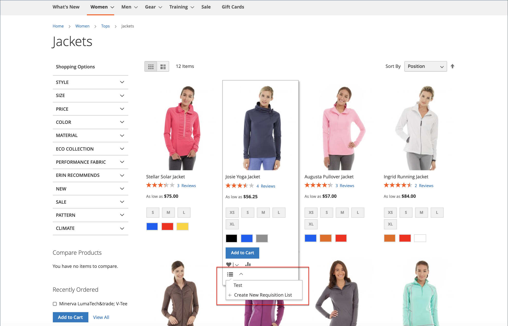

# Anforderungslisten

Durch die Verwendung einer Anforderungsliste sparen Sie Zeit beim Kauf häufig bestellter Produkte, da Artikel direkt aus der Liste zum Warenkorb hinzugefügt werden. Kunden können mehrere Listen verwalten, die sich auf Produkte verschiedener Anbieter, Käufer, Teams, Kampagnen oder alles andere konzentrieren, das ihren Workflow optimiert. Es ist sowohl für angemeldete Benutzer als auch für Gäste verfügbar.

>[!NOTE]
>
>Informationen zum Aktivieren von Anforderungslisten für Ihren Store finden Sie unter [B2B-Funktionen aktivieren](enable-basic-features.md). Je nach der [Konfiguration](configure-requisition-lists.md).

Die Funktionalität der Anforderungsliste ähnelt den Wunschlisten, mit folgenden Unterschieden:

- Nach dem Senden von Artikeln an den Warenkorb wird eine Anforderungsliste nicht gelöscht. Es kann mehrmals verwendet werden.
- Die Benutzeroberfläche für Anforderungslisten verwendet eine kompakte Ansicht, um viele Elemente anzuzeigen.

{width="600" zoomable="yes"}

## Erstellen Sie eine Anforderungsliste über das Konto-Dashboard.

Ein angemeldeter Kunde, der mit einem Unternehmenskonto verknüpft ist, kann über sein Konto-Dashboard eine Anforderungsliste erstellen.

1. In der Seitenleiste ihres Kontos wählt **[!UICONTROL My Requisition Lists]**.

1. Im _[!UICONTROL Requisition Lists]_Seite, Klicks **[!UICONTROL Create New Requisition List]**.

1. Fügt die **[!UICONTROL Requisition List Name]** und **[!UICONTROL Description]**.

   {width="300"}

1. Klicken Sie nach Abschluss **[!UICONTROL Save]**.

## Erstellen einer Anforderungsliste von einer Produktseite

Ein angemeldeter Kunde, der mit einem Unternehmenskonto verknüpft ist, kann von einer Produktseite aus eine Anforderungsliste erstellen. Diese Methode bietet eine einfache Verknüpfung zum Erstellen der Liste und zum Hinzufügen des Produkts.

1. Klicken Sie auf der Produktdetailseite auf **[!UICONTROL Add to Requisition List]**.

1. Klicks **[!UICONTROL Create New Requisition List]**.

1. Fügt die **[!UICONTROL Requisition List Name]** und **[!UICONTROL Description]**.

1. Klicken Sie nach Abschluss **[!UICONTROL Save]**.

## Produkte zu einer Anforderungsliste hinzufügen

Kunden können Produkte zu einer Anforderungsliste hinzufügen, indem sie:

- Produktseiten
- Eine Katalogseite
- Der Warenkorb
- Bestehende Bestellungen

### Auf einer Produktdetailseite

1. Der Kunde ruft von der Storefront die Detailseite des Produkts auf, die der Anforderungsliste hinzugefügt werden soll.

1. Klicks **[!UICONTROL Add to Requisition List]** und führt einen der folgenden Schritte aus:

   - Wählt eine vorhandene Anforderungsliste aus.
   - Erstellt eine Anforderungsliste.

   {width="700" zoomable="yes"}

### Von einer Katalogseite

1. Der Kunde ruft von der Storefront die Katalogseite auf, die das Produkt enthält, das der Anforderungsliste hinzugefügt werden soll.

1. Bewegen Sie die Maus über das Produkt.

1. Klicks **[!UICONTROL Add to Requisition List]** und führt einen der folgenden Schritte aus:

   - Wählt eine vorhandene Anforderungsliste aus.
   - Erstellt eine Anforderungsliste.

   {width="700" zoomable="yes"}

### Aus einer bestehenden Bestellung

1. Der Kunde wählt in der Seitenleiste seines Konto-Dashboards **[!UICONTROL My Orders]**.

1. Klicken Sie oben in der Bestellung auf **[!UICONTROL Add to Requisition List]** und führt einen der folgenden Schritte aus:

   - Wählt eine vorhandene Anforderungsliste aus.
   - Erstellt eine Anforderungsliste.

   {width="700" zoomable="yes"}

### Aus dem Warenkorb

1. Unter dem Artikel klickt der Kunde auf die **[!UICONTROL Add to Requisition List]** und führt einen der folgenden Schritte aus:

   - Wählt eine vorhandene Anforderungsliste aus.
   - Erstellt eine Anforderungsliste.

   {width="700" zoomable="yes"}

## Aktualisierte Anforderungsliste anzeigen

Wenn ein Kunde in seinem Konto angemeldet ist, kann er eine der folgenden Methoden verwenden, um eine seiner Anforderungslisten anzuzeigen.

{width="700" zoomable="yes"}

### Über das Konto-Dashboard

1. Wählen Sie in der Seitenleiste des Dashboards ihres Kontos **[!UICONTROL My Requisition Lists]**.

1. In der Liste der Anforderungslisten klicken Sie auf **[!UICONTROL View]** im _Aktionen_ Spalte.

### Von einer Storefront-Seite aus

1. Klicken Sie in der Symbolleiste mit den Schnelllinks oben auf der Seite auf den Benutzernamen.

1. Wählen Sie im Menü **[!UICONTROL My Requisition Lists]**.
