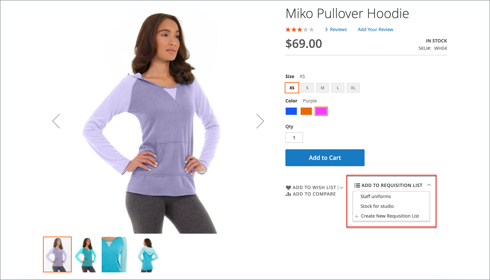
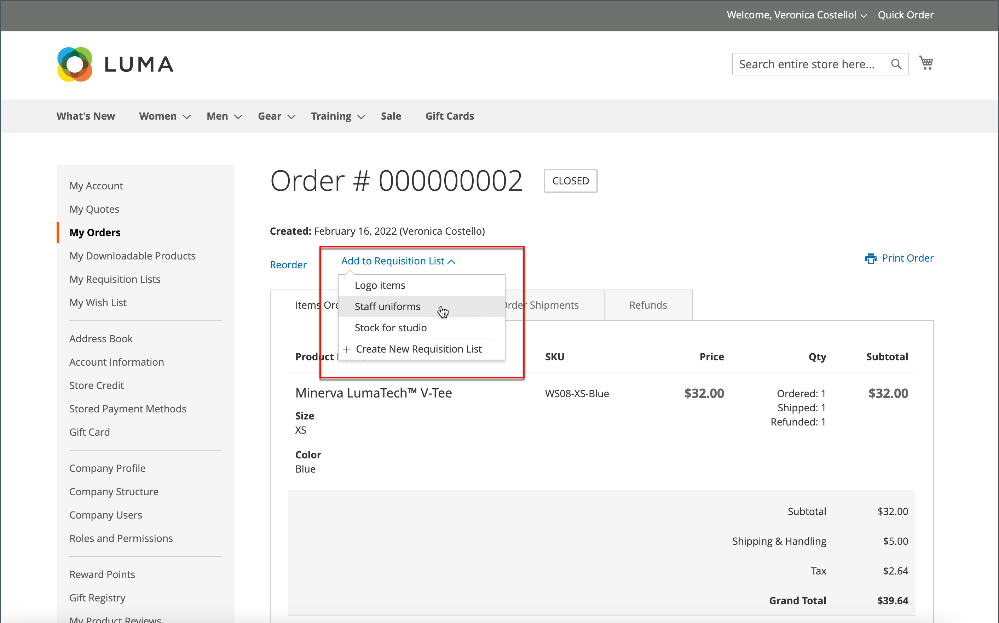

# Anforderungslisten

Die Verwendung einer Anforderungsliste spart Zeit beim Kauf häufig bestellter Produkte, da Artikel direkt aus der Liste in den Warenkorb gelegt werden. Käufer können mehrere Listen verwalten, die sich auf Produkte von verschiedenen Anbietern, Käufern, Teams, Kampagnen oder auf alles andere konzentrieren, was ihren Workflow optimiert. Die Anforderungslistenfunktion steht angemeldeten Benutzern zur Verfügung.

>[!NOTE]
>
>Informationen zum Aktivieren von Anforderungslisten für Ihren Store finden Sie unter [Aktivieren von B2B-Funktionen](enable-basic-features.md). Für jedes Einkäuferkonto können je nach Konfiguration bis zu 999 Anforderungslisten [ werden](configure-requisition-lists.md).

Die Funktionalität der Anforderungsliste ähnelt der von Wunschlisten, mit den folgenden Unterschieden:

- Eine Anforderungsliste wird nach dem Versand von Artikeln an den Warenkorb nicht gelöscht. Es kann mehrmals verwendet werden.
- Die Benutzeroberfläche für Anforderungslisten verwendet eine kompakte Ansicht, um viele Elemente anzuzeigen.

{width="600" zoomable="yes"}

## Erstellen einer Anforderungsliste über das Konto-Dashboard

Ein angemeldeter Käufer, der einem Firmenkonto zugeordnet ist, kann über sein Konto-Dashboard eine Anforderungsliste erstellen.

1. Wählen Sie in der Seitenleiste ihres Kontos **[!UICONTROL My Requisition Lists]** aus.

1. Klicken Sie auf der _[!UICONTROL Requisition Lists]_Seite auf **[!UICONTROL Create New Requisition List]**.

1. Gibt den **[!UICONTROL Requisition List Name]** und die **[!UICONTROL Description]** ein.

   {width="300"}

1. Wenn Sie fertig sind, klicken Sie **[!UICONTROL Save]**.

## Erstellen einer Anforderungsliste von einer Produktseite aus

Ein angemeldeter Käufer, der mit einem Unternehmenskonto verknüpft ist, kann eine Anforderungsliste von einer Produktseite aus erstellen. Diese Methode bietet eine einfache Verknüpfung zum Erstellen der Liste und Hinzufügen des Produkts.

1. Auf der Produktdetailseite klickt der Käufer auf **[!UICONTROL Add to Requisition List]**.

1. Klicks **[!UICONTROL Create New Requisition List]**.

1. Gibt den **[!UICONTROL Requisition List Name]** und die **[!UICONTROL Description]** ein.

1. Wenn Sie fertig sind, klicken Sie **[!UICONTROL Save]**.

## Produkte zu einer Anforderungsliste hinzufügen

Einkäufer können Produkte aus folgenden Gründen zu einer Anforderungsliste hinzufügen:

- Produktseiten
- Eine Katalogseite
- Der Warenkorb
- Bestehende Bestellungen
- Vorhandene Anführungszeichen

### Von einer Produktdetailseite

1. In der Storefront wechselt der Käufer zur Detailseite des Produkts, das der Anforderungsliste hinzugefügt werden soll.

1. Klicken Sie auf **[!UICONTROL Add to Requisition List]** und führen Sie einen der folgenden Schritte aus:

   - Wählt eine vorhandene Anforderungsliste aus.
   - Erstellt eine Anforderungsliste.

   {width="700" zoomable="yes"}

### Von einer Katalogseite aus

1. Der Käufer wechselt von der Storefront zur Katalogseite, die das Produkt enthält, das der Anforderungsliste hinzugefügt werden soll.

1. Bewegen Sie den Mauszeiger über das Produkt.

1. Klicken Sie auf **[!UICONTROL Add to Requisition List]** und führen Sie einen der folgenden Schritte aus:

   - Wählt eine vorhandene Anforderungsliste aus.
   - Erstellt eine Anforderungsliste.

   {width="700" zoomable="yes"}

### Aus einer vorhandenen Bestellung

1. In der Seitenleiste des Konto-Dashboards wählt der Käufer **[!UICONTROL My Orders]** aus.

1. Klicken Sie oben in der Bestellung auf **[!UICONTROL Add to Requisition List]** und führen Sie einen der folgenden Schritte aus:

   - Wählt eine vorhandene Anforderungsliste aus.
   - Erstellt eine Anforderungsliste.

   {width="700" zoomable="yes"}

### Aus einem vorhandenen Angebot

Über ein verhandelbares Angebot können Einkäufer die Option &quot;[!UICONTROL Move to Requisition List]&quot; verwenden, um Produkte aus dem Angebot in eine vorhandene Anforderungsliste zu verschieben. Wenn keine Anforderungslisten vorhanden sind, ist die [!UICONTROL Move to Requisition List] nicht verfügbar.

1. In der Seitenleiste des Konto-Dashboards wählt der Käufer **[!UICONTROL My Quotes]** aus.

1. Suchen Sie das gewünschte Angebot in der Liste und greifen Sie darauf zu.

1. Wählen Sie auf der Registerkarte [!UICONTROL Items Quoted] das zu verschiebende Produkt aus.

1. Wählen Sie mithilfe des Dropdown-[!UICONTROL Select] in der Spalte &quot;[!UICONTROL Actions]&quot; für den Produktzeileneintrag **[!UICONTROL Move to Requisition list]**.

1. Auswahl der Anforderungsliste für die ausgewählten Artikel

1. Klicken Sie auf **[!UICONTROL Move item to Requisition List]**.

Weitere Informationen zu B2B-Angeboten finden [ unter „Meine ](account-dashboard-my-quotes.md)&quot;.

### Aus dem Warenkorb

1. Unter dem Artikel klickt der Käufer auf das Menü &quot;**[!UICONTROL Add to Requisition List]**&quot; und führt einen der folgenden Schritte aus:

   - Wählt eine vorhandene Anforderungsliste aus.
   - Erstellt eine Anforderungsliste.

   {width="700" zoomable="yes"}

## Aktualisierte Anforderungsliste anzeigen

Wenn ein Käufer bei seinem Konto angemeldet ist, kann er eine der folgenden Methoden verwenden, um eine seiner Anforderungslisten anzuzeigen.

{width="700" zoomable="yes"}

### Vom Konto-Dashboard

1. Wählen Sie in der Seitenleiste ihres Konto-Dashboards **[!UICONTROL My Requisition Lists]** aus.

1. Klicken Sie in der Liste der Anforderungslisten auf **[!UICONTROL View]** in der Spalte _Aktionen_ .

### Von jeder Storefront-Seite

1. Klicken Sie oben auf der Seite in der Leiste „Schnelllinks“ auf den jeweiligen Benutzernamen.

1. Wählen Sie im Menü **[!UICONTROL My Requisition Lists]** aus.
