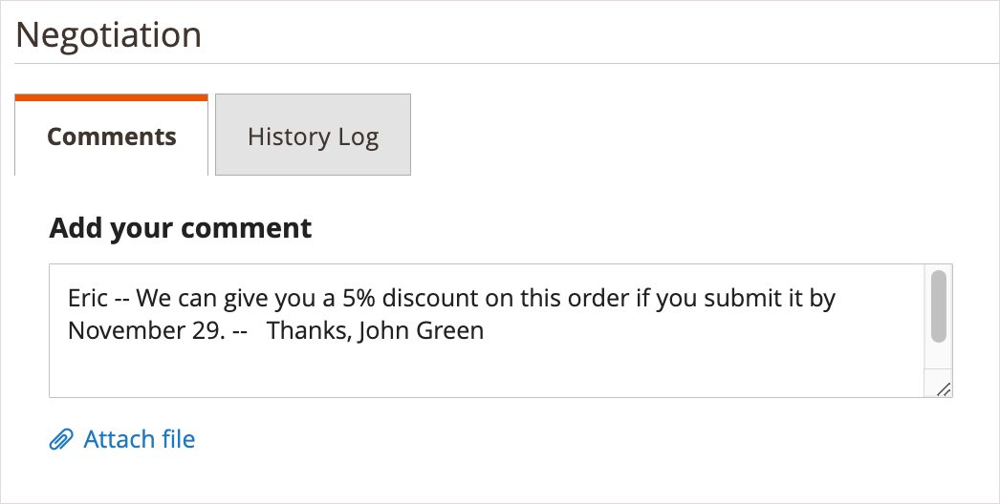

# Initiieren eines Angebots für einen Käufer

Wenn Anführungszeichen in der Konfiguration der [Verkaufsfunktionen](configure-quotes.md) aktiviert sind, kann ein Vertriebsmitarbeiter den Verhandlungsprozess mit einem Firmenkäufer starten, indem er ein Angebot vom Administrator erstellt.

- Entwurfsangebote sind nur für den Verkäufer sichtbar.
- Kostenentwürfe können erst eingereicht werden, wenn der Vertriebsmitarbeiter Artikel, relevante Rabatte und Hinweise zur Erstellung des ersten Angebots für den Käufer hinzufügt.
- Ein Verkäufer kann ein Angebot aus den Anführungszeichen oder dem Kundenraster erstellen.

Der Vertriebsmitarbeiter sendet das Angebot an den Käufer, um den Verhandlungsprozess einzuleiten. Siehe [Ein Zitat verhandeln](quote-price-negotiation.md).

## Angebotserstellung für Vertriebsmitarbeiter

Ein Vertriebsmitarbeiter kann ein Angebot aus den Anführungszeichen oder dem Kundenraster erstellen.

>[!NOTE]
>
>Eine Videodemo eines Verkäufers, der ein Angebot für einen Käufer erstellt, finden Sie unter [Verkaufsmitarbeiter initiiert das Angebot](https://experienceleague.adobe.com/docs/commerce-learn/tutorials/b2b/b2b-quote/sales-rep-initiates-quote.html) in _Videos und Tutorials in Commerce_.

### Erstellen eines Zitats aus dem Raster &quot;Anführungszeichen&quot;

1. Der Vertriebsmitarbeiter meldet sich beim Administrator als Administrator mit [Berechtigung für Verkaufsvorgänge](../systems/permissions.md) an, um Angebote zu verwalten.

1. Wechseln Sie im Admin zum Raster [!UICONTROL Quotes] , indem Sie **[!UICONTROL Sales]** auswählen und dann auf **[!UICONTROL Quotes]** klicken.

1. Erstellen Sie ein Angebot für einen Käufer.

   - Wählen Sie im Raster Anführungszeichen die Option **[!UICONTROL Create New Quote]** aus.

     {width="700" zoomable="yes"}

   - Wählen Sie auf der Seite [!UICONTROL Create New Quote] den Kunden (Firmenkäufer) aus, um das Angebot zu erstellen.

     {width="700" zoomable="yes"}

     Ein neues Anführungszeichen wird im Status `Draft` angezeigt.

     {width="700" zoomable="yes"}

   - Aktualisieren Sie den Anführungszeichen und ändern Sie das Ablaufdatum nach Bedarf.

   - Speichern Sie das Anführungszeichen als Entwurf.

## Vorbereiten des Kurses für den Käufer

Fügen Sie nach der Erstellung des Angebotsentwurfs Produktartikel hinzu, gewähren Sie Rabatte und kommunizieren Sie mit dem Käufer, indem Sie Kommentare und alle damit verbundenen Dateien zum Angebot hinzufügen. Senden Sie dann das Angebot an den Käufer zur Überprüfung oder speichern Sie es als Entwurf.

1. Fügen Sie dem Anführungszeichen Elemente hinzu, indem Sie **[!UICONTROL Add Product By SKU]** auswählen. Geben Sie die SKU-Nummer und -Menge ein und wählen Sie dann **[!UICONTROL Add Product]** aus.

   {width="675" zoomable="yes"}

1. Wenden Sie bei Bedarf Rabatte für Zeileneinträge auf Produkte an.

   - Wählen Sie im Aktionsmenü [!UICONTROL Select] die Option **[!UICONTROL Discount Item]**.

   - Wählen Sie im Formular [!UICONTROL Discount Line item] den Wert **[!UICONTROL Discount Type]** aus.

     {width="675" zoomable="yes"}

   - Geben Sie im Feld [!UICONTROL Discount] den Wert für den Rabatttyp ein. Wenn Sie beispielsweise einen prozentualen Rabatt ausgewählt haben, geben Sie 10 ein, um einen 10-%-Rabatt auf den Zeileneintrag anzuwenden.

   - [!BADGE 1.5.0-Beta-Funktionen]{type=Informative url="/help/b2b/release-notes.md" tooltip="Nur für Beta-Programmteilnehmer verfügbar"}

     Nach Bestätigung der Änderung wird der angewendete Rabattbetrag durch die Zeileneintrag-Attribute im Produktraster aktualisiert. Wenn der Rabatt gesperrt ist, wird ein Sperrsymbol angezeigt.

1. Wenden Sie bei Bedarf einen Rabatt auf Anführungszeichen an:

   - Wählen Sie im Abschnitt [!UICONTROL Quote Totals - Negotiated Price] den Rabatttyp aus und geben Sie dann den anzuwendenden Wert ein.

     {width="700" zoomable="yes"}

   Das Produktraster wird aktualisiert, um den Rabatt anzuzeigen.

1. Zusätzliche Informationen für den Käufer hinzufügen.

   Fügen Sie auf dem Tab **[!UICONTROL Negotiation - Comments]** einen Hinweis hinzu und fügen Sie alle für den Käufer erforderlichen unterstützenden Dateien hinzu.

   {width="700" zoomable="yes"}

   Standardmäßig kann eine [angehängte Datei](configure-quotes.md) in einem der folgenden Dateiformate bis zu 2 MB groß sein: DOC, DOCX, XLS, XLSX, PDF, TXT, JPG oder JPEG, PNG.

1. Verarbeiten Sie das Anführungszeichen.

   Speichern Sie das Angebot als Entwurf oder schicken Sie es an den Käufer.

   - Wenn Sie das Anführungszeichen als Entwurf speichern, wird der Status auf `Draft` aktualisiert und eine Bestätigungsmeldung wird angezeigt.

   - Wenn Sie das Angebot an den Käufer senden, ändert sich der Status in `Submitted`. Der Käufer erhält eine E-Mail-Benachrichtigung, um das Angebot zu überprüfen. Das Angebot ist gesperrt, bis der Käufer es zur weiteren Verhandlung zurückgibt. Der Verkäufer kann das Angebot über das Zitat-Raster oder das Kundenraster anzeigen.

## Anzeigen und Erstellen von Anführungszeichen aus dem Kundenraster

1. Wechseln Sie im Admin zum Raster [!UICONTROL Customer] , indem Sie **[!UICONTROL Customers]** auswählen und dann auf **[!UICONTROL All Customers]** klicken.

1. Wählen Sie die Kunden-ID für einen Firmenkäufer aus.

   {width="700" zoomable="yes"}

1. Wählen Sie **[!UICONTROL Edit]** aus, um die Kundeninformationen anzuzeigen.

1. Erstellen Sie ein Angebot für den Kunden, indem Sie auf &quot;**[!UICONTROL Create Quote]**&quot;klicken und dem Prozess folgen, um den Entwurf des Angebots zu aktualisieren und ihn an den Kunden zu senden.

1. Zeigen Sie die vorhandenen Anführungszeichen von Kunden an, indem Sie **[!UICONTROL Quotes]** auswählen.

   {width="700" zoomable="yes"}

1. Öffnen Sie ein Anführungszeichen, indem Sie **[!UICONTROL View]** auswählen.

Weitere Informationen zur Verwaltung des Anführungszeichenverhandelungsprozesses finden Sie unter [Anführungszeichen verhandeln](quote-price-negotiation.md)
