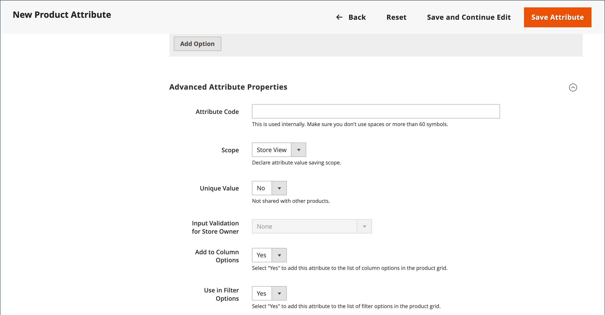
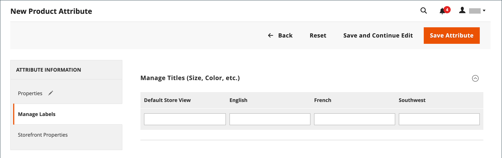
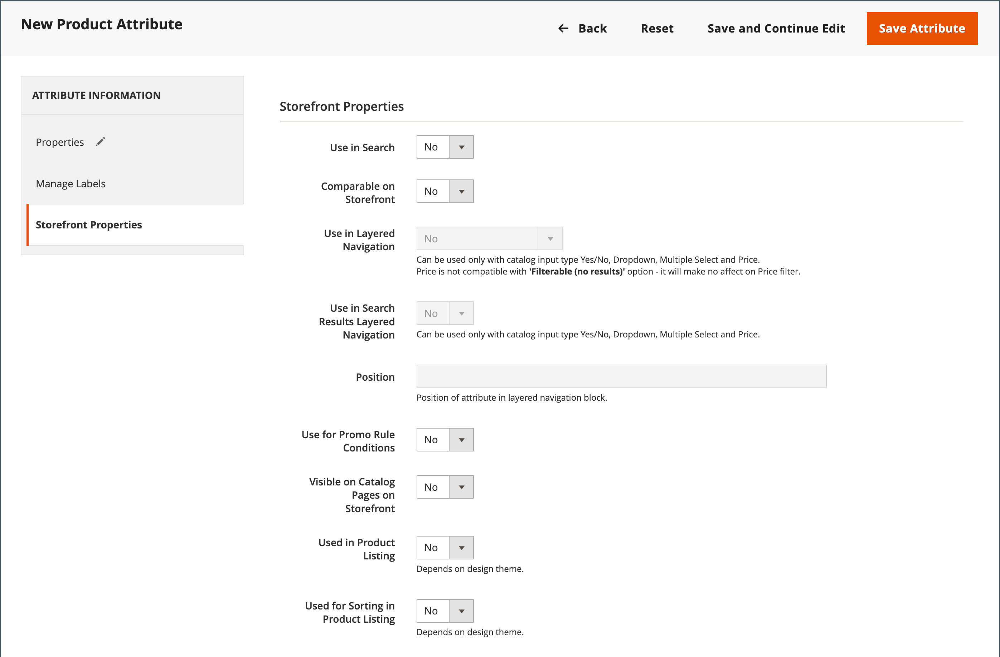

# Produktattribute erstellen und löschen

Sie können Attribute erstellen, während Sie an einem Produkt oder auf der _[!UICONTROL Product Attributes]_arbeiten. Die folgenden Schritte zeigen, wie Sie Attribute über das Menü_[!UICONTROL Stores]_ erstellen.

## Schritt 1: Grundlegende Attributeigenschaften beschreiben

1. Navigieren Sie in _Admin_-Seitenleiste zu **[!UICONTROL Stores]** > _[!UICONTROL Attributes]_>**[!UICONTROL Product]**.

1. Klicken Sie auf **[!UICONTROL Add New Attribute]**.

   {width="600" zoomable="yes"}

1. Geben Sie **[!UICONTROL Default Label]** einen Titel ein, der das Attribut identifiziert.

1. Um den Typ des Eingabedialogs zu bestimmen, der für die Dateneingabe verwendet wird, legen Sie **[!UICONTROL Catalog Input Type for Store Owner]** auf einen der folgenden Werte fest:

   | Eigenschaft | Beschreibung |
   |--- |--- |
   | `Text Field` | Ein einzeiliges Eingabefeld für Text. |
   | `Text Area` | Ein mehrzeiliges Eingabefeld zum Eingeben von Textabsätzen, z. B. eine Produktbeschreibung. Sie können den WYSIWYG-Editor verwenden, um den Text mit HTML-Tags zu formatieren, oder die Tags direkt in den Text eingeben. |
   | `Text Editor` | Ein voll funktionsfähiger Texteditor am Attributspeicherort. |
   | Datum | Zeigt einen Datumswert im [bevorzugten Format](attributes-input-types.md#date-and-time-options) und [Zeitzone](../getting-started/store-details.md#locale-options) an. Datumswerte können aus einer Liste oder einem Kalender ausgewählt werden (  ).   **_Hinweis _**Je nach Systemkonfiguration können_Admin _-Benutzer Datumsangaben direkt in ein Feld eingeben oder ein Datum aus dem Kalender oder der Liste auswählen. Weitere Informationen zum Angeben von Datums- und Uhrzeitwerten finden Sie unter [Optionen für Datum und Uhrzeit](attributes-input-types.md#date-and-time-options). |
   | `Yes/No` | Zeigt eine Dropdown-Liste mit vordefinierten Optionen `Yes` und `No` an. |
   | `Dropdown` | Zeigt eine Dropdown-Liste mit Werten an, die nur eine einzige Auswahl akzeptieren. Der Dropdown-Eingabetyp ist eine Schlüsselkomponente von [konfigurierbaren Produkten](product-create-configurable.md). |
   | `Multiple Select` | Zeigt eine Dropdown-Liste mit Werten an, die mehrere Auswahlmöglichkeiten akzeptieren. |
   | `Price` | Dieser Eingabetyp wird verwendet, um Preisfelder zu erstellen, die zusätzlich zu den vordefinierten Attributen erstellt werden: Preis, Sonderpreis, Stufenpreis und Kosten. Die verwendete Währung wird von Ihrer Systemkonfiguration bestimmt. |
   | `Media Image` | Ordnet einem Produkt ein zusätzliches Bild zu, z. B. ein Produktlogo, Pflegehinweise oder Zutaten von einem Lebensmitteletikett. Wenn Sie dem Attributsatz eines Produkts ein Medienbildattribut hinzufügen, wird es zu einem zusätzlichen Bildtyp, zusammen mit „Basis“, „Klein“ und „Miniatur“. Das Medienbildattribut kann aus dem „Storefront[Medienbrowser“ ](catalog-images-video.md#storefront-media-browser) werden. |
   | `Fixed Product Tax` | Ermöglicht die Definition [FPT](../stores-purchase/fixed-product-tax.md)Tarife basierend auf den Anforderungen Ihres Gebietsschemas. |
   | `Visual Swatch` | Zeigt ein Farbfeld an, das die Farbe, Textur oder das Muster eines konfigurierbaren Produkts darstellt. Ein [visuelles Farbfeld](swatches.md) kann mit einem hexadezimalen Farbwert ausgefüllt werden oder ein hochgeladenes Bild anzeigen, das die Farbe, das Material, die Textur oder das Muster der Option darstellt. |
   | `Text Swatch` | Eine textbasierte Darstellung einer konfigurierbaren Produktoption, die häufig für die Größe verwendet wird. [Textmuster](swatches.md#text-based-swatches) können auch hexadezimale Farbwerte enthalten. |
   | `Page Builder` | Ein voll funktionsfähiger [Page Builder](../page-builder/introduction.md)-Arbeitsbereich am Attributspeicherort, der das Hinzufügen ansprechender Inhalte zur Produktseite erleichtert. |

   {style="table-layout:auto"}

1. Wenn Sie eine Optionsauswahl benötigen, bevor der Kunde das Produkt kaufen kann, setzen Sie **[!UICONTROL Values Required]** auf `Yes`.

1. Gehen Sie für die Eingabetypen [!UICONTROL Dropdown] und [!UICONTROL Multiple Select] wie folgt vor:

   - Klicken Sie unter _[!UICONTROL Manage Options]_auf **[!UICONTROL Add Option]**.

   - Geben Sie den ersten Wert ein, der in der Liste angezeigt werden soll.

     Sie können einen Wert für den Administrator und eine Übersetzung des Werts für jede Shop-Ansicht eingeben. Wenn Sie nur eine Store-Ansicht haben, können Sie nur den Admin-Wert eingeben und er wird auch für die Storefront verwendet.

   - Klicken Sie auf **[!UICONTROL Add Option]** und wiederholen Sie den vorherigen Schritt für jede Option, die Sie in die Liste aufnehmen möchten.

   - Wählen Sie **[!UICONTROL Is Default]** aus, um die Option als Standardwert zu verwenden.

   {width="600" zoomable="yes"}

## Schritt 2: Erweiterte Eigenschaften beschreiben (falls erforderlich)

1. Geben Sie einen eindeutigen **[!UICONTROL Attribute Code]** in Kleinbuchstaben und ohne Leerzeichen ein.

   {width="600" zoomable="yes"}

   Die verfügbaren Optionen hängen von der _[!UICONTROL Catalog Input Type for Store Owner]_ab.

1. Legen Sie **[!UICONTROL Scope]** fest, um anzugeben, wo in [Store-](../getting-started/websites-stores-views.md)&quot; das Attribut verwendet werden kann.

1. Wenn Sie eine doppelte Werteingabe verhindern möchten, setzen Sie **[!UICONTROL Unique Value]** auf `Yes`.

1. Führen Sie für Eingabetypen, bei denen es sich um eingegebene Werte handelt, einen Gültigkeitstest für alle in ein Textfeld eingegebenen Daten durch, indem Sie **[!UICONTROL Input Validation for Store Owner]** auf den Datentyp festlegen, den das Feld enthalten soll.

   Dieses Feld ist nicht für Eingabetypen mit ausgewählten Werten verfügbar. Der Test kann Folgendes validieren:

   - `Decimal Number`
   - `Integer Number`
   - `Email`
   - `URL`
   - `Letters`
   - `Letters (a-z, A-Z) or Numbers (0-9)`

   {width="400"}

1. Um dieses Attribut zur &quot;[&quot; hinzuzufügen](products-list.md) legen Sie die folgenden Optionen auf `Yes` fest.

   - **Zu Spaltenoptionen hinzufügen** - Schließt das Attribut als Spalte in die _[!UICONTROL Products]_ein.
   - **In Filteroptionen verwenden** - Fügt der Spaltenüberschrift in der _[!UICONTROL Products]_ein Filtersteuerelement hinzu.

## Schritt 3: Feldbezeichnung eingeben

1. Wählen Sie in der linken Navigationsleiste die Option **[!UICONTROL Manage Labels]**.

1. Geben Sie einen **[!UICONTROL Title]** ein, der als Titel für das Feld verwendet werden soll.

   Wenn Ihr Store in verschiedenen Sprachen verfügbar ist, können Sie für jede Ansicht einen übersetzten Titel eingeben.

   {width="600" zoomable="yes"}

## Schritt 4: Beschreiben Sie die Eigenschaften der Storefront

1. Wählen Sie in der linken Navigationsleiste die Option **[!UICONTROL Storefront Properties]**.

   {width="600" zoomable="yes"}

   Die verfügbaren Optionen hängen von der _[!UICONTROL Catalog Input Type for Store Owner]_ab.

1. Wenn das Attribut für die Suche verfügbar sein soll, setzen Sie **[!UICONTROL Use in Search]** auf `Yes`.

   - Legen Sie den **[!UICONTROL Search Weight]** fest, um zu steuern, wo das Element in den Suchergebnissen angezeigt werden soll: 1 (niedrigste Gewichtung) bis 10 (höchste Gewichtung).

   - Legen Sie die **[!UICONTROL Visible in Advanced Search]** nach Bedarf fest. Weitere Informationen finden Sie unter [Erweiterte Suche](search.md#advanced-search).

1. Um das Attribut in den Produktvergleich aufzunehmen, setzen Sie **[!UICONTROL Comparable on Storefront]** auf `Yes`.

1. Gehen Sie für die Dropdown-Felder „Mehrere auswählen“ und „Preis“ wie folgt vor:

   - Um das -Attribut als Filter in der mehrschichtigen Navigation zu verwenden, setzen Sie **[!UICONTROL Use in Layered Navigation]** auf `Yes`.

   - Um das -Attribut in der mehrschichtigen Navigation auf Suchergebnisseiten zu verwenden, setzen Sie **[!UICONTROL Use in Search Results Layered Navigation]** auf `Yes`.

   - Geben Sie **[!UICONTROL Position]** eine Zahl ein, um die relative Position des Attributs im mehrschichtigen Navigationsblock anzugeben.

1. Um das Attribut in Preisregeln zu verwenden, setzen Sie **[!UICONTROL Use for Promo Rule Conditions]** auf `Yes`.

1. Damit der Text mit HTML formatiert werden kann, legen Sie **[!UICONTROL Allow HTML Tags on Frontend]** auf `Yes` fest.

   Durch diese Einstellung wird der WYSIWYG-Editor für das Feld verfügbar.

1. Um das Attribut in die Produktseite aufzunehmen, setzen Sie **[!UICONTROL Visible on Catalog Pages on Storefront]** auf `Yes`.

1. Füllen Sie die folgenden Einstellungen aus, wenn sie von Ihrem Design unterstützt werden:

   - Um das Attribut in Produktlisten aufzunehmen, setzen Sie **[!UICONTROL Used in Product Listing]** auf `Yes`.

   - Um das -Attribut als Sortierparameter für Produktlisten zu verwenden, setzen Sie **[!UICONTROL Used for Sorting in Product Listing]** auf `Yes`.

1. Klicken Sie abschließend auf **[!UICONTROL Save Attribute]**.

## Schritt 5: Zuweisen des erstellten Attributs zum Attributsatz

Damit ein Attribut auf der Seite „Produkterstellung“ sichtbar ist, fügen Sie es einem bestimmten Attributsatz hinzu.

1. Nachdem Sie die vorherigen Schritte abgeschlossen haben, navigieren Sie zu **[!UICONTROL Stores]** > _[!UICONTROL Attributes]_>**[!UICONTROL Attribute Set]**.

1. Wählen Sie das in der Liste benötigte Attributset aus und öffnen Sie es im Bearbeitungsmodus.

1. Ziehen Sie das erstellte Attribut aus der **[!UICONTROL Unassigned Attributes]** in den entsprechenden Ordner in der Spalte **Gruppen**.

1. Klicken Sie abschließend auf **[!UICONTROL Save]**.

## Attribute für konfigurierbare Produkte

Jedes Attribut, das als Dropdown-Liste von Optionen für ein [konfigurierbares Produkt](product-create-configurable.md) verwendet wird, muss die folgenden Eigenschaften aufweisen:

| Eigenschaft | Wert |
|----------|------ |
| Katalogeingabetyp für Store-Inhaber | Dropdown |
| Umfang | Global |

{style="table-layout:auto"}

## Löschen eines Attributs

Wenn ein Attribut gelöscht wird, wird es aus allen zugehörigen Produkten und Attributsätzen entfernt. Systemattribute sind Teil der Kernfunktionalität Ihres Stores und können nicht gelöscht werden.

Bevor Sie ein Attribut löschen, stellen Sie sicher, dass es derzeit von keinem Produkt in Ihrem Katalog verwendet wird. Eine einfache Möglichkeit, um festzustellen, ob ein Attribut verwendet wird, besteht darin, das Tool [Export](../systems/data-export.md) zu verwenden, um die Liste der Produktentitätsattribute zu überprüfen. Wenn das Attribut nicht in der Liste enthalten ist, wird es von keinem Produkt im Katalog verwendet.

**_So löschen Sie ein Attribut:_**

1. Navigieren Sie in _Admin_-Seitenleiste zu **[!UICONTROL Stores]** > _[!UICONTROL Attributes]_>**[!UICONTROL Product]**.

1. Suchen Sie das Attribut in der Liste und öffnen Sie es im Bearbeitungsmodus.

1. Klicken Sie auf **[!UICONTROL Delete Attribute]**.

   {width="600" zoomable="yes"}

1. Wenn Sie zum Bestätigen aufgefordert werden, klicken Sie auf **[!UICONTROL OK]**.
