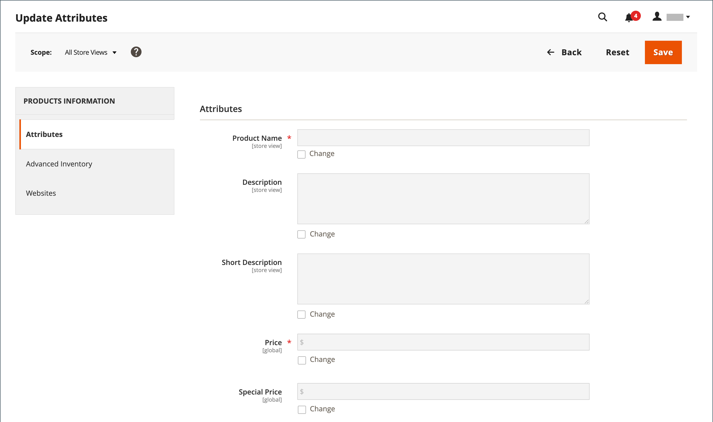

# Massenaktualisierungen für Produktattribute

Verwenden Sie das _[!UICONTROL Update Attributes]_-Tool, um ein oder mehrere Attribute in Ihren Produkten zu ändern. Mit diesem Tool können Sie wesentliche Änderungen auf eine große Produktgruppe anwenden.

1. Navigieren Sie in der _Admin_-Seitenleiste zu **[!UICONTROL Catalog]** > **[!UICONTROL Products]**.

1. Wählen Sie die Produkte aus, deren Quellen Sie ändern möchten.

   Suchen Sie nach den Produkten und aktivieren Sie diese Kontrollkästchen.

1. Klicken Sie oben auf das **[!UICONTROL Actions]** und wählen Sie **[!UICONTROL Update Attributes]** aus.

   {width="600" zoomable="yes"}

1. Aktualisieren Sie das Attribut, den erweiterten Bestand oder die Website-Daten für die ausgewählten Produkte entsprechend Ihren Anforderungen.

   {width="600" zoomable="yes"}

1. Klicken Sie abschließend auf **[!UICONTROL Save]**.
