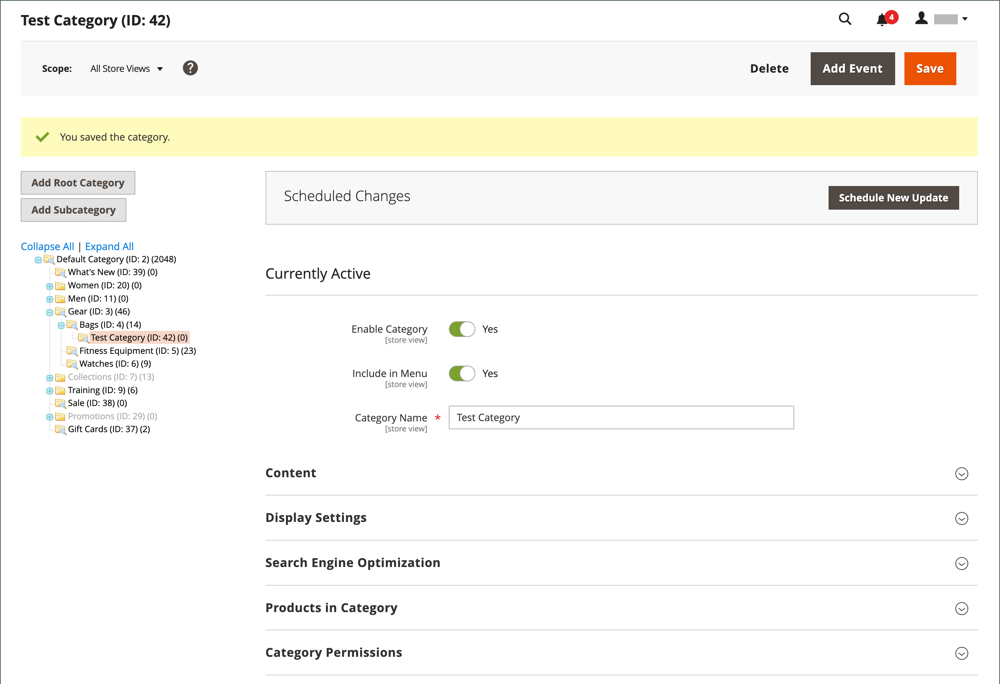
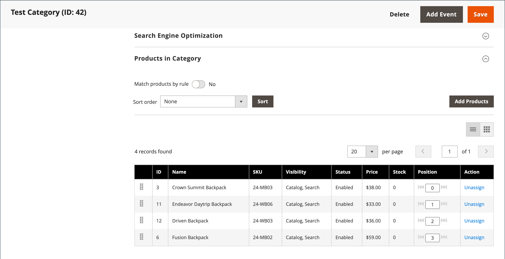

# Flache Kataloge

>[!IMPORTANT]
>
>Die Verwendung eines flachen Katalogs wird nicht mehr als Best Practice empfohlen. Es ist bekannt, dass die kontinuierliche Verwendung dieser Funktion zu Leistungseinbußen und anderen Indizierungsproblemen führt. Eine ausführliche Beschreibung und Lösung finden Sie im [Hilfe-Center](https://experienceleague.adobe.com/docs/commerce-knowledge-base/kb/troubleshooting/miscellaneous/slow-performance-slow-and-long-running-crons.html).  Betroffene Versionen sind unter anderem:  - Adobe Commerce auf Cloud-Infrastruktur, 2.3.x und höher - Adobe Commerce (On-Premise), 2.3.x und höher - Magento Open Source, 2.3.x und höher   In jeder Release-Version funktionieren einige Erweiterungen nur mit flachen Tabellen, was ein Risiko darstellt, wenn Sie flache Tabellen deaktivieren. Wenn Sie wissen, dass Sie einige Erweiterungen haben, die Indexer für flache Kataloge verwenden, müssen Sie sich dieses Risikos bewusst sein, wenn Sie diese Werte auf `No` setzen.

Commerce speichert Katalogdaten in der Regel in mehreren Tabellen, basierend auf dem Entitätenattribut-Wert-Modell (EAV). Da Produktattribute in vielen Tabellen gespeichert sind, sind SQL-Abfragen manchmal lang und komplex.

Im Gegensatz dazu werden bei einem flachen Katalog Tabellen im laufenden Betrieb erstellt, wobei jede Zeile alle erforderlichen Daten zu einem Produkt oder einer Kategorie enthält. Ein flacher Katalog wird automatisch aktualisiert - entweder jede Minute oder entsprechend Ihrem Cron-Auftrag. Eine flache Katalogindizierung kann auch die Verarbeitung von Katalog- und Warenkorbpreisregeln beschleunigen. Ein Katalog mit bis zu 500.000 Artikelnummern kann schnell als flacher Katalog indiziert werden.

>[!NOTE]
>
>Stellen Sie sicher, dass Sie die Konfiguration in einer Entwicklungsumgebung testen, bevor Sie einen flachen Katalog für einen Live Store aktivieren.

## Schritt 1: Flachen Katalog aktivieren

1. Navigieren Sie in _Admin_-Seitenleiste zu **[!UICONTROL Stores]** > _[!UICONTROL Settings]_>**[!UICONTROL Configuration]**.

1. Erweitern Sie im linken Bereich **[!UICONTROL Catalog]** und wählen Sie darunter **[!UICONTROL Catalog]**.

1. Erweitern Sie den _Storefront_-Abschnitt und gehen Sie folgendermaßen vor:

   - Legen Sie **[!UICONTROL Use Flat Catalog Category]** auf `Yes` fest. (Deaktivieren Sie bei Bedarf das Kontrollkästchen **[!UICONTROL Use system value]** .)

   - Legen Sie **[!UICONTROL Use Flat Catalog Product]** auf `Yes` fest.

   {width="700" zoomable="yes"}

1. Klicken Sie abschließend auf **[!UICONTROL Save Config]**.

1. Wenn Sie aufgefordert werden, den Cache zu aktualisieren, klicken Sie in der Systemmeldung auf **[!UICONTROL Cache Management]** und befolgen Sie die Anweisungen zum Aktualisieren des Caches.

## Schritt 2: Überprüfen Sie die Ergebnisse

Es gibt zwei Methoden, mit denen Sie die Ergebnisse überprüfen können.

### Methode 1: Überprüfen der Ergebnisse für ein einzelnes Produkt

1. Navigieren Sie in der _Admin_-Seitenleiste zu **[!UICONTROL Catalog]** > **[!UICONTROL Products]**.

1. Öffnen Sie ein Produkt im Bearbeitungsmodus.

1. Fügen Sie **[!UICONTROL Name]** den `_TEST` am Ende des Produktnamens hinzu.

1. Klicken Sie auf **[!UICONTROL Save]**.

1. Navigieren Sie auf einer neuen Browser-Registerkarte zur Startseite Ihres Stores und führen Sie folgende Schritte aus:

   - Suchen Sie nach dem bearbeiteten Produkt.

   - Verwenden Sie die Navigation , um zum Produkt unter der zugewiesenen Kategorie zu navigieren.

     Aktualisieren Sie bei Bedarf die Seite, um die Ergebnisse anzuzeigen. Die Änderung wird innerhalb einer Minute oder gemäß Ihrem [Cron](../systems/cron.md)-Zeitplan angezeigt.

   {width="700" zoomable="yes"}

### Methode 2: Überprüfen der Ergebnisse für eine Kategorie

1. Navigieren Sie in der _Admin_-Seitenleiste zu **[!UICONTROL Catalog]** > **[!UICONTROL Categories]**.

1. Überprüfen Sie in der oberen linken Ecke, ob **[!UICONTROL Store View]** auf `All Store Views` gesetzt ist.

   Wenn Sie dazu aufgefordert werden, klicken Sie zur Bestätigung auf **[!UICONTROL OK]** .

1. Wählen Sie in der Kategoriestruktur eine vorhandene Kategorie aus, klicken Sie auf **[!UICONTROL Add Subcategory]** und führen Sie folgende Schritte aus:

   - Geben Sie **[!UICONTROL Category Name]** `Test Category` ein.

   - Klicken Sie abschließend auf **[!UICONTROL Save]**.

     {width="600" zoomable="yes"}

   - Erweitern Sie  den Abschnitt **[!UICONTROL Products in Category]** und klicken Sie auf **[!UICONTROL Reset Filter]** , um alle Produkte anzuzeigen.

   - Aktivieren Sie das Kontrollkästchen mehrerer Produkte, die der neuen Kategorie hinzugefügt werden sollen.

   - Klicken Sie auf **[!UICONTROL Save]**.

   {width="600" zoomable="yes"}

1. Navigieren Sie auf einer neuen Browser-Registerkarte zur Startseite Ihres Stores und verwenden Sie die Store-Navigation, um zur von Ihnen erstellten Kategorie zu navigieren.

   Aktualisieren Sie bei Bedarf die Seite, um die Ergebnisse anzuzeigen. Die Änderung wird innerhalb einer Minute oder gemäß Ihrem Cron-Zeitplan angezeigt.

## Schritt 3: Entfernen der Testdaten

Gehen Sie folgendermaßen vor, um die Testdaten zu entfernen und den ursprünglichen Produktnamen und die Katalogkonfiguration wiederherzustellen.

### Entfernen der Testkategorie

1. Navigieren Sie in der _Admin_-Seitenleiste zu **[!UICONTROL Catalog]** > **[!UICONTROL Categories]**.

1. Wählen Sie in der Kategoriestruktur die von Ihnen erstellte Test-Unterkategorie aus.

1. Klicken Sie oben rechts auf **[!UICONTROL Delete]**.

1. Wenn Sie zum Bestätigen aufgefordert werden, klicken Sie auf **[!UICONTROL OK]**.

   Beim Entfernen dieser Kategorie werden die der Kategorie zugewiesenen Produkte nicht entfernt.

### Originalproduktname wiederherstellen

1. Navigieren Sie in der _Admin_-Seitenleiste zu **[!UICONTROL Catalog]** > **[!UICONTROL Categories]**.

1. Öffnen Sie das Testprodukt im Bearbeitungsmodus.

1. Entfernen Sie den `_TEST`, den Sie dem **[!UICONTROL Product Name]** hinzugefügt haben.

1. Klicken Sie oben rechts auf **[!UICONTROL Save]**.

### Wiederherstellen der ursprünglichen Katalogkonfiguration

1. Navigieren Sie in _Admin_-Seitenleiste zu **[!UICONTROL Stores]** > _[!UICONTROL Settings]_>**[!UICONTROL Configuration]**.

1. Erweitern Sie im linken Bereich **[!UICONTROL Catalog]** und wählen Sie darunter **[!UICONTROL Catalog]**.

1. Erweitern Sie den _Storefront_-Abschnitt und gehen Sie folgendermaßen vor:

   - Legen Sie **[!UICONTROL Use Flat Catalog Category]** auf `No` fest.

   - Legen Sie **[!UICONTROL Use Flat Catalog Product]** auf `No` fest.

1. Klicken Sie abschließend auf **[!UICONTROL Save Config]**.

1. Aktualisieren Sie bei Aufforderung den Cache.
