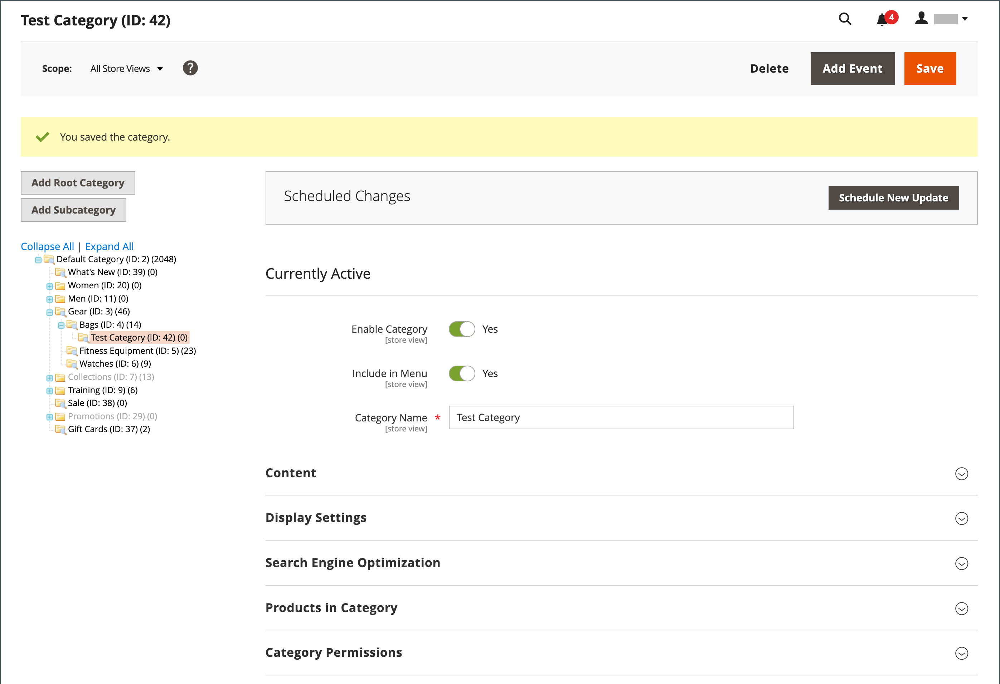

# Flachkataloge

>[!IMPORTANT]
>
>Die Verwendung eines flachen Katalogs wird nicht mehr als Best Practice empfohlen. Die kontinuierliche Verwendung dieser Funktion führt bekanntermaßen zu Leistungsbeeinträchtigungen und anderen Indizierungsproblemen. Eine ausführliche Beschreibung und Lösung finden Sie im [Hilfezentrum](https://experienceleague.adobe.com/docs/commerce-knowledge-base/kb/troubleshooting/miscellaneous/slow-performance-slow-and-long-running-crons.html).  Betroffene Versionen sind:  - Adobe Commerce in der Cloud-Infrastruktur, 2.3.x und höher - Adobe Commerce (On-Premise), 2.3.x und höher - Magento Open Source, 2.3.x und höher   Auf allen Release-Versionen funktionieren einige Erweiterungen nur mit flachen Tabellen, wodurch ein Risiko entsteht, wenn flache Tabellen deaktiviert werden. Wenn Sie wissen, dass Sie einige Erweiterungen haben, die Indexer für flache Kataloge verwenden, müssen Sie dieses Risiko beachten, wenn Sie diese Werte auf `No` setzen.

Commerce speichert Katalogdaten normalerweise in mehreren Tabellen, basierend auf dem Entitäts-/Attribut-Wert-Modell (EAV). Da Produktattribute in vielen Tabellen gespeichert werden, sind SQL-Abfragen manchmal lang und komplex.

Dagegen erstellt ein flacher Katalog dynamisch Tabellen, wobei jede Zeile alle erforderlichen Daten über ein Produkt oder eine Kategorie enthält. Ein flacher Katalog wird automatisch aktualisiert - entweder jede Minute oder entsprechend Ihrem Cron-Auftrag. Eine einfache Katalogindizierung kann auch die Verarbeitung von Katalog- und Warenkorbpreisregeln beschleunigen. Ein Katalog mit bis zu 500.000 SKUs kann schnell als flacher Katalog indexiert werden.

>[!NOTE]
>
>Bevor Sie einen flachen Katalog für einen Live Store aktivieren, testen Sie die Konfiguration in einer Entwicklungsumgebung.

## Schritt 1: Einfache Kataloge aktivieren

1. Wechseln Sie in der Seitenleiste _Admin_ zu **[!UICONTROL Stores]** > _[!UICONTROL Settings]_>**[!UICONTROL Configuration]**.

1. Erweitern Sie im linken Bedienfeld den Wert **[!UICONTROL Catalog]** und wählen Sie unter &quot;**[!UICONTROL Catalog]**&quot;.

1. Erweitern Sie den Abschnitt _Storefront_ und gehen Sie wie folgt vor:

   - Setzen Sie **[!UICONTROL Use Flat Catalog Category]** auf `Yes`. (Heben Sie bei Bedarf das Kontrollkästchen **[!UICONTROL Use system value]** auf.)

   - Setzen Sie **[!UICONTROL Use Flat Catalog Product]** auf `Yes`.

   {width="700" zoomable="yes"}

1. Klicken Sie nach Abschluss des Vorgangs auf **[!UICONTROL Save Config]**.

1. Wenn Sie aufgefordert werden, den Cache zu aktualisieren, klicken Sie in der Systemmeldung auf **[!UICONTROL Cache Management]** und befolgen Sie die Anweisungen zum Aktualisieren des Caches.

## Schritt 2: Ergebnisse überprüfen

Es gibt zwei Methoden, mit denen Sie die Ergebnisse überprüfen können.

### Methode 1: Überprüfen der Ergebnisse für ein einzelnes Produkt

1. Wechseln Sie in der Seitenleiste _Admin_ zu **[!UICONTROL Catalog]** > **[!UICONTROL Products]**.

1. Öffnen Sie ein Produkt im Bearbeitungsmodus.

1. Fügen Sie für **[!UICONTROL Name]** den Text `_TEST` am Ende des Produktnamens hinzu.

1. Klicken Sie auf **[!UICONTROL Save]**.

1. Navigieren Sie auf einer neuen Browser-Registerkarte zur Startseite Ihres Stores und führen Sie die folgenden Schritte aus:

   - Suchen Sie nach dem bearbeiteten Produkt.

   - Verwenden Sie die Navigation , um zum Produkt unter seiner zugewiesenen Kategorie zu navigieren.

     Aktualisieren Sie bei Bedarf die Seite, um die Ergebnisse anzuzeigen. Die Änderung wird innerhalb der Minute oder gemäß Ihrem [Cron](../systems/cron.md)-Zeitplan angezeigt.

   {width="700" zoomable="yes"}

### Methode 2: Überprüfen der Ergebnisse für eine Kategorie

1. Wechseln Sie in der Seitenleiste _Admin_ zu **[!UICONTROL Catalog]** > **[!UICONTROL Categories]**.

1. Überprüfen Sie in der linken oberen Ecke, ob **[!UICONTROL Store View]** auf `All Store Views` eingestellt ist.

   Klicken Sie bei entsprechender Aufforderung zur Bestätigung auf **[!UICONTROL OK]** .

1. Wählen Sie im Kategorienbaum eine vorhandene Kategorie aus, klicken Sie auf **[!UICONTROL Add Subcategory]** und führen Sie die folgenden Schritte aus:

   - Geben Sie für **[!UICONTROL Category Name]** den Wert `Test Category` ein.

   - Klicken Sie nach Abschluss des Vorgangs auf **[!UICONTROL Save]**.

     {width="600" zoomable="yes"}

   - Erweitern Sie  im Abschnitt **[!UICONTROL Products in Category]** und klicken Sie auf **[!UICONTROL Reset Filter]** , um alle Produkte anzuzeigen.

   - Aktivieren Sie das Kontrollkästchen der verschiedenen Produkte, die der neuen Kategorie hinzugefügt werden sollen.

   - Klicken Sie auf **[!UICONTROL Save]**.

   {width="600" zoomable="yes"}

1. Navigieren Sie auf einer neuen Browser-Registerkarte zur Startseite Ihres Stores und navigieren Sie mithilfe der Store-Navigation zu der von Ihnen erstellten Kategorie.

   Aktualisieren Sie bei Bedarf die Seite, um die Ergebnisse anzuzeigen. Die Änderung wird innerhalb der Minute oder entsprechend Ihrem Cron-Zeitplan angezeigt.

## Schritt 3: Testdaten entfernen

Führen Sie die folgenden Schritte aus, um die Testdaten zu entfernen und den ursprünglichen Produktnamen und die Katalogkonfiguration wiederherzustellen.

### Entfernen Sie die Testkategorie

1. Wechseln Sie in der Seitenleiste _Admin_ zu **[!UICONTROL Catalog]** > **[!UICONTROL Categories]**.

1. Wählen Sie in der Kategoriestruktur die von Ihnen erstellte Test-Unterkategorie aus.

1. Klicken Sie in der oberen rechten Ecke auf **[!UICONTROL Delete]**.

1. Klicken Sie bei Aufforderung zur Bestätigung auf **[!UICONTROL OK]**.

   Bei dieser Kategorieentfernung werden die der Kategorie zugewiesenen Produkte nicht entfernt.

### Originalproduktnamen wiederherstellen

1. Wechseln Sie in der Seitenleiste _Admin_ zu **[!UICONTROL Catalog]** > **[!UICONTROL Categories]**.

1. Öffnen Sie das Testprodukt im Bearbeitungsmodus.

1. Entfernen Sie den Text `_TEST` , den Sie dem **[!UICONTROL Product Name]** hinzugefügt haben.

1. Klicken Sie in der oberen rechten Ecke auf **[!UICONTROL Save]**.

### Wiederherstellen der ursprünglichen Katalogkonfiguration

1. Wechseln Sie in der Seitenleiste _Admin_ zu **[!UICONTROL Stores]** > _[!UICONTROL Settings]_>**[!UICONTROL Configuration]**.

1. Erweitern Sie im linken Bedienfeld den Wert **[!UICONTROL Catalog]** und wählen Sie unter &quot;**[!UICONTROL Catalog]**&quot;.

1. Erweitern Sie den Abschnitt _Storefront_ und gehen Sie wie folgt vor:

   - Setzen Sie **[!UICONTROL Use Flat Catalog Category]** auf `No`.

   - Setzen Sie **[!UICONTROL Use Flat Catalog Product]** auf `No`.

1. Klicken Sie nach Abschluss des Vorgangs auf **[!UICONTROL Save Config]**.

1. Wenn Sie dazu aufgefordert werden, aktualisieren Sie den Cache.
