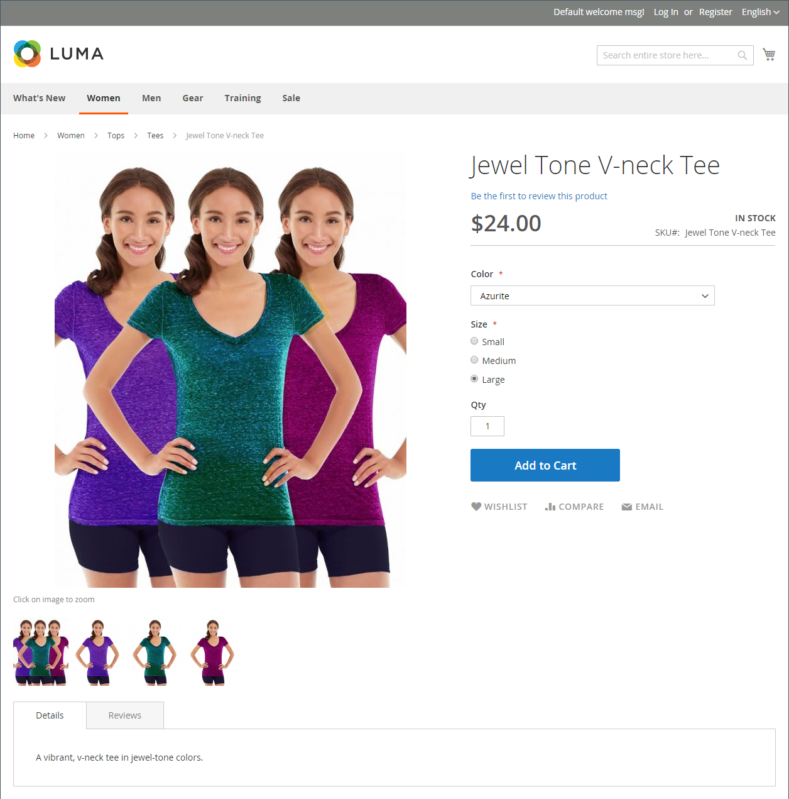
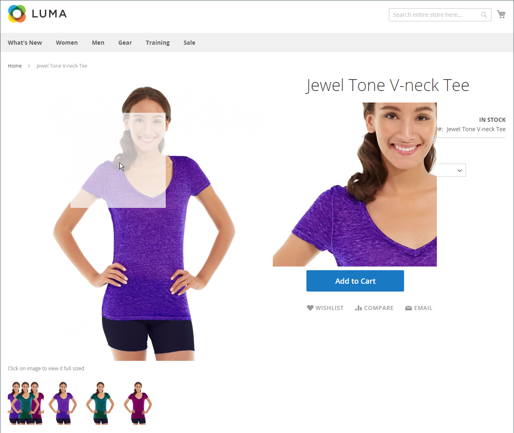

# Katalogbilder und Videos

Die Verwendung hochwertiger Bilder mit konsistenter Proportion verleiht Ihrem Katalog einen professionellen Look mit kommerzieller Attraktivität. Wenn Sie einen großen Katalog mit mehreren Bildern pro Produkt haben, können Sie problemlos Hunderte, wenn nicht Tausende von Produktbildern verwalten. Bevor Sie beginnen, richten Sie eine Namenskonvention für Ihre Bilddateien ein und organisieren Sie diese, damit Sie die Originale finden können, falls Sie sie benötigen.

{width="600" zoomable="yes"}

Ein einzelnes Produktbild wird im gesamten Katalog in verschiedenen Größen gerendert. Die Anzeigegröße des Bild-Containers auf der Seite wird im Stylesheet Ihres Designs definiert. Wo das Bild in Ihrem Store angezeigt wird, wird jedoch durch die Rolle bestimmt, die dem Bild zugewiesen ist. Das Hauptproduktbild bzw. _Basisbild_ muss groß genug sein, um die für das Zoomen erforderliche Vergrößerung zu erzeugen. Zusätzlich zum Hauptbild kann eine kleinere Version desselben Bildes in den Produktlisten oder als Miniaturansicht im Warenkorb angezeigt werden. Sie können ein Bild in der größten erforderlichen Größe hochladen oder ein [Adobe Stock](../content-design/adobe-stock.md)-Bild verwenden und Commerce die für jede Verwendung erforderlichen Größen rendern lassen. Für alle Rollen kann dasselbe Bild verwendet werden, oder jeder Rolle kann ein anderes Bild zugewiesen werden. Standardmäßig wird das erste hochgeladene Bild allen drei Rollen zugewiesen.

## Storefront-Medienbrowser

Der Medien-Browser auf der Produktseite zeigt mehrere Bilder, Videos oder Farbfelder an, die mit dem Produkt zusammenhängen. Jede Miniaturansicht kann eine andere Ansicht oder Variante des Produkts anzeigen. Der Käufer kann auf eine Miniaturansicht klicken, um die Medien-Assets zu durchsuchen. Obwohl die Position des Medien-Browsers je nach Thema variiert, befindet sich die Standardposition direkt unter dem Hauptbild auf der Produktseite. Steuerelemente für die Barrierefreiheit finden Sie unter [Barrierefreiheit der Navigation](../getting-started/navigation-accessibility.md).

{width="700" zoomable="yes"}

### Bild-Zoom

Wenn das [Basisbild](product-image.md) groß genug ist, um den Zoom-Effekt zu erzeugen, können Kunden einen vergrößerten Teil des Bildes sehen, wenn sie den Mauszeiger darüber bewegen. Wenn Zoom aktiviert ist, können Kunden auf das Hauptbild klicken und den Cursor bewegen, um verschiedene Teile des Bildes zu vergrößern. Die vergrößerte Auswahl wird rechts neben dem Bild angezeigt.

{width="700" zoomable="yes"}

### Leuchtkästen und Schieber

Es gibt viele Lichtboxen und Schieberegler von Drittanbietern, die Sie verwenden können, um die Präsentation Ihrer Produktbilder zu verbessern. Suchen Sie nach Erweiterungen in [Commerce Marketplace](../getting-started/commerce-marketplace.md).

## Fehlerbehebung bei Ressourcen

Hilfe bei der Fehlerbehebung bei Bild- und Videoproblemen finden Sie in den folgenden Artikeln in der Commerce-Support-Wissensdatenbank:

- [Produktbilder werden trotz der Rollen „Produktbild bearbeiten“ nicht angezeigt](https://experienceleague.adobe.com/docs/commerce-knowledge-base/kb/troubleshooting/storefront/product-images-do-not-display-despite-product-edit-image-roles.html)
- [Bilder speichern, die nach der Bereitstellung nicht angezeigt werden](https://experienceleague.adobe.com/docs/commerce-knowledge-base/kb/troubleshooting/storefront/store-images-not-displayed-after-deployment.html)
