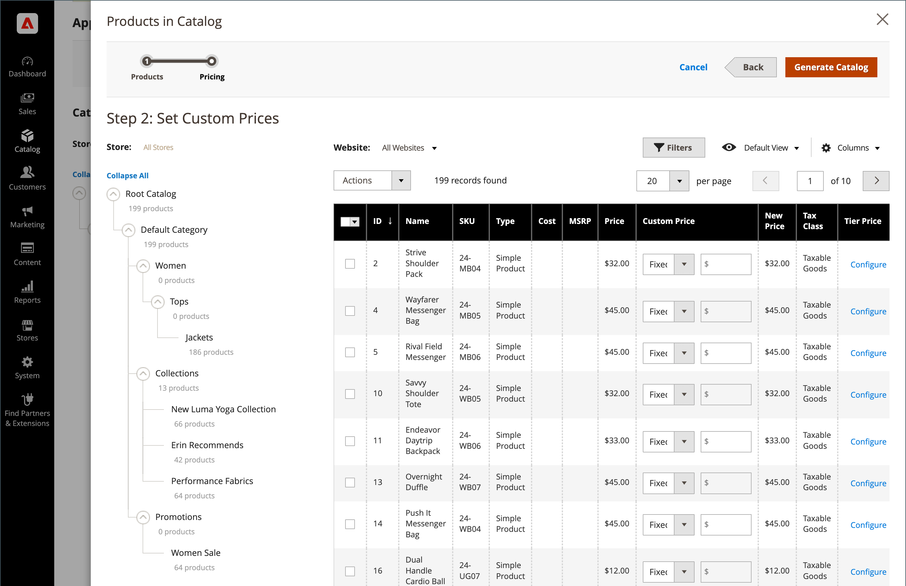

# Menü [!UICONTROL Catalog]

Das Menü [!UICONTROL Catalog] bietet einfachen Zugriff auf Tools zur Produkterstellung, Kategorie- und Lagerbestandsverwaltung sowie freigegebene Kataloge für benutzerdefinierte Preise in [B2B Stores](https://experienceleague.adobe.com/docs/commerce-admin/b2b/introduction.html).

{width="300" zoomable="yes"}

Klicken Sie in der Seitenleiste _Admin_ auf **[!UICONTROL Catalog]**.

## [!UICONTROL Products]

Erstellen Sie [Produkte](products-list.md) jedes Typs und verwalten Sie Ihren Bestand.

{width="700" zoomable="yes"}

## [!UICONTROL Categories]

Erstellen Sie die Struktur [category](categories.md) , die die Grundlage der Navigation Ihres Stores bildet.

{width="700" zoomable="yes"}

## [!UICONTROL Shared Catalogs]

Bei Geschäften mit installiertem und aktiviertem Adobe Commerce B2B-Speicher bieten Ihnen die [freigegebenen Kataloge](https://experienceleague.adobe.com/docs/commerce-admin/b2b/shared-catalogs/catalog-shared.html) die Möglichkeit, den verschiedenen Unternehmen benutzerdefinierte Preise zur Verfügung zu stellen.

{width="700" zoomable="yes"}
