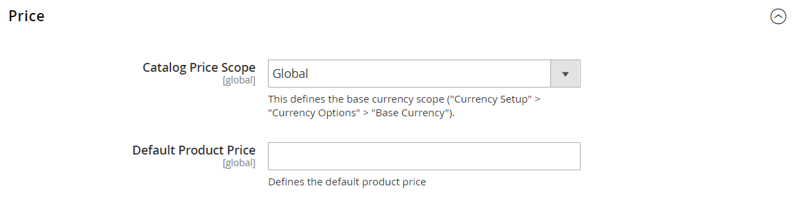

# Preissegment

Der Umfang der [Basiswährung](../stores-purchase/currency-configuration.md), die für Produktpreise verwendet wird, kann so konfiguriert werden, dass er auf globaler oder Website-Ebene angewendet wird. Wenn der Preis auf die globale Ebene angewendet wird, wird der gleiche Preis in der gesamten Store-Hierarchie verwendet. Wenn dasselbe Produkt auf Website-Ebene angewendet wird, kann es zu unterschiedlichen Preisen als Geschäfte verfügbar sein, die mit verschiedenen Websites verbunden sind. Standardmäßig ist der Umfang der Produktpreise global.

Verschiedene Faktoren können sich auf den Preis desselben Produkts an einem Ort und nicht an einem anderen auswirken. Beispielsweise können zusätzliche Vertriebskosten für das Produkt und andere Aspekte vorliegen, die sich auf den Preis von Produkten auswirken, die in einem bestimmten Geschäft verkauft werden. Das folgende Diagramm zeigt eine Multisite-Installation, bei der die Basiswährung auf Website-Ebene eingestellt ist. Die Stores und Store-Ansichten, die mit jeder Website verknüpft sind, spiegeln die Produktpreise wider, die auf der Website-Ebene festgelegt werden.

 Wenn Sie freigegebene Kataloge verwenden, lesen Sie auch den Abschnitt [Festlegen der gemeinsamen Katalogpreisstruktur und -struktur](../b2b/catalog-shared-pricing-structure.md) im _Adobe Commerce B2B-Handbuch_.

{width="550"}

## Konfigurieren des Preisumfangs

1. Gehen Sie im Menü _Admin_ zu **[!UICONTROL Stores]** > _[!UICONTROL Settings]_>**[!UICONTROL Configuration]**.

1. Erweitern Sie im linken Bedienfeld den Wert **[!UICONTROL Catalog]** und wählen Sie unter &quot;**[!UICONTROL Catalog]**&quot;.

1. Scrollen Sie nach unten zum Abschnitt **[!UICONTROL Price]** und legen Sie **[!UICONTROL Catalog Price Scope]** auf einen der folgenden Werte fest:

   - `Global`
   - `Website`

   Die von Ihnen ausgewählte Perimeter-Einstellung wird unter den Preisfeldern in Ihrem Katalog angezeigt.

   {width="600" zoomable="yes"}

1. Klicken Sie nach Abschluss des Vorgangs auf **[!UICONTROL Save Config]**.

## Verwendungsbereich zur Einrichtung der Produktpreise

Commerce lässt die Festlegung eines Produktpreises für jeden Store nicht zu. Sie können jedoch den Preis pro Website ändern:

1. Gehen Sie im Menü _Admin_ zu **[!UICONTROL Stores]** > _[!UICONTROL Settings]_>**[!UICONTROL Configuration]**.

1. Erweitern Sie im linken Bedienfeld den Wert **[!UICONTROL Catalog]** und wählen Sie unter &quot;**[!UICONTROL Catalog]**&quot;.

1. Setzen Sie auf der Registerkarte **[!UICONTROL Price]** den Preisbereich auf `Website` anstelle von global.

1. Legen Sie den Preis fest, indem Sie die Seite zur Produktbearbeitung öffnen, den Bereich oben links auswählen und dann einen neuen Preis pro Website eingeben.
