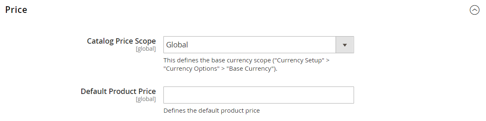

# Preisspanne

Der Umfang der [Basiswährung](../stores-purchase/currency-configuration.md) die für Produktpreise verwendet wird, kann so konfiguriert werden, dass er entweder auf globaler Ebene oder auf Website-Ebene gilt. Wird der Preis auf globaler Ebene angewendet, wird er in der gesamten Shop-Hierarchie verwendet. Wenn dasselbe Produkt auf Website-Ebene angewendet wird, kann es zu unterschiedlichen Preisen in Geschäften verfügbar sein, die mit verschiedenen Websites verbunden sind. Standardmäßig ist der Umfang der Produktpreise global.

Verschiedene Faktoren können sich auf den Preis des gleichen Produkts an einem Ort und nicht an einem anderen auswirken. So könnten beispielsweise zusätzliche Vertriebskosten für das Produkt und andere Erwägungen anfallen, die sich auf den Preis der in einem bestimmten Geschäft verkauften Produkte auswirken. Das folgende Diagramm zeigt eine Multi-Site-Installation, bei der die Basiswährung auf Website-Ebene festgelegt ist. Die jeder Website zugeordneten Stores und Store-Ansichten spiegeln die Produktpreise wider, die auf Website-Ebene festgelegt werden.

 Wenn Sie freigegebene Kataloge verwenden, lesen Sie auch den Abschnitt [Preise und Struktur für freigegebene Kataloge festlegen](../b2b/catalog-shared-pricing-structure.md) im _Adobe Commerce B2B-Handbuch_.

{width="550"}

## Konfigurieren des Preisbereichs

1. Gehen Sie _Menü_ Admin“ zu **[!UICONTROL Stores]** > _[!UICONTROL Settings]_>**[!UICONTROL Configuration]**.

1. Erweitern Sie im linken Bereich **[!UICONTROL Catalog]** und wählen Sie darunter **[!UICONTROL Catalog]**.

1. Scrollen Sie nach unten zum Abschnitt **[!UICONTROL Price]** und legen Sie **[!UICONTROL Catalog Price Scope]** auf eine der folgenden Einstellungen fest:

   - `Global`
   - `Website`

   Die von Ihnen gewählte Bereichseinstellung wird unter den Preisfeldern in Ihrem Katalog angezeigt.

   {width="600" zoomable="yes"}

1. Klicken Sie abschließend auf **[!UICONTROL Save Config]**.

## Berechnung verwenden, um Produktpreise festzulegen

In Commerce ist es nicht zulässig, für jeden Shop einen Produktpreis festzulegen. Sie können jedoch den Preis pro Website ändern:

1. Gehen Sie _Menü_ Admin“ zu **[!UICONTROL Stores]** > _[!UICONTROL Settings]_>**[!UICONTROL Configuration]**.

1. Erweitern Sie im linken Bereich **[!UICONTROL Catalog]** und wählen Sie darunter **[!UICONTROL Catalog]**.

1. Legen Sie auf der Registerkarte **[!UICONTROL Price]** den Preisbereich auf `Website` statt auf `Global` fest.

1. Legen Sie den Preis fest, indem Sie die Seite zur Produktbearbeitung öffnen, den Umfang oben links auswählen und dann einen neuen Preis pro Website eingeben.

In den seltenen Fällen, in denen der Preisbereich auf `Global` festgelegt ist, kann die Commerce-Datenbank auf der Website weiterhin unterschiedliche Preise aufweisen. Dies kann infolge von Synchronisationsproblemen außerhalb von Commerce auftreten. In diesen Fällen muss der Händler eine Preisbereinigung auf Store-Ebene durchführen und eine Katalogsynchronisierung mit Commerce Services durchführen.