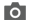

# Kategorien - Inhaltseinstellungen

Die _[!UICONTROL Content]_Einstellungen bestimmen, ob zusätzliche Inhalte auf der Kategorieseite angezeigt werden. Zusätzlich zur Liste der Kategorieprodukte kann die Seite ein Bild, eine Beschreibung und einen CMS-Block enthalten. Sie können die [[!DNL Page Builder]](../page-builder/introduction.md) Inhaltswerkzeuge verwenden, um die Kategoriebeschreibung zu definieren.

## Hinzufügen der Kategoriebeschreibung in [!DNL Page Builder]

1. Öffnen Sie die Kategorie im Bearbeitungsmodus.

1. Scrollen Sie nach unten und erweitern Sie  den Abschnitt **[!UICONTROL Content]** .

   {width="600" zoomable="yes"}

1. Klicken Sie oben rechts im **[!UICONTROL Description]** auf **[!UICONTROL Edit with Page Builder]**.

1. Verwenden Sie die [[!DNL Page Builder]](../page-builder/introduction.md)-Tools, um [vorhandenen Text zu bearbeiten](../page-builder/text.md) und bei Bedarf weitere Inhalte hinzuzufügen.

## Vorschau [!DNL Page Builder]

Wenn Sie den Abschnitt _Inhalt_ für eine vorhandene Kategorie erweitern, in der mit [!DNL Page Builder] erstellte Inhalte vorhanden sind, wird eine Vorschau des **[!UICONTROL Description]** Inhalts so angezeigt, wie er auf der Kategorieseite angezeigt würde. Wenn Sie auf den Inhaltsbereich klicken, wird der [!DNL Page Builder] Arbeitsbereich geöffnet, in dem Sie alle erforderlichen Aktualisierungen vornehmen können.

{width="500" zoomable="yes"}

Diese Inhaltsvorschau ist standardmäßig für die Produkt- und Kategorieformulare aktiviert. Wenn die Leistung aufgrund des Ladens der Vorschau beeinträchtigt ist, können Sie die Vorschau in den Einstellungen [Content-Management-](../configuration-reference/general/content-management.md#advanced-content-tools)) deaktivieren.

## Hinzufügen der Kategoriebeschreibung im Editor

Geben Sie nur ASCII-Zeichen in das Textfeld ein. Wenn Sie Text aus einem Textverarbeitungsprogramm einfügen, speichern Sie ihn zuerst als einfache TXT-Datei, um alle unsichtbaren Steuerzeichen zu entfernen.

Weitere Informationen finden Sie unter [WYSIWYG-Editor](../content-design/editor.md).

1. Öffnen Sie die Kategorie im Bearbeitungsmodus.

1. Scrollen Sie nach unten und erweitern Sie  den Abschnitt **[!UICONTROL Content]** .

   {width="500" zoomable="yes"}

1. Geben Sie die **[!UICONTROL Description]** ein und verwenden Sie die [Editor-](../content-design/editor.md)), um die Formatierung nach Bedarf vorzunehmen.

   Sie können die untere rechte Ecke ziehen, um die Höhe des Textfelds zu ändern.

## CMS-Block zur Kategorieseite hinzufügen

1. Navigieren Sie in der _Admin_-Seitenleiste zu **[!UICONTROL Catalog]** > **[!UICONTROL Categories]**.

1. Wählen Sie in der Kategoriestruktur die Kategorie aus, die Sie bearbeiten möchten.

1. Erweitern Sie  den Abschnitt **[!UICONTROL Content]** .

1. Wählen Sie **[!UICONTROL Add the CMS block]** einen Block aus, den Sie hinzufügen möchten.

1. Erweitern Sie  den Abschnitt **[!UICONTROL Display Settings]** .

1. Legen Sie die **[!UICONTROL Display Mode]** auf einen der folgenden Werte fest:

   - `Static block only`
   - `Static block and products`

1. Wenn Sie fertig sind, klicken Sie auf **[!UICONTROL Save]** und überprüfen Sie die Blockanzeige in der Storefront (Cache-Aktualisierung erforderlich).

## Referenz zu Inhaltseinstellungen

| Einstellung | [Umfang](../getting-started/websites-stores-views.md#scope-settings) | Beschreibung |
|--- |--- |--- |
| [!UICONTROL Category Image] | Shop-Ansicht | Gibt ein Bild für den Anfang der Kategorieseite an. Methoden:   **[!UICONTROL Upload]**- Lädt eine Bilddatei von Ihrem lokalen Computer in die Galerie hoch und verwendet sie als Kategoriebild.  **[!UICONTROL Select from Gallery]** - Fordert Sie auf, ein vorhandenes Bild aus der Galerie auszuwählen.    - Ziehen Sie entweder eine Bilddatei auf die Kamerakachel oder navigieren Sie zum Bild und wählen Sie es aus Ihrem lokalen Dateisystem aus. |
| [!UICONTROL Description] | Shop-Ansicht | Gibt eine Beschreibung an, die auf der Kategorieseite angezeigt wird.   **[!UICONTROL Edit with Page Builder]**- Öffnet den [[!DNL Page Builder] Arbeitsbereich](../page-builder/workspace.md), in dem Sie die Beschreibung bearbeiten können.  **[!UICONTROL Show / Hide Editor]** - Schaltet die Anzeige zwischen dem WYSIWYG-Editor und dem HTML-Modus um. |
| [!UICONTROL Add CMS Block] | Shop-Ansicht | Fügt der Kategorieseite einen vorhandenen [CMS](../content-design/blocks.md)Block hinzu. |

{style="table-layout:auto"}
